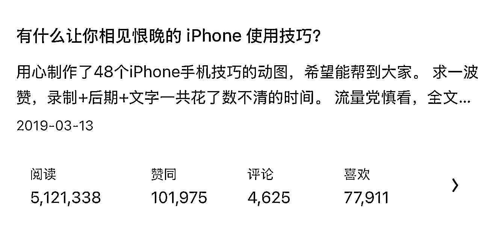

# 自媒体新手一定要懂的内容传播逻辑

> 原文：[`www.yuque.com/for_lazy/zhoubao/fn2ikbmrqz6ornfq`](https://www.yuque.com/for_lazy/zhoubao/fn2ikbmrqz6ornfq)

## (29 赞)自媒体新手一定要懂的内容传播逻辑

作者： KOJAY

日期：2025-01-17

这是我六年前写的一篇知乎的回答，累计阅读 500 万+，很多微博账号纷纷转发，给我公众号也涨了上万粉丝，内容其实很简单人人都能做，就是一些 iPhone 使用小技巧，文字配合动图仅此而已。

获得高流量的原因：（当然也有运气成分）

1.内容简单直击核心受众广泛更易传播（例：标题、封面、内容等）

2.合集类内容更易获得转发、收藏、点赞（更易获得平台自然流量的推荐）

** *如果自媒体新手想建立信心与正反馈，建议从合集类内容入手，这类内容更易获得流量（收藏、转发等），同时制作内容时一定要将复杂的内容转化为能被大众轻易理解的信息。***

我让 ChatGPT
o1 帮我分析了这四个角度：内容传播逻辑、用户收藏行为的心理、平台算法逻辑、合集类内容自带的特征，我觉得他的回答能够精准表达核心思想，我就不自己写了，AI 又帮我节省了几小时。

❶ 提问：如果想要信息进行大面积的传播，是不是需要尽最大可能降低传播成本、内容的认知成本、减少弯弯绕绕？反之亦然？

ChatGPT o1 回答：

**  **

简短回答：

是的，如果想让信息或内容在更大范围内被理解、被接受并传播，就需要**尽可能地降低“传播成本”、减少“认知负荷”、去除不必要的“弯弯绕绕”** 。反之，如果内容过于复杂、门槛过高，或呈现方式不够清晰，就会显著减少受众范围和传播效率。

**为什么降低“传播成本”能带来更大面积的传播？**

1.  **注意力有限**

• 现代社会被称作“注意力经济”，人们每天要接触海量信息，大多数人只愿意在极短时间内决定是否继续关注。

• 信息越简明易懂，越能迅速抓住注意力，避免“滑走”。

2.  **认知负荷有限**

• 人类大脑的工作记忆容量是有限的，当信息结构复杂、逻辑链条太长，就容易导致理解困难，注意力丧失。

• **KISS 原则** （Keep It Simple, Stupid）在传播和设计领域被广泛应用，强调用最简单、直观、易懂的方式来表达复杂概念。

3.  **减少误解与噪音**

• 信息在传播链条中会出现“传话游戏”效应：每多一层转述，就会多一层理解和表达的偏差。

• 使用更直接、清晰的表达方式，可以最大限度地减少信息损耗，提高传播的准确性。

4.  **门槛越低，人群越广**

• 受众理解信息的门槛（知识门槛、时间成本、操作步骤）越低，参与者的人数就越容易扩大。

• 在营销或科普领域，往往通过“分解复杂问题，设计浅显易懂的示例、比喻”来吸引更多人群。

**“降低传播成本”具体可以怎么做？**

1.  **语言简化**

• 尽量使用通俗易懂的词汇，避免过度专业术语或晦涩表达；

• 用生动的例子或故事来阐述概念，让人“听得进去，记得住”。

2.  **视觉化呈现**

• 借助图表、视频、动画等方式，让抽象概念更具象、更可视；

• 视觉化的信息往往更能吸引注意力并减少理解门槛。

3.  **结构化、分层化**

• 信息分段、分级呈现：先给核心结论或关键事实，随后再提供更详细的背景；

• 这样有助于不同层次的受众快速获取适合自己的信息深度。

4.  **减少操作或思考步骤**

• 如果是产品或服务的推广，尽量简化用户操作路径；

• 如果是思想或理念的传播，尽量提供“主干结论 + 框架思维”，减少绕圈子。

5.  **情感或场景引导**

• 刺激用户的好奇心、求知欲或共鸣感，能让传播更具爆发力；

• 通过故事化、场景化呈现，让受众产生个人联想和情感连接。

**反之，“高门槛”带来的小众传播**

• 如果刻意提高认知或操作门槛，内容会更“专业”或“高深”，往往只吸引到特定专业圈子或兴趣群体；

• 这种策略适用于**高端品牌塑造、专业学术圈** 或对“精准受众”有较高要求的领域；

• 好处是能聚拢高粘性的核心用户或粉丝，坏处则是很难进行大面积扩散。

**总结**

• **想要大范围传播** ：

• 减少认知负荷、传播障碍，尽可能让内容**“一看就懂、一转就走”**。

• 简明、直观的表达 + 有吸引力的情绪或利益点，往往是快速破圈的关键。

• **想要保持专业或小范围高质量传播** ：

• 可以适当提高门槛，筛选目标受众，以建立更强的专业壁垒或社群凝聚力。

总之，**“降低传播成本”与“提高覆盖面”往往呈正相关；而“提高传播门槛”则会强化圈层感与专业度** ，但会失去一部分大众受众。根据不同的传播目标和受众定位，选择恰当的策略最为重要。

❷ 提问比较零碎分了多次，大概就是让它分析：收藏背后的用户心理、平台算法逻辑以及合集类内容自带的特征

ChatGPT o1 回答：

在各种社交媒体或内容平台上，“合集类内容”往往更容易获得**高收藏量** ，而**收藏** 这一指标在很多平台的算法中都会被当作**衡量内容价值** 和**用户需求度** 的重要信号，进而帮助内容获得更多自然流量的推荐。下面，我们从**收藏背后的用户心理、平台算法逻辑** 以及**合集类内容自带的特征** 三个角度来详细分析这一现象。

**1****.** **用户为什么更愿意收藏“合集类内容”？**

1.  **实用价值高，方便未来查阅**

• 合集通常是针对某个主题、工具、资源或技巧的系统性归纳；

• 当用户意识到“这些信息可能以后会用到”，他们就会有强烈的动机去收藏，以防下次需要时再去逐条查找，浪费时间。

2.  **参考与对比需求**

• 合集通常包含多项内容（比如多款 APP 推荐、多个技巧、多个目的地），用户可能短时间内并不能一一消化或体验；

• 收藏之后，可以在日后慢慢对比、对照使用。

3.  **收集与补全心理**

• 人们常常有“打卡”或“补全清单”的心理冲动，特别是对一些“必看影视作品合集”“旅行目的地清单”“热门书单”等；

• 这种收藏行为不仅是为了实用，也是一种满足个人成就感和“我已经掌握了所有关键信息”的心理。

4.  **内容深度/信息密度高**

• 合集往往信息量大、覆盖面广；与零碎的单点内容相比，合集看起来更“值”，收藏也更能“物超所值”；

• 用户也更倾向于觉得“花更少的时间，获得更多的知识或资料”。

5.  **减少信息遗失焦虑**

• 当用户看到一个质量很高的合集，通常会觉得“错过就不再有”，哪怕暂时用不到，也可能先收藏以缓解“错失良机”的焦虑感。

**2****.** **平台算法如何利用“收藏量”来判断内容价值？**

1.  **收藏作为“深度互动”或“强认可”信号**

• 点赞、评论、转发是相对更即时、更浅层次的互动；而“收藏”则意味着用户愿意长久保留这条内容；

• 平台往往会将收藏行为视为内容高质量、用户高满意度的佐证。

2.  **触发更多二次曝光与长尾流量**

• 一旦某篇内容的收藏数达到一定阈值，平台的推荐算法可能会倾向于将其推荐给更多相似偏好的用户；

• 这会形成“算法正反馈回路”——更多人看见、更多人收藏、平台进一步推荐。

3.  **收藏在用户个人空间内的二次传播**

• 有的社交平台会允许用户将收藏夹“公开”或分享；他人看到“某某的收藏夹”时，也可能发现并再次点击该内容；

• 虽然这种分享频率不如转发或点赞高，但对于小圈子或精准人群，依然具有较强的“种草”和二次传播潜力。

**3****.** **“合集类内容”天然更适合收藏与分享的特点**

1.  **内容整体性与系统性**

• 合集以“主题+列表”的方式呈现，条理清晰，结构分明，这种形式让人一眼就能看到内容的全面性；

• 内容在知识或信息脉络上相对自成体系，更像一个“小资料库”或者“攻略手册”，更值得收藏。

2.  **可更新、可扩展**

• 很多作者会把合集内容不断更新，如“XX 工具合集”的后续版本、添加新的信息点等；

• 用户在收藏后，希望及时跟进更新，持续获取增量信息。

3.  **高参考价值，节省用户时间**

• 合集通常就是为了“让你不用东找西找”，直接提供多个选项或方案；

• 用户一旦觉得这个合集“值得反复参考”，会倾向于收藏，以备随时调用。

4.  **适应“碎片化阅读”与“系统化使用”的双重需求**

• 碎片化阅读时，可快速浏览和了解；

• 等到真正需要深入应用时，又能通过收藏回到原文，逐条进行深度对比或实践。

**4****.** **整体效应：高收藏量带来更多曝光和阅读**

1.  **多维度互动指标提升**

• “合集类内容”往往同时获得“阅读、点赞、收藏、转发、评论”等多种互动，加权后在算法中更具优势；

• 平台一般会综合评估互动率、互动质量（例如收藏、评论的权重高于浏览），从而提高内容在推荐流中的曝光度。

2.  **长尾效应明显**

• 对于“合集类”的实用信息，只要其内容没有过时，就长期具有参考价值；

• 这意味着在发布后很长一段时间内，用户通过搜索、分享或再次打开收藏夹，都可能持续为内容贡献流量。

3.  **品牌或作者价值的积累**

• 用户收藏这类“干货”合集时，往往也会对创作者产生好感或信任，进而关注或订阅；

• 长期下来，创作者在特定领域能树立专业或优质内容的口碑，为后续更多类型的内容传播打下基础。

**5****.** **补充：如何让“合集类内容”更具收藏和传播的可能？**

1.  **选题针对性与实用性**

• 选择用户普遍关心、且有实用需求的主题，如工具整理、技能集锦、学习资源、旅行攻略等；

• 主题尽量明确，避免“大而空”或过度泛化。

2.  **内容呈现简洁、易扫读**

• 使用清晰的层级和排版，如序号、小标题、简要描述和插图；

• 每个内容点都能“一眼看懂”，减少阅读门槛。

3.  **突出“干货”与具体价值**

• 在标题或摘要里突出“能为读者解决哪些问题”“带来哪些好处”；

• 多用示例、案例来说明具体应用场景，提升实际可操作性。

4.  **定期更新、维护**

• 如果是工具或资料类合集，适当进行迭代；

• 可以在文末标注“最后更新日期”，鼓励读者持续关注或“再次回访”。

5.  **引导收藏与分享**

• 在内容结尾或合集中合适位置，适度提及“如果对你有帮助，别忘了收藏、分享给有需要的朋友哦”；

• 不要过度强迫，但善意的提醒可以显著提升收藏率。

**总结**

“合集类内容”往往信息量大、实用性强、结构清晰，能为用户在短时间内提供**高效率** 、**高价值** 的信息获取体验，让用户产生强烈的**收藏与二次回访** 动机。而在公域平台的算法中，**收藏** 行为通常被视为重要的“深度互动”指标，会带来更多的自然流量推荐，形成正向的推荐-流量-
互动循环。由此可见，想要在平台上获得高曝光、高阅读量，创作者可以多利用**“合集式”整合**的内容形态来满足用户需求，同时也借此在用户与平台算法之间形成“双赢”局面。

* * *

评论区：

暂无评论