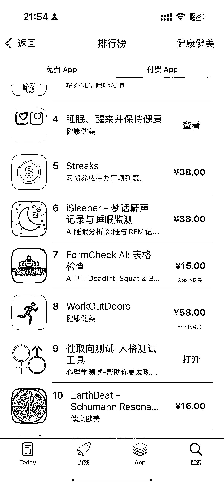
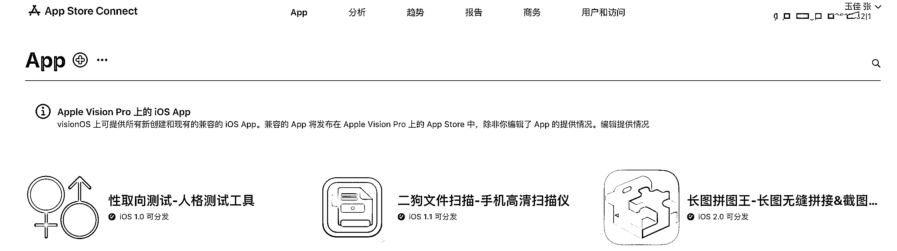
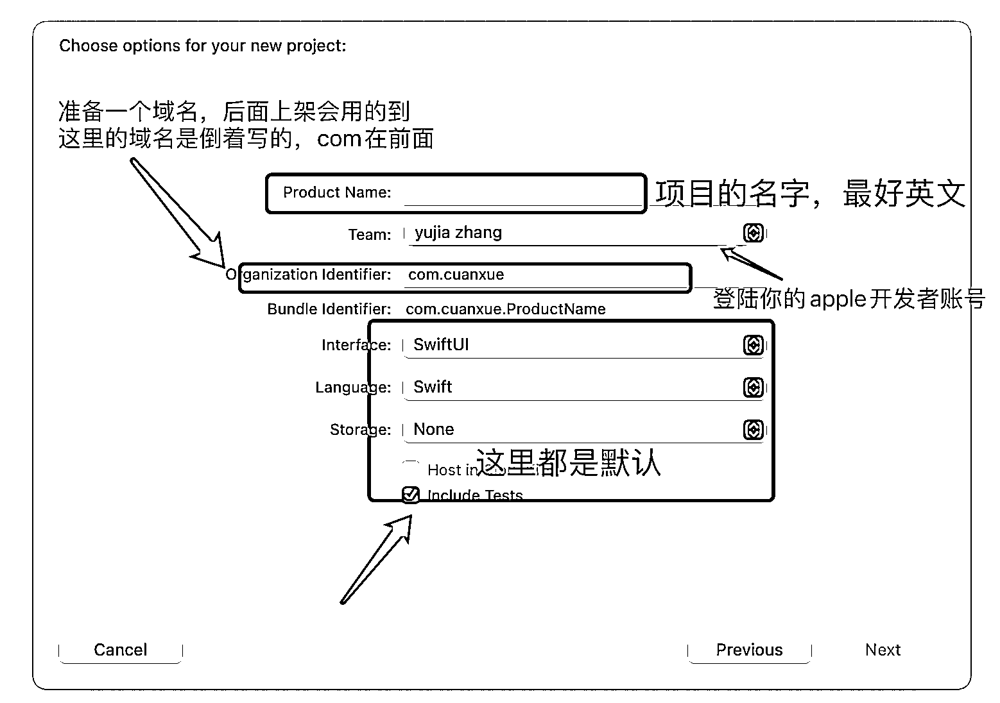
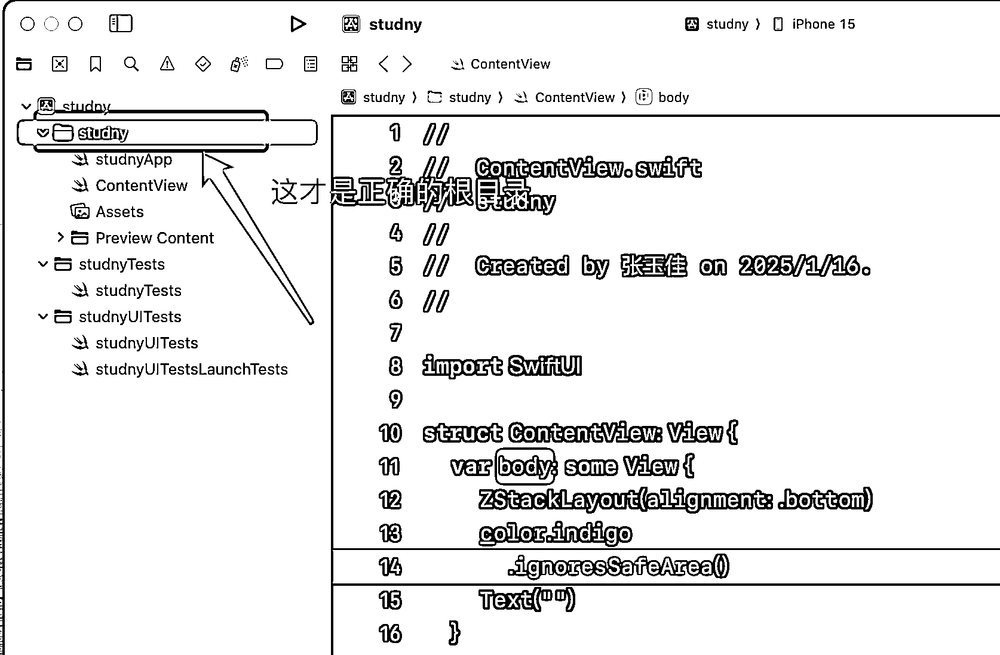
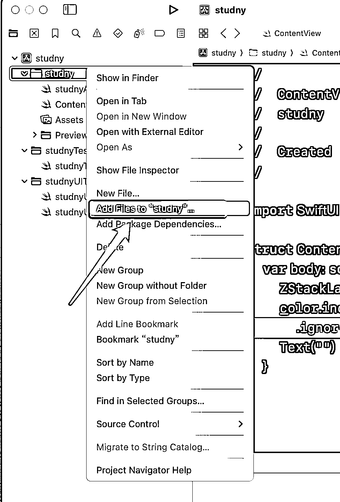
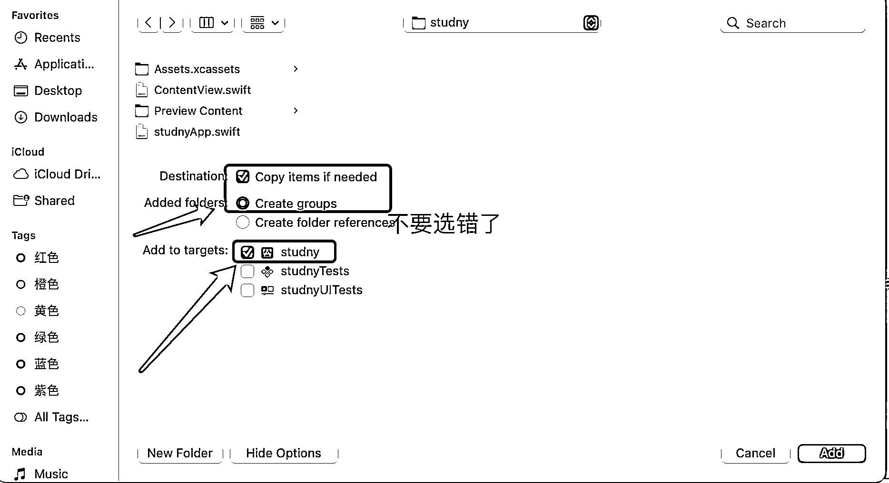
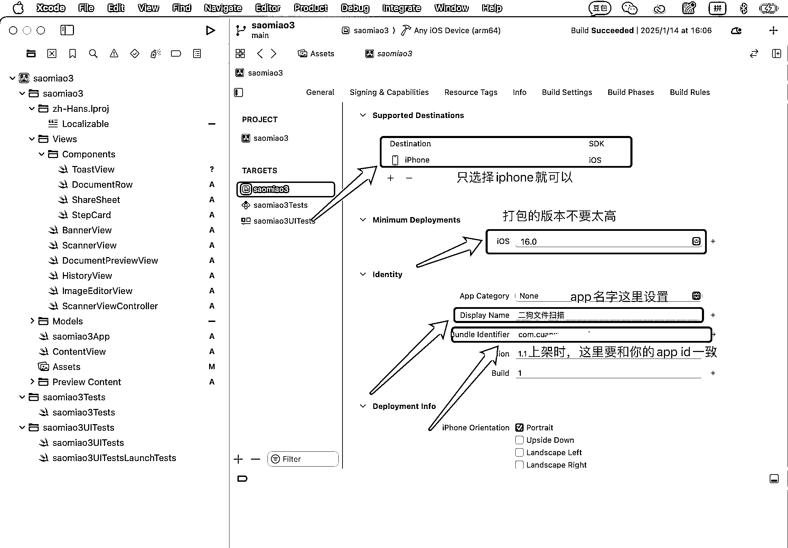

# 一周时间，我用 cursor 开发了个 3 个 ios app 上架到了 appstore

> 原文：[`www.yuque.com/for_lazy/zhoubao/ir01u9ut8su6ydwr`](https://www.yuque.com/for_lazy/zhoubao/ir01u9ut8su6ydwr)

## (28 赞)一周时间，我用 cursor 开发了个 3 个 ios app 上架到了 appstore

作者： 黑帽子

日期：2025-01-16

大家好，12 月我参加生财的 cursor 大航海后，就一直在用 cursor 尝试软件开发，直到目前为止，我在一周时间内做了 3 款 APP，全部上架到了 appstore，这也是我第一次开发 app，开发的过程中也遇到了很多困难和大坑，不过在各种找教程、问 AI 的反复过程中也挨个解决了，今天和大家分享下我这段时间以来做 app 的经验。

。。。我做的性取向测试 app，刚刚一看竟然上了健康健美的付费 app 排行榜第 9，这个 app 是今天早晨刚刚审核通过的。。

 YP4fMyp)

到现在为止我做 app 还没有变现，但是我现在的开发速度已经有明显提升了，最近的一个 app 我一共花了 8 小时左右，从构思到开发，到调试，再到上架，不过我相信距离变现应该不远了，目前已经在申请 google
admob 的广告了，可能是海外 google 抓取 appstore 的文件速度有点慢，目前还在耐心等待审核。

先说一下我的开发背景吧。

我是一个对于开发的纯小白，英文能力也很差，对于开发的理解仅限于使用 wordpress、宝塔面板这样的开源程序来做一些博客、网站，所以即使用 Cursor 来做开发，对于我刚开始来说也有很大的困难。

航海过程中，跟着教练和手册，试着做了贪吃蛇、图片压缩这些简单的小工具，不怕大家笑话，航海手册我是看了好几遍，这些简单用几句提示词就能实现的小工具我做了好几次才成功，现在再回头看当时的错误其实非常低级，错误主要出在要安装的运行环境和依赖的目录错了，所以一直报错，报错信息发给 cursor 后也理解不了 cursor 的意思，这个阶段还是挺打击个人信心的。

后来为什么要想着开发 ios app,而不是做安卓 app，做网站，或者做浏览器插件、微信小程序呢。

首先，我简单判断了下目前的市场环境，我觉得做网站来说的话，流量留存能力差，流量来源主要依赖于 seo，但是现在的百度 seo 不是很好做，不备案的网站都不收录，而 google
seo 的话周期太久，正反馈周期太长，我怕坚持不到赚钱就放弃了，站外推广的话我觉得网站的留存能力比较差，眼下 pc 和移动端的流量也有极大的差距，所以毫不犹豫的选择了开发移动端的 app。

但是移动端我想了想，是开发 ios app 还是安卓，还是微信小程序。

我首先排除掉了安卓 app，因为安卓 app 上架是个很麻烦的事，因为我前两年让朋友帮我开发过一个任务平台 app，所以我知道安卓应用市场上架不仅麻烦，而且成本比较高，一个 app 软著代办就得 300 块钱，还得办理软著周期再快也得三四个星期，而且安卓最恶心的地方在于不同版本的安卓手机会有兼容性的问题，我没有这个开发能力去解决这个问题，所以直接 pass 了。

然后就是微信小程序，我觉得微信小程序的话留存能力比较差，而且很难靠微信搜索获取流量，就只能靠主动推广，依靠微信的社交关系裂变，这个难度比较大，其次的话，个人资质开发微信小程序会有很多限制，我前两年再微擎应用市场买过一个小程序源码，没有一周就给我封了，还是个很简单的打卡小程序。

那么剩下的唯一答案，就是做 ios app 了。

不过做 ios
app 首先面临的第一个问题，就是你要有一台 mac 电脑，和一个 iphone 手机，好在我所有的手机基本都是苹果，而 mac 电脑的话，我不得已从角落里翻出来了 2018 年买的一台 mac
pro，配置有些扎眼，8 核 8g 内存 128g 空间 i5 的处理器。

这个配置的电脑，我但凡是同时打开超过 3 个软件就明显卡顿了。

首先，我开发 ios
app 遇见的第一个问题，就是 apple 的开发者账号注册问题，年费 99 刀，合人民币 688/年，我在注册过程中遇见的第一个问题，就是提示我账号异常不能注册，于是我就在往上各种找教程试着解决这个问题，但是也没有找到答案，发现很多人遇见了和我一样的问题。

于是，我就试着给 apple 的客服发邮件问我的这个问题怎么解决，最终发现问题是因为我差不多 8 年前就注册过一个 apple
id，我已经将这个 id 账号实名了，所以我后面再注册任何的 apple
id 都没法过开发者实名的认证，好在运气还不错，从角落里找到多年前的 iphone 手机，打开设置后看好了 id，最终成功缴费注册。

总结下 apple 开发者账号的一些问题。

（1）尽量使用一台苹果设备注册，不要中途更换设备。

（2）不要使用登录超过 3 个 apple id 的设备注册，因为会被判定会公共设备。

（3）一定要用自己最早实名的 apple id 账号，如果你忘了，对不起，苹果客服也不会告诉你，你也就永远无法注册开发者账号。

虽然 apple
开发者账号听朋友讲可以买，但是买的账号会有一个问题，就是次年不好续费，因为 id 绑定的是人家的支付信息，所以就存在次年无法续费，所有上架的 app 被强制下架的风险，能用自己的就自己的，实在不行就家人的试一下。

其次，我开发 ios app 遇见的第二个问题就比较麻烦了。

ios app 开发会用到两个软件，其中一个是 cursor，另一个是 xcode。

我们先得在 xcode 里新建一个项目，然后再从 cursor 去打开 xcode 新建的这个目录。

 images.zsxq.com/FgWDu8KMxx6hK6asoh4UKR6ctMSG) images.zsxq.com/Fi7kmGvIXhfblW1HxmHPqiH_DMya)

注意！这里面有个史诗级的大坑。

就是目录的问题，你会发现用 xcode 新建项目后，在目录下会有三个文件夹，一个是你的项目名命名的文件夹，比如我这个项目叫做“paizhao”，那么 paizhao 这个文件夹下会有三个文件夹，一个是“paizhao”，还有两个是“paizhaoTest、PaizhaoUItest”。

如果说，你用 cursor 打开的是新建项目创建的那个 paizhao 文件夹，不是 paizhao 目录下同名的“paizhao”文件夹，那么恭喜你，你后面开发的所有动作就全是浪费时间！因为 xcode 后面编译打包 app，编译的是 paizhao 下面的那个同名文件夹，你后面用 cursor 写的代码，也要全部放在这个文件夹下面才会有效！

注意！第二个史诗级大坑，我遇见了 xcode 文件关联的问题。

我在用 curosr 写完代码后，回到 xcode 一看，卧槽，cursor 给我创建的文件和代码怎么一个也没有？说真的这个问题，我不管是问 AI，还是问一些有 ios 开发经验的人都没人告诉我这是为什么。

原因很简单，因为 cursor 打开文件的方式和 xcode 不同，所以 cursor 新创建的文件，你会发现根本不会像 windows 一样自动同步更新到 xcode 里面，所以这个时候每当 cursor 生成了新的文件后，你必须手动回到 code，右键选中对应的目录，然后点击 add
files to"xxxx",xxxx 是你的文件名，然后添加对应的文件才行！

这里也要注意！！不要勾选默认的 create folder reference，而是要选择 create
groups 选项，不然你会发现即使添加了文件，一样会编译失败，而 cursor 又不会告诉你是这里勾选的问题。

第三个坑，就是数据线的问题，因为 ios
app 编译好后想要在真机上测试，必须要在 iphone 打开设置里的开发者模式后，通过数据线链接到 mac，这个过程我遇见的问题就是如果很便宜的那种数据线，比如淘宝九块九包邮的就不能用，根本连接不了 mac 电脑，最好是原装的。

然后就是使用 cursor 开发的过程了，在这个过程中我总结了几点经验和大家分享下。

（1）如果你要开发的功能比较复杂，比如涉及登录、注册、支付这些功能，但是你的开发经验还不足的话，我建议你直接去掉这些功能，因为我发现 cursor 一旦面临比较复杂的业务，特别是代码量超过两三千行后，忘形就很严重了，开发效率就极低，经常性的修 bug，把一些原有的功能给你删掉，所以一旦复杂业务就需要分开实现，也就是分开做，不要一直继续继续的让 ai 帮你实现，先实现一个最核心的基本功能。

（2）不要过度依赖 cursor，要自己试着去理解业务的实现逻辑和流程！虽然有些时候 ai 能给你惊喜，但是大多数时候你会发现 cursor 根本做不出来你想要的功能，特别是涉及一些图形界面的改动的时候，你会发现怎么改都改不出来。

（3）提示词很重要，要学会写提示词，提示词要具体、明确，特别是在新建项目的时候，一定得创建一个 cursorrules.md 的技术说明文件，以及一些功能、页面设计的产品说明文件，因为在后面随着 bug 的增多，你需要用 cursor 读取这些文件理解你的产品，因为 cursor 有对于上下文理解的字符限制，如果说不会写提示词的话，可以用 chat 模式，沟通好你的需求后，让 AI 帮你去写提示词，这样开发效率就高很多了。

（4）我在开发 app 的时间大多数都花在了处理 app 编译时的报错，以及调整 app 的功能问题，我觉得大家不要被一些文章的字眼迷惑了，一个小时两个小时开发一个好用的 app 绝对是吹牛逼，特别是代码量超过 2000 行后，光处理 bug 的时间就得一俩小时不止，而且但凡是你功能稍微复杂点，代码量必然过 2000+

最后，就是关于 ios 上架的问题，我目前的上架过程都比较顺利，没有遇见小红书上好多人说的 4.2 的问题，我特意百度下了 4.2 的问题是啥，大概就是你开发的应用和 ios 市场上的应用同质化严重，所以就拒绝了。

关于 ios 上架的过程，往上也有很多教程，我就不在这里多说了，只说几点我的经验吧。

（1）用户的隐私协议，我的建议是直接抄，去 appstore 找一个和你类似的应用，复制他的隐私协议后，扔给豆包让 AI 改完后，你复制粘贴到你的隐私协议中，隐私协议的内容关键是你要把你这个 app 牵扯到需要用到的授权写明白就行，比如你需要用户授权相机权限、相册权限、wifi 权限这些，隐私协议如果说你没有自己的服务器，其实可以用腾讯文档这种也可以。

（2）建议大家有一个自己的服务器，因为在 appstore 上架的时候，会让你填一个营销网站的链接，虽然说不用填，但是如果后面你需要挂 google 的广告，就需要在你的服务器新建一个 ad-
ads.txt 的文件，把你 google 的 id 代码复制进去，腾讯文档的话可能实现不了。

（3）打包上架的时候，要注意的两个细节，一个是 ios 系统的版本，和要发布的平台，系统版本不要勾选的太高了，因为太高了的话，手机系统版本低的用户下载不了，这里在 xcode 的蓝色图标里可以设置。

其次，就是不要勾选一堆 ios 设备平台，只选择 iphone 就行，ipad 什么的就全部删掉，不然的话你得多做一堆 app 预览图！

想到哪说到哪，可能有些地方说的不够全面，圈友们有什么问题可以评论区再问我！

* * *

评论区：

老彭 : 好久不见，黑帽哥

黑帽子 : [旺柴]

吴海晖 : 厉害呀。我尝试安卓 apk 都没搞出来。有时遇到问题怎么也解决不了。就直接卡死了。

Anna 碧海心 : 厉害👍高手👍