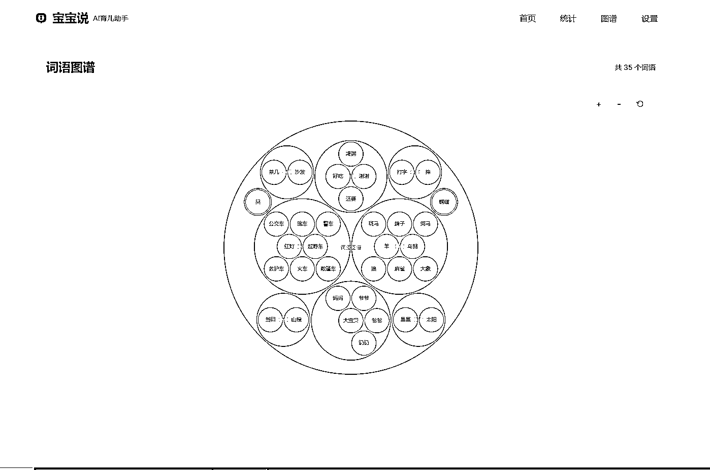

# 我用 Cursor 为我儿子开发了一个 AI 辅助学习工具

> 原文：[`www.yuque.com/for_lazy/zhoubao/qnfz109t5rcvlobg`](https://www.yuque.com/for_lazy/zhoubao/qnfz109t5rcvlobg)

## (精华帖)(28 赞)我用 Cursor 为我儿子开发了一个 AI 辅助学习工具

作者： 陈子游

日期：2025-01-13

加入生财也有一段时间了，航海参加过好几次，但由于一直没有做出什么像样的结果，所以也就没有什么东西可以分享。

但是最近这一次 Cursor 的航海，让我有了一点像是打开新世界的大门的感觉，虽然没有赚钱，但是感觉很兴奋。

一个毫无编程基础的人，稍微花点时间学习，就能做出一个真正有用的工具，这对于我来说是很有吸引力的。

所以这次航海我可以说是最认真的一次，从航海之前我就已经开始练习 Cursor，并尝试做一些小工具和小网站。

包括给我自己使用的 Midjourney 官网插件、小红书图片水印工具等。

在航海期间，我又尝试做了一两个简单的网站，并注册了域名，体会到了久违的成就感。

不过总体上来说，这些都是比较简单和基础的项目。

后来我尝试过做复杂一点的项目，比如带后台的网站，但是试了几次都做崩盘了。

这对我的信心有些打击，因为完全不懂代码，也不知道自己问题出在哪里，只好暂时放弃做难的项目。

直到前几天我看到很多人在讨论一个叫做 DeepSeek 的 AI 大模型，我突然想到，我可以用它来做点什么有趣的工具。

反正就算失败了，我也没啥损失。毕竟 Cursor 一直是白嫖的（这几天已经开始付费了），DeepSeek 的 API 好像也很便宜。

于是我就决定再试一次，看看自己到底能不能做出来一个真正能算得上 AI 工具的项目。

一开始奔着实验的目的，我打算做一个能对话的 AI 套壳网站就行。

但是我在带孩子的时候，突然有了个灵感，我可以给我儿子做一个 AI 工具，可以用来辅助他更好的学说话。

本来以为自己不一定能做成，没想到这次居然给我做出来了。

虽然功能还比较简陋，但是我自己还是挺满意的。

所以我想把自己做项目过程中的一点心得体会分享出来，也许对后面的朋友有一点点帮助。

* * *

**1、项目开始之前，先花足够的时间和 AI 讨论需求**

由于之前我做稍微复杂一点的项目就很容易失败，这次我决定稳扎稳打，先花足够的时间和 AI 讨论需求。

我先把我的初步想法跟 AI 讲了一遍，然后让 AI 帮我分析需求的完整度，以及实现的可能性。

AI 会帮我查漏补缺，然后还会提出一些问题让我确认。

同时我也会提前告诉 AI，我准备接入 DeepSeek 的 API，并且最后要部署到 Vercel 上。

这样 AI 很快就会帮我梳理好需求，并且给出大概的技术方案。

这一步非常重要，因为我并不具备丰富的项目开发经验，如果不和 AI 讨论需求，把各种需求细化和明确下来，那很可能是拿着一个没想清楚的需求去乱开发，做到后来发现根本不是自己想要的结果。

* * *

**2、让 AI 写出详细的需求文档，并且随时更新**

需求初步明确后，技术方案 AI 也给出了，我就会要求他帮我写一个详细的需求文档。

这个需求文档我觉得有几个核心的地方有：一是到底具体要实现哪些功能，二是用什么技术方案，三是项目要拆成几个阶段。

还有一个更重要的地方，就是文档要一直更新，随时记录下项目进展和需求变更。

因为我们不可能保证自己一开始定下来的功能真的就是我们最终想要的，也不能保证技术方案不做任何变化，有可能做着做着就发现很多地方都要变。

这个时候如果文档不及时随时更新，AI 有可能就会在开发过程中参考原来的功能或方案去写一些代码，最后就会做崩盘。

另外由于 AI 对于上下文的记忆有限，所以一定要在项目进展到一定程度之后，让 AI 更新项目进展。

这样等到我们去新开一个 Chat 或者 Compose 的时候，AI 更容易理解当前的项目进展和需求，它就不容易乱来。

一方面我们在过程中可能会做一些重要的修改或者功能调整，记录下来之后，我们自己心里也有数，而且还可以通过【时间线】把修改的版本重命名一下，这样后面如果发现做不下去了，就可以退回去重来。

* * *

**3、项目阶段一定要尽量拆分细一些**

我们这些不懂代码的人，利用 AI 来开发项目，其实是很容易遇到无法解决的问题的。

之前我刚开始接触 Cursor 的时候，就遇到过很多问题。

比如我想要做一个带后台的网站，但是做着做着就遇到无法解决的 bug，最后把自己搞得很郁闷，只好放弃。

但是这次我发现，其实只要把项目每个阶段拆分的足够细，每个阶段只完成一个功能，那么成功的概率就会大大提升。

比如我这个项目的第一阶段，我就觉得它只要能够帮我实现接入 Deepseek API，并且能够正常对话就谢天谢地了。

因为就算完成到了这一步之后走不下去了，对我来说也是一个从 0 到 1 的大突破。

后来当我真的成功接入 Deepseek API，并且能够正常对话之后，我就信心大增。

然后就这样一步步推进，最后就真的做出来了。

这里附上我需求文档里已经完成差不多的项目拆分内容供大家参考：

**### 第一阶段：基础功能（MVP）**

*   [✓] 搭建 Next.js 项目基础框架

*   [✓] 实现简单的对话界面

*   [✓] 接入 Deepseek API 基础功能

*   [✓] 设计基础 AI 角色提示词

*   [✓] 实现智能对话的核心功能：

*   [✓] 词语录入对话流程

*   [✓] 记录修改对话流程

*   [✓] 分类调整对话流程

*   [✓] 实现基础的词语存储功能

*   [✓] 部署到 Vercel 验证可用性

**### 第二阶段：多页面架构与数据展示**

*   [✓] 导航组件开发：

*   [✓] 创建独立导航组件

*   [✓] 实现页面状态管理

*   [✓] 响应式布局适配

*   [✓] 从 MainLayout 中解耦

*   [✓] 优化 MainLayout 支持可选侧边栏

*   [✓] 导航样式优化：

*   简化 Logo 为简约气泡设计

*   统一使用清新蓝色主题

*   增大导航文字尺寸

*   简化交互为背景色变化

*   采用两端对齐的布局

*   [✓] 基础数据 API 开发：

*   [✓] 实现词汇统计 API（总量/分类/趋势）

*   [✓] 实现词语列表 API

*   [✓] 实现词语删除 API

*   [✓] 优化数据查询性能

*   [✓] 统计页面开发：

*   [✓] 页面布局设计

*   [✓] 核心统计卡片

*   总词汇量

*   今日新增

*   分类数量

*   [✓] 分类统计展示

*   网格式布局

*   支持分类筛选

*   [✓] 词语列表功能

*   表格展示

*   支持删除操作

*   按时间排序

*   <card type="inline" name="checkbox" value="data:false">趋势图表实现（延后开发）</card>

*   <card type="inline" name="checkbox" value="data:false">数据导出功能（延后开发）</card>

*   [✓] 首页改版：

*   [✓] 左侧信息栏布局

*   [✓] 数据概览（简化版统计）

*   [✓] 最近记录（优化展示）

*   [✓] 分类统计（简化版图表）

*   [✓] 聊天窗口优化：

*   实现消息持久化存储

*   支持历史记录显示

*   自动滚动到最新消息

*   即时显示用户消息

*   优化发送状态反馈

*   简化界面，移除冗余按钮

*   <card type="inline" name="checkbox" value="data:false">词语图谱页面：</card>

*   [✓] 基础功能实现

*   使用 D3.js 实现打包布局

*   分类节点和词语节点区分显示

*   清晰的层次结构

*   优雅的蓝色主题配色

*   [✓] 交互功能

*   鼠标滚轮缩放

*   按钮控制缩放（+/-）

*   一键重置视图

*   拖拽平移功能

* * *

整个项目我大概花了 3-4 天的空余时间，因为其他时间我都需要带孩子。

项目最终实现了几个我预想中的重要功能：

**1、接入 Deepseek API，并且能够正常对话**

**2、能够记录和并自动分类我儿子已经学会的词语，还会推荐相关度比较高的词语**

**3、能够通过图谱展示已经学会的词语**

**4、有数据库功能，能够存储词语和对话记录**

**5、有简单的词语管理功能**

第一张图是首页，这里主要的功能是对话，就是发消息给 AI，让他帮忙记录词语，以及推荐相关度比较高的词语。

第二张图是统计页面，主要用来看看我儿子已经学会了哪些词语。

第三张图是图谱页面，主要用来图形化展示已经学会的词语。

虽然目前这个工具还比较简陋，AI 智能化的程度不高，但是暂时够用了。

对于我个人来说，最关键的地方在于突破了自己的舒适区，能够做出难度更高的产品。

所以我把一些经验分享出来，希望对大家有所帮助。

* * *

评论区：

毛豆 : 太厉害了

许老师～生财投资孵化 : 厉害，挺有意思的一个需求

陈子游 : 谢谢，我试过之后才知道，只要细心细致，谁都可以做稍微复杂点的项目

陈子游 : 谢谢鼓励[憨笑]

不进则退 : 厉害了，要是过程能详细一些就好了，想体会学习一下

陈子游 : 过程因为比较繁琐，基本上就是一点点磨出来的，几乎没有任何特别的技巧，就是发现失控了，马上退回之前的版本

亦仁 : 很棒的想法，可以进一步看能不能继续做成小程序，收获你的第一个付费用户

陈子游 : [鼓掌]谢谢亦仁大佬的鼓励，我会继续努力研究一下