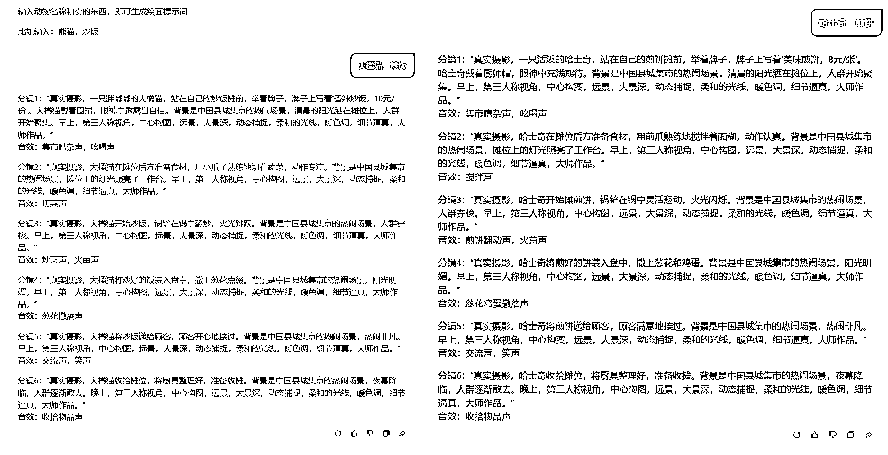

# 用 AI 做视频到底能赚钱嘛？有哪些赚钱方式？1 个月实测分享

> 原文：[`www.yuque.com/for_lazy/zhoubao/grp8g9h0yncirn3w`](https://www.yuque.com/for_lazy/zhoubao/grp8g9h0yncirn3w)

## (62 赞)用 AI 做视频到底能赚钱嘛？有哪些赚钱方式？1 个月实测分享

作者： 大鹏

日期：2025-01-16

大家好，我是大鹏

都知道 AI 视频在 25 年一定是个大风口，我也想抓住这个机会

所以，最近我一直在测试 AI 视频的各种变现玩法

一方面增加我的收益渠道，另一方面也为今年社群交付确定好方向

经过两周多的测试，效果确实还不错，给各位圈友汇报下

**  **

**下面是我半个多月涨粉数据：**

视频号发了 16 条视频，涨粉 2.1 万+；

抖音发了 16 条视频，涨粉 2.5 万+；

小红书发了 13 条视频，涨粉 1300+；

快手没号了暂时没发。

其中抖音发的第 6 条视频直接爆了近千万播放， *直接涨粉 1.8W+*

几十万、上百万播放视频也有好多~

**总之就是流量好到爆，在我做之前我是没有想到就这几秒钟的视频竟然能有这么强的爆发力。**

**  **

**变现数据：**

**视频号创作分成计划开了**

基本上万次播放一块钱，爆个百万播放，一条视频能赚个一两百块。

**抖音创作者分成计划开了**

我是第 6 条视频爆了就涨了一万多粉丝，开通了抖音创作者分成计划，开通之后不爆的情况下基本每天二三十块，如果有大爆了，一天几百上千也有可能

**小红书商单接了**

小红书最开始没有同步，是后面抖音爆了之后才同步的视频，前几天才有空开通了蒲公英，接到了第一条广告

**卖教程也卖了**

因为后端还不够完善，很多人想要跟我学都被我拒绝了，很多流量都浪费了，但即使这样还是卖出去了几百块

这些数据虽然不像别人说的那样，一条视频就能赚几千块吧（爆了也有可能），但充分说明了这个玩法的可行性，确实能赚到钱

因为我还有其他事情要忙，基本每天也就更新 1 条视频，如果更新频率能上去，变现会更多。

**AI 视频制作起来难吗？**

目前大部分 AI 视频制作的基本流程非常简单

主要包括三步：** *AI 画图--图片生成视频--剪辑***

当然上面这是视频形式是最简单的一种 AI 视频形式，但 AI 视频制作最基本的流程也都包括了

至于你在外面看到的稍微复杂一点视频，只不过也就是在这个基础上加上首尾帧转换，又多做了几条视频拼接而已，其实也没什么难度。

**  **

**提示词怎么写？**

在制作 AI 视频的过程中最难的是什么？

当然是**写提示词了** ，这也是让无数新手小白头疼的问题

怎么写提示词才能生成符合自己要求的图片？

怎么写图片转视频提示词才能生成自己想要的动画效果？

当然外面有很多博主也在分享一些提示词，但他们分享的提示词大都只有一套，比如他分享个猫咪做炒饭的，你就只能做猫咪炒饭的

如果你想发挥一下自己的想想生成一些不一样的东西，比如改成哈士奇做煎饼，你就需要自己改提示词，不会改怎么办？

从零去学习提示词的知识？太浪费时间，大部分同学也坚持不下来

*这个时候，其实我们完全可以让 AI 帮忙了*

*可以制作一套提示词生成器智能体，想做什么直接输入关键字就行，直接给你生成提示词*

把生成的提示词直接复制到 AI 绘画软件里面，即可得到图片

然后再把图片导入到可灵里面生成视频，图片转视频提示词怎么写呢？

可以再搞一个**“图片转视频提示词优化器”智能体，简直不要太方便！**

上传图片，简单输入你想要生成的视频样子，自动就帮你补齐提示词了，把提示词直接复制到可灵里面，一段视频就搞定了

学会了这套工具，你不需要学什么 AI 知识，也不需要学什么 AI 提示词，即使你是个纯 AI 小白也能轻松做出想要的视频出来

**就是这么简单！**

给大家搞两个体验下：

动物摆摊做饭提示词生成器：[`yuanbao.tencent.com/chat/xdNNVtMb3vfT`](https://yuanbao.tencent.com/chat/xdNNVtMb3vfT)

图片转视频提示词优化器：[`yuanbao.tencent.com/chat/wcGgaeNGROtF`](https://yuanbao.tencent.com/chat/wcGgaeNGROtF)

**  **

**AI 视频越复杂越好？**

由于 AI 太过强大，只要你能想到的它都能给你生成出来，所以目前市面上的 AI 视频新玩法层出不穷

如果你不能及时发掘到这些新玩法，可能就会错过大把流量

很多小白都喜欢盯着比较酷的玩法

认为**“制作 AI 视频一定是越复杂的越好”**

这是大多数小白会进入的误区

其实，经过我们测试，其实** *内容制作难度≠内容受欢迎程度*** ，这俩基本没啥关系

你花了几天做出来的视频不一定有别人 3 分钟做出来的视频流量跑得好

我们大部分人学习 AI 视频的初衷都是为了能做出 AI 视频，然后赚到钱就这么简单

你只需要明白两件事：做什么视频能赚到钱？怎么把视频做出来？就完了

别的不用考虑这么多，至于研究技术，那是专业人员做的事情，普通人先上手实操拿到结果才是硬道理。

**  **

**做什么视频比较好？**

当然是做比较热门的玩法视频最好了，更容易有正反馈

别再研究那种过时的玩法了，浪费时间很难拿到结果

经过我这段时间的研究

目前在短视频平台主要有这么这么几个形式流量比较好

** *萌娃：*** *特别可爱的宝宝喊奶奶啊、宝宝送祝福啊，流量简直不要太好*

** *萌宠：*** *什么动物做饭、动物摆摊、动物日常等等账号流量也大到离谱*

** *恶搞：*** *什么人和动物打架的，荒诞无厘头的视频等等流量也很大*

** *祝福：*** *财神爷送财视频、老牛拉黄金视频、十二生肖视频流量也很猛，但很容易违规限流，新手慎碰*

可能还有很多好的玩法我没有发现，毕竟 AI 太牛逼了，只要你能想出来，他就能给你做出来，玩法无限多！

还有 AI 微电影玩法，但那个制作门槛就有点高了，不太适合小白上手

就上面这几种单镜头或少镜头的玩法制作起来也简单，发出去也很容易跑流量，正反馈嘎嘎快

很容易建立信心。

账号做起来之后变现方式基本就是我前面讲的那些了，目前来说 AI 视频赛道还是比较好做的

门槛低，很容易拿结果，如果有精力多起几个号收益也是不错的，作为副业来讲，够了！**  **

好了今天就是我分享的主要内容了，如果你也多 AI 视频变现感兴趣可以找我来聊一聊啊~**  **

* * *

评论区：

11 : 感谢

旭哥 : 祝福类的很容易违规吗？我刷到很多视频，播放量很高

一朵云 : 非常容易

轻舟 : 请问如果在做 youtube shorts，是不是同步把视频发国内平台比较好？

大鹏 : 肯定同步啊，一鱼多吃，不同步也是被搬[捂脸]

大鹏 : 容易违规，平台对这类视频管控还挺严的

大鹏 : [抱拳]

轻舟 : 新人不太懂，谢谢指点。