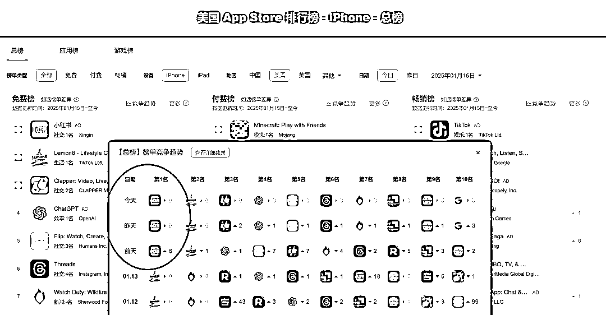

# 小红书承接 TikTok 泼天流量，与 ASO 脱不了干系，运营可以得满分！

> 原文：[`www.yuque.com/for_lazy/zhoubao/esagiqxt8mrc8cyv`](https://www.yuque.com/for_lazy/zhoubao/esagiqxt8mrc8cyv)

## (29 赞)小红书承接 TikTok 泼天流量，与 ASO 脱不了干系，运营可以得满分！

作者： 波波@抖查查@爱盈利

日期：2025-01-16

这两天小红书发疯了，最近打开小红书满眼都是老外的视频和作品，满屏都是英语博主。

原因是 **TikTok（抖音海外版）面临在美国禁用下架的情况，1 月 19 号可能就有可能下架。** 美国网红靠 TikTok
赚钱，很焦虑并寻找出路。他们误以为小红书是抖音的中文版（依赖 ASO 操作），于是大量在小红书上面注册。现在小红书在在美国（同时也在其他 50 多个国家）苹果应用商店排行榜上的名次不断提升，一度跃升至免费
APP 榜首。

大量各国老外突然间就开始用小红书？ TikTok 不让用了，理论上应该开始用抖音，可在 Apple Store 或者是在 Google 的 Play
Store 上去搜索**“抖音”** 这个 App 的时候，搜出来排第一个的是 **rednote（小红书）** ，这是赞助商广告，也就是说现在小红书针对这个搜索做了一个排名的优化，然后第二个才是
TikTok。这定向投放，获取了海量用户，直接使得小红书冲到几十个国家的下载榜单第一位。

波波手机切换至美国 App Store 搜索抖音结果

其他网友的搜索抖音结果

搜索相关性的提高，会进一步稳固小红书和抖音的关联，导致更多用户在榜单、搜索、相关应用、以及社会化分享的途径下载小红书国际版。

除了中文“抖音”以外，还有几个相关的关键词，如**“tik tok china”** 通过 ASO 覆盖和优化，均排在了第一，承接了不少分不清楚的用户：

总的来说，提升关键词覆盖并非遥不可及，只要策略明智，每个人都能见证显著的增长。欢迎找波波交流探讨更多 ASO 相关问题。^_

* * *

评论区：

波波@抖查查@爱盈利 : 应用商店优化，在有较大的事件爆发的时候还是很管用的，可以节省上亿的推广费用！

死生原点 : 麻烦问下，ASO 的意思就是应用商店优化么？

死生原点 : 大量的外国用户涌入小红书，我们普通的小红书用户，可以做点什么呀？

波波@抖查查@爱盈利 : 是的

波波@抖查查@爱盈利 : 中文起名…

凯文 : 牛逼啊，这分析我第一次知道 aso 原来是应用商城优化

凯文 : 听说有新的动作，特朗普可能终止拜登的那个封禁令

dingt3 : 这应该是 ASM，ASO 共同作用，而不仅仅是 ASO