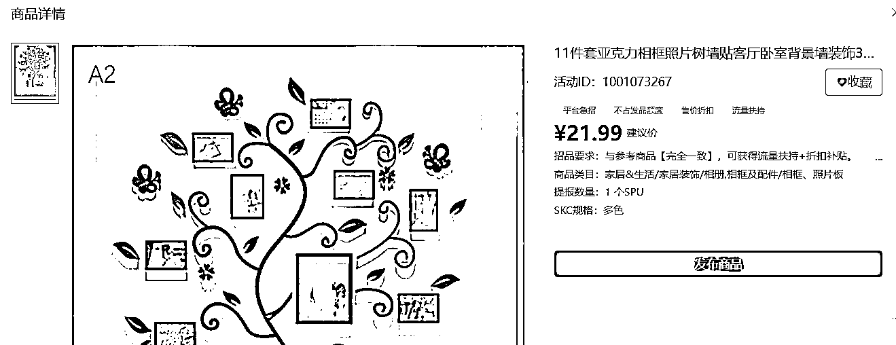
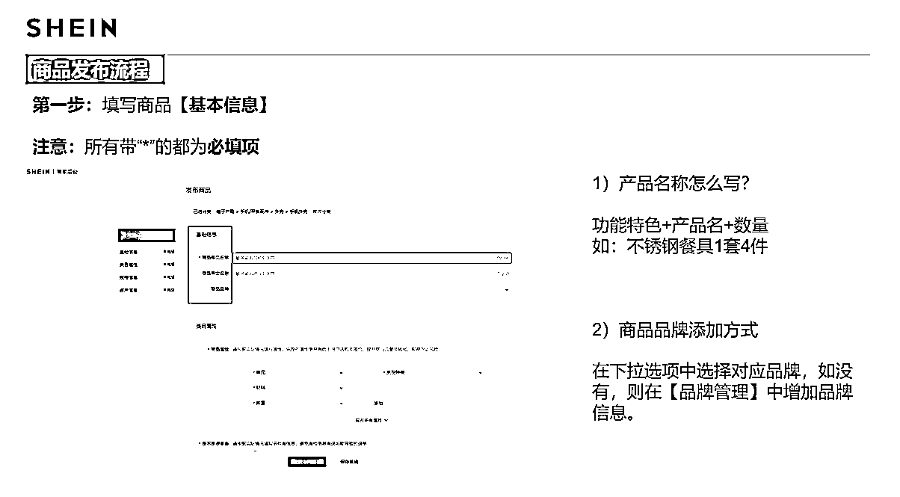

# SHEIN 新手第一个月需要做什么的跨境电商全攻略（结合自己实操和 SHEIN 本身的学习资料）

> 原文：[`www.yuque.com/for_lazy/zhoubao/bb2uvnkligzf0yhy`](https://www.yuque.com/for_lazy/zhoubao/bb2uvnkligzf0yhy)

## (42 赞)SHEIN 新手第一个月需要做什么的跨境电商全攻略（结合自己实操和 SHEIN 本身的学习资料）

作者： 嘉应岛主

日期：2025-01-16

最近在玩 SHEIN 全托管，目前经过两周过了新手村。SHEIN 的我们可以只是发产品主图不用详情页，所以我们主要就是选品，找 1688 比价拿货，然后上架图片，接着等审核，双方议价成功，就可以上架了。

这篇文章会聊很基础的，跨境电商大佬可以略过，也会扒 SHEIIN 内部分享的截图出来，我觉得他们分享上架和发货非常仔细。我会终点聊如何选品，上架和发货，还有避坑。

# 一、基础之注册

## 1.进入网址注册：

[`seller.sheincorp.cn/`](https://seller.sheincorp.cn)

你只要有营业执照就可以注册了，步骤不复杂，填错了（例如我）有 SHEIN 招商经理找你，帮你领进门（招商经理帮我搞定了店铺，还给我弄了三个类目）。

## 2.注册店铺之后找淘宝

搞定德国 EPR 和欧洲授权代表（简称欧代），就可以开始选品上架了。再唠叨一句，你做欧洲电商市场这两个是少不了的。

## 3.加入希音的企业微信

我们加入之后有个专门的 SHEIN 工作人员会带我们新手三个月，有问题可以一对一问她。

## 4.先干了再说

其实你避开需要证书的商品，每天从机会商品中选择上架就好，那时候你只需要 5 个主图+包装后产品长宽高和重量+价格+让商家帮忙贴标签，就走完上新，平台核准就发货过去真正上架。

# 二、基础篇选品

## 1.找亚马逊和 TEMU 爆款

选品可以对比亚马逊和 TEMU 热销品去做，你可以找跨境平台的热销榜单。你还可以配合节日，进入平台去搜索节日常用品的关键词+插件 TEMU 选品助手来去选品。找到一个月内畅销品月销不低于 1000 单的。

## 2.找到竞品店铺

找到 SHEIN 竞品店铺搭配 SHEIN 选品助手，挖掘有没有其他新的选品（同样适用于 TEMU 店铺）。

## 3.找产业带的企业

如果你确定了某个垂类，找到垂类的核心地区例如牛仔服装主要就是在广东如广州、增城和中山，找到头部的几家供应链，让他们推荐新款，也是一种选品思路。毕竟他们比你懂选品。

## 4.上新品

如果商品在其他平台热销，商品所在类目在 SHEIN 有热销，那么你在 SHEIN 检测是否独有一份。（畅销或者潜力好品如果扎堆就是拼价格了，那就太不美丽了）

## 5.尽量不选有需要证书的

而且不是以下需要证书的可以优先上新，毕竟其实不少做国内市场的是没有证书的，那意味着你需要自己掏腰包检测。一开始没必要增加难度。（这里还漏了一个，欧洲跟食物接触也需要出具报告，一款与食品接触的产品报告预计 300RMB）

## 6.太低利润的不做

利润低于 3 元的尽量就别忙活了，要知道核价只有 3 元利润，你难道贴标签和自己的时间不算钱？（类似下面的亚克力感谢礼物）

## 7.直接做机会商品

万一如果你没有经验，不要忙目上新，直接去后台找机会商品就好，勤奋总会有收获的。

（1）平台热卖:搜集了 SHEIN 平台内当前热销的产品画像,不占上新产品的额度，有大流量扶持+中标后有平台折扣补贴，但是高门槛，需要跟后台说的产品一模一样，会比价。

（2）市场爆款:整理了目前全网热搜的产品画像，不占上新产品的额度，有小流量扶持+中标后有平台折扣补贴，但是中门槛，需要跟后台说的产品一模一样，会比价。

（3）潜力趋势:各个品类买手推荐的热销趋势产品，不占上新产品的额度，低门槛，多是买手给的趋势款，有要求一样的，也有相关元素就好，看好要求。

新手说找到品之后怎么找货源，我也是在 1688 一个品一个品去问，当然有帮忙贴标签的最好。SHEIN 工作人员说 20 个品可能有个畅销品，畅销品一开始的数据是有 3000 流量，至少 3%的点击。

以下都是 SHEIN 官方资料，帮助新手克服开始的问题。

# 三、基础篇之产品上新

# 四、基础篇之产品发货

# 五、基础篇之高频问题

1.上新议价驳回申诉指南

2.核价太低了

10.平台驳回的价格实在太低了，比我成本都低，我该怎么议价?

答:-申请重新议价，并提交以下材料

A.对应的成本计算表，成本计算表越详细越好

(例举:用料，做工，采购价，工厂加工费，其他成本，包装成本等等)

B.举证自身优势:对比市场其他货品的优势是什么(性能，其他渠道销售表现等)

PS:若提交如上材料后，重新议价仍被打回，建议您提交资料，给到买手沟通相关事宜。

3.推款

我店里明明没有上过重复的款式，但是推款一直因为重复款被驳回，为什么?

答:重复款是指整个 SHEIN 平台，该款商品已有同款或相似款，而非仅指自己店铺范围内。

4.审核

为什么我的推款一直是待审核状态?

答:72 小时内未通过都是正常的，部分类目由于待审核商品数量过多，需要等待 5-7 天。

请联系类目买手确认审款时间，若超出类目规定的审款时间，请将反馈 skc 给买手/客服催审。

5.罚款主要以下两个

（1）后台商品重量/体积属性填错了，入仓的话，仓库会罚款嘛?

答:会，符合以下情况属于违规，会扣钱

（2）急采单要看准数量和时间

* * *

评论区：

嘉应岛主 : 核价低：这些买手直接找 1688 对比，可以做个组合来试试

我的执着 : 你们这么多同事一起做吗

嘉应岛主 : 我单个人在测试，图片是希音企业微信进去的，它们全部显示同事而已