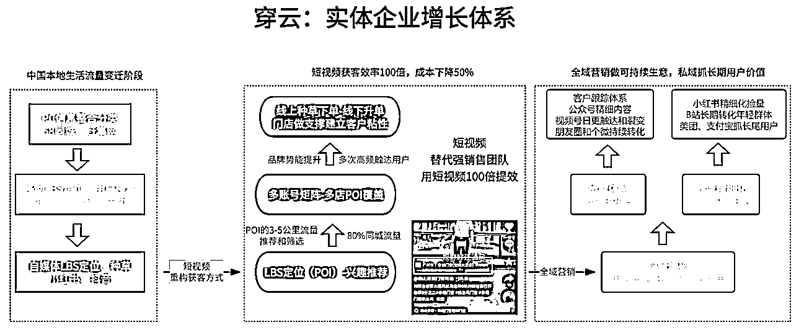
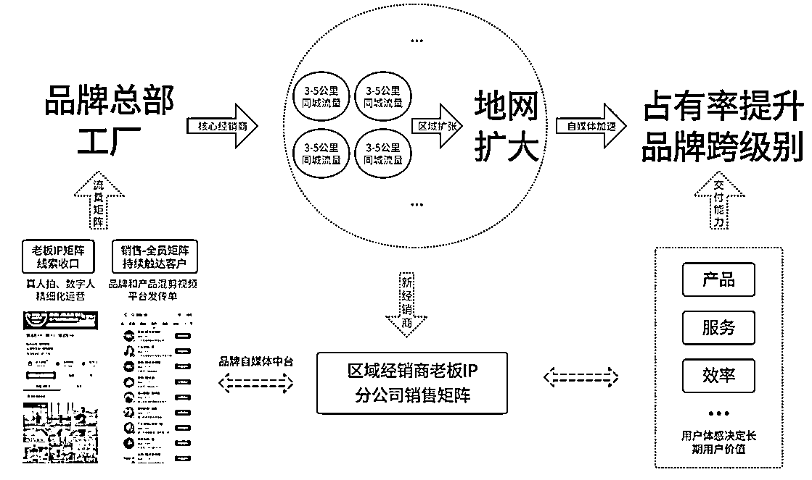
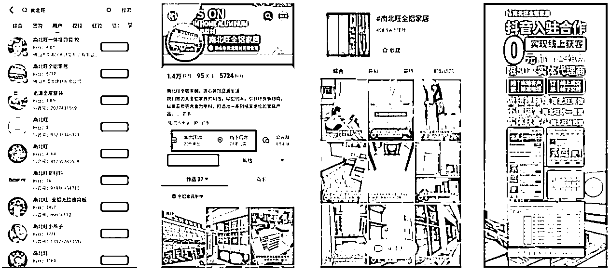
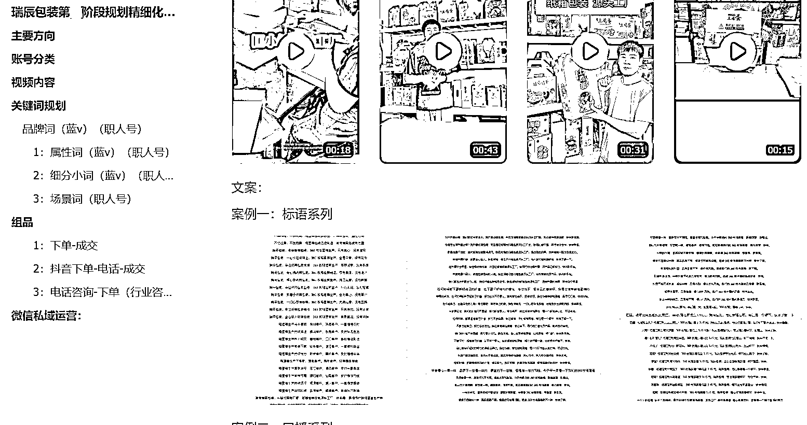

# 制造业的抖音新机遇：从传统到创新，解析赛道的流量密码

> 原文：[`www.yuque.com/for_lazy/zhoubao/px3fgxm17cmxgt1d`](https://www.yuque.com/for_lazy/zhoubao/px3fgxm17cmxgt1d)

## (8 赞)制造业的抖音新机遇：从传统到创新，解析赛道的流量密码

作者： 楚川

日期：2025-01-16

经常会有生财是圈友会问到我，本地生活怎么玩，怎么搞到钱。今天就从可以持续搞到客户、能从市场拿到钱的角度来分析，值得已经掌握流量能力的圈友思考，如何转型拿结果。_

### **楚川：为何说制造业是抖音下一个值得关注的行业？**

在大多数人印象中，抖音更像是一个娱乐化、消费导向的平台。但最近 2 年，它凭借“兴趣电商”和“本地生活服务”两大模式，一次次突破行业边界。

从餐饮、旅游到教育培训、法律咨询、五金建材等，越来越多非标品类开始通过短视频找到属于自己的商业机会。

2024 年 11 月 28 日，抖音生活服务开放了【机械设备】类目的商家入驻，引发楚川对“制造业如何拥抱短视频生态”的深刻思考。

 images.zsxq.com/Fk9ylOSrhiOyUOTg1gRtbSXjAYjm) images.zsxq.com/FrHr4oOXcP15N_j28_lNXyYkIkY0)

作为工业经济的重要基石，机械设备行业长期以来依赖于传统销售模式和线下渠道。当抖音这样的超级流量平台加入战场，这一赛道是否会迎来新的增长曲线？本文将剖析制造业在抖音生态中的潜力与挑战，并结合相关产业的真实案例，为这一新兴趋势提供深度解读。

### **行业背景：传统销售模式的难题与破局契机**

#### **1****.** **经销商体系：覆盖广但效率低**

制造业 90%的销售主要依赖经销商地域网络，以 ToB 为主。这种模式确实具备区域覆盖广、客户资源稳定等特点，但也存在明显痛点：

1.  信息不透明：终端用户需求传递至厂家的链条过长，容易导致沟通失效或错位，但当下逐渐很多客户的决策者的活动范围在自媒体、短视频平台，触达用户这一环节是断层的状态；

2.  运营效率低：经销商之间竞争激烈，但缺乏创新营销手段，很难快速出圈，**2023-2024 年楚川跟伟星管业、万鑫精工、南北旺铝材、良辰科技的总部和经销商沟通都是一模一样感受——越来越卷知道怎么办，这是机会点** ；

3.  区域粘性不足：跨区域拓展成本高昂，中小品牌在全国范围内提升知名度较为困难，这一点让不少区域供给能力强、品牌弱的企业难走出核心区域。

#### **2****.** **数字化转型滞后**

相比消费品市场的大步迈进，大多数机械设备企业仍停留在线下展会、广告信息流投放等传统获客方式上。不少企业和工厂单月投入 30 万以上，又无法做到品牌价值提升，但成交成本又持续上涨，导致利润严重被挤压。与此同时，“靠关系”的局限性愈发明显，新兴企业很难打开市场，而老牌企业又陷入增长瓶颈。

#### **3****.** **用户决策路径复杂化**

制造业当下的困境为一个复杂增长、运营的难题。以机械设备为例，这属于高价低频产品，其购买决策涉及产品性能、售后保障以及信任背书等多个维度。

在没有强大品牌影响力加持的情况下，仅靠单一渠道很难打动潜在客户。但管理层提出做自媒体、做短视频的时候，又会从单一维度来考量这个渠道的产出，而不综合评估整体的增长效率，这正是传统模式难以解决的问题所在。

因此，当抖音平台开放【机械设备】类目时，新的可能性来了——通过短视频内容和直播，将复杂的信息简单化，将抽象的价值具体化，让业务多了持续的发声窗口，让客户“加深印象到最终成交”的决策闭环。

### **抖音云连锁逻辑如何赋能制造业？**

首先理清楚，流量分发逻辑。那就是抖音 POI（Point of
Interest）的流量分发，以城市区域为核心，结合兴趣推荐，这种独特的流量筛选机制，会比过去地推效率提高 n 倍：每条视频代表一次陌拜和地推。再拆解其中的逻辑：

#### **1****.** **精准触达目标客户群体**

不同于展会这种“大海捞针”式获客方式，以短视频矩阵的方式在核心区域做覆盖，兴趣推荐给目标人群。例如，一条关于工程车操作技巧的视频，可以精准触达到相关领域从业者或采购负责人，从而缩短品牌曝光到购买意向形成的路径。

#### **2****.** **降低区域壁垒，实现连锁效应**

通过 POI 模型，一个品牌可以将全国核心城市的经销商绑定到同一个营销体系（云连锁门店、销售矩阵等），实现流量聚合。例如，当某地区用户搜索“挖掘机租赁”，系统会自动匹配距离最近的供应商。同时，全国经销商间的信息协同还能提高整体运营效率，让原本割裂的数据孤岛实现互联互通。

#### **3****.** **内容驱动信任建立**

短视频和直播可以生动展示产品性能及使用场景，这些是过去绝大部分制造业没有尝试的方式。例如，通过短视频还原使用场景、直播试验某款工业泵在恶劣条件下运转表现，不仅能够直观呈现其质量优势，还能增强观众对品牌专业性的认知。这种动态交互形式，比起静态图片和文字说明更容易赢得客户信任。

### **案例分享：南北旺铝材和瑞辰包装工厂的落地实战**

为了验证上述逻辑，我们来拆解 2 个正在进行转型的 2 个生产型企业。

**1、南北旺铝材是广东做铝材生意的工厂，主要做定制工业铝材、全屋定制等，一年营业额在 2 亿左右。**

长期以来主要依赖三种传统获客方式：线下经销商网络、展会推广以及工程项目招标。但随着市场竞争加剧，该公司逐渐面临订单减少、库存积压的问题，同时营销费用却逐年攀升。2023 年初，他们决定尝试转型入驻抖音，创始人谭总和高管一起做 IP，内容以科普+趣味+品宣为主，小部分增长后就遇到瓶颈。

2024 年，穿云团队接手后从以核心区域经销商建立 POI，做成云连锁形式，并建立招商体系；然后做全员营销矩阵，每个人发视频；最后就是线索进池子-私域长线运营。

南北旺是一家很传统的家族型企业，在转型的过程很漫长，在搭建营销基础：品牌定位（全铝家居）、VI 重新设计、全员矩阵（拍剪发一体）、核心区域云连锁搭建，这个过程走了半年，会有内部、双方协作的各种阻力。未来需要放量，往前走 1-10 的话过程会更加辛苦，但这又是不得不走。这是整个中国制造业数字化转型的一个缩影，如果不变，则面临市场占有率降低，体量萎缩。

2**、瑞辰包装是湖南邵东做包装材料的工厂，主要做咖啡纸托、电器外包装、鸡蛋箱、圣诞球生产等，一年营业额在 1 亿左右。**

瑞辰包装的掌权老板是 89 年，属于二代正式接班 30 年的工厂，过去靠资源、人脉和团队的勤奋，在包装行业杀出自己的一条路。但都会面临一个无限内卷，竞对乱价的干扰。2024 年，老板亲自带领团队做短视频转型，每月出现的线索最高成交 100 多万。

于是找到我们团队寻求放大通道。尽管这是一家管理层为 80-90 的工厂，但我们依旧花了 4 个多月完成人员的招管培、营销基建（全员营销、产品体系梳理、抖音搜索运营），目前每个月线索量都在进私域，再做长线转化。在产品线的推广上分别从：粘蚊球、普通纸箱、鸡蛋箱、圣诞球等产品做测试，联合 100 多名员工做短视频矩阵。每个月保持增长，预计 1 年完整流程跑通，月营收能翻倍。

目前老板最大的感受就是：在客户、同行交流中，不需要再做 5-6 分钟的自我介绍，而是说出自己的工厂名称，大家就会反应“天天在抖音刷到你们”，这些因素无形中建立了信任，在销售转化层面是能有很大说服力的。接下来，我们将从老板个人 IP、私域运营 sop 发力，提高后端转化。

这两个案例，都在说明当下在自媒体环境中拿到结果，绝不是一朝一夕，靠简单的 IP 运营获取线索和成交，而是针对企业的实际情况，做出营销体系化的工作，再花 3-12 个月把这项工作，联合老板和背后的团队做执行。最终所做的事情，一定是具有长期价值，如我们的供应链项目 3 年前的矩阵短视频，现在还在出线索。

### **趋势展望：未来赛道走向与竞争格局预测**

随着更多制造业玩家涌入短视频生态，这一领域必然呈现出以下发展趋势：

**平台化体系运营成为主流，组织力强的企业会出头。** 未来，大多数制造业工厂或者品牌都将把“线上+线下”双轨制作为核心战略。一方面利用体系化的打法做短视频矩阵提升曝光率，布局搜索流量，私域发售（公众号-视频号-
社群-朋友圈）长线经营；另一方面结合 POI 功能做重点区域覆盖，而非传统 IP 型做全国流量，这会整合现有经销体系的力量，也加大新的经销商涌入，像滚雪球一样做大。

**头部效应显现，中腰部崛起机会增加。** 像三一重工这样的大型企业将在布局早期占据显著优势，但算法推荐机制注重内容质量，会奖励勤奋和有方法的团队，中腰部品牌也有机会通过优质创意、铺天盖地的视频数量突围，实现快速成长。

**在数字化浪潮之下，“上网”已成必然选择，而以抖音为代表的新媒体平台，则为这一传统行业提供了一条通往未来的新路径。** 从精准获客到信任构建，再到业务增长，它所构建的不只是一个营销工具，更是一种全新的商业逻辑。**但是这个过程如同二次创业，对于企业自身来讲需要投入时间、人力和财力，去搏一个第二增长曲线，这是老板和全员需要做好的心理准备。**

* * *

评论区：

暂无评论