# YouTube 赚钱：YouTube 运营及赚更多的钱

> 原文：[`www.yuque.com/for_lazy/zhoubao/uceia5h7zum4izu5`](https://www.yuque.com/for_lazy/zhoubao/uceia5h7zum4izu5)

## (9 赞)YouTube 赚钱：YouTube 运营及赚更多的钱

作者： 书情小跟班

日期：2025-01-17

前言：这篇文章对之前的文章做一个补充，提到的相关的关键词可在之前发的帖子可找到更详细的介绍

关于 YouTube
赚钱这块，给大多数人的套路都是先做 Shorts，把粉丝涨起来，如果出爆款了，那么时长也来了，这里会有一个问题，那就是 Shorts 收益太低了。

在以前的建议中，当你的 Shorts 感觉赚钱来得慢，那么就要转换思路了。

Shorts 推流与长视频的推流机制是不一样的，Shorts 关于封面的重要性，在前面已经说明过了。

Shorts
的场景是上下滑动，那么在上下滑动的这种情况，往往是封面不怎么来得及看，视频就开始播了，在这种场景下封面没那么重要，封面在什么情况下会有用，之前也有提。

长视频涨时长最快，那就是设置首映，设置首映，会推送给你的粉丝，在右下角还会有提醒，首映是比正常播放权重更高的操作。

在实测中，采取视频是以首映的方式来播视频，用小号去看 YouTube，在小号的 YouTube 首页，大号设置首映的视频出现在最前面。时间点在大号首映视频播放前后，同时频道，这里的频道指的是你关注的频道列表，也会有非常显眼的直播图标。在直播的频道给你显示在这了

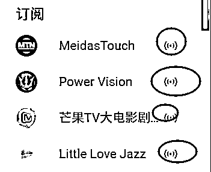

关于一段视频重复播，用工具实现无人值守也有提过，如果懂技术，有另外的花钱方式，那就是买服务器，把视频上传到服务器，视频的播放源设置于服务器的播放源。

最经济实惠的莫过于“真人出镜”，这里我要打一个“”，意在于与真的真人出镜做一个区分。

下面是以图来讲解，这里的订阅人数是 1340

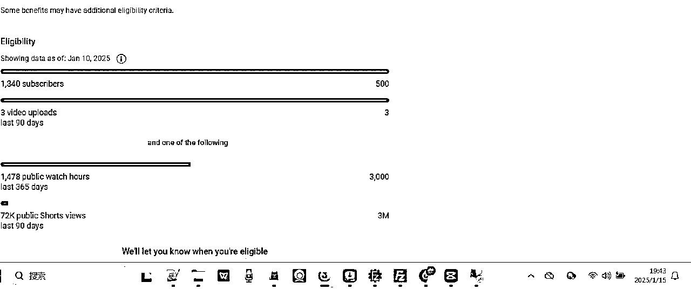

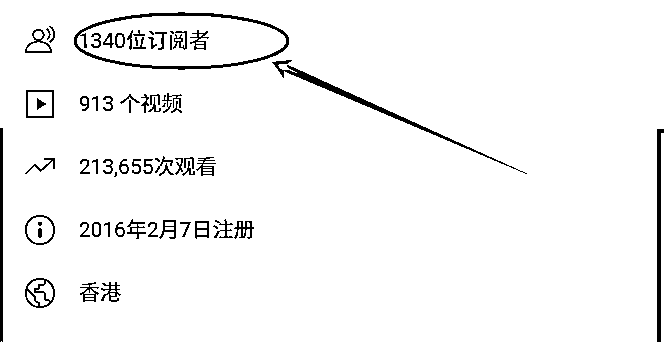

这个图，播放是 98 次

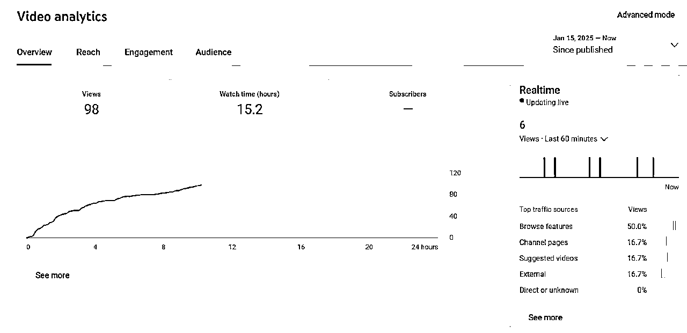

这两张图是来自于 2025 年 1 月 15 号的后台的一个图，这个图，直播开始日期 2025 年 1 月 15 号，110 次播放 ，其实是吻合的

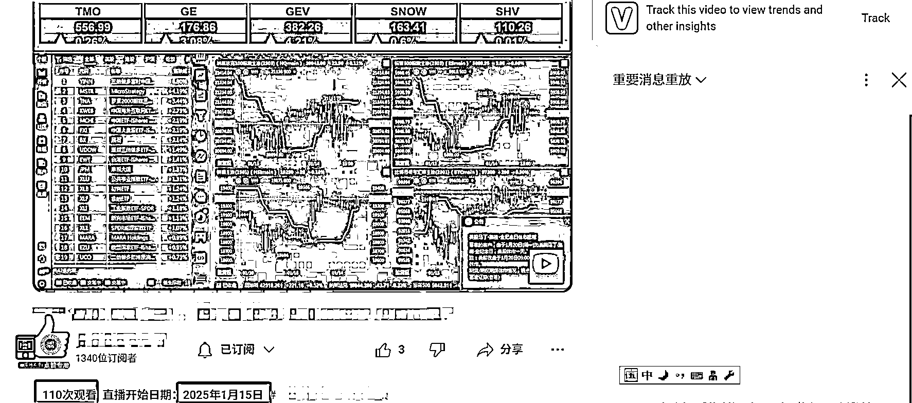

这是 2025 年 1 月 16 号的数据，图片上有日期

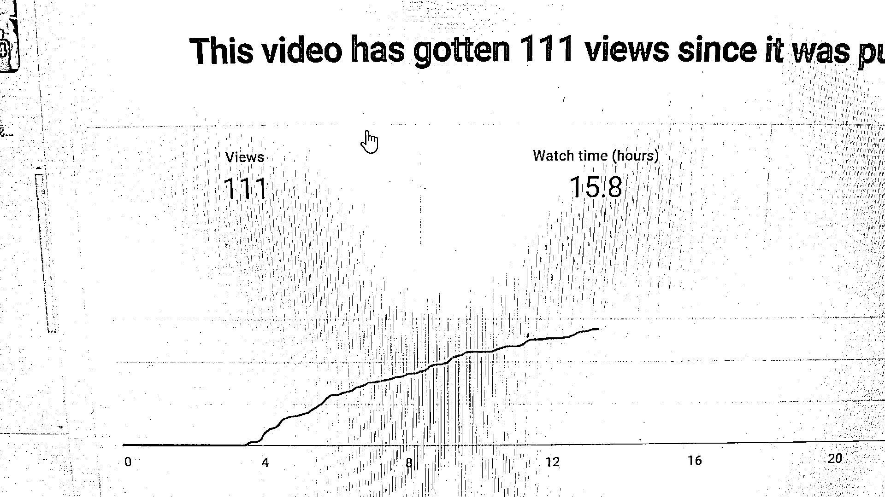

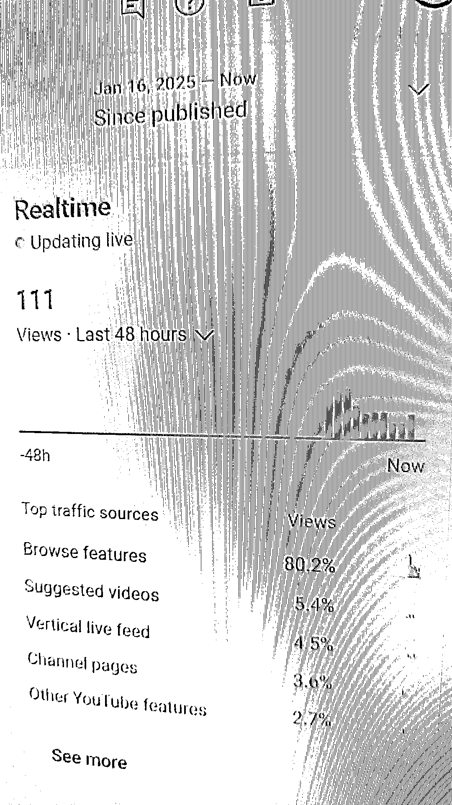

这里是 116 次，前面的图，后台是 111 次，次数是相近的

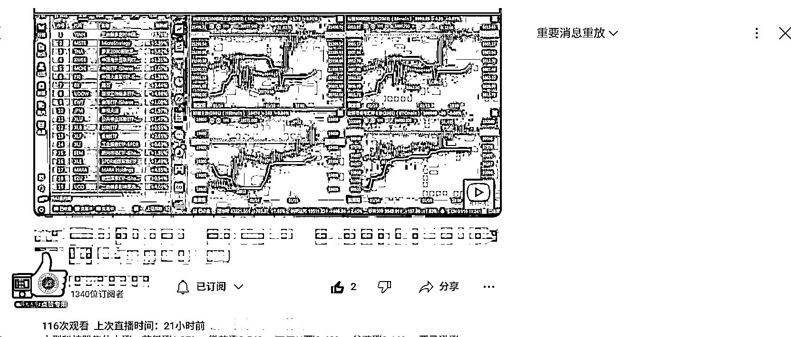

用这个图来看，他是怎么做的，这个页面动态生成的，不定期去抓取数据，让数据动起来

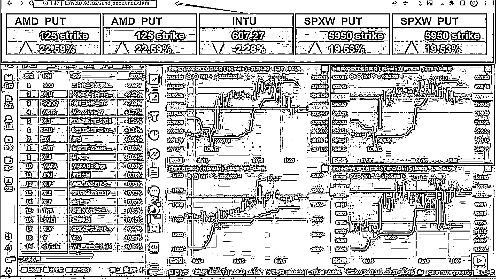

其实就是之前写的涨时长用直播的方式最快了，相对于 Shorts 而言，直播的形式可以扩展开来，直播是外衣，内容是可以多变的，比如下面的案例

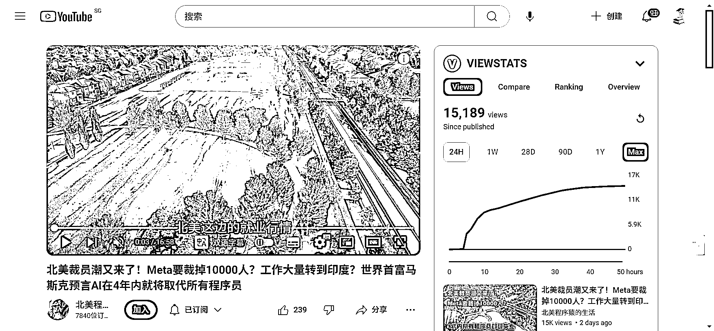

这种视频展现形式也是挺不错的，前提是有无人机的视频资源，资源怎么来，这个就八仙过海各显神通了

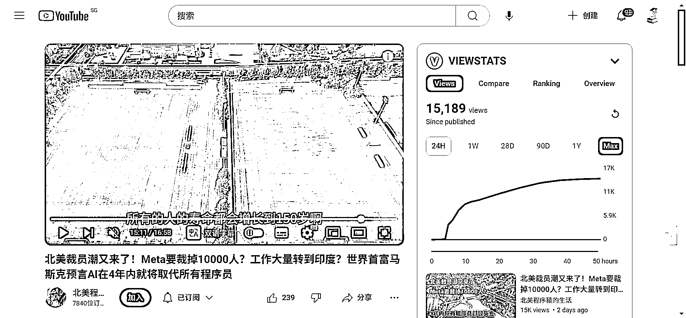

整个视频拍照美景，也是吸引人，无人机的视频做为背景，有声音，有字幕，看起来也不错

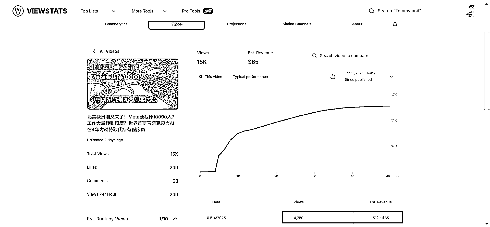

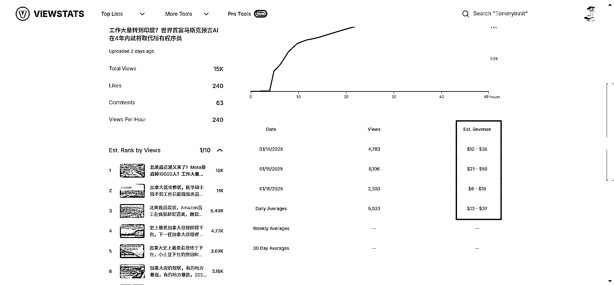

可以扩展下，做风景类的，如下图

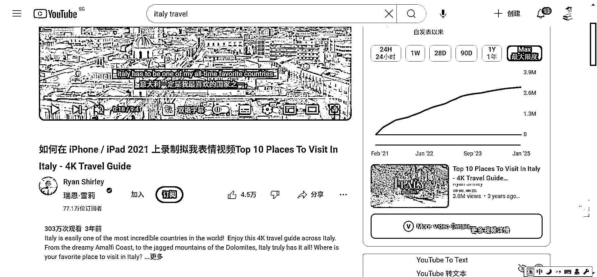

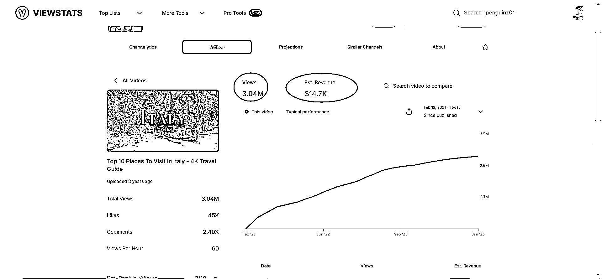

这个是收益的图 $14.7K，那就是 1.47W，这是美元哦，这个工具，之前也有提，算收益相对会更准一点的，建议大家都用这个来看收益

直播要花钱的两大类：

1、用直播软件，对某一个视频进行重复播多次

2、买服务器，直播的时候，视频源用服务器上的视频来推，先把视频上传到服务器上去

好了，最后是普通人能做的，就是这种形式如何做？

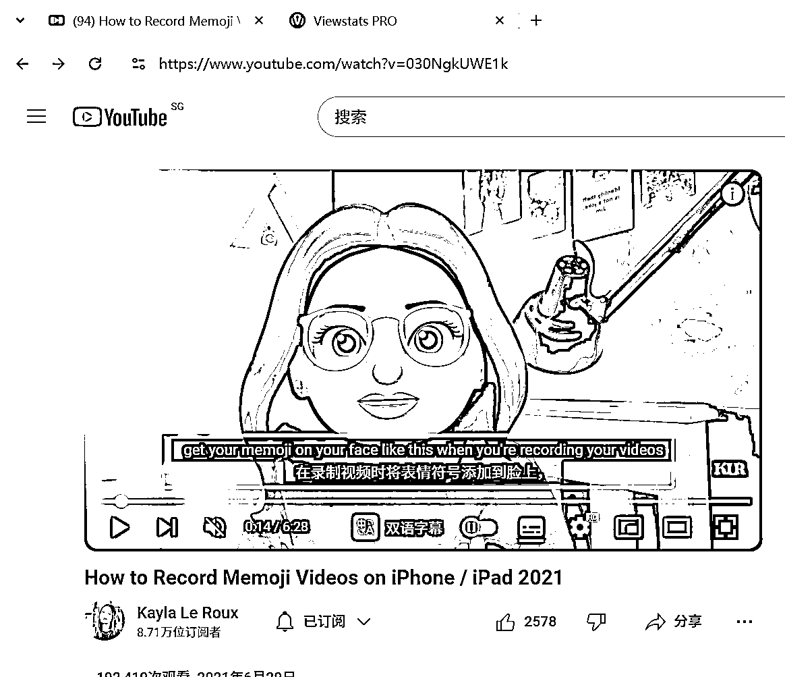

这个方法有局限性，苹果系产品才能用，相关链接

[`www.youtube.com/watch?v=030NgkUWE1k`](https://www.youtube.com/watch?v=030NgkUWE1k)

以上内容抛砖引玉，比如说同样是直播，那么直播的内容是不是可以换个形式，换个场景，比如说是不是可以挖掘从哪里去低价或者比较便宜的渠道去拿到无人机拍摄的视频？或者干脆带个头套拍视频？

之前写的内容，我有空会更新在这个飞书文档上

做 YouTube 的一些常识

[`rlwxa0zgke.feishu.cn/docx/P2DYduGbkoW0nqxcRZgcL6xKn7I`](https://rlwxa0zgke.feishu.cn/docx/P2DYduGbkoW0nqxcRZgcL6xKn7I)

* * *

评论区：

暂无评论