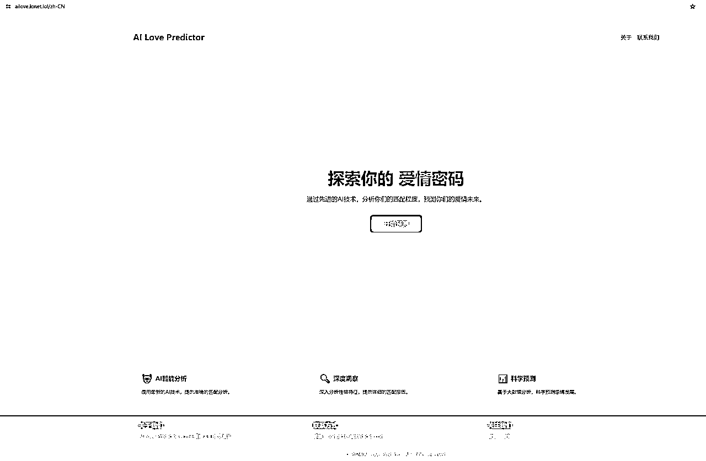
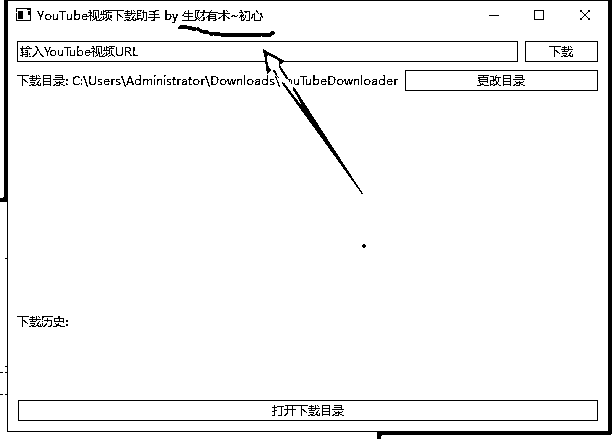
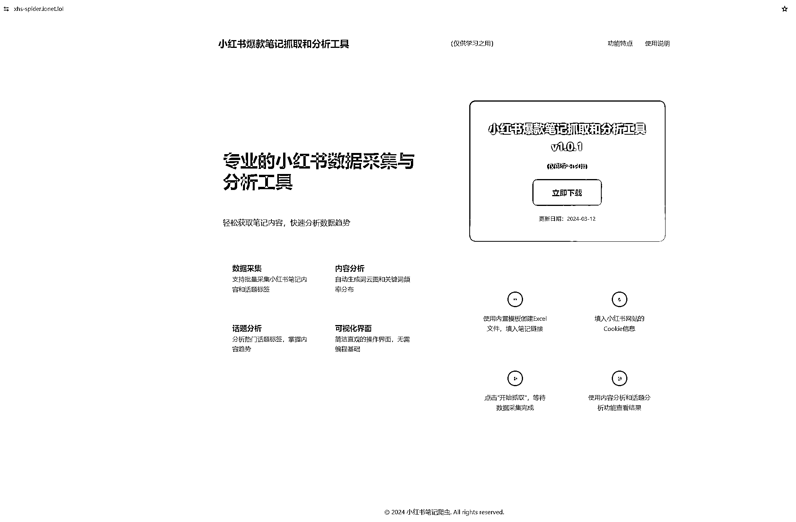
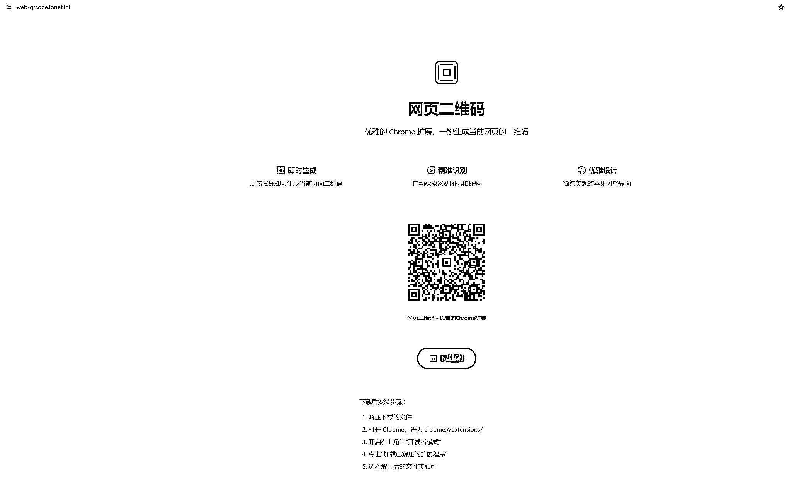
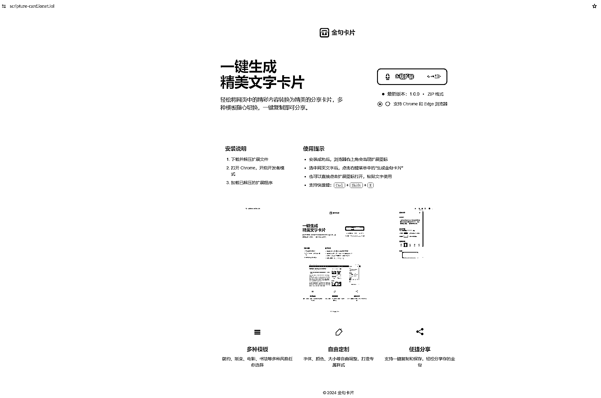
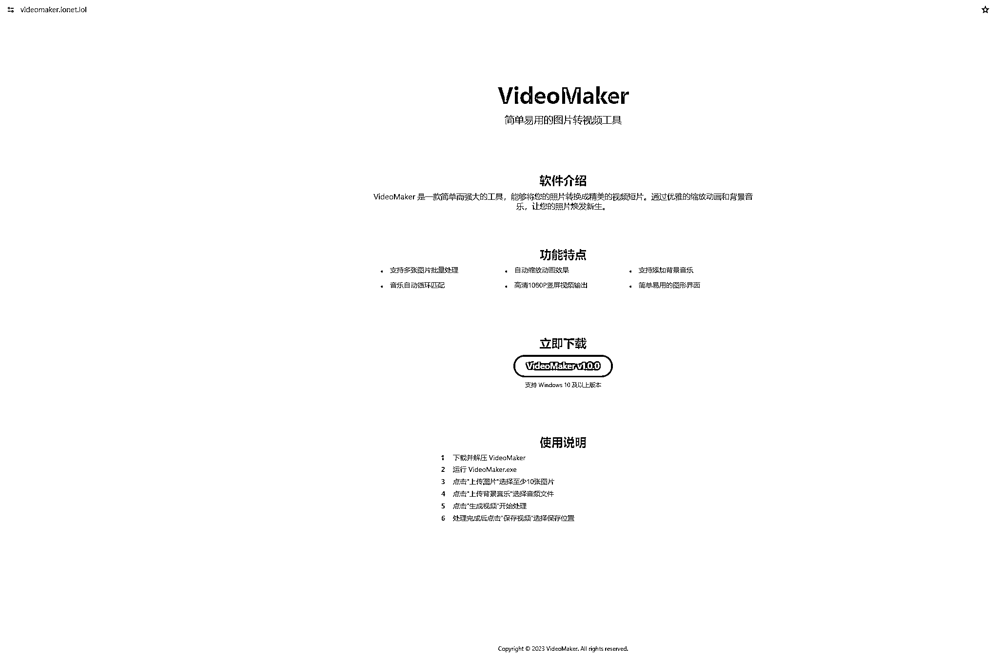
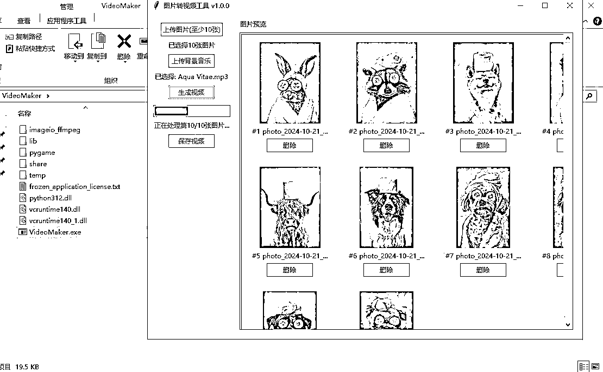
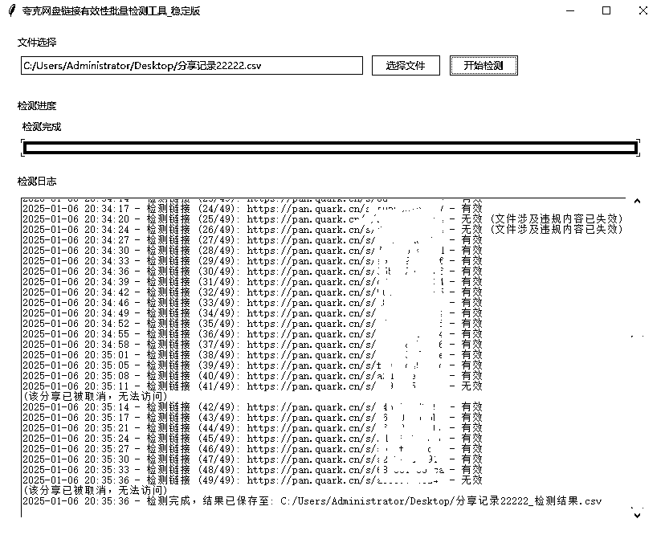

# 一个全职宝妈的 cursor 编程之路（迟来的航海好事）

> 原文：[`www.yuque.com/for_lazy/zhoubao/gaqaiymzxpf4y1nf`](https://www.yuque.com/for_lazy/zhoubao/gaqaiymzxpf4y1nf)

## (精华帖)(65 赞)一个全职宝妈的 cursor 编程之路（迟来的航海好事）

作者： 初心

日期：2025-01-06

**用想法播种、用耐心耕种、用热情燃动**

hi~大家好，我是初心，是一位全职宝妈。今年 8 月 29 日加入生财，这是我的第二次航海。

Cursor 航海至 12 月 16 日顺利上岸，期间做完了本次航海手册中的全部 6 个开发案例：AI 恋爱预测网站、YouTube 本地下载工具、小红书爆款笔记抓取和分析工具、网页二维码插件、网页金句卡片插件，以及 YouTube
Shorts 视频批量剪辑工具。

对于以上这些，如果是一位具有代码开发经验的朋友，可能微不足道；但对于像我这样的，在接触 Cursor 之前，看代码就像看天书一样的外行，那简直就是噩梦。

所以，像我这样，一个连代码都一窍不通的全职宝妈，是如何从 0 ~ 1 ~ 6，顺利完成这些案例开发的呢？

# **一、用想法播种**

每个人都有自己想要实现的梦想，一辆车、一套房子、一位帅气老公/漂亮媳妇，又或者一款工具软件。由于各种原因，我们可能都还没能实现自己那个小小的梦想。

但是，只要你有着强烈的意愿，并且迈出那最最最艰难的一步，你的新旅程就正式开航啦！~

回想起为何会加入这次海航，当然是看到花生的「小猫补光灯」啦，它彻底重新点燃内心深处的那个想法。

试想一下，以往需要各种复杂技术的 APP 软件，现在用一款 AI 工具（Cursor），就可以在毫无代码经验的基础下独立完成开发，并且上架正式运营，这是一件多么美妙的事情。

一时间，各种想法涌上心头，突然不知道该如何下手，如何开始。幸亏有航海手册的指引，让我们能够从一款经典的俄罗斯方块游戏和图片压缩网站开始。

按照航海手册上的方法，几乎不费摧毁之力就可以完成游戏和图片压缩网站的开发，而且能正常运行，这期间并没有遇到什么 BUG 出现，可能是因为开始阶段它们的功能比较好实现吧，这也打心底给了我莫大的信心。

经过小试牛刀，此时的我已经蠢蠢欲动，希望尽快完成海航手册中的案例，早早出师，然后就可以去完成自己一直想要的那些工具软件。

# **二、用耐心耕种**

显而易见，越往后，开发难度越大，因为涉及到的代码也越来越多，别说有代码经验的看到头都疼（看群里的大佬们），更何况像我这样的代码盲呢。

但经过我的亲身经历，Cursor 的好处是可以无限改错，你所需要的就是时间，这就需要你有足够的耐心去不断尝试和调教。

### **1、AI 恋爱预测网站**

我按照顺序第一个开发的是 AI 恋爱预测网站，而恰恰它耗费了我最多的时间，因为不懂得控制 AI 工具，我一直按照 Cursor 的指示一步一步往下走，发现没有尽头，中间没有做任何调试，甚至不知道代码能不能运行起来。

我知道自己不能一直这样下去，如此会消磨自己的积极心态，我需要一个哪怕功能很少，但确切可以运行起来的工具来给自己打气。

随后，我停下了脚步，开始调整心态，我告诉 Cursor，我现在需要一个极少功能但可运行的网站，这是我们生财人都懂的，跑通最小 MVP。Cursor 很听话，它开始根据当前的代码进行调整，以满足我的需求。

对我来说，一切都很顺利，但是期间遇到的问题并不少，我就直接把问题复制粘贴给 Cursor，这样循环往复，看上去，我需要的就是时间以及专注。

这里有个细节我觉得非常值得留意，我看见 Cursor 会不停地犯同样的错，如果你也发现类似情况，那就要认真地去看一下你与 Cursor 的对话记录了。

即便不懂代码，至少也要看一下上下文对话，比如是否执行了正确位置的文件，我就遇到很多次它不停修改错误位置的同名文件，最终还是我发现了问题所在。

就这样，经过大概 5~6 个小时的时间，AI 恋爱预测网站完成了。虽然，界面很丑，但是作为我用 Cursor 完成的第一个完整网站，我决定给自己足够的鼓励。

伴随第一个网站的完成这里还有个小插曲：把网站的代码放到 github 和 vercel
之后，我发现访问不了，我心有不甘，自己开发出的好工具，如果不能让朋友们用，岂不是暴殄天物！！！

于是，我又开始执着起来，利用 ChatGPT 寻找解决方案，终于让我找到了方法，将自己的域名先解析到 CF，然后直接生成二级域名，再绑定到 vercel 对应的项目上面，这样就可以直接分享给小伙伴们使用啦。

往后的几个案例项目，我都绑定了自己的二级域名，简直一劳永逸。

当我完成第一个网站的开发之后，自信心更强了，但我是有底气的，我对 Cursor 的使用更加熟练了，我开始理解目录结构、git 等这些东西，至少有一个初步的概念，这要得益于航海手册的内容丰富。

接下来的 5 个案例项目，在航海手册要求的基础上，我开始有了自己的想法和意识，开始给自己增加难度。

### **2、“YouTube 本地下载站点”**

虽然要求开发的是网站，但是我觉得如果能够在 Windows 下直接用，那岂不是更便捷。于是我向 Cursor 寻求制作 windows 软件的可能性。

起初，我觉得这太难了，应该不太现实，但是当 Cursor 给出方案后，我喜出望外，基于我目前的知识，竟然没有一丝难度，只要按照它的提示不停的“accept
all”即可。

就这样，没曾想耗费 1.5 个小时左右，我就顺利制作出了人生第一款 windows 软件。想想看，输入一个 YouTube 视频地址，点击下载按钮，然后视频就出现自己的电脑上了。目前，这个软件已经给我的同学使用，据说很顺畅。

虽然，YouTube 本地下载站点也做了一个官网，但是由于网站托管到 github 和 Vercel
的安全性缘故，无法实现数据交互，所以，它几乎只是一个没有功能的站点，由于时间原因也没有添加下载链接。

这个项目其实很有意思，它可以和我参加的另外一个航海“YouTube Shorts”互补。

### **3、“小红书爆款笔记抓取”**

和上面的一样，虽然要求开发的是直接通过代码抓取，但我现在满脑子都是做 Windows 软件的想法，不达到这个目的誓不罢休的状态。因为我之前成功过，所以现在有了更多的底气。

于是在调试代码没有问题之后，也顺其自然的让 Cursor 帮我实现了 Windows 版本，结果虽然成功了，但是过程依然很漫长，也是经过近 5 个小时的调试才最终完成。

这一次，我又开始给自己加“戏码”了，我当时在想，一般外面那些软件都是有自己的一个官网，最简单也是用来介绍软件和提供下载，我是不是也能配套做一个软件的官网。

于是顺着这个思路，开始让自己的“黑奴”（听他们都这么叫）Cursor 又开始做事了，我只需要告诉它我要做什么，然后盯着点代码里的路径，因为我发现 Cursor 经常搞错，大概率和自己不严谨的提示词有关。

相较之下，网站的开发要更顺利一些，因为就是一个简单的页面，提供了软件介绍、功能说明和下载地址。虽然页面还丑，但是暂时就先不去优化了。

### **4、“网页二维码”和“网页金句卡片”的浏览器插件**

现在，根据我的思路，但凡做一款工具，都至少需要一个 windows 软件和配套的官网。经过我对航海手册的观察，这两个浏览器插件的实现要比之前的工具简单一些。

所以，我保持了一天开发完成一个的进度，还顺利完成了配套官网的制作，其中 80%的时间都是在让 Cursor 改代码。

在此期间，我没有停下去做其他事，而是一蹴而就的完成整个插件的开发，我认为只有这样，才能在这个过程中不断进步。

### **5、“批量剪 YouTube shorts 视频”**

这是最后一个开发案例，也是很有实际使用价值的工具，同样能够与“YouTube
Shorts 航海”遥相呼应。航海手册中依然是要去使用代码直接生成视频，追寻自己的想法，我再次“提升难度”，将可行的代码生成了 Windows 工具并制作了一个官网提供软件介绍和下载。

这次，我遇到了更多的问题，试图让 Cursor 自己完成视频的合成，但是视频在预览中始终都有条纹，最终还是让 Cursor 参考了航海手册中的代码才得以解决。

这个过程耗费了我将近 8 个小时，我自己都不敢相信，其中夹杂着自己的执着，虽然回头想来确实有些浪费时间，但是结果让我将其抛之脑后，我成功完成了案例。

当天，我几乎是到了晚上接近 24 点才提交打卡，我一边看着时间一遍调试错误，想着一定要在当天完成后再打开，结果我真的做到了。

# **三、用热情燃动**

现在，我已经完成航海手册中的所有案例开发，“能否完成一款软件的开发”已不再是我关心的话题，现在的我想知道自己究竟能用 Cursor 开发出一款怎样的软件。

我在随后的打卡中给了自己几个选择：

1、英语实时对话工具，用于帮助小孩练习口语。

2、视频分析工具，用于分析视频中的内容，非语音转文案。

3、某平台关键词分析工具，用于分析某个关键词在某个平台的结果。

这三个都是自己有需求的工具，当时我首选了第二个，大概花了 3 个小时完成开发完核心功能，并在与腾讯云 API 对接过程中调试成功。但是在生成网页端时，由于自己对 Cursor 的控制力不够，导致核心功能又失效了，在累计耗时 10 个小时之后，还是没能调试成功。主要问题在于自己不懂代码，以及 Cursor 始终没能正确读取腾讯云的官方文档，这也与自己的实际开发能力有关。

由于最近，受困于夸克网盘链接的大量失效问题，我没忍住又花了 3 个小时做了一款“夸克网盘分享链接批量有效性检测工具”，终于解决了这几天遇到的烦恼。

我能感觉到自己当前正身处 Cursor 的热浪之中，我有着强烈的意愿去完成这些工具的开发，AI 让这个世界的门槛大大降低，所以，我们一定要把握住这次机会。

# **写在最后**

经过这次实战历练，我能够快速成功开发出这些小工具，主要归结于以下几点：

1、强烈的意愿

2、充足的时间

3、足够的耐心

4、不满足现状

5、真诚的热爱

即便你没有顺利完成这些案例的开发也不打紧，因为你可能只是没有像我这样充足的时间，如果有，你或许比我完成的更好、更快。

每个人的实际情况并不相同，走的路也一定是千差万别，我想，只要能发挥自己的优势就应该没问题了。

最后，感谢志愿者、教练和领队在本次航海中给予我们船员的帮助！！！

* * *

评论区：

AI 进化论-花生 : 很棒

糖饼 : 优秀[强]

11 : 太厉害了，请问都是用电脑弄的吗？还是手机弄的，因为我刚进来没多久，不太明白

初心 : [玫瑰]教练给力

初心 : 是电脑上做的，跟着海航手册做就行。

路途 : 电脑哦。

蘑菇 : 厉害👍

小迷 : 自己的域名先解析到 CF，然后直接生成二级域名，再绑定到 vercel 对应的项目上面
这里可以详细说说吗？我今天也遇到生成 vercel 不能用的问题，求喂饭[呲牙]