# 我用 Cursor 复刻了古代朋友圈日历

> 原文：[`www.yuque.com/for_lazy/zhoubao/ninggbg4c4woip4v`](https://www.yuque.com/for_lazy/zhoubao/ninggbg4c4woip4v)

## (精华帖)(58 赞)我用 Cursor 复刻了古代朋友圈日历

作者： 何勇

日期：2025-01-08

#龙珠悬赏 #AI 编程 #Cursor

之前用 Cursor 做了一款小红书小绿书图文生成器，瓜斯老师找到我让我抽空写个帖子来分享一下。

但白天上班，晚上下班到家又比较晚，等到周末想起来写，打开生财又关闭发帖了，所以就一直拖着......

今天晚上回来早，趁有空，把前段时间做的一个案例分享给大家。

先来看看做好之后的效果图吧（需要小工具请到文末下载）。

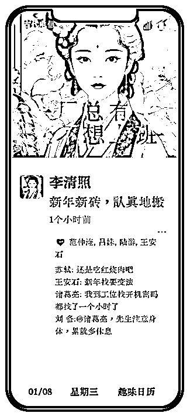

**一、事情的起因**

大约是元旦前的某一天，看到有人在朋友圈发个性化的文创日历，还是比较好看的。就是下面的这种：

看到之后，发现每一天的日历，都是很有个性的语句，整体风格比较可爱。我想着，如果做成一个工具模板，让大家自己定义，也是挺好的玩。

说干就干，大约花了 2 个小时，搞定了这个小工具。

**二、复刻的过程**

一开始，我问 Cursor，是否能帮我搞定这事。

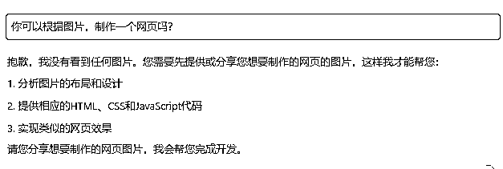

当它回复我之后，我明确地提成了我想要的内容。

（这一步很关键，相当于做产品的需求分析，描述得越清楚，Cursor 越容易帮你实现它）

我上传了朋友圈的图片，给的提示词是：

这是一个模仿微信朋友圈的网页截图，请帮我转为网页。其中，顶部的人物骑车背景以更换其他图片；个人头像也可以定制，发的朋友圈内容可以定制，发布时间，点赞人、回复、日历的日期都可以定制修改。

很快，它变给我画出了一个雏形。

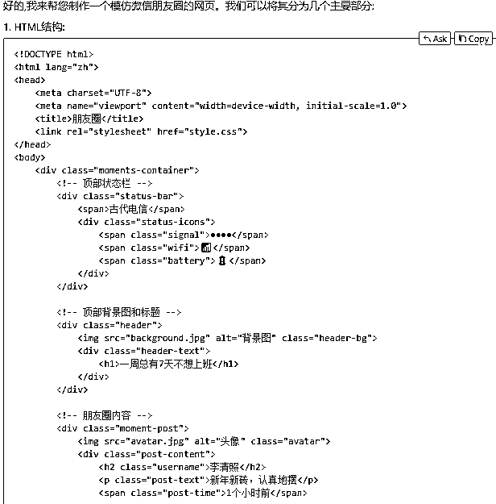

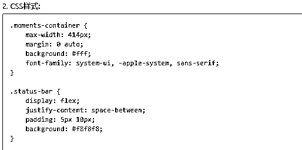

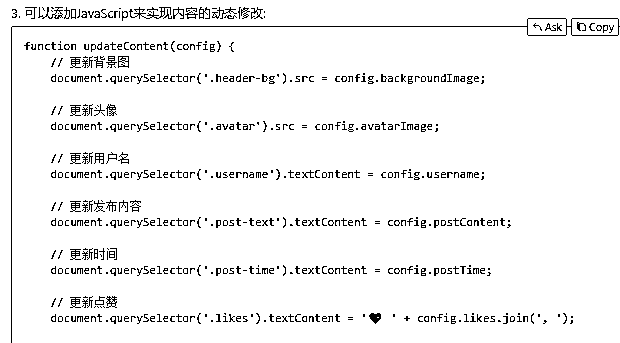

想必看到这里，大家跟我一样，发现了问题，它把文件拆分成 3 个文件了。作为小工具，其实是没必要这样拆分的，于是，我让它合并成一个文件。

这样，就成一个 pyq.html 对于后面的工具打包是更方便的。

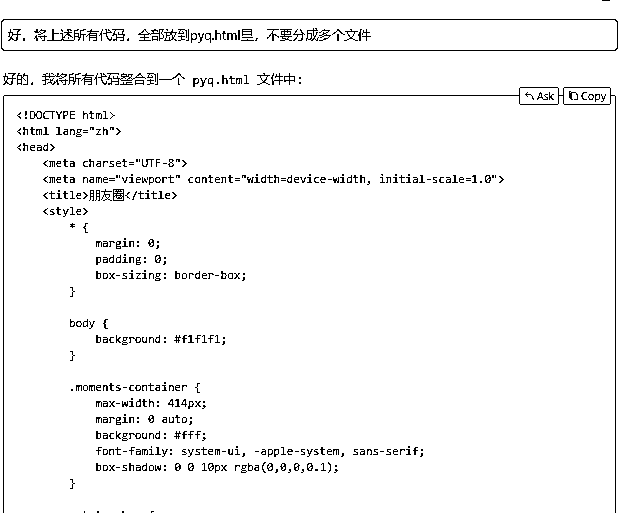

用浏览器打开，是这个样子的（已经有点图中的模样了，但手机的边框、版面的高度都不够）：

于是，我接着让它帮我调整出来手机屏的感觉。

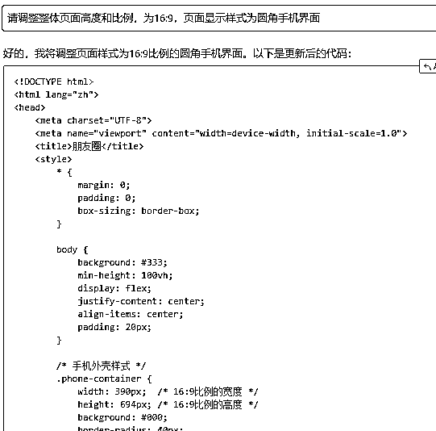

这一步操作完，整体工作基本上就完成的差不多了。

但我还是觉得字体不够复古，于是手工添加了字体。然后，让它把页面显示的字体全部调整为这个字体。

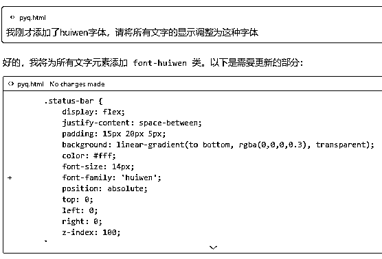

到这一步，基本上显示的内容就完成了，就是一开始大家看到的图。但是，为了每天都可以用这个模板来定制，所以我们需要将图中的如下部分（图中标注数字的 8 个地方），调整为用户可编辑。

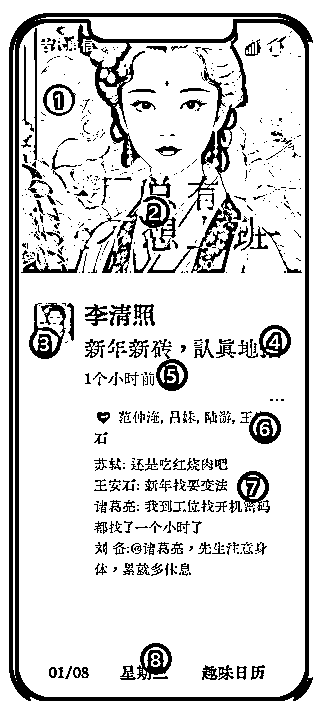

所以，我让 Cursor 帮我调整。

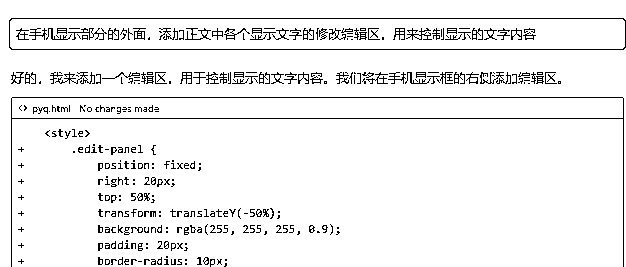

这一步，Cursor 执行得非常完美。甚至，我都没有告诉它修改哪些字段，它自动调整好了，还告诉我调整了哪些字段，大大地超出了我的预期。

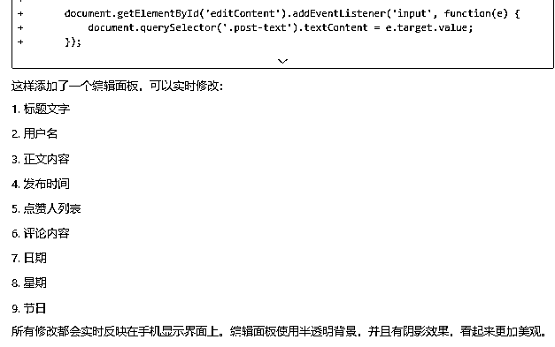

当我运行起来，发现日期不可以自己设置，于是，

让它帮我添加了一个日期控件。

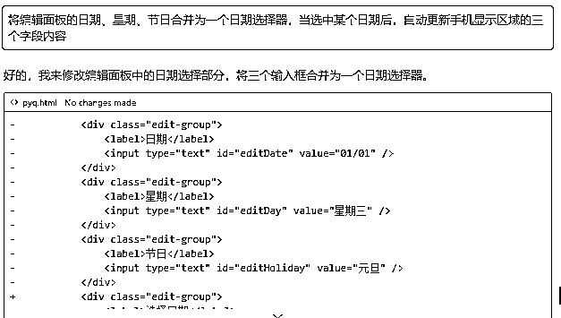

最后，发现它不知道中国的农历节气，又添加了一下提示词：

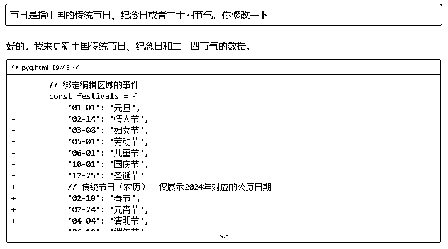

最后，我想它帮我把设置好的日历，导出一个图片。

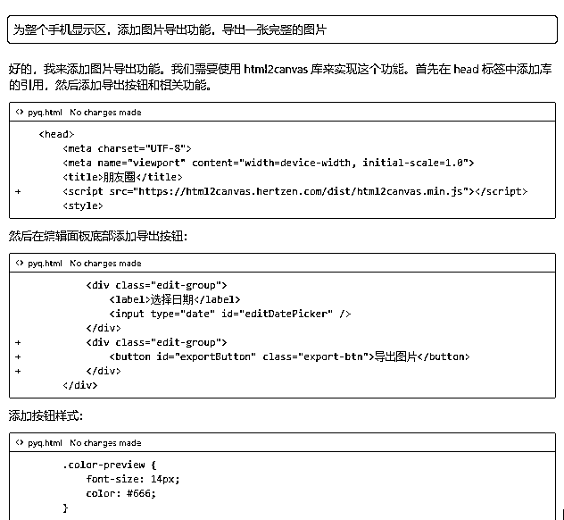

好了，到这里，就基本结束了。它最终呈现的效果是下面这样的：

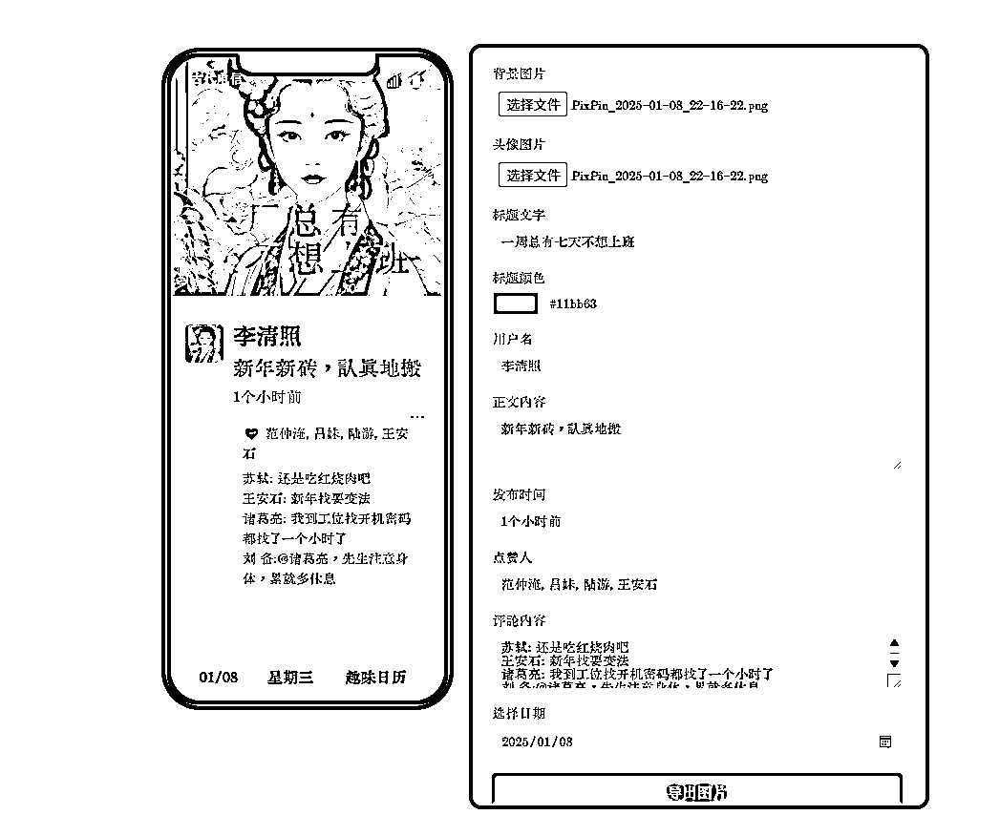

**三、总结及感受**

1.Cursor 已经很强大了，做一些小工具是非常适合的。

2.但 Cursor 仍然不适合做大型工具，或者说代码一多起来，它就乱。所以，做大的改动时要记得及时备份。如果你会使用 svn\git 之类，那是再好不过了。

3.自己还是懂代码的，Cursor 写的代码，最好自己看一遍，或者对比一下差异，再合并。这样，可以减少很多无谓的重复时间。

最后，祝大家一起生财！
（就不介绍自己了，害怕被认出来，需要小工具的可以访问夸克网盘链接：[`pan.quark.cn/s/b798019630af）`](https://pan.quark.cn/s/b798019630af）)

* * *

评论区：

吴海晖 : 厉害

何勇 : [握手]

亦仁 : 弄上线传播一下。

何勇 : 谢谢亦仁老大！没放线上是因为我没想好下一步迭代意向，其实图、文是都可以一键生成的。