# 纯新手，从 0-1 用 ai 撸房贷计算微信小程序至上架的心得（cursor 航海复盘）

> 原文：[`www.yuque.com/for_lazy/zhoubao/eag66rzzwcrw03qh`](https://www.yuque.com/for_lazy/zhoubao/eag66rzzwcrw03qh)

## (精华帖)(54 赞)纯新手，从 0-1 用 ai 撸房贷计算微信小程序至上架的心得（cursor 航海复盘）

作者： 波本零

日期：2025-01-08

基础代码薄弱的人，怎么从 0-1 撸一个微信小程序并顺利上架？

大家好我是波本，想来有点惭愧我是 21 年加入生财的，但这是我第一次完整地在生财发布一篇帖子。12 月份我跟着生财的 cursor 小航海实操，航海期间我曾经用 cursor 尝试做过不少产品，都失败了。直到月底我上架了一个房贷计算器的微信小程序，甚至元旦前我都还在改代码，所以这次想要总结一下我整个做小程序的心路历程。

先跟大家说明，其实我是有一定 html 和 css 基础的，但是全程跟着 cursor 做下来还是很吃力，所以这篇复盘文章我个人认为算是对于完全 0 代码基础的小白的一篇“祛魅文”，客观来说也算是缓解大家不会用 ai 做产品的焦虑🍌🟢

# 1、0 基础小白不要一上来就做非常困难的产品

之前看生财里别人写的帖子，有大佬写到“可以根据自己的贴身需求去找产品”，同时我看到的航海手册案例里面也有油管下载器，于是我就思考能不能做一个 ins 下载器，这样就能满足我随时在 instagram 上下载帅哥图片的需求哈哈哈。

所以我先是动手做了个 ins 下载器，要求 cursor 帮我做一个可以下载图片和视频的 google 插件。

像下面这个图片，我的下载器运行其实开头就运行很顺利，很快就给我下载了一张图片。这时候我在想“原来做个 google 插件也没有那么难嘛”。

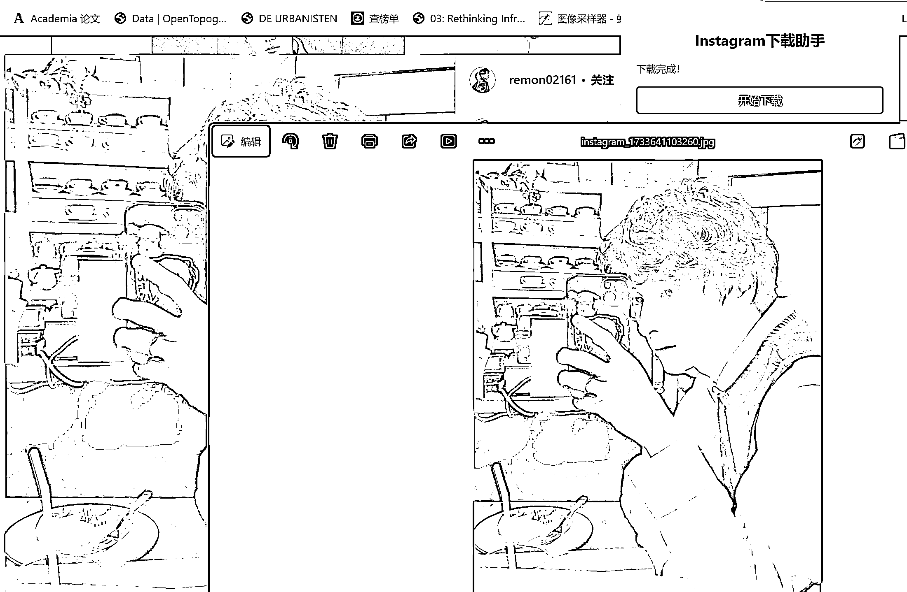

但是后面代码改着改着就出现了问题：

要么小程序只能下载帖子里的第一张图，要么无法接收下载视频的指令，总之林林总总的问题都出现了，甚至还有从前的代码已经改好了、后面再改其他代码的时候又会把前面修补好的 bug 重复改错的情况，几度陷入鬼打墙。

后面在航海群里提问，发现可能是 cursor 无法适应长对话，所以需要把之前的修改记录总结到 README.md 文件里，否则你不断向 cursor 提出需求，它会“变笨”原地打转，压根听不懂你的命令。

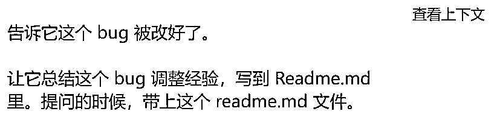

本来代码改到这里我以为做这个插件已经临门一脚的事儿了，没想到还是重复陷入鬼打墙的状态。

后面实在忍不住找到程序员朋友帮我看代码，他查到问题跟我说，是我使用 cursor 自带的免费模型不够聪明，导致尽管我提的需求已经很精确了、但依旧出现 ai 还是在反复自以为修正了 bug 而不断写错误的代码的状况。

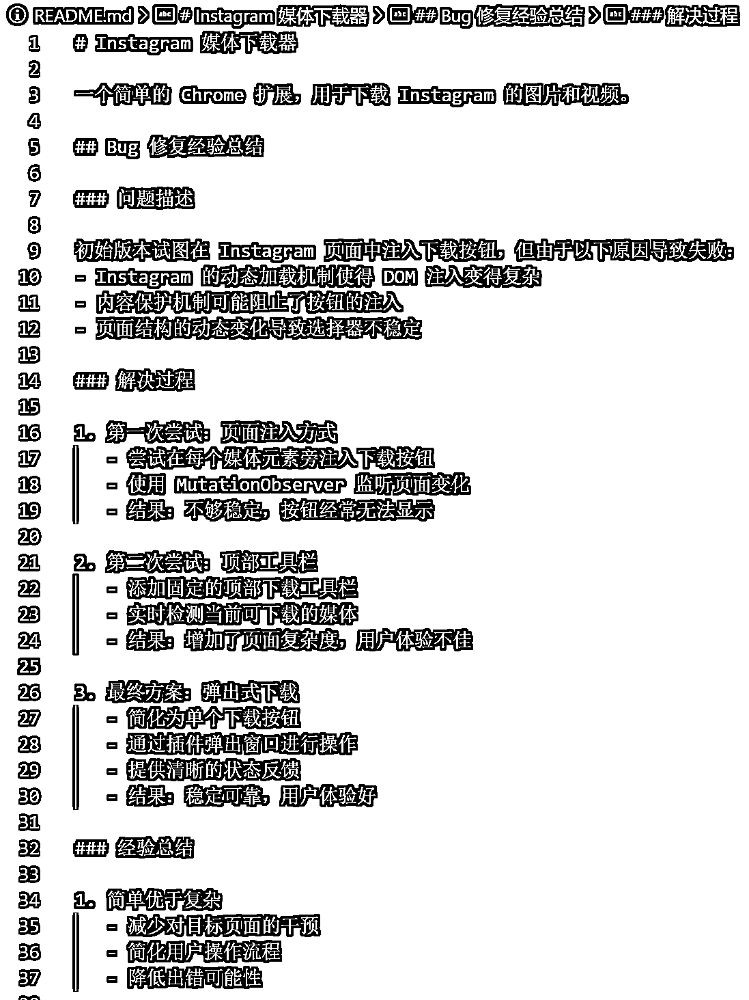

同时，我的程序员朋友也指出完全 0 基础撸一个 ins 下载器实在太复杂了，让我先做别的产品。

因为一个 ins 帖子既包括静态图、也包括视频还有动态图，尽管在付费购买 cursor 的升级模型可能会解决这个问题，但没有代码基础的人没办法提出非常精确的问题，从而向 ai 描述需要用什么语言、在什么环境下去完成多模态下载的需求，而是只能用大白话跟它说“目前我遇到了 xx 问题”“目前我收到的 bug 是 xxxx”。

当 ai 听不懂的时候，它就只能反复在一个漏洞上打转，很影响整个代码推进过程的效率。尤其是如果你的产品综合了很多功能，而你的 ai 还在你 1/10 的功能上打转，真的会很崩溃…

而且，他也指出正确使用 ai 改代码的姿势应该是你看得懂 cursor 写的代码，你拿出一小串有问题的代码让 ai 帮你改，而不是只管提出问题、然后完全不看 cursor 发送的结果直接整段复制粘贴（事实证明有时候 cursor 它只会改部分代码，如果你完全抄到文档里是必然出现 bug 的），那简直是天方夜谭。

所以写到这里想强调的是，完全不懂代码的小白就是用 ai 做很简单的产品就已经很了不起了，比如下载器、pdf 压缩器、简易的导航网站等等，这些产品既不需要调用 api，同时功能也不复杂。

不要一步登天就想着做一个狂炫酷帅屌炸天的工具，踏实学点代码基础、平平淡淡才是真……

# 2、通过关键词找需求

ins 下载器放弃以后，我在闲鱼花 30 来块钱找人给账号代充值（注意这里不是买号，买号是指你用公共的账号进行登录，不要搞错了），且中途我又打算围绕自己的需求做了两三个产品，但都因为各种各样的原因失败了。

最后兜兜转转，我发现还是“计算器”这个产品的功能最简单。并且以变现为目的，我最后定下做一个计算器类的微信小程序。

但是计算器，要做什么功能的计算呢？

这里再次推荐一个免费的关键词查询工具——腾讯搜一搜平台[`ad.qq.com/`](https://ad.qq.com/（)。

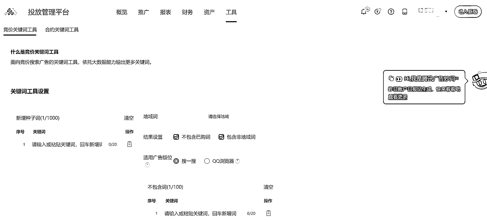

注册的时候会对你的身份有要求，没关系普通个人肯定是不通过的，随便填完注册进去就好了，我们目的是使用平台的关键词工具，来获得用户使用微信搜一搜的数据反馈，从而挖掘微信上哪些需求是用户需求量比较大的。

注册完后，直接从“工具”-“投放管理”-“关键词工具”点进去即可。

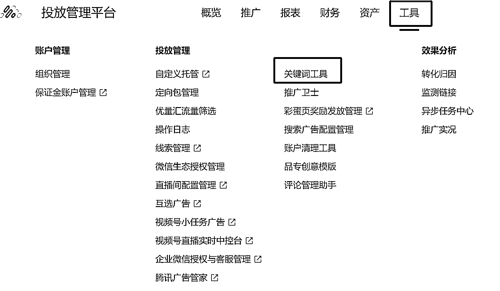

比如我想知道有哪些计算的需求是微信用户搜索量最大的，直接输入“计算”，其他默认，点击“提交拓词任务”即可。

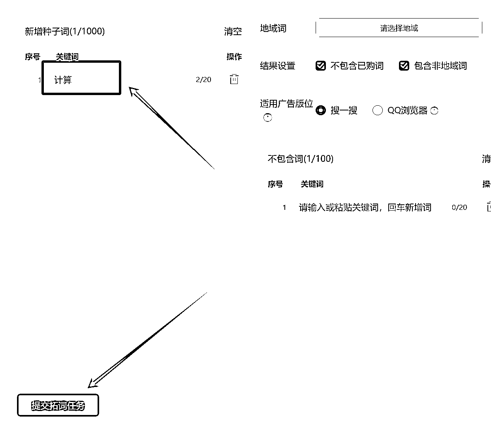

提交完后，最下方会呈现你的需求词正在处理，正常 1 分钟不到就处理好了。但有可能过了几分钟状态进度还是不变的。你可以刷新网页，又或者是继续输入你想了解的其他关键词，通过不断提交拓词任务来督促上一个拓词任务的完成。

下载完成后打开 csv 文件，可以看到关键词已经按照月均点击量默认给你从高到低排好了，你只要一个个往下找你想做的功能就行。至于要不要筛掉同行买词，可以先不用管，这个不是我们这些个人小玩家该关心的事情。

而我想做的房贷计算器，刚好排在第二位，搜索流量排行妥妥前列啊。

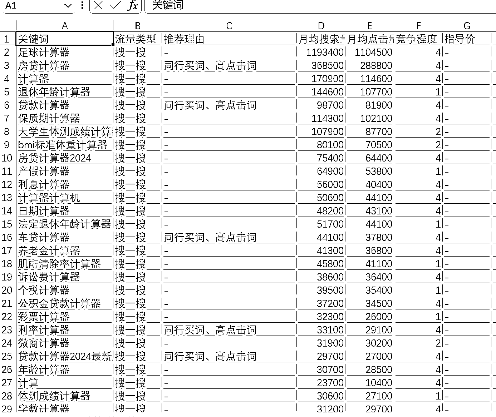

确定要做的类目后，就思考里面需要填充什么功能，就顺势找同行的小程序就行，可以看到这个赛道竞争还是很激烈的。

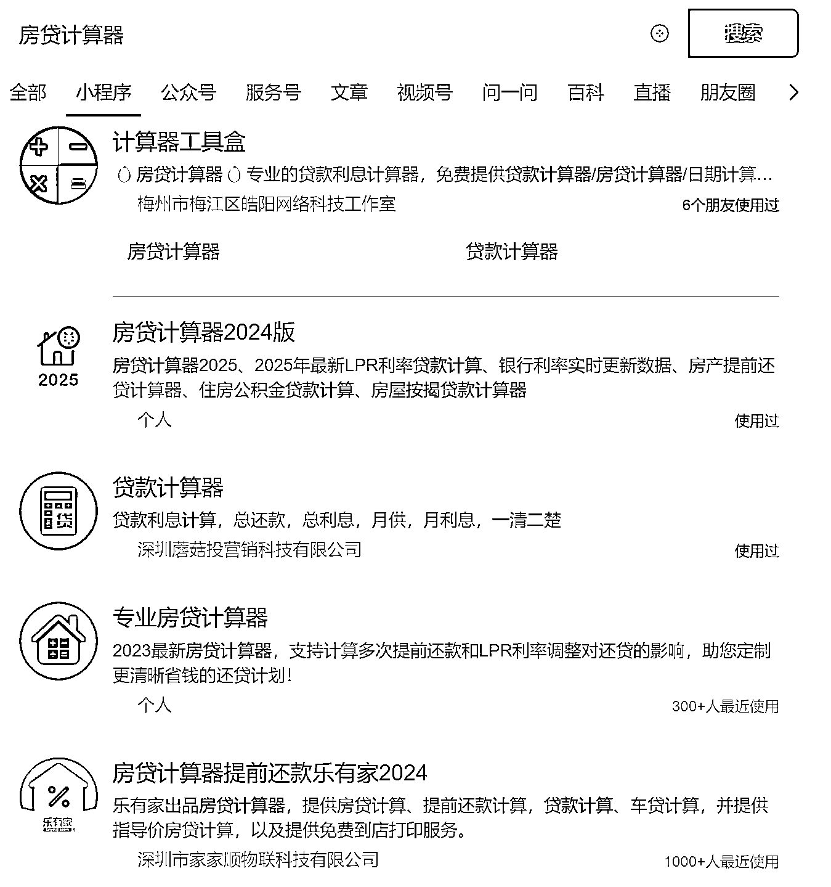

但是我没想那么多，觉得先完成再完美。并且找到别人已经做成的成品，有利于你描述你想要的产品功能，以便于 cursor 更容易理解你的需求以一步到位完成基本架构的搭建。甚至于你不知道怎么做一个微信小程序，cursor 还会很有耐心地教你怎么下载、如何注册等等，只要你跟它交代“你没有代码基础”即可。

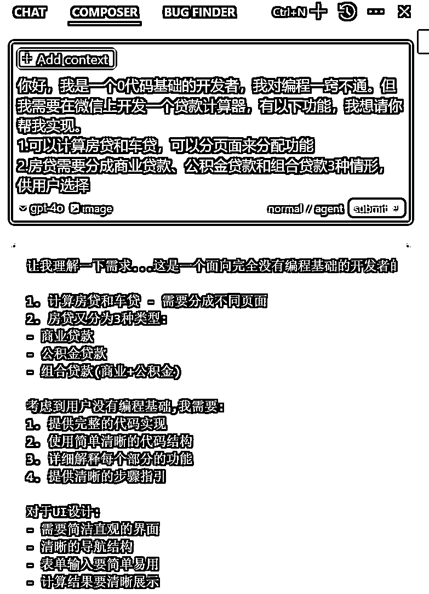

中途除了用 cursor 写代码以外，我还会用豆包、kimi 等 ai 工具反复验证计算的准确性，防止出现 cursor 自以为优化好了一个功能、但实则并没有的尴尬局面。

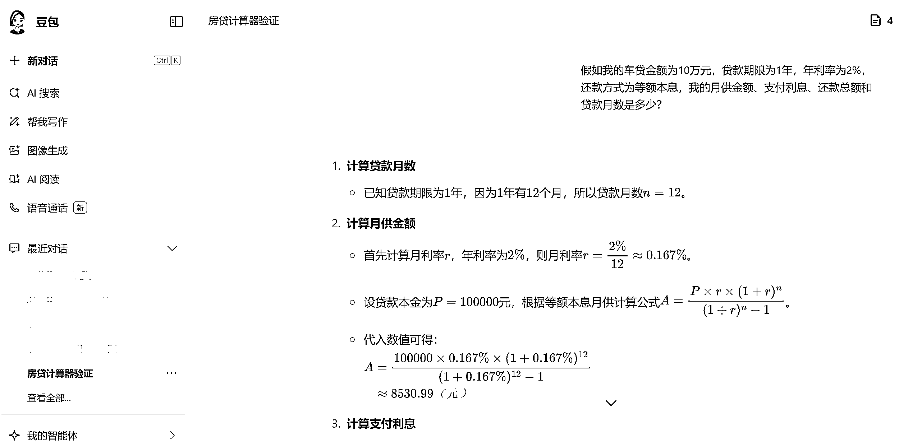

不过不同 ai 工具计算结果会不一样，所以尽量接近精确即可，有些计算太复杂、同时我也不太确定是否计算正确的功能我会进行下架，改成简单的功能包整合在一个页面。

如下图，这个界面我用的是微信开发者工具里自带的基本框架（其他模板花里胡哨的我看不懂也不太会用），并且每个功能 cursor 已经帮你单独分好文件包了

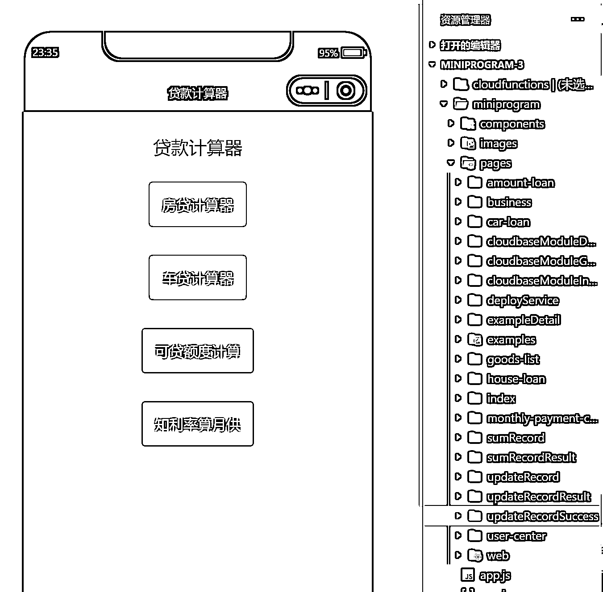

# 3、上架你的小程序

所有功能搭建得差不多了，就可以开始着手上架小程序了，在微信开发者工具中点击右上角的上传，上传文件。

但如果你没有注册账号的话，需要先去公众号平台注册一个。假如你此前注册过微信公众号，可能会发生账号占用的情况，换邮箱 or 换微信来注册小程序的专属账号即可。

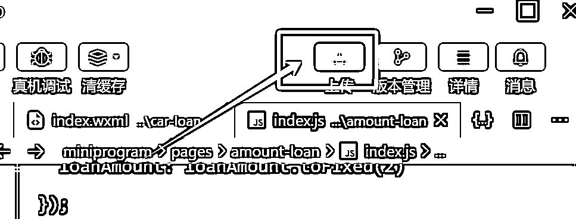

按照首页的步骤，一个个提交小程序信息、备案、交 30 块钱的年费、代码上传等等，因为平台上的审核不是线性链路，不熟悉的用户可能以为自己提交完小程序信息就算结束了，压根忘了还要去备案、要传代码。

所以完成了上一步的材料提交，一定要记得返回首页看看还有哪些审核步骤没有完成的，不然就被动拖慢审核进度了。

尤其是你在开发者工具中传了开发代码，还需要在平台上将开发版本再提交一次审核，等审核版本显示“你暂无提交审核的版本或者版本已发布上线”时，才算代码审核的步骤完成。

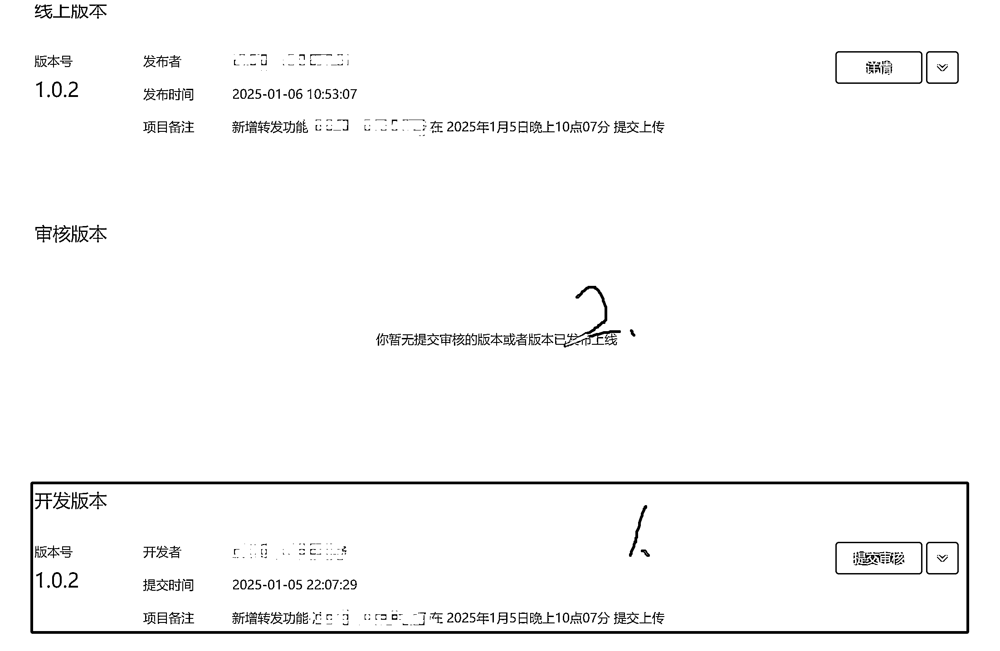

提交信息过程中，如果你不知道怎么做 logo，可以直接外包给豆包。不过有时候你向豆包提出不要带文字，最后生成的图片还是会带文字，没关系后期 p 掉就好。

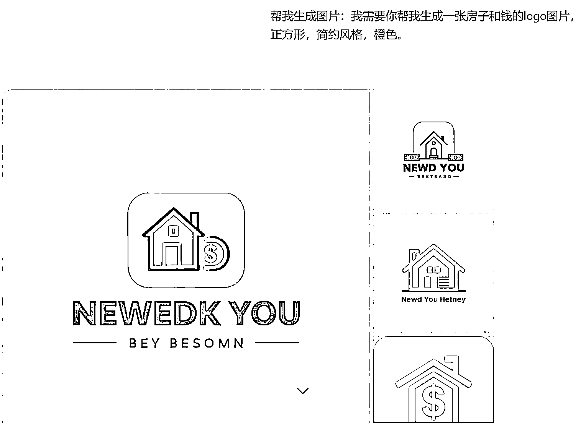

有个坑需要说一下，就是提交完审核材料后，记得把你手机的防骚扰拦截都打开，因为很有可能会因为你的拦截而导致接不到腾讯审核人员的电话，然后反复卡在审核步骤上，这样也会被动拖慢小程序上线进度。

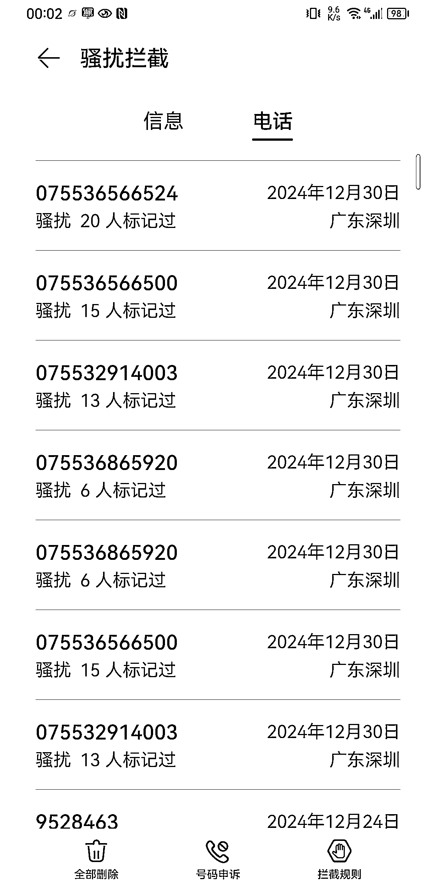

等后期小程序正式上线了，就可以通过铺 SEO 的方式来进行引流，用户达到 500 人后自动开通流量主功能，进行躺赚式的流量变现。不过我还没走到那一步，先慢慢把该踩的坑都踩完再说。

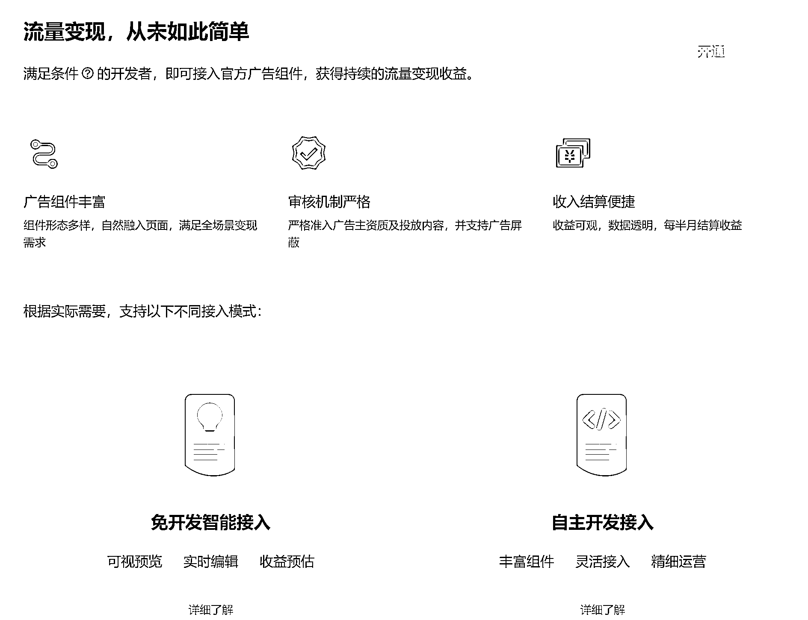

# 4、有哪些坑需要避开

当然还有一个我意想不到的坑，就是我小程序都过审了，居然不！能！转！发！

为此我反复查官方文档手册和平台的后台设置，发现转发功能是需要小程序的作者手动写代码来设置的……我可以理解转发功能需要作者来个性化设计，但是平台方压根不提供，是不是太鸡肋了点？

没办法，代码还是要回炉重造，继续把问题交给 cursor，按照要求改代码。

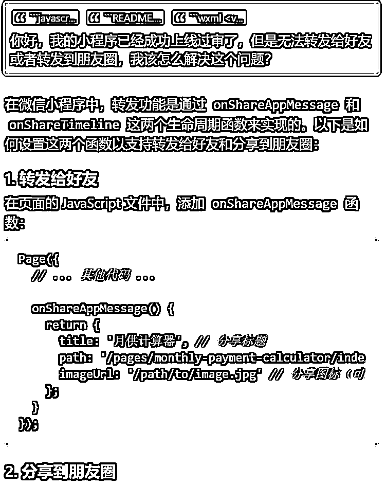

简单设置了一下转发语，代码重新上架过审后，效果是这样的：

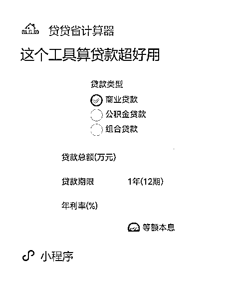

还有一个坑就是，如果关键词是非行业限制性的，尽量用在小程序的命名上，因为微信搜一搜的搜索排名还是优先看小程序的名字，而不是小程序的介绍内容，只在小程序介绍上堆砌 SEO 词汇的用处不太大（当然也有可能会因为后期曝光多了，小程序的搜索排名就变高了）。

不然就会像我一样，明知有哪些词的搜索量是最高的，却因为不给使用而欲哭无泪~

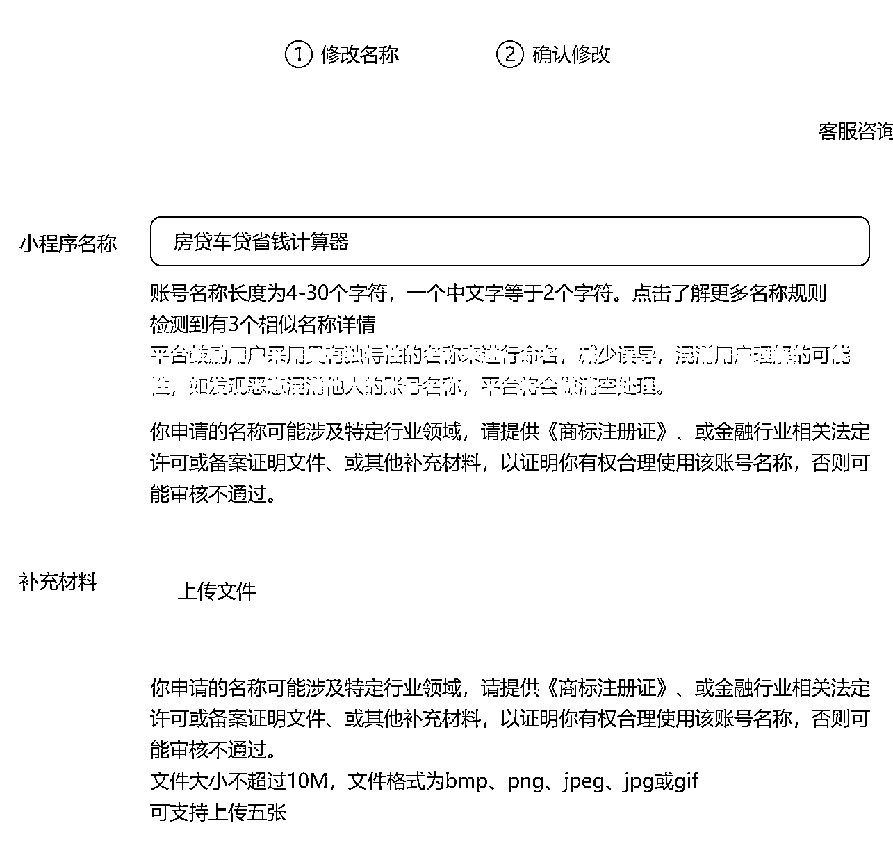

最后，感谢生财小航海，这次从 0-1 撸代码到上架微信小程序的经历真的弥足珍贵。

尽管后期在提高小程序搜索排名和获得流量主收入的过程中可能还会踩一些坑，但总归是踏出了做产品的第一步，希望我的复盘心得能给没有代码基础的小伙伴一些启发~

* * *

评论区：

11 : 请问这个怎么变现呢？

波本零 : 满 500 用户开流量主，接广变现，具体变现教程可以搜其它星友写的帖子

11 : 感谢

叶落影 : 也太棒了🍁

金钱逻辑 : 朕已阅[皱眉]