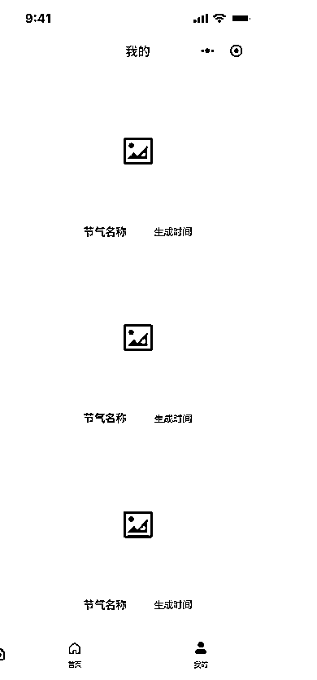

# 喂饭级教程!教你用 coze 做一个微信小程序之终篇：如何使用数据库以及如何发布到小程序

> 原文：[`www.yuque.com/for_lazy/zhoubao/oaygg7gw6r61g8sy`](https://www.yuque.com/for_lazy/zhoubao/oaygg7gw6r61g8sy)

## (36 赞)喂饭级教程!教你用 coze 做一个微信小程序之终篇：如何使用数据库以及如何发布到小程序

作者： 陈序员大康

日期：2025-01-07

在开始本期内容之前，如果你还没有看过前面两期的教程，需要先去看一下：

1、[coze 搭建海报生成微信小程序之：页面搭建](https://b121w2zgwyx.feishu.cn/docx/XevpdRH0JokjJzxtZ71cvnPMngc)

2、[coze 搭建海报生成微信小程序之：业务逻辑实现](https://b121w2zgwyx.feishu.cn/docx/K5FMd5t71ojcREx7GFMcVsttnUJ)

上一期内容，我们完成了首页的主要功能，海报生成页面。本期内容我们将完成另外一个“我的”页面的业务逻辑。

# 一、“我的”页面功能分析

这个页面主要的功能就是展示历史生成记录，便于查看。

因此它的主要功能就是拉取历史记录显示出来

但是历史记录在哪里呢？ 还没有！因此我们需要把每次生成的内容都提前保存下来。

因此我们需要加一个数据库存储的功能

完整教程，跳转阅读体验更佳：[喂饭级教程!教你用 coze 做一个微信小程序之终篇：如何使用数据库以及如何发布到小程序](https://b121w2zgwyx.feishu.cn/docx/Gkzpdyd4Eo1Wn8x8Q8oc32DAnEh)

* * *

评论区：

mojito : 牛

亦仁 : 可以把几篇汇总合成一篇发布一下，有利于加精华。

陈序员大康 : 好的，我重新整理成一下