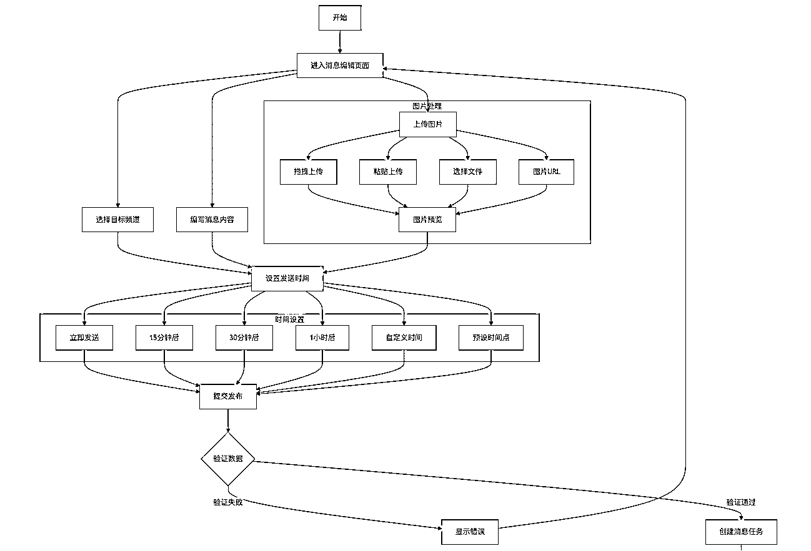
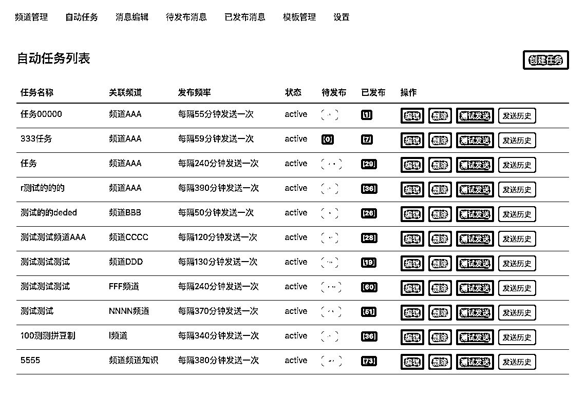
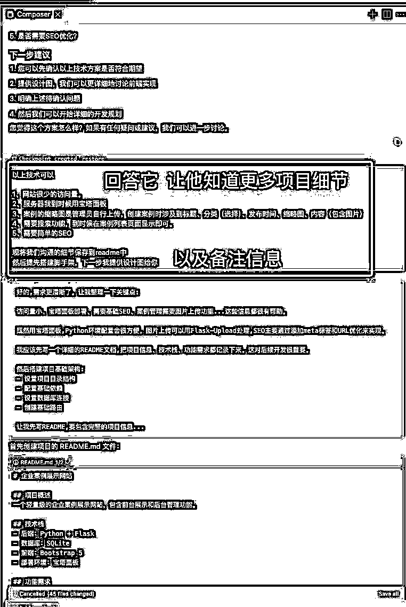
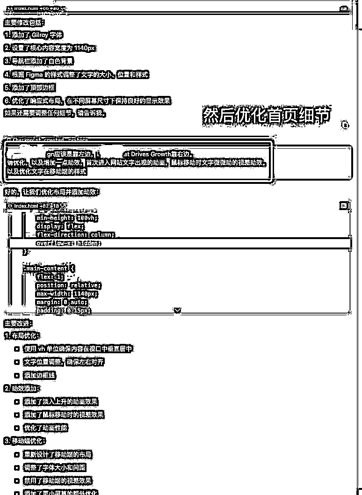

# 边带娃边搞钱：我用 Cursor 打造 Telegram 频道矩阵系统与 2000 商单经验分享

> 原文：[`www.yuque.com/for_lazy/zhoubao/vqtx05f2v5go1op9`](https://www.yuque.com/for_lazy/zhoubao/vqtx05f2v5go1op9)

## (精华帖)(28 赞)边带娃边搞钱：我用 Cursor 打造 Telegram 频道矩阵系统与 2000 商单经验分享

作者： Susumr

日期：2025-01-08

#AI #AI 编程 #Cursor

大家好，我是 Susumr，会 UI 的产品经理，已经自由职业 10 个月了，目前在家边带娃边探索搞钱之路。

上一篇写的 [分享我低成本做个网站实现睡后收入的方法，新人也适合](https://articles.zsxq.com/id_2pmwndiw6q71.html)，之前那个项目也稳定运行中，每个月都能持续有被动收入。

这次借着 AI 编程，自己也学习了一下，利用工具为自己提效和赚钱，下面是我依靠 cursor 做了的两件事，接下来给大家分享。

## 1、用 cursor 制作了 TG 频道矩阵自动化发布系统

早前，我用通过 **RSS + IFTTT** 的方式，自动化采集国内一些公共平台的优质帖子，并将这些内容同步发布到 Telegram
频道上。这种简单却高效的内容聚合方式，为我节省了大量时间，成功吸引了数万名订阅者。频道的内容涵盖了多个领域，从科技资讯到生活趣闻，各种频道都有。

经过一段时间的运营，频道的订阅量稳步增长。看到频道的影响力逐渐扩大，我决定尝试商业化变现。前段时间，我首次在频道中招募广告合作，没想到很快就收到了正反馈，成功成交了几笔广告合作。让我收获了第一笔收益，居然在 tg 上也能赚钱。

在早期的运营中，我依赖 **RSS** 的方式来自动采集内容并发布到 Telegram
频道。虽然这种方式节省了大量时间，但也带来了一个明显的弊端：**内容质量不可控** 。而且 ifttt 后来改了收费模式，各种限制让我用的很不爽，以及由于
RSS
源的内容质量参差不齐，有时会出现重复、低质甚至无关的信息，这对频道的用户体验和长期发展造成了一定的影响。每天手动筛选和发布消息也让我烦，常常也会花费或浪费很多时间，效率低下。

解决这些问题，我就想着寻找一种更高效、更方便的解决方案。我果断氪金 **Cursor** ，并利用它开发了一套**自动化发布系统** 。整个开发过程中，我参考**航海手册** 中 AI 编程的方法论，从需求分析到功能设计，再到代码实现。

这套自动化系统让我彻底摆脱了手动发布内容的繁琐流程，现在我集中一天整理内容，用 RPA 工具采集我需要的能让，或者手动收集内容，把一个多月的内容都整理好。接下来一个月就不用管内容上事情了，偶尔看一下即可，频道的运营效率提升了。内容质量也在我可控范围内，虽然现在有广告，但是也不妨碍订阅的增长。

目前这套系统只是自用，下一步想尝试一下商业化。

 images.zsxq.com/FrzF9Kty1vIcK1sBCe0yPR6sHAEo) images.zsxq.com/FkmtnZiqilcQCsx8eOp_F1VUiunH)

 tK5C8eabpHKvfqaKzCQ7Q) images.zsxq.com/Fq6q6RqQknBWUO8_Uqdo4ER2olfU)

Telegram 矩阵频道消息发布管理系统。支持多机器人、多频道管理，支持定时发布、自动任务、模板管理等功能。系统采用前后端分离架构，使用 FastAPI
作为后端框架，SQLite 作为数据库，实现了一个完整的 Telegram 频道消息发布系统。

核心功能

1. 机器人管理

- 支持多个 Telegram 机器人

- 机器人状态监控

- 机器人权限管理

2. 频道管理

- 多频道支持

- 频道与机器人关联

- 频道状态监控

3. 消息编辑与发布

- Markdown 格式支持

- 图片上传和发送

- 支持多图片同时发送

- 支持 GIF 动图

- 定时发布功能

- 发布状态追踪

- 历史记录查询

4. 自动任务

- 数据导入功能（支持 CSV、Excel，如有图片）

- 自定义发布时间范围

- 自定义发布频率

- 内容模板配置

- 字段映射配置

5. 模板管理

- 消息模板创建和管理

- 变量替换支持

- 格式化配置

## 2、通过发布朋友圈，接到千元的网站开发的订单

作为一个典型的 **i 人** ，我过去很少在朋友圈分享自己的生活，总觉得默默做好自己的事情就够了。最近我决定尝试改变自己，开始每天更新朋友圈，记录生活中的点滴，分享自己的成长和收获。这小小的改变，逐渐走出了自己的舒适圈，也让我与朋友们的联系变得更加紧密。

在日更的过程中，我开始分享一些生活中的美好瞬间，比如孩子的成长趣事、自己学习新技能的心得，甚至是一些日常的小成就。没想到，这些看似平凡的内容却引起了朋友们的关注和共鸣。大家纷纷点赞、留言，甚至主动找我聊天，询问更多细节。

 CF4KYDnSkXEEl8wT2AVh7yvrO) images.zsxq.com/FpiP65r0a8n3GRlHm9Jwn1wxgV88) images.zsxq.com/Fua1WQZ1NTotalFB2AXE17T4SzrH)

让我惊喜还有意外的是，这种持续的分享还带来意想不到的机会。很久之前一个同事找来问我，开始向我咨询相关问题，以前在公司时就帮他用 Wordpress 搭建过站点，然后这次二话不说直接转了 1000 块预付款。

这个网站开发，也是轻量级的，整个过程大概就是开始跟 AI 沟通需求，让他知道我的需求，能具体就具体，然后让他搭建脚手架、搭建后台、测试后台、后台基本没大问题，就开始给他发前端的 UI 图（客户提供的）给 AI，告诉他页面的细节，具体就具体。大概过程就是下面的截图。

 KLjU)

 images.zsxq.com/FmyMFX2JtPbq0b5UED5nKvYEUL4g) images.zsxq.com/Fo3HZpifFx4aIDTV0CxA06JGphxi)

 images.zsxq.com/Fg4bWeTlRZmdwUewItrpQYQE_pqh) images.zsxq.com/FuZw8ugIdk7lEfUkuzGxQI2Z5jRH)

说实话，开发的过程很顺利，因为我知道如何跟 AI 沟通和协作将这个活干好，倒是部署的时候出了很多问题，涉及到环境、依赖、各种配置等搞得我快崩溃了，虽然有问题给 AI，但是这个过程有很多问题出现，我也没有系统化学过编程，经常会照着文档操作就好。

因为没接触过 python 这块的部署，但是最后心态收回来了，奔着即使一点小问题我也要重来一遍，尝试了好几遍，痛苦的过程就是积攒经验的过程。出错失败好几遍之后，到最后也可以丝滑的部署了。

发朋友圈这件事情让我意识到，**改变自己、主动展示自己** ，真的可以带来更多的机会和可能性。虽然一开始有些不习惯，但日更朋友圈的经历让我逐渐找到了自信，也让我更加愿意去尝试新的事物，每天都有人咨询或问候。

## 感悟

自由职业的这 10 个月，是我人生中一段非常宝贵的经历。家里新添了成员，我能一遍陪伴小孩，也能一遍探索，虽然很多时候时间没办法平衡，但回过头来看还是自由职业香啊。

昨天晚上还跟一个很久未联系的朋友感叹，自由职业是要保持开放的心态，可以保持松弛感和对新事物、新的机会都去链接和探索。

**自由职业并不是终点，而是一个新的起点** 。这条道路，我还在探索中。

* * *

评论区：

橘子脑袋 : 加油

亦仁 : 我私信你了 看下私信

Susumr : 好👌

zwj : 一直没有搞定网站部署的事情，特别是需要数据库的时候，国外有免费的，国内的是不是必须购买数据库服务器？