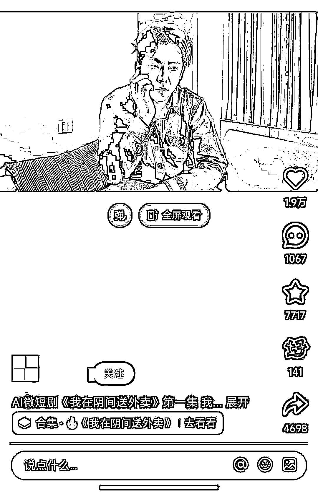
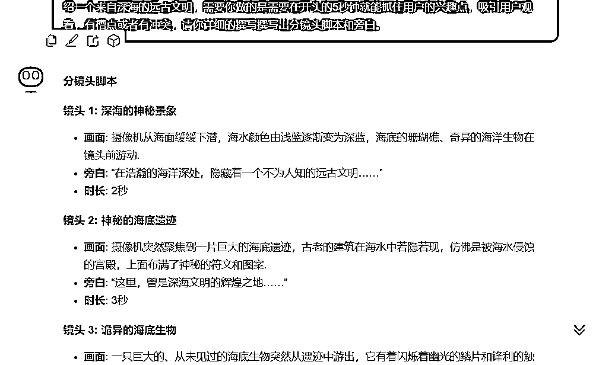
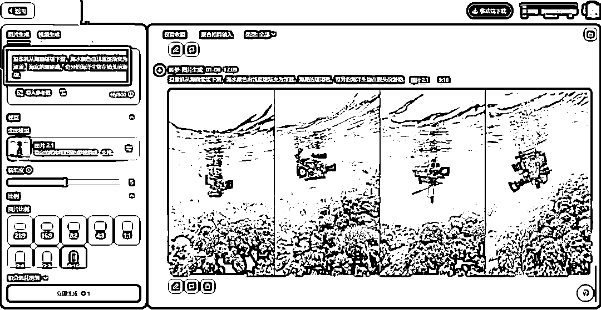
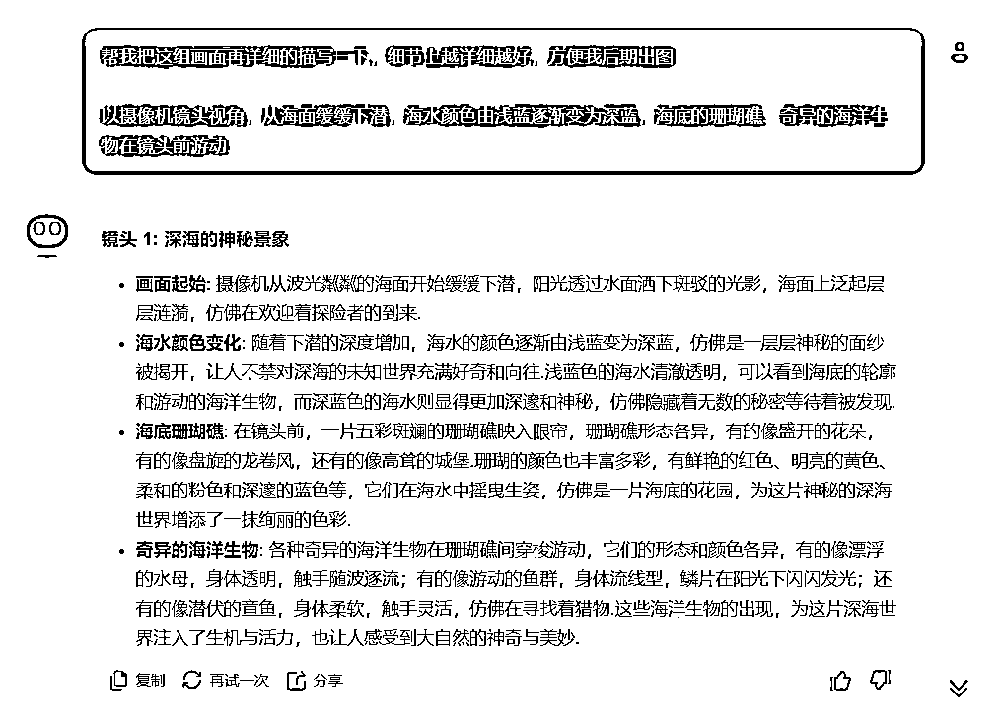
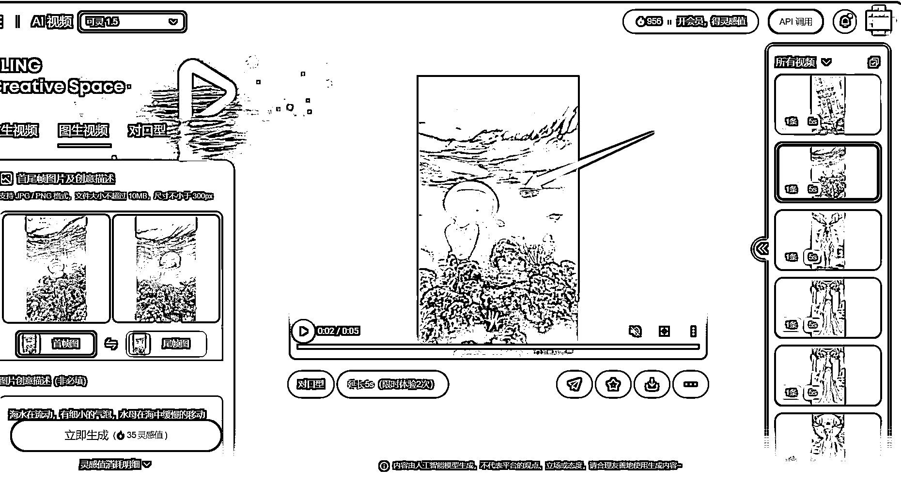
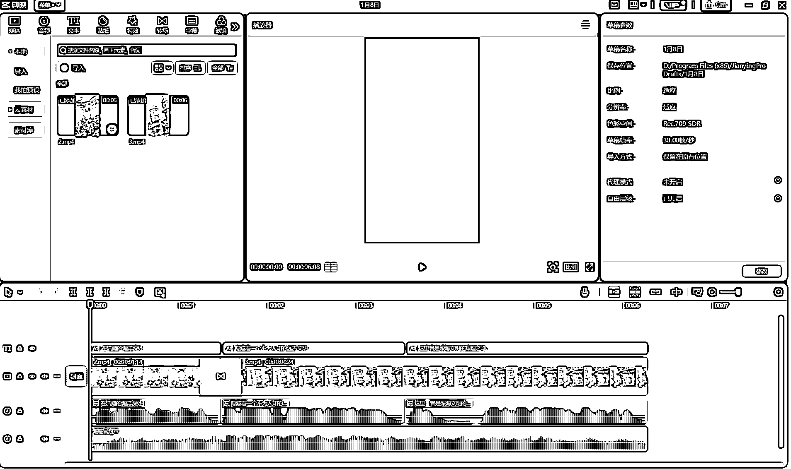

# 用 AI 做微短剧，1 个视频就跑出 100 万的播放量，原来是用好了这 3 款 AI 工具！

> 原文：[`www.yuque.com/for_lazy/zhoubao/cg1qci2o4hn90w35`](https://www.yuque.com/for_lazy/zhoubao/cg1qci2o4hn90w35)

## (41 赞)用 AI 做微短剧，1 个视频就跑出 100 万的播放量，原来是用好了这 3 款 AI 工具！

作者： 任样花子

日期：2025-01-10

**Hi****，我是吴旭** ，通过自媒体变现 7 位数，希望能够帮助 1 万人在副业中赚到钱。

最近短剧赛道可真的太火爆了啊，各大短视频平台都争先恐后的给短剧赛道流量扶持。

很多做自媒体的小伙伴都纷纷入场，忙着做起了【**短剧推广** 】，不可否认，【短剧推广】赛道做好了确实赚钱。

但是他们不知道的是，并非只有做【短剧推广】项目，才能够享受到短剧赛道的流量扶持。

其实，**我们也可以用 AI 原创一部微短剧，在享受到流量红利的同时，再也不用担心原创度的问题了** 。

这篇文章，我就详细给大家讲讲**如何用 AI 原创一部微短剧** 。

## 一、项目简介

“**用 AI 原创一部微短剧** ”这个创意可不是我想出来的，事实上，早就用同行这么做了，而且做的还非常不错。

这个视频大概 1 分钟左右，题材和剧情都很吸引人，获得了 1.2 万的点赞量，播放量大概一百多万吧。

我仔细分析了下视频，1 分左右的视频大该有 20 来个镜头短片组成，不难看出，这些短片段，都是由 AI 生成的，最后在拼合剪辑而成。

**这个视频能够火，也就标志着，市面上所有的由真实人物出演的爆火短剧，例如霸道总裁，古装穿越剧等，都可以用 AI 再重新做一遍。**

**  **

而用**AI 做短剧的优势也非常明显** ：不用花大价钱去请演员，去取景，去拍摄，唯一的成本只有每个月几十元的 AI 工具使用费。

正如这个视频下方的评论所言，未来也许真的有一天，AI 虚拟明星就会取代真实明星。 images.zsxq.com/FvKJHXEW-fMakVgcO-x47j2DDgst)

因为 AI 明星优势太多了，“他（她）”不会人设崩塌，“他（她）”不用支付高昂的演出费，“他（她）”不会产生经济纠纷，“他（她）”不会疲劳，可以高产影视剧。

总之，AI 影视剧、AI 虚拟明星，一定是未来几年的一个大趋势。大家如果有对 AI 视频感兴趣的，可以着重往这个方向研究一下。

那说了这么多 AI 微短剧的好处，到底我们该怎么才能做出一集精彩的 AI 微短剧呢？

## 二、实操步骤

要制作一集精彩的 AI 微短剧视频，总共分为 4 步：

** *第一步：用 AI 工具来写分镜头剧本。***

** *第二步：用 AI 根据剧本制作分镜头的画面。***

** *第三步：把 AI 图片转变成视频形式。***

** *第四步：剪辑：配音乐***

** _  _**

下面咱们一步步具体来说。

### 第一步：用 AI 工具来写分镜头剧本

打开 KIMI，把咱们准备好的分镜头提示词扔进去，让 AI 开始帮咱们写。

**（完整提示词，我会放到文末！）**

**  **

大概 1 分钟左右，AI 就帮我们把镜头的画面和旁白都写好了，按照镜头来分组，一共提供了有 8 组。

### 第二步：根据分镜头用 AI 作图

接下来，咱们就需要根据分镜头提示词，投喂给 AI 绘图工具，比如即梦。

注意，可能生成的画面并不是你想要的，所以你就需要根据基础的提示词，进行扩充，让 AI 更细致的画面描述。

**分享一个小技巧给大家。**

**  **

把原来的分镜头提示词，再次复制给 kimi，让它帮你详细的描述下这个画面的细节，提醒它不要脱离原来的画面。

**提示词，你可以你这么写：**

> 帮我把这组画面再详细的描写一下，细节上越详细越好，方便我以后出图。

### 第三步：用 AI 把图片转变成视频

**把生成好的图片，按照首尾帧排序** ，扔到海螺 AI、即梦 AI、或者可灵 AI，这里面比较推荐可灵 AI，因为它可以设置首尾帧图片，然后生成的视频更加平滑和真实。

像这样，把每一个短画面生成好后，就要进行最后的视频拼接了。

### 第四步：拼接剪辑+配音乐

**把所有画面导入剪映后，配上合适的音乐+字幕** 。

最后导出。这样，一个完整的 AI 微短剧就制作好了。

不过大家放心，我这是让 AI 随即生产的提示词，大家做短剧的话，让它生成短剧的提示词就行了。

其实啊，咱们做这样一集微短剧视频，本来视频时长就很短，所以不需要太多分镜头，大概 20 个左右就做够用了，只要剧情精彩，结尾留点悬念给下一集，涨粉率会更高。

看到这里，估计有的小伙伴会问了，我做了这样一个短剧账号，该怎么去变现呢？

## 三、变现方式

变现方式很简单，你看看人家短剧制片方是怎么变现的？

无非就是**后续剧情设置付费观看，演员接广告、视频中插入广告，或接商单** 。即便是**撸各大平台【创作者分成计划】收益** ，也是很香的。

总之，有了平台的流量的扶持，你还愁变不了现吗？

好了，以上就是我分享的【AI 微短剧】玩法。

**如果你感兴趣，想要自己用 AI 做一个微短剧视频试试，我把完整的【分镜头的提示词】都放到下面的文档里了。**

[`a5yo5lvdaa.feishu.cn/docx/WjvCdVSyToDLQuxeOgvcYnG0nqe?from=from_copylink`](https://a5yo5lvdaa.feishu.cn/docx/WjvCdVSyToDLQuxeOgvcYnG0nqe?from=from_copylink)

* * *

评论区：

小祎 : 感谢分享