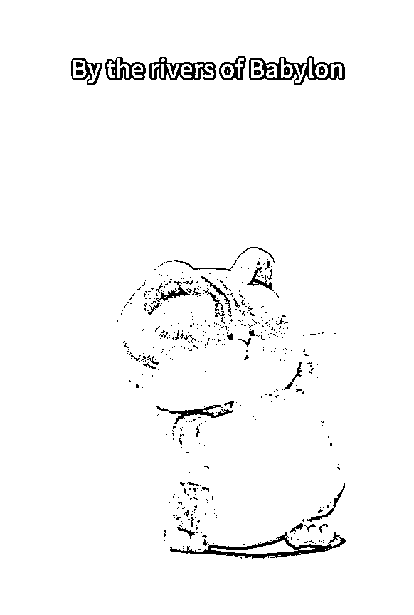

# 20 条作品涨粉 6 万，AI 猫咪跳舞视频爆火，完整攻略送给你

> 原文：[`www.yuque.com/for_lazy/zhoubao/dqg47l99uuy39iwk`](https://www.yuque.com/for_lazy/zhoubao/dqg47l99uuy39iwk)

## (34 赞)20 条作品涨粉 6 万，AI 猫咪跳舞视频爆火，完整攻略送给你

作者： 高鹏圈

日期：2025-01-10

​大家好，我是高鹏。

今天继续分享一个热门玩法。

这种猫咪跳舞的视频流量非常不错，它是怎么做出来的？

今天给大家详细的拆解。

创作这样的视频，首先需要用文字和垫图的方式来生成一张萌猫的图片，然后利用一款工作流，实现让猫咪扭动跳舞的效果。

首先打开即梦首页，找到图片生成的功能，然后点进去。

把我给大家准备好的提示词粘贴进去，然后上传一张垫图。

这个垫图的话，大家可以去截大佬视频里边画面的某一帧，一定是截这个猫比较完整的，正面面向镜头的一个画面。

然后在图片生成模型里，选择 2.0 pro，也就是它的升级版，这样生成的图片的效果会更好。

然后即梦给到了四张图片，基本上还是符合要求的。

比如最后一张效果呢很不错，直接保存使用。

有了图片之后，接下来就是让图片里边的猫咪扭动跳舞了。

用到就是一款工作流，这个工作流出自破站的大佬之手，非常给力。

你只需要上传一张萌宠的静态图片，然后再上传一段的人物跳舞的视频，它就可以让图片里面的动物模仿视频里人的动作进行跳舞。

我们首先来到这个工作流的页面，它最左边就是上传图片的地方，然后中间是需要你上传一段人物跳舞的视频，最右侧它就会生成这个视频的结果。

因为工作流都是提前配置好的，大家使用起来也比较简单。

但需要注意的是，这款工作流比较吃显卡，至少要 12 个 G 的显存，如果你的电脑带不动，可以直接去租云端，都是可以的，其实租云端的话更方便一些。

如果你想要做好这类号有这么几个注意的事项，大家可以看到胖胖部落大佬，他的视频里边的动物形象基本上都是同一个。

前期可以模仿它的风格，或者变换猫的颜色、身材、体型等等，多生成几款形象，后期看哪个比较火就用哪个。

你可以看到大佬他的视频，这个猫每次跳舞的音乐是不一样的。

音乐一般他都是选择热门的音乐，也算是给视频做了加持，跳舞的场景是不一样的。

这些都可以在图片生成的时候，通过对描述词的调整来控制。

好，这就是今天给大家分享的这个玩法。

关于 AI 工具以及描述词和垫图，还有这类号到底怎么样进行商业化，统一放到文档里了：[`svj4gxvm0v3.feishu.cn/docx/YKy1dWL8loARKExgKb1cP9vbnSf?from=from_copylink`](https://svj4gxvm0v3.feishu.cn/docx/YKy1dWL8loARKExgKb1cP9vbnSf?from=from_copylink)

我是高鹏，深耕网创 9 年，这是我拆解的第 708 个落地项目玩法，更多项目玩法，欢迎找我聊聊呀~

* * *

评论区：

暂无评论