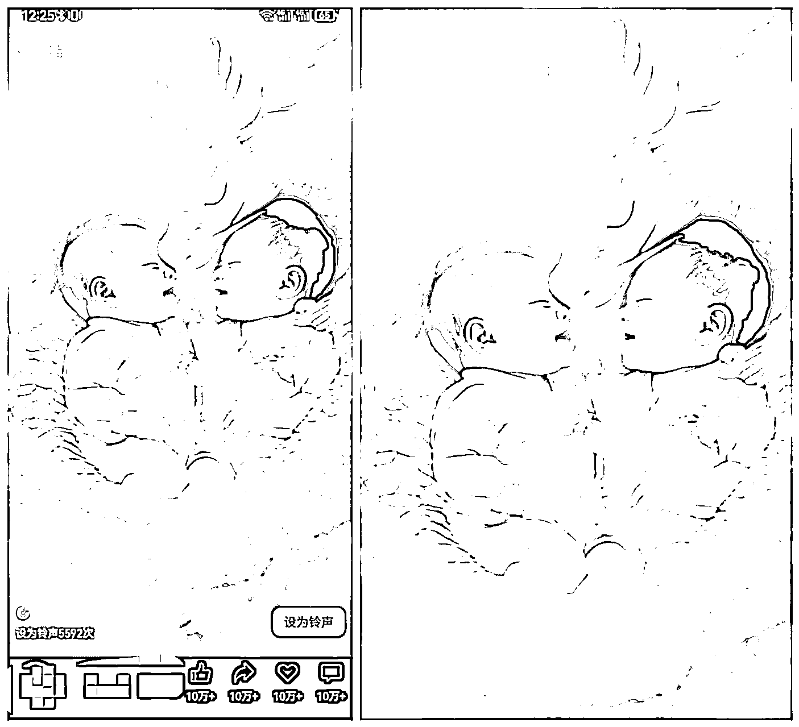

# “AI+视频号”7 个变现关键点想和你聊聊

> 原文：[`www.yuque.com/for_lazy/zhoubao/kla5libxznpsqzo7`](https://www.yuque.com/for_lazy/zhoubao/kla5libxznpsqzo7)

## (24 赞)“AI+视频号”7 个变现关键点想和你聊聊

作者： 陈先生

日期：2025-01-06

未来的自媒体大佬你好，我是陈先生

⑨⑥年四川人，②⑧岁，万人星球嘉宾/训练营导师。

2020 年 1 月开始摸索做视频号和线上副业，截止 2025 年 1 月变现超⑤Ow。

感谢亦仁大佬的平台想和你分享..（全文+图 2w 字左右，20 分钟左右阅读完）

**闭环目录：1、视频号规则和起号**

**2、爆款号对标和兵器库**

**3、AI 工具｜图片剪辑**

**4、AI 赋能｜爆款剪辑**

**5、AI 视频和微信号变现**

**6、AI 账号十倍放大收益**

**7、独家秘诀和提问复盘**

# **1、视频号规则和起号**

今晚我们先了解一下视频号的重要底层规则。（老司机可跳过目录 1）

**一、微信短视频营销新趋势**

抖音和快手两个平台成功地验证了：图文时代已经迈向了视频时代，视频的直观性和碎片化，在 2020
年之后，用户已经逐渐适应起来，微信携手视频号入局必有一番新的机遇。

从用户层面来看，微信有 14
亿的用户。结合微信生态的。社交平台，因为视频号可以直接放公众号链接，可以直接分享到朋友圈，可以直播可以带货，后续还有很多工人在开发，整体看视频号的趋势和发展趋势是可观的，如果你的账号也可以得到权限可以开通视频号，那一定要尝试做一做。

**二、视频号的算法及运营规则**

**2.1 视频号推荐算法**

知己知彼方能百战百胜，了解微信视频号的平台算法和规则，对于我们在视频号的创作成为成功的创作者非常重要。

目前视频号的推荐，和抖音和快手最大的区别就是分发推荐模式。

目前视频号的推荐，基本是基于社交关系来进行推荐分发：

例如：发现页中的小红点提示，是好友点赞。

好友在看的直播 等。

进入视频号，默认打开的是朋友板块，而朋友也是处于顶部。四大信息流的中间位置，从朋友圈聊天图片这里看到的都是视频号动态，更是纯粹的社交推荐。

在最近曝光的视频和算法机制中显示，朋友点赞的社交推荐在算法中占 55%，而优质的内容热门推荐只占
15%。这就充分证明充满微信特色的社交分发，依然是视频号的优先级。

**2.2 微信视频号审核机制**

微信视频号每天都有大量的创作者发布视频，目前有双重的审核，分别是机器人审核和人工审核。

微信视频号的审核标准，我们可以扫码看下方的官方运营规则。

图 1：XXX 看最后的飞书

机器审核：

提前设置好人工智能模型来识别视频画面和关键词。用审核作品和文案是否存在违规行为。如果存在违规行为的话，视频可能会被：降低推荐，删除作品，自我可见等。

严重违反规则，直接删除或设置自我可见。

如果无法判别违规的话会进入人工审核系统。

人工审核：

对机器筛选出疑似违规的作品，由人工进行审核。人工审核主要围绕三块，视频标题，视频封面，视频关键帧。如果发现是违规，将会进行：删除视频，降权通告，封禁账号等处理。

三、如何打造视频号…

**1.1 账号注册及内容定位**

打开微信-点击发现-视频号，点击右上角小人图标，【建立视频号】，填写相关的信息，审核过后就可以发布作品。

需要注意的是，视频号的名称是不可重复的，你注册了别人就用不了了，所以可以去抢注好的名称。

微信视频号的基本常识-视频号的基本设置：

一个微信号只能申请一个视频号，如果是企业号，建议使用合适的微信号开通。

视频号可以通过添加，公众号文章链接，这位公众号导流。和以后的未来电商变现提供了想象空间。

视频号内容可以转发给好友，微信群，朋友圈，点赞，收藏，评论。视频号也可以是利用创作平台，任何时候 ，【**优质原创的内容才是核心。** 】

**账号和内容的定位**

给视频号做定位是上一篇和录音讲过的定位差异大小差不多，然后我们怎么给视频号做定位呢？

我们做视频号要和开一家店铺一样，尽量选择一个垂直的领域方向。

**①做标签**

例如专注在健身领域，那输出的内容以后就要以这个领域为主。

那我们做视频写脚本。找素材学习。都要把时间利用在这个领域。内容从浅到深。渐渐的我们会成为这个领域的专家。

用户也会对我们产生信任，慢慢的就会有更高的辨识度，重要的也是在塑造自己。

**②精准用户。**

当我们抓住某一个领域内容的时候。

吸引来的用户也是同领域的。有助于我们分析用户的话。

这样我们输出的内容更有针对性，后续才能做高转化。

**③精准平台流量。**

用户精准了，平台会根据关注我们内容的用户画像做推荐，从而为我们的视频也打上标签，更多的优质的流量会推给我们，把我们的内容更加精准和快速的推送到目标客户中，我们也能实现越来越快的增粉的目的。

**3.2 那我们如何做到内容垂直？**

如何找到视频定位，总共下面五步：

**①、先做调研，找对标，找自己的兴趣**

**②、复盘自己的每一次尝试**

**③、收集其他人的评价。**

**④、尝试更多，进行更多的体验。**

**⑤、用旁观者视角修正自我印象，让定位自然发生。**

这篇就到这里～后面再见！

我是陈先生我们今晚继续…

**一、视频号基础运营方法**

账号基础设置：

①头像和名字

1.头像和名字的设置要求。

除了视频号开通时设定的名字，一年之内还有两次修改的机会，目前头像不限制次数，可以任意修改。

2.基础注意事项

视频号的头像要有标识性，亲切性，个人视频号可以直接利用形象照，企业号可以使用企业 logo
帮助用户建立认知。昵称要简单易懂好传播，如果有一定名气，可以用真实姓名。简历可以简单介绍自己，让别人更快认识我们，知道我们做什么，能够从我们这里获得什么。

背景图分为上下两半，下拉可以看到上半部分，可以进行设计一下，下拉藏个小惊喜。

头像昵称简历背景图不要有明显的引流行为。

②视频号认证

视频号认证，目前分为兴趣认证，职业认证，企业和机构认证。

1.认证申请路径

我的视频号-点击右上角的“…”进行认证。

2.个人认证需要满足的条件：

近 30 天发布一条内容，粉丝需要 100 人以上，已填写简历。

3.在个人认证 里，兴趣领域自媒体认证需要满足任意以下一条要求即可：

在对应领域持续发表原创内容，且视频号和公众号关注数达到 10 万以上。

在对应新区持续发表原创内容，且除微信外的其他平台粉丝数量达到 100 万以上。

通过认证后的账号会显示金 V 的标识，以及名字下方会显示认证的身份。

4.企业和机构认证。

企业和机构认证，是通过已认证的同名公众号为视频号认证，每个视频号每年有两次认证的机会。

一个公众号只可以认证一个视频号：认证需要公众号管理员扫码确认；公众号名称需要与视频号一致，管理员扫码确认后，公众号主体信息将展示在视频号上；企业和机构通过认证，视频号名字后方将带有蓝
V 标志。

**三、内容要求**

1.发布步骤

打开微信-发现-视频号，点击右上角“相机”，选择拍摄或手机相册素材，然后进入素材编辑页面，完成后就会跳转到发布页面，最后点击“发布”即可。

2.发布内容的格式要求

视频号可以每天发布多条，不限次数。

视频封面不可选，默认第一帧画面。

内容以视频+文字为主，也可以是图片+文字。

视频最长一分钟，最短三秒钟，图片最多 9 张。

（后续有改变）

不能纯发文字，文案超过三行会自动折叠。

配文最多发 1000 个字，也可以存图片或者存视频发布。

文案在编辑时，可以添加话题#XXX

视频的横屏尺寸为 16:9（1080-608），横屏尺寸为 9:16（1080-1920）。

可以添加公众号文章链接，以及位置定位。

我们继续来看视频号的运营技巧。

**一、视频号前期提升曝光的方法。**

大部分新手前期都会面临这个问题。事实上我们从选题策划制作内容一直到发布作品，其实这都只是准备工作发布完成后我们还需要跟上相应的运营动作。否则有内容极少能主动扩散出圈。

视频号的推荐机制是我点赞我们才能推给朋友，朋友点赞才能推给朋友的朋友，

所以我们发布完。作品后要及时的去推广，推广的途径有哪些呢？

**1，自己点赞自己朋友圈推广，这是最基本的，如果我们好友够多，朋友圈的运营也不错，做视频号的话，前期的量就不会太少。**

**2.私聊微信推广，视频号早期有很多人这么做，但是现在内容太多了，没有新鲜感了，不推荐这样去做宣传。**

**3.自己的社群，相关的视频点赞群，最重要的是先判断真实的社群点赞评论还是机器刷的？如果色情中的人是真实的，拥有自己的社交圈子，有自己的微信好友，视频号是基于他的社交链接来推送的，这样的内容是非常有用的。**

如果点赞是通过机器模拟或者一些批量手机去点的话，不具备社交属性的微信号，这样刷赞对我们内容的传播几乎没有意义，后期还容易被封号。

有哪些值得关注，值得模仿的视频号同类推荐？

读书类：

健身类

生活类：行动的陈先生

这里推荐自己建立一个账号库，将好的低粉爆款账号进行列举，储存下来，一时不备之用。

**二、视频号好的工具推荐**

①文案灵感

梅花网，文案，金句谷。

②图片素材

Designspiration（根据颜色找图片，以图搜图功能体验很赞）

Pinterest（国际版的“花瓣”，以图搜图）

Pexels（无版权图库）

Unsplash（无版权图库）

③视频素材

包图网（无版权视频）、摄图网

④剪辑工具

剪映 APP（首选，易用性强）

快影 APP

⑤音频工具

迅捷文字转语音：支持 mp3、m4a、wma 等语音格式，识别率高，男女多种音调库。

音效素材站

录屏工具

录屏王

略格式录屏大师：支持自定义屏幕区域录制，音频录制。

…

**三、视频号常见的问题解答**

①如何让微信朋友找到你的视频号？

微信朋友无法在你的微信中看到你的视频号，你可以主动分享视频或名片给他们。

②哪些人有机会看到你的视频号？

如果你拍的视频或照片很棒，有人（包括你自己）点赞，系统就会推荐给他们的微信朋友，

任何看到的人都可以关注你的视频号。

③我们发表的视频如何进入热门推荐？

建议在发表的时候打赏#话题、配上音乐，设置地理位置信息，让我们的视频更具有吸引力。

当视频很多人点赞时，该视频就可能进入热门推荐。

④视频号会鼓励什么样的内容？

视频号鼓励我们分享原创的拍摄作品，从他人那里搬运过来的内容是不会得到推荐，还可能会被处罚。

⑤一个视频号可以在不同的微信使用吗？

只能开通视频号时的微信使用，无法转移到其他微信中。

⑥为什么视频动态有时候比较模糊？

建议我们使用清晰的原视频，比如说聊天中收到的视频可能就被压缩了，会影响清晰度。例如我们把视频在导出的时候，就要设置 1080p 或者 2k4k。

# **2、爆款号对标和兵器库**

晚上好，我刚酒局完，回来了优化素材有点晚，还好赶回来了、

来看看我们今晚的目录：

视频号爆款账号的对标和选题库

1.爆款视频兵器库

2.经典音乐兵器库

3.爆款选题兵器库

4.图片视频素材库。

还记得我们今年有分享过关于抄题库和选题库，今晚总结一下，内容细化一下，毕竟送上嘴的才是最好的对嘛？哈哈哈

1、爆款视频兵器库

我们分享过用微信自带拉群，三个人➕自己小号就可以拉个小群，目的是减少我们的行动阻力。

我再分享一个顺序，下面是我精选的几个赛道，和他们的爆款视频，看看有没有你的赛道，

①奶爸+娃的账号，互动很高#养娃+#奶爸对标账号宝子们。

②情侣账号：这是一个异常值有关于【#女生】#洗澡#雾气腾腾

③卖房卖车对标账号：这个扛着跑的有点意思。

④#读书对标账号

⑤AI 婴儿+老年人赛道：对标账号

⑥医生 IP+自媒体专家类对标账号：#靠谱

在自媒体闭环前几年，我们做账号对标，账号拆解，是我们那正反馈，拿金币结果最快的途径之一。

**2、经典音乐兵器库**

陈先生 2025：精选背景音乐

我本身初期是用飞书+备忘录，第一时间存好的音乐，早期再用抖音剪映存音乐。好的爆款视频其他都可以改，但音乐是我们不能偷懒的，爆款的音乐一听就能让我们进入状态…

例如这首音乐：

是不是一听前奏，就感觉有一段传奇故事要开始了？

2，背景音乐就到这里，需要那个就用图片中的音乐很方便。

3、爆款选题兵器库

爆款选题可以从爆款视频里提取，也可以像这样，从账号里找出爆款的同赛道账号，成功的账号，他们的标题和选题说不定变现就更容易…

例如我今做变现视频刚发现：

你能猜到这条视频光小游戏就变现了多少嘛？

我之前看这些赶海的视频就好奇，他们背后的变现模式是什么？但不知道他们具体变现多少…

直到我自己今天再做视频变现任务，查爆款排名发现他一条视频可以变现 70000 多块，果然是我们灯下黑，光刷视频了。

下方是视频号 1k 粉后，可做的视频号带小游戏变现全流程：

排名第一账号一个视频变现 90000 多块，拆解后发现视频不难，难的是像他矩阵发一堆，我们今年前面的内容可以复刻他的模式和内容，例如我这里在实操的：

后面出了案例，我们 2025 再仔细分解，我有强烈预感过年还没结束，我们就能接过年流量出几个爆款。

一个视频变现 10000+也不是没有可能，原理我们上面已分享，其他可翻我们目录下内容。

以上是能搞变现的视频寻找对标处，它旁边还有其他甲方投广视频，直接对标抄就行。

前提还是自己能做爆款，能拆解爆款哈，不是原创有风险，不要标原创。

哪句话咋说的，赚钱了可以不分给我，被抓了别说我教的，哈哈哈

**4、图片视频素材库。**

图片和视频的积累需要大量的时间，这里也算是很好的竞争力壁垒：

例如我这个手机：

图片 5w+

视频 1800+

录屏 30000+

我们如何更方便的随时记录生活和拍照？

第一步就是把相机放在手机最顺手的快捷键位置，方便第一时间记录：

推荐拍摄摄影的书：

20 年我买了一本拍摄的书，赠了一本教做抖音的书，拍摄技巧其实挺多，用多就会熟悉了。

我再推荐一个日常教拍摄的视频号加入我们对标库，她们的拍摄和定位，也挺简单可以做人设模仿。

这拍摄账号，她能在海量教学视频，多次突出重围的教拍摄视频中框框出爆款，我们简单分析一下优秀的她们：

1.视频人物情感强烈，能抓住三秒眼熟。

2.她的账号做强烈的反差

3。她的账号特殊有我们四川…耙耳朵+虎老虎的独特味道…

4。她更新频率很高日更

5。她就两个人做账号就行，成本不好，基本自然取景…

6。她是接相机和手机的广告，每年变现能力有的，大部分账号停更就是饿死了…

还有一点技巧分享，也是我们分享过的：

手机容易图片和视频多了不好找到，这时我们可以用 QQ 相册保存图片和视频。

今晚内容就到这里，有提问可以评论区互动，有灵感可以发我们评论区。

喜欢的可以点点赞，或者转发内容分享。

# **3、AI 工具｜图片剪辑**

前言：2023 过年后闷声淘金，我和 cp 无岸学长的复盘后写本章。

**【因果种子】：**

1、我自己折腾三年建立视频号。（打磨期 3 年

2、进阿猫的《觉醒 xx》内部福利-视频号围观打卡群，打卡/围观了接近一百天。（学习期 100+天

3、阿猫在《觉醒 xx》内部分享了【梵野的 xx-视频号赚大钱】。

我第一直觉就买了，后面中午悄悄看+执行，并第一时间各平台尝试机制。（破卡点期 30 天

**【机会终于来了！】（前置工具：讯飞输入法 app+剪映 vip。**

还有美图秀秀和稿定，4 个都有 ai 优化功能。

前置：1 央视春晚 +2 视频号红利 +3 大家都过年有空玩手机 +4 我合伙人人无岸学长，

出一个火爆的短视频。达到了几万＋的播放量。

**正文、我在第一时间凭积累进行：本次火爆热点，“魔术有人好像失败，有可能是背后的炒作”。**

先**进行爆款的图片收集，寻找最火爆的视频和配音，控制剪辑的时间和信息的密度。**

【1:1 模仿视频】

1：视频号图片我经常在小红书选取的图+aip 图

2：用美图秀秀 p 掉 LO 狗， Ai 一键优化。

（能省几分钟。

3：用的剪映 vip，开始尝试 ai+剪辑。

（能省半天时间

4：剪辑中选取本次热点事件，热点人物为中心剪辑。

5：看下来图片流程添加后+剪裁抽帧数。

6：vip 剪映 ai 或手动加特效。

7：调整 vip 特效参数到两个 50，

并且将特效拉完，重点是第一个吸引目标停留，第二个才是搞笑类特效。

8：做好模仿别创意：剪辑出来不加音乐，不加任何特效-找到陈先生我的视频号，选取爆款视频点击进入，截个图后面好 1:1
模仿文案，艾特，细节还有我发视频的时间～自己看。

9：模仿好+选用我的嗨音乐发同款，不要多加东西！

原创选择有多种，我发了三个视频就是为了卡标签。

其中爆了两个标签：明星和新闻。

10：用讯飞输入法确定好，1:1 模仿以后，确定好原创和不选位置。都确定好，就可以发了。

【重点注意】：1。视频号不要太长 10 秒，2。一定走魔性音乐进。3.特效为了抓眼睛的不能改，4。文案，标题，艾特，原创项都要 1:1。

5.时间：一条中午发，一条 6 点吃饭发，一条 8 点饭后发。

ok 就可以发了，连续发三条，看跑的咋样。

有人问：我现在已经中年 50 了，练习什么都已经晚了吧？

不晚。

无论你是自媒体新人还是中年人 50+，无论你是否有“天赋”，

只要掌握正确的方法，你的变现闭环都可以实现！

# **4、AI 赋能｜爆款剪辑**

晚上好，今晚我以一个最新的 AI 红利类实战小项目为例，分享几个 AI 提效工具。

#AI 生成龙年宝宝视频，据悉，一个视频爆了 3000 万播放，赚了 3000 块。

我们先前置 AI 工具的链接：

1.1⃣️AI 秒画

[`miaohua.sensetime.com/m_get_invited?invite_code=wV2ybQa2D`](https://miaohua.sensetime.com/m_get_invited?invite_code=wV2ybQa2D)

2.可灵 AI

[`klingai.kuaishou.com/image-to-video/60265970`](https://klingai.kuaishou.com/image-to-video/60265970)

今晚节奏对于新人可能比较快，多参与多实战尝试会很快熟悉的，基本发视频 10 次以上会手熟的，看完最后记得点点小赞。

一条爆款视频就能赚 3200 块，这是一条很明显的异常值情报，想对比我上次看了某觉醒朋友的地区象征+AI 动物，有异曲同工之妙。

后续我们可以在本贴下交流你的心得，迎接过年的流量，我们开始今晚的小实操：

①.通过倒推我们看看爆款视频他的各种结构和大纲，因为和 AI 很多视频结构类似，我这边直接分享制作流程，助你们早日出千万+播放视频。

②.爆款制作心得取他封面做第一帧画面，后面我们聊怎么从 AI 秒画点进去做自己的图片，也可以模仿他的素材，因为做视频 AI
可灵动图最后都是不一样的，上可以原创。

2.1 第一帧爆款封面通过截图-美图秀秀-截图-小 P-裁剪，就出来了。

爆款封面和爆款标题很重要，直接拿来模仿，我们不做改动。

2.2 同样进入爆款视频，再取一个图片，选一帧留了，同样步骤后出成图，我们一会用可灵 AI 做 AI 视频的尾帧。

（2 个图片=爆款首图+任意好图，最后会用上）

③.我们直接用 AI 可灵做 5 秒的视频：

[`klingai.kuaishou.com/image-to-video/60265970`](https://klingai.kuaishou.com/image-to-video/60265970)

1.5 可灵，用保存的图片+提示词：

一条粉红色龙用头蹭了蹭宝宝的头，两个宝宝睁开眼睛，开心的笑着亲吻一下对方，固定镜头

图片合成 5 秒视频，用 2～3 个 5 秒短视频，确保第一个 5 秒有宝宝亲吻的动作，符合未来的背景音乐，在剪映上加速到 12 秒左右。

保存视频有两种方法：1。直接下载

第二种：我没开 VIP 前我常用的方法，用手机录制下来，再用剪映 app 减下来，保证时间和节奏和爆款视频一致，他是 12 秒，

我们就 12 秒，不用➕音乐，就用他的背景音乐。（后面我买会员了，可以直接下下载无水印。)

第三个 AIapp：腾讯智影

剪完的视频右下角会带 app 辨识，我们用今晚的第三个 APP 消除掉。

这 3200 块一条的视频，就完成一半了，

我们怎么发后面爆款视频？

点击进入视频，点评论区，点背景音乐

把我们编辑好的视频按背景音乐进入，然后编辑好第一画面和爆款视频一致。

可以提前复制标题例如：好可爱双胞胎龙宝宝#萌娃#萌化了#治愈#AI 视频

提前准备评论区内容：评论区：喜欢博主作品的，可以点击评论区广告观看一下。

你们的支持，就是我更新的动力[合十][合十]

是不是和我们上面分享做春节爆款视频很像？去年也是细致流程复刻十连发，出好几个 10w+爆款。

我们随时可看上面的视频制作流程：

我们这次比 2024 年初迭代多三个新的 AI 类 app，成片效率比之前至少提高了 100%。

实现闭环要的几个 AI+APP：

1。可灵 AI

2。腾讯智影

3.AI 秒图

4。秒剪 APP

最后我们来试一试 AI 秒画：

我们提前准备好 AI 绘画提示词：

一条温柔的粉红色龙，身体覆盖着细腻的鳞片，正在保护或拥抱两个穿着粉红色衣服的婴儿。一个婴儿大眼睛微笑，另一个也微笑着，他们的表情宁静安详，背景是柔和的粉色调，整体氛围温暖。

制作流程，我减少用这类图片，做了也不能保证出爆款，我多用的方式，首图还是直接去找爆款用“AI 模仿”出新图。

今晚主要是熟悉这几个 app 使用，有了他们，我们在 AI 视频的制作上将无往不利！

行动派看完，实践后可以写复盘发评论区，有提问的可以留言，我们会留意看你的评论。

#三个 AI+APP

#AI 生成龙年宝宝视频，据悉，一个视频爆了 3000 万播放，赚了 3000 块。

可以点我头像或评论区下方留言交流心得一起复盘。

# **5、AI 视频和微信号变现**

晚上好，本章我们汇总分享一下 AI+视频号的各类变现方法闭环。

加入陈先生我自媒体圈和各大知识星球，小伙伴们才发现原有这么多变现的方法，你看你知道几种？

有看到有灵感处可以点点赞

**一、视频号自带的四大变现路径：**

1。直播变现。

2.创作分成计划。

3.带货中心。

4.视频变现任务移到目录②爆款变现对标。

5.个人变现技巧分享。

我们按粉丝需求难度顺序从①到④下来分析：

**①.直播变现下限低上限高的变现方式，门槛也很低。**

只需要满足两个门槛，没有粉丝也能直接开始粉丝积累和商业化：

视频号结算缴费：20～40 个人所得锐后，是进入我们微信零花钱。

还可以结合当下最方便的语音无人直播获得快速涨粉到 100-1000 粉。

**②创作分成计划：**

微信视频号-

什么是「创作分成计划」，如何加入？

视频号「创作分成计划」是基于视频号生态体系，符合一定条件的视频号优质原创作者，可在原创视频评论区通过展示广告内容，获取广告收入的模式。

加入方式：

「创作分成计划」当前处于内测阶段，平台将对优质原创作者分批邀请，同时满足以下条件会收到邀请：

1。有效关注人数在 100 人及以上；

2.符合内容规范；

3.账号不是企业号、政务号和媒体号。

受邀作者可从「视频号团队」私信进入权益页面申请开通，或在「创作者中心>创作者服务>创作分成计划」查看并申请加入计划。

若未收到邀请，敬请期待受邀。

这也是我小号的主流变现计划，

我们回顾一下最近出现的 AI 播放量异常值，并分享一下独门秘诀：

他的这篇 AI 视频播放量，在 3045w。收益是 3329。

假如我们有一条视频也爆了 1w 以上的异常值我们该怎么做？

我拿我 2025 年第一条十万➕视频做例子：

⭐分享两种评论区的提示词：

第一类获得点击率评论区提示词：

喜欢博主作品的，可以点击评论区广告观看一下。

你们的支持，就是我更新的动力[合十][合十][拥抱]

第二种增加短视频收益的提示词：我看三楼挺久了，烦他丫的。

AI 写真类可以在评论区留言和截流变现，一并分享一下：

我们看看报价前的成交词：

宝宝，一个 5s 视频 5r，8s 视频 10r，定制动作 +3r

顶配 8 秒+超清+性能打包价 20r

想要的直接拍然后发照片，我看到了立马去做哦！

关于定制动作：这个特效是随机的+定制动作的话可以发你想要的+我会编辑成指令+但是不一定会一模一样哦

小号换手机，vx 没有成功案例了，小红书截流后要让对方先发消息方式，才能
100%安全进私域付款，在微信确定对方的需求，发定金，再根据我们前面分享过的制作方式就能给她成品。

🔥小闭环就跑通了。

最后分享新报价海报，当我们都跑通了从 AI 视频制作到抖音或小红书截流，勇敢的群友可以直接私信抖音变现/视频号也能私信接单变现。

我记得某知识星球，也有圈友直播挂图片，引流微信号，做 AI 头像应该类似，可以增加变现路径，我们也可以挂图卖 AI 制作流程。

群友案例（今晚分享勿传，各提示可自行优化）

**③.带货中心**

我分享三种我常用的视频号带货方式：

1.常用选自己喜的商品，我 2023 年初视频号带货也是刚开始选书卖，例如《认知觉醒》…《打造个人 IP》。

2.选择符合自己账号类型的高分佣商品，例如我大号是做运动/游泳+健康。选泳帽/泳镜/蛋白粉/带货出过牙膏，洗面奶，便携泡澡桶等等…

3.我走合伙人渠道，买入某小绿书/视频号的商人联盟，每个 100 付 100 块，让他们选爆款品，备文案，辅助我们发小绿书。原来是 100/月，现在满
100+人，是 200/一个月。

我们群也有做这个得，入场都有点晚，还好过年流量很好，前期的都入可以都当是备货了。

视频号现在真是红利阶段，可以看到身边做小红书的，其他地方平台，闭环和提示词很容易找到，现在入局很不错，尤其是中老年赛道。

我第二个视频号是 AI+AI 类账号，我们可以实名 2-3 个视频号账号，其他用家人的账号。

（我有一个视频号未注销，手机号又注销了，卡 BUG 损失了个名额，我们要记得不用手机号，连带微信提前改卡。)

视频变现任务。我没怎么做就不分享了，这个需要千粉以上，需要大量关注+自然流，适合明星网红变现。

**⑤独家分享第 5 种变现闭环：接商单变现。**

前置条件：1000 粉+最近 7 条露脸原创短视频。

补充分成计划：需要发十条原创视频+粉丝数才能变现，我小号涨粉半月 1.5k 粉，最近也是刚补了大量露脸原创视频，准备接商单了。

哈哈哈，今天刷了好几条露脸原创，为了接甲方商单也是豁出老脸了。

**我们先看我上次接商单甲方对接商品挂链接流程：**

**【甲方要求需严格按照以下操作方法操作】**

**①查看原视频（下载）**

**②在视频号账号上 上传原视频**

**③视频底下点击链接 在合作推广内 记得关联刚刚扫码的商品的链接****❗**

**④。标题 不写**

**⑦。完成后去个人主页找到刚刚发布的视频 关闭评论区****❗**

**⑧发完将视频分享转发到群里**

上面图是从商家找上微信，洽谈，报价，对接小群，上链接，发视频，等原创+推流，等结算，结算等等。

全闭环，希望对你有帮助！

本章分享就到这里，未来还有两个变现没分享：1。视频变现任务，2。游戏直播变现。

我们 2025 再见。

# **6、AI 账号十倍放大收益**

**我们放大收益的四个类型：**

**①账号矩阵收益**

**②账号放量收益**

**③时间累积收益**

**④组织杠杆收益**

剩余内容看飞书：[`tx0vqocm3fc.feishu.cn/docx/OhX8dVO3roQPi4x2GDhcXZUHn5C?from=from_copylink`](https://tx0vqocm3fc.feishu.cn/docx/OhX8dVO3roQPi4x2GDhcXZUHn5C?from=from_copylink)

# **7、独家秘诀和提问复盘**

剩余内容看飞书：[`tx0vqocm3fc.feishu.cn/docx/OhX8dVO3roQPi4x2GDhcXZUHn5C?from=from_copylink`](https://tx0vqocm3fc.feishu.cn/docx/OhX8dVO3roQPi4x2GDhcXZUHn5C?from=from_copylink)

* * *

评论区：

心净亦如心镜 : 干货！

陈先生 : [呲牙][玫瑰][握手]