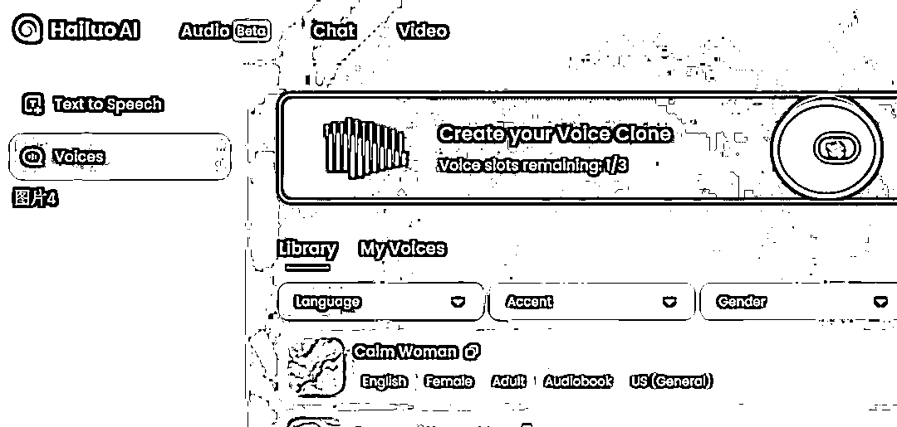
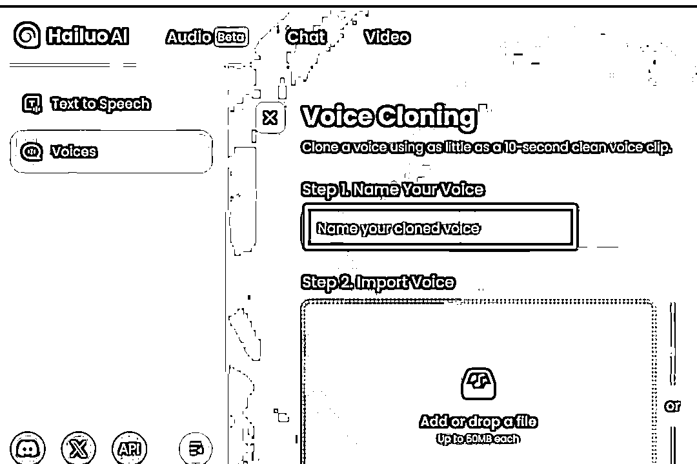

# 新号 10 条作品涨粉 7 万+，第一视角影视解说视频怎么做，完整教程攻略来了

> 原文：[`www.yuque.com/for_lazy/zhoubao/al13ok9fn30odkna`](https://www.yuque.com/for_lazy/zhoubao/al13ok9fn30odkna)

## (15 赞)新号 10 条作品涨粉 7 万+，第一视角影视解说视频怎么做，完整教程攻略来了

作者： 高鹏圈

日期：2025-01-08

​大家好，我是高鹏。

今天继续分享一个热门玩法。

以影视剧里某一个人物的第一视角来解说这部剧，最近非常火。

这种作品能火的原因，有这么几个。

首先以人物的第一人称来解说，这个形式就比较新颖。

第二点就是解说的声音，是克隆的影视剧里这个演员的音色。

最后也是最重要的一点，就是这个第一人称的口述文案非常的攻心。

比如刚才给大家展示的这个猪八戒的口述，跳出了原剧里边的平淡的故事情节。把西游记背后展示出来的尔虞我诈、人际关系和斗争都讲了出来。

接下来我用树先生这个电影为例，以树先生的第一视角来解说这部电影，给大家演示一下到底应该怎么样制作这类的视频。

首先最重要的就是我们要搞定这种高质量的文案，用到的 AI 工具就是豆包。

依然用到投喂法，把大佬的文案直接投喂给 AI，让 AI 进行深度的学习，然后用它学习到的写作风格来创作新的文案脚本。

首先复制大佬的视频链接，用到这个工具里提取文案的功能。

文案提取出来之后，我们在前面加一段指令，然后把文案同步丢到里边，让 AI 深度学习这种写作风格。

然后 AI 从各个维度和层面进行了深度的分析和学习。

接下来就是要让 AI 来用学到的这个风格来进行创作了。

我们投喂给他一段这样的指令，让他写一段以树先生为第一视角的解说文案，而且要规定字数。

因为这种视频一般的时长都比较长，大概字数需要 1000 到 1500 字左右，也就是几分钟的这样一个片子。

我们可以看到 AI 给到的文案还是非常符合我们的要求的，深度也不错。

而且通过树先生讲的这个文案，我们能体会到这种世态炎凉，还有树先生无可奈何的含义在里边，所以我觉得 AI 写的文案基本上达到了 80 分左右。

当然文采比较好的小伙伴也可以在他的基础之上，加一些东西或者修改。

有了文案之后，接下来就是配音了，我们需要先克隆宝强的声音。

用到的工具就是最近上线的海外版的海螺 AI，用它的声音克隆功能。

来到首页之后，可以看到海螺的提示。当然它原版的是英文的，我把它翻译了一下，它说只需要十秒钟左右的原音，就能够直接克隆出来一款音色，功能确实比较厉害。

来到首页之后，我们点它的上边这个按钮，就是 video。

然后点左边的这个 voices。

然后点右边这个箭头，英文写的是 create your voice clone。

然后，它会提示你给自己要创建的这个音乐起一个名字，这个名字随便写一个就可以了。

然后在下边有一个框，点一下之后，从本地上传提前准备好的，宝强说话的原音音频。

如果你找的这个音频，有背景音乐，可以点这个地方，把它的背景音乐给移除掉。

然后在第三个选项里选择中文，右下角点创建。

稍微等待一会儿，在 my voices 选项里边，就可以看到刚才克隆好的音色了。

音色克隆好之后，接下来就是直接根据文案进行配音了。

我们回到这个页面，然后点击 text to speech，那也就是文本转语音的功能，在右边这个框里边，输入所要转的文字。

文字输入进去之后，点右下角 switch voice。

然后选择刚才哎克隆好的声音模型。

右边还有一个设置的选项，里边可以设置很多东西。

首先选择输出中文，然后再选择情绪，比如说我这儿选择的是 happy，就是比较开心的一种情绪，下边其实还有就是语速，语调的调节。

点紫色的创建按钮，这个音频就生成了。

有了配音之后，接下来就是搞定视频的画面了，这个就比较简单了。

可以去某宝直接找现成的整部片子，从里面挑选符合的片段来匹配配音。

或者直接从平台上去找现有的其他作者解说的画面，因为像这种解说的片子，都把经典的片段给你挑选出来了。

最后把它下载下来，把画面和上一步得到的配音文件同步导入到剪映里边，进行音画同步的匹配，添加一个合适的背景音乐，还有字幕，这个视频就制作完成了。

Ok，这就是今天给大家分享的视频的玩法。

关于刚才提到的 AI 工具以及提示词组，还有这种号如何做商业化，统一放到文档里了：[`svj4gxvm0v3.feishu.cn/docx/QPSJddbPooAz7UxrzdXcClPVnQc?from=from_copylink`](https://svj4gxvm0v3.feishu.cn/docx/QPSJddbPooAz7UxrzdXcClPVnQc?from=from_copylink)

我是高鹏，深耕网创 9 年，这是我拆解的第 707 个落地项目玩法，更多项目玩法，欢迎找我聊聊呀~

* * *

评论区：

11 : 请问为啥根据你提供的海螺 ai 进入，看到的界面和你的界面不一样呢

Ex : 配出来声音怪怪的

Ex : 刚公众号刷到有人盗你生财的文章了 把豆包换成文案提取器就成他的原创了