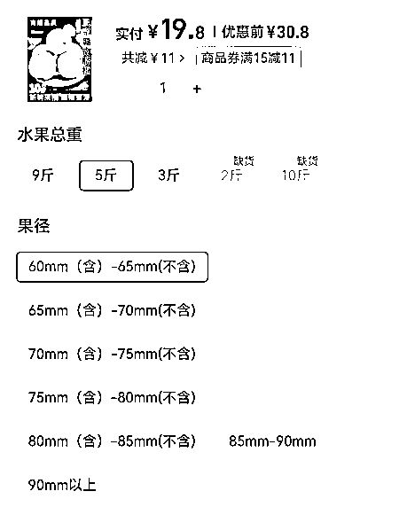
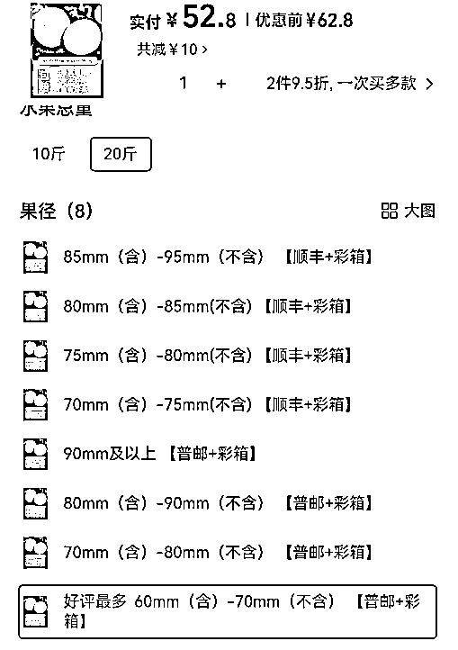
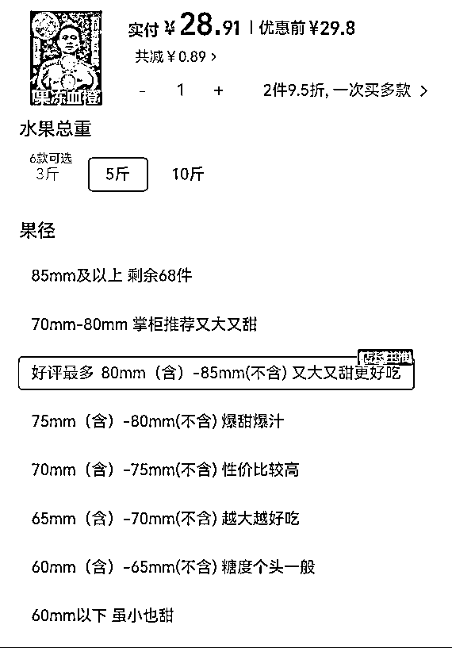

# 六种提升小红书店铺转化率的方法！

> 原文：[`www.yuque.com/for_lazy/zhoubao/yxiplus3db1cgoaq`](https://www.yuque.com/for_lazy/zhoubao/yxiplus3db1cgoaq)

## (19 赞)六种提升小红书店铺转化率的方法！

作者： 古辛

日期：2025-01-06

给圈友们分享六种，经古辛测试后，效果非常好的，提升小红书店铺转化率的方法，这六种方法中，有几种不仅可以提升小红书店铺的转化率，也能提升其他平台的电商，比如淘宝等等的转化率。

## **1****.** **链接补评论**

小红书店铺的新链接补 5 条及以上图文评价。想要提升链接转化，人为补评价是有必要的，最好是图文评价，至少补 5 条，5 条图文评价能达到边际最大化。

小红书补单主要为评价，流量需要靠笔记。5 条图文评价，找亲朋好友就能搞定；不想麻烦亲朋好友的，就找以前的客户；没有客户积累的，就找微信好友；微信好友也不想麻烦，那就闲鱼发布任务。

## **2****.** **SKU 引导**

咱们做的链接，大多数都是多 SKU 的，有时候 SKU 一多，会让用户有选择困难症，反而可能会降低转化率，在 SKU 名称的设置上，我们也能利用从众效应，让客户选择，我们想让他们选的那个 SKU。

以脐橙为例：

上图这个 SKU 的设置，就是很原始的设置，只有数据参数，没有任何营销性的术语，
很多时候客户一眼看过去，并不知道哪个更好，所以这条链接的 SKU 设置，在古辛看来很差。

上图这条链接的 SKU，就稍微设置了一下，最底下的那条 SKU 的名称，前面加了“好评最多”，这个链接的 SKU，比上面那条链接设置得稍微好一点，但在古辛看来设置得也不够好。

虽然客户看完所有 SKU 之后，目光被最底下那条 SKU 吸引，但也有不少问题。

首先是排序的问题，主推的 SKU 应该放前排，放最后排，是害怕让客户看到吗？

其次，主推的 SKU，肯定是要推利润高的呀，推尺寸最小的果算怎么回事？

最后，营销话术还有改进的空间

我们再来看第三条链接，这条链接的 SKU 设置得算合格，

首先，主推的链接放在前排的，方便客户优先锁定，店主放在第三位的，其实把主推链接放第二位会更好。

第一位放店铺客单最高的，锚定价格，客户看完第一条 SKU，价格 100，再看第二条主推 SKU，价格 80，觉得 80 不算贵，因为有 100 这个最高价做衬托。

其次，营销术语不错，除了主推 SKU 外，其他 SKU 都有营销话术。

最后，主推 SKU 前面的“好评最多”，可以优化成“千人好评”，“万人好评”，前提是销量够，销量不够，就用“好评最多”，用这种话术的目的，就是告诉客户，大家都选的这条 SKU，没问题的，闭着眼睛付款就行。

## **3.设置优惠券**

设置一个高的初始价，再设置一个高的优惠券，可以让客户有捡到便宜的感觉，特别是对于非标品来说，非常好使，因为非标品没有同行参考价，你的标准就是唯一的标准。

## **4****.** **用漂亮的模特**

有些产品需要用到模特来展示效果，尽量用漂亮的模特，越漂亮越好。

比如祛痘产品，美白产品，需要用到模特来展示前后的效果对比图，效果图可以网上选，也可以让美工合成。

用来展示对比效果图的模特越漂亮，转化率越高，因为客户会自我带入，所以，如果用来展示效果对比的模特，比较丑，会起到反面效果。

人都喜欢好看的东西，特别是女性，都希望自己更美，更漂亮。

## **5****.** **利用恐惧的情绪来提升转化率**

人的情绪当中，有不少都可以用来提升转化，我们用的效果最好的，也是目前使用最多的，就是利用客户的恐惧情绪，来提升转化率。

比如卖儿童用品，会用“如果你不及时纠正孩子的某某行为，以后就会如何如何”，“孩子的同学们都在使用这种方法，你的孩子如果不用就会落后”等等类似的话术。

卖美容护肤产品，会用“如果你不舍得花钱来保养，你节省的钱就会被小三姐花掉来保养”等等会让用户感到害怕的话术。

需要记住的是，我们利用客户的恐惧情绪的最终目的，是为了转化，是为了卖产品，一定是为了成交而使用恐惧，千万不要单纯为了吓唬客户而使用恐惧。

## **6****.** **用相似性来包装小红书账号**

小红书的账号，店铺和笔记是相辅相成的，彼此不能分开来看。

首先，小红书的本质，不是一个纯正的电商平台，而是一个种草平台，种草平台的意思是，我有某项需求，买了某个产品，我使用之后觉得这个产品很棒，分享给了小红书姐妹，小红书的姐妹被我真诚的分享打动，去下单了这个产品。

所以，大家在做小红书的时候，给自己小红书的定位，不能定位成一个卖家，而是要定位成产品的爱好者，或者使用者。

因为如果你定位成一个卖家，那其他小红书的姐妹就是买家，你们之间的关系就是买卖关系，如果你定位成某个问题的解决者，某类产品的爱好者，你就跟有同样需求的姐妹们具有相似性，你们就能成为朋友，你们之间的关系，就是朋友关系，而不是买卖关系。

小红书的姐妹，会更相信和自己具有相似性的朋友推荐的产品，还是相信一个商人卖的产品呢？

其次，用相似性来包装小红书账号，那么就需要你清楚你的目标用户群体，大概的画像，以及圈子内使用的特定术语。

这些，都可以通过在小红书搜索关键词，去看帖子和评论，来得到相关的信息。

所以，大家的小红书账号，在性别一栏里，有没有设置为女性？大家的小红书笔记，有没有从你的产品的使用者的口吻，去推荐你的产品。
记住，你在小红书的定位，不是一个商人，而是你的客户的朋友，你们是具有相似性的。

* * *

评论区：

金喜 surprise : 很实用！感谢分享 1⃣️商品链接人工干预补图文评论。2⃣️SKU 位置排序➕营销关键词引导。3⃣️高初始价➕高优惠券。4⃣️漂亮模特。5⃣️文案合适运用恐惧情绪话术。6⃣️账号定位角色设置。

颜颜 : 您好，请教下，闲鱼发布任务用什么关键词呢，我搜索了下能想到的关键词没有看到相关的任务，可能是关键词不对。但是能搜到帮别人做任务的帖子，基本都是“大学生帮小忙”这种，这种直接找它们做任务的是不是也可以呢。谢谢。

古辛 : “大学生兼职”“宝妈兼职”等等。找大学生帮小忙这种也行。

古辛 : [强][强]