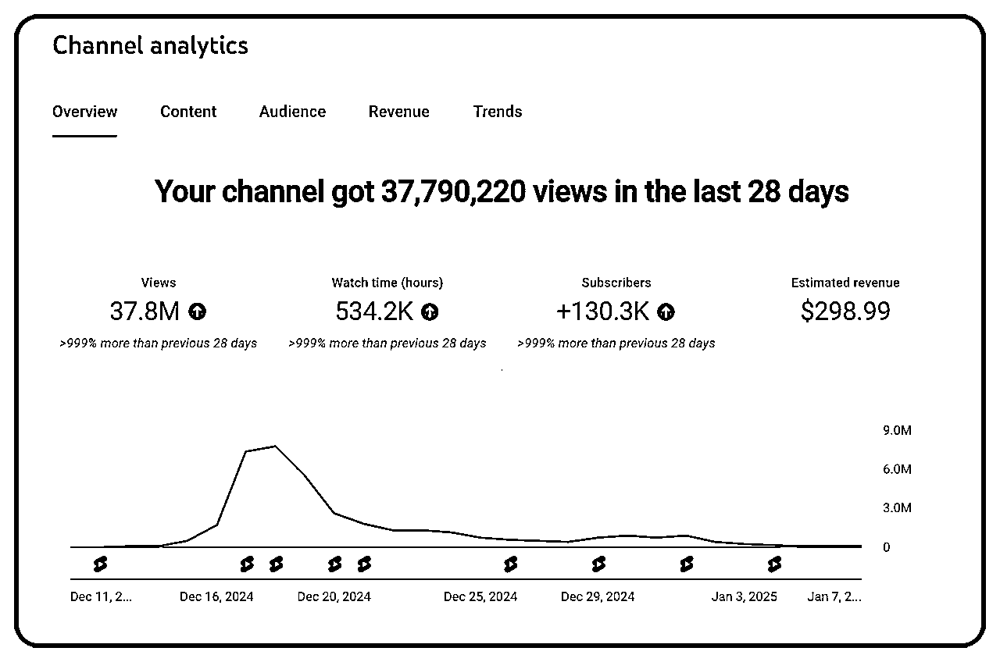

# Youtube Shorts 爆款视频经验分享

> 原文：[`www.yuque.com/for_lazy/zhoubao/vyi7n1ri8vyo6g5h`](https://www.yuque.com/for_lazy/zhoubao/vyi7n1ri8vyo6g5h)

## (精华帖)(47 赞)Youtube Shorts 爆款视频经验分享

作者： 程序员赤小豆

日期：2025-01-09

YouTube Shorts
航海结束已经有一段时间，我对于自己取得的成绩兴奋过一段时间，但对硕果累累马上就抛到脑后，极少对自己夸赞，极少庆功，极其严格要求自己，极度不自信。

看了刘小排的 越快乐才越成功 [`wx.zsxq.com/group/1824528822/topic/5121444828812144`](https://wx.zsxq.com/group/1824528822/topic/5121444828812144) 我一下子醍醐灌顶，仿佛打开了任督二脉，我反复读了两遍，并对自己过去的人生做了很久的思考和复盘。我决定从今天起做一个快乐和充满正能量的人。我会时刻 reframe 自己的大脑。
我也决定分享一下我的 Youtube 航海的过程和我赚钱认知上的领悟。

开头终于写出来了，这很好，因为万事开头难。

先晒一下我的航海成绩。过去 28 天，3000 多万的观看，订阅 13 万，收入接近 300 刀。出了 4 个 100 万以上播放的爆款视频，以及一个 3000 万的播放的视频。总体收入不是太高，因为爆款视频出来后，我又发了几个带人头的视频之后，才开通的 YPP，稍微损失了一部分前期的广告费。

更详细的内容，请移步飞书

[`lwyr88cudi.feishu.cn/docx/PU19d0X8yo66ozxBHxacQ4aFnhe?from=from_copylink`](https://lwyr88cudi.feishu.cn/docx/PU19d0X8yo66ozxBHxacQ4aFnhe?from=from_copylink)

* * *

评论区：

华仔 : 链接没权限

程序员赤小豆 : 谢谢提醒！权限打开了

前行 : 请问下，现在这种达人秀分成收益大概是多少

亦仁 : 优秀，航海期间内就能变现的算少数优秀的，大多数可能需要坚持 2-3 个月才能看到收入。

程序员赤小豆 : 感谢亦仁🥹！来生财三年，感觉认知在不断升级和开窍，开心🥳