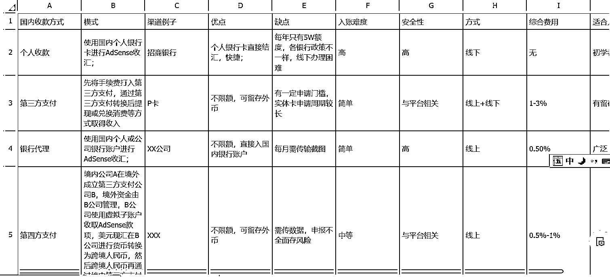

# YouTube 赚钱：关于绕开个人 5 万美元便利结汇额度的方案

> 原文：[`www.yuque.com/for_lazy/zhoubao/lma07y2i1af8k9xx`](https://www.yuque.com/for_lazy/zhoubao/lma07y2i1af8k9xx)

## (33 赞)YouTube 赚钱：关于绕开个人 5 万美元便利结汇额度的方案

作者： 书情小跟班

日期：2025-01-07

这篇文章是对 YouTube 赚钱，收款细节、方式、税务的补充 [`articles.zsxq.com/id_3exr591bo0gx.html`](https://articles.zsxq.com/id_3exr591bo0gx.html) 的补充说明

对应的是银行代理的收款方案

随着收款的金额越来越多，有些人可能已经超过 5W 美元的个人结汇限制，急需有一个新的路子来绕开这个限制，当然了这也意味着成本，通道的成本。

文章分两部分，一部分是文字说明，一部分是图片说明

### 文字说明

服务贸易结汇指引(V.20240217)

**银行直连谷歌结汇指引手册**

我司与银行共同建设成谷歌、苹果服务贸易真实性审核、结汇服务平台。从事谷歌、苹果平台服务的客户可通过本项目获得贸易真实性认证，享受合法、合规的无限额结汇服务，无单笔限额，无总额度限制！Youtube 博主、应用开发者、网站站长等通过谷歌、苹果平台获取收入的个人或公司为项目主要客户群体。

为了观看体验点开飞书文档，说明下，我不做担保，因此也就不提供具体的公司名，做这种业务的公司不止一家，如果你是自己找的服务公司，发生纠纷也与我无关，我只是提供资讯。

关于绕开个人 5 万美元便利结汇额度的方案

[`rlwxa0zgke.feishu.cn/docx/Old0d6nJLoT9uzxFEjncnksqnLt?from=from_copylink`](https://rlwxa0zgke.feishu.cn/docx/Old0d6nJLoT9uzxFEjncnksqnLt?from=from_copylink)

* * *

评论区：

暂无评论