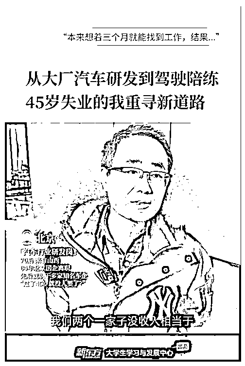
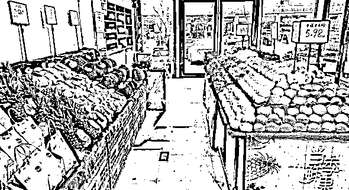

# 2025 年破局第一枪，20 万开超市 10 天时间，用模式打败对手

> 原文：[`www.yuque.com/for_lazy/zhoubao/xdl67wug6ndul6b9`](https://www.yuque.com/for_lazy/zhoubao/xdl67wug6ndul6b9)

## (21 赞)2025 年破局第一枪，20 万开超市 10 天时间，用模式打败对手

作者： 领飞懂运营

日期：2025-01-06

哈喽！

我是领飞！潜水的航海家！

2025 年，分享一篇我在病痛的中的战斗。

**  **

**我是一个 IP 博主，一个月断更，我不是消失了，迫不得已；**

**  **

一个月前，是我有史以来第一次，身体给我了强烈的反馈。

只要坐在电脑面前肩膀就疼，睡觉也浑身不舒服，导致差点进入急救中心。

具体是什么病痛，我就不说了；休息了一个月，没有分享任何内容。

最近身体恢复不少，也改变了我之前生活的方式，和工作方式，也算是另一种活法吧。

**这个视频，想比大家都看到了；** 人到中年，经济困惑，就是最大的焦虑。

其实，前段时间由于生病，我也很焦虑，我该怎么走，怎么破局？

想通了也就，那么回事！就像大姨妈来了，一段时间而已。

**这些年，我一直朋友、学员、粉丝讲：**

**  **

大家有点钱就买房子，就买小平米的房子，不是学区，就是中心地段，只要好租就行。

我不听那些所谓的专家，我只相信自己的判断。

我现在有 2 套房子出租，一年 5 万的租金，真的很舒服，想比现在的银行利息，简直好太多。

别骂我！

有几套房子，是我前些年经济好的时候，置办下的；我没有买百万豪车，没有铺张浪费，而已。

如果我现在没工作了，这也是我应该得到。

谁叫你，有经济的时候，不知道自己是谁了。

**为什么呢？**

**  **

**能量场**

本来标题我想写：不工作休息一个月，还能收入 9800 元

这个月我没工作，其他平台我上传的课程，以及我分享的内容知识付费；不工作休息一个月，还能收入 9800 元。

这就是我多年布局的“道场”，即便我现在不工作，一段时间内，也不会吃老本。

**最有意思的是：**

**  **

这一个月我又花了 20 万，开了一家综合小超市

10 天时间用**【互联网思维，阳谋营销】** ，把这家超市验证了我的模式，现在每天人工成本和房租成本，都能够天天回本。

至于赚钱，只是时间的问题。

我怎么做的呢？

借鉴，认真看下面：

水果现在变成了奢侈品，超市变成了打破头要进入的行业；

你以前看不起开超市，现在变为你高攀不起，尤其是小区门口第一家。

**01**

**  **

我养病期间，用了 15 天时间：选址

我只有一个标准，现在是冬天，晚上 9 点这条街还有没有人走动。

所以，开店房租再贵，也要去有人流的地方，至少你会成功 30%。

**02**

**  **

超市什么都卖，我目标很明确，只卖水果、代购、烟草、团购。

最终：玩赚私域会员制度。（大家好像也都这么玩，下面细品我的不同）

用吃不起的“水果”打流量，同行再怎么竞争跟我没关系。

【冲 200 元送 70 元】这就是我的策略。

**03**

**  **

水果损耗大，5 元的水果，同行基本要卖 10 元才有的赚，翻一倍的利润；

这也就是为什么？

你随随便便去水果店没买多少东西，花费上百元的原因。

水果是刚需产品，他并不是标品，里面操作的空间很大；以及水果没有品牌价值，只有地理产地价值。

这就是我选择这个项目的原因。（非标品、地理标签）

**04**

**  **

我策略，为什么【冲 200 元送 70 元】？

我跟我的店长说：你不需要跟任何顾客主动介绍会员，让他们会主动咨询你会员怎么办理。

（最好的销售，永远都是爷爷式销售法，这些年我互联网卖知识付费，一直都是如此）

玩法很简单，水果标 2 个价格，一个会员价，一个正常价。

正常价格：跟外面的同行一个价，不虚高任何价格。

会员价格：7.5 折的价格，一定有心理落差，生活消费更应如此，这也是网红带货的策略。

**05**

**  **

凡是顾客，买了水果，只要超过 50 元，他都会主动问会员价；

这时候店长一解释，基本都会办理，除非不是这个社区附近的人。

之前没有标记会员价格，每次都要跟顾客讲解“充值会员”，那你就是孙子；

调整之后，省时省力很多，简单粗暴。

**06**

**  **

我只做 200 的会员制度，不做高价，告诉大家秘密？

200 元降低门槛，锁定用户长期消费，小刀割肉长长久久。

全同城，除非你去批发市场，没有比我价格更低了，尤其对一个社区而言。

水果是高消费频次的产品；一个家庭至少 3 天买一次，谁也不是傻子，我的水果，又便宜，质量又好，为什么不常来，这就是阳谋。

我能做到会员里天天 30%的进店率，每人最低消费 50 元。

并且一个星期消费完 200 元，再充值。

**07**

**  **

重点来了！

我开店不攀比进货成本，只追求会员数量，会员消费数据。

由于刚开店，附近居民还不熟悉我，也不可能做出爆款店铺。

老百姓常吃的水果，就那几个品类，你去哪进货都一样，除非大批量。

水果店，降低损耗，就是你赚的；

价格高，也是因为损耗高。

我的策略，就是长期锁定会员，降低损耗。

损耗低了，非会员就能赚更多；

会员多了，更认同我，更信任我，我才能大批量进货，降低成本。

**08**

**  **

现阶段，我店里进了很多货，都没有花钱，比如：冷冻海鲜，农产品干粮、罐头、小吃。。。

这些都是经销商，自愿给我铺货，不用给钱，虽然给钱成本更低。

我想的很清楚，开业前期铺货很重要，不在乎利润，锁定进店率，才是我重中之重。

所以，我不焦虑我的进货成本，能包住人工和房租，就行。

就目前来看，我做到了，剩下的就是时间问题了，积累会员的问题了。

从来不主动加顾客微信，只加会员，玩的就是精准的精准，不盲目烂营销。

这也是我互联网的经验，从不主动求粉丝加我，我有价值，你自然会找我。

越牛掰的人，越爱答不理，反而客户更诉求你。放在线下生意，稍微热心点就行。

**所以啊我跟大家讲：**

做好互联网运营，到了线下就是【降维打击】，虚拟产品你都卖的了，更何况是实物产品。

**09**

**  **

**  **

现在每天有 3-5 个会员加入，我没有做任何宣传，全凭自然流量进入。

我玩互联网营销多年了，其实我觉得，会玩模式，要比会玩营销更重要。

因为你要懂？什么时间用营销，用什么营销最有效。

我没有拍同城抖音，不是不拍；是，不是时候，因为？

你没有**能量场和势** ，拍什么都扯淡。

如果到了 1000 个会员，如果有 4 家店，这时候你拍什么，都有噱头，都有自信。

所以啊！

大家开门店，模式很重要，有了模式，一切营销都是自然。

**10**

**  **

这 10 天，我从一个小白，没有任何经验的菜鸟，就是利用互联网思维把一个店开起来了，我对它充满信心。

**我跟店长说：**

开店就是养孩子，不急不躁，用你的方式去养，就会成才。大家都卷，你也卷，何必呢？早晚把你焦虑死。

还有很多没做的事情，很多要推进的策略，很多优化的点，比如：

1、老会员拉新奖励，多宣传我们，拉一个朋友送 30。

2、私域还没玩，积攒到一定会员数量开始运营，我的朋友圈只是会员。

3、积分制度，带动其他消费品。

4、私域团购，也要积累一定人数

。。。。。。

2025 年，领飞分享点不一样的事情，虽然成绩还不是很大，有几个点，值得细品，也算是小结果了。

一个月时间，即养病，有干了一件事情，想想这 30 天，我自己都不可思议。

之前，也跟亦人老大交流，我的焦虑，给了我很好的答案：过程和结果

我也闲不住，每年我都会干一个实体，互联网挣钱，实体赔钱；

那又何妨？总在吸取经验。

万一我把水果店，开遍全城呢？我也是朝着这个目标来的。

0 到 1 吧，不急不躁，做好自己的模式。

**总结一下：**

**  **

1、自己生病也没闲着，继续战斗！

2、干什么都行，一定要做【可积累】的事情！

3、一定要为自己搭建“能量场”

4、“布道”才是每个人，年年要去做的事情。

5、一个创业者，不要因为风险而不行动！

你看吧，我身体不好了，我还在拼，还在勇于试错。

过往的任何经验，都会你未来有帮助；只有按兵不动的守城将，才不留青史，早晚被灭。

人一辈子在于折腾，有方向的折腾，不盲目的折腾，没有 100%对的，只有 100%多试错，最终才能验证。

**2025！**

**  **

**领飞在互联网，还是干那一件事！****干了快 10 年的事情。**

**领飞，往期生财加精文章：**

[0、【倒爷（中介）发财术】合作别人才有意思，大家一起分钱](https://articles.zsxq.com/id_wus55cjxodtw.html)

[1、如何通过【创业知识博主】原始积累 800 万](https://articles.zsxq.com/id_sckk8imjgqgi.html)

[2、【长期暴利项目】中介思维极致，年入百万项目方法](https://articles.zsxq.com/id_cd7wutqqqa61.html)

[3、【卖服务+卖产品】个人轻资产运营，价值“百万”商业模式](https://articles.zsxq.com/id_msepc8pc7r5m.html)

[4、五年用闲钱买房赚了 50 万，小城市房产投资经验，纯干货！！！](https://articles.zsxq.com/id_s0n9vvaawd1j.html)

[5、【先拼数量，再保质量】一个素人做 IP 写小作文，108 营销方法论](https://articles.zsxq.com/id_2q75vclbo9rx.html)

[6、如何用你的“热爱”，选择创业项目方向](https://articles.zsxq.com/id_vcqr0bwozsqa.html)

[7、【中介思维赚钱术】卖人，卖项目，链接高手一起卖](https://articles.zsxq.com/id_n2uw328j6swl.html)

[8、【大龄职场破局副业】6 个入局赛道解析，长期的搞钱策略（2 万字）](https://articles.zsxq.com/id_n3ddt25tm66o.html)

* * *

评论区：

胖大魔（AI 提效版） : [旺柴]有个错别字

领飞懂运营 : 错错更健康[偷笑]

亦仁 : 可以把你开水果店的这个拍成视频发到各个平台上去，养一个线上的「水果店」