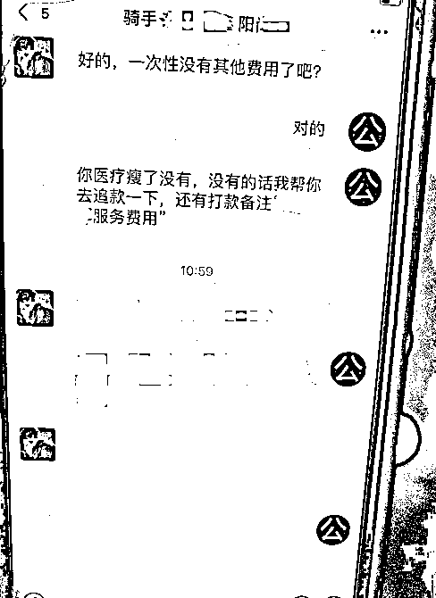

# 高客单小众蓝海：我是如何帮外卖骑手维权，赚取高额收益的

> 原文：[`www.yuque.com/for_lazy/zhoubao/dfrqb6yb8pny6kqs`](https://www.yuque.com/for_lazy/zhoubao/dfrqb6yb8pny6kqs)

## (精华帖)(29 赞)高客单小众蓝海：我是如何帮外卖骑手维权，赚取高额收益的

作者： Yc·Jw

日期：2025-01-06

#### 各位圈友，大家好，我是 YC，坐标广州~做着一家每天为大家提供 20 万次外卖配送服务的公司

今天以配送行业 10 年老司机身份分享项目，分享一个主/副业都可以去做，高客单价有稳定收入的小业务。

这个项目属于一个高客单、小众的蓝海服务，成本低，产出高，既能帮到需要的人，也能赚取一份不错的收益。

 osH6A)

## 内容较长，为了更好的观看体验请移步飞书，感谢大家耐心观看~

[`rcnh7ictkhmv.feishu.cn/wiki/G43GwgKlximft7kwtCRc0SaKnrg?from=from_copylink`](https://rcnh7ictkhmv.feishu.cn/wiki/G43GwgKlximft7kwtCRc0SaKnrg?from=from_copylink)

大纲如下：

## **如何通过帮助配送骑手维权赚取高额收益**

一、骑手为什么需要维权

二、收益

三、项目开发

四、同行优势

五、市场空间

六、结尾

* * *

评论区：

咕咕不咕咕 : 谢谢分享！刚执业的律师心动了

王厚道 : 谢谢分享 有搞头哈哈 可以加您链接下嘛[呲牙]江苏的法律人

唠唠嗑 : 您好我是从事外卖行业的资深运营人，希望能与您建联一下，看看有没有合作的可能性，可以给您分享一下我的项目规划，因为看到您提及到的内容，我想应该会有一个契机联动创造一些价值

Yc·Jw : 好的呀，一起交流一下[呲牙]

Yc·Jw : 好呀，一起交流一下，外卖相关的项目我们都感兴趣的[呲牙]

Yc·Jw : 可以做一单试试的[机智]

Yc·Jw : 好呀，是找鱼丸建联吧？

姚先森 : 这个项目没有法律经验的人 能操作吗？