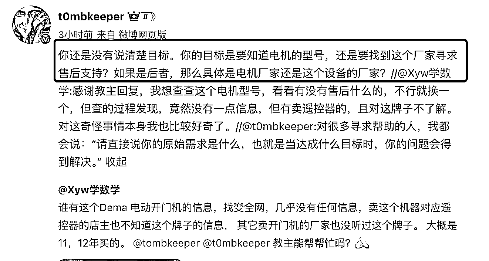

# 产品经理分享增长经验与实用案例

> 原文：[`www.yuque.com/for_lazy/zhoubao/gy4rr3e4ue9aaraz`](https://www.yuque.com/for_lazy/zhoubao/gy4rr3e4ue9aaraz)

## (18 赞)产品经理分享增长经验与实用案例

作者： 长庚

日期：2025-01-01

做了几年的产品经理，最近两年在做产品增长相关的工作。下面的内容是「线下组局」分享的内容整理，应该会对大家的业务提供一些有用的信息。

目录：

1. 在公司学到的一些道理

2. 海盗模型的应用与案例

3. HVA（高价值行为）的介绍与案例

4. 吃得更健康、在网上保护自己的隐私。

**  **

### **1、在公司学到的一些道理**

1. 说人话

1.  想办法让文案说人话，让所有人都能看得懂。

2.  听起来很简单，但是实际上做起来很难，难点在于，我们受过专业的产品训练而用户没有，不能让普通用户理解专业术语。例如

3.  原文案：“点击进入星球”

4.  改为 “点这里开始学习，立即成长”

5.  用户可能完全不了解“星球”是什么，他们只认识“星主”，并知道自己是来这里学习的。

6.  当我们想表达某个信息时，用户可能不了解我们的意图，因为我们省略或隐含了太多意思。例如：

2. 尽量少，如果没有必要就别增加

1.  奥卡姆剃刀原则：对于一个功能或页面，如果无法论证其可行性，那就不做。做就有成本，包括研发成本、用户学习成本，并且回退也要代价。

2.  一个页面最好只保留一个按钮，明确告诉用户：

3.  他们当前的状态是什么

4.  他们接下来要去哪里

3. 从用户视角出发（说的很简单，但是真的很难）

1.  将思考方式从“我为用户做了什么”转变为“用户感知到了什么”。

### **2、有效用户需求分析**

**第一步、辨析用户的问题**

1.  面对用户的反馈，我们要明确几点：用户的情绪、对方遇到的问题、对方提出的解决方案。

2.  例如：用户反馈：“你们产品怎么这么不成熟？支付宝付款都不支持？快把你们的产品经理开除吧”

3.  用户情绪：你们的产品不成熟

4.  遇到的问题：用户想要用支付宝付款

5.  解决方案：开除产品经理

**第二步、找到用户遇到的实际问题**

1.  用 **5why** 法，找出实际问题。

2.  针对“想用支付宝付款”的需求，多问几个为什么：

3.  **为什么要付款？** 是想购买某个产品或服务吗？

4.  **为什么一定要用支付宝付款？** 用户可能回答：“我是外国人，无法使用微信支付。”

5.  **核心问题：** “外国用户无法使用微信支付”。

6.  关于用户的解决方案，不建议直接采用，因为：

7.  用户并不清楚自己真正需要什么，也不了解代价。

8.  他们对产品的了解，不如我们，提出的解决方案可能不合理。

9.  我们的做法是：针对用户提出的多个问题，给他们一定的“筹码”（例如 10 个），让他们自行分配，以此判断优先级和重要程度。

**第三步、判断多少人会有这个问题（用户分层）**

1.  使用 **5w1h** 分析，找到有多少类型的用户会有类似的问题。

2.  以续费的为例，需要考虑

3.  加入星球 6 个月的用户，该怎么提醒他们关注这事。

4.  加入星球 9 个月的用户，怎么引导他们续费。

5.  加入星球 12 个月（过期）的用户，如何召回，并提醒他们尽快续费，以免失去权益。

6.  加入星球 15 个月的用户，考虑该怎么让他们重新回归。用户流失这么久，大概率已经和我们形同陌路了。

**设计解决方案**

1.  提炼上述不同类型的用户的共性的需求，针对性思考解决方案，用尽可能低的成本，换最大的收益。

2.  再进一步，就是页面交互的设计了，不在此处展开。

### **3、海盗模型（AARRR）**

1.  **AARRR** 分别代表：获取用户（Acquisition）、激活用户（Activation）、提高留存（Retention）、增加收入（Revenue）、自传播（Referral）。

2.  可以把自己的业务套进去，然后理清楚每个环节可以优化的细节，让整件事转起来。但这里的前提都是，你要很熟悉自己的业务。并且有充分的数据基础。

**  **

**下面以小红书获客为例：**

**A：拉新：我们的用户从哪里来**

1.  他们通过何种渠道了解我们？哪些文章转化率最高？

2.  他们选择我们时输入了什么关键词？

3.  怎么开口、怎么突破平台限制、怎么选择“赠送的资料”…

**A：激活：在他加我们微信之后，怎么激活他**

1.  最重要的事情是：用户做了什么动作，我们才能定义为『用户被激活』，用户被激活后的特征是什么？

**  **

**R：留存**

1.  用户加了你的微信，怎么才算真正留下来？可能的答案是，不删你、看得到你微信、偶尔点赞，那么就能围绕这个环节去做动作。

**  **

**R：收益**

1.  话术有没有值得优化的地方

2.  朋友圈内容、频率有没有值得优化的地方

3.  和用户沟通的频率有没有可优化的点…

**  **

**R：分销**

1.  这一步也要具体情况具体分析，是什么让用户分享，是什么让用户的朋友愿意买你的服务，你的用户到底是什么类型的人？

**  **

**R：召回**

1.  可以把用户分层，买过东西流失、没买过东西流失、在小红书有开口，但是没下文的，都需要针对性做优化。

### **4、HVA（High Value Action）用户高价值行为**

**到底什么才是增长：**

1.  我们并非单纯的要流量、数据增长或打开率。如果只要这些，不如频繁给用户推送私信，虽然能提升打开率，但无疑是饮鸩止渴。**真正的增长应是有效数据指标的提升，最终提高用户的全生命周期价值（LTV）。**

**  **

**具体方向：**

1.  **找出能提升用户价值的功能或服务** 找到哪些功能、服务，能让用户产生更高的价值（LTV）。

2.  如果找不到，也可以猜测，列一系列功能，评估行为以及对应的价值。

3.  **引导用户完成高价值行为** 一步步尝试，引导用户去做上述的事情

4.  最好做 AB 测试、或者样本尽可能保持一致，避免偏差

5.  最终找到能带来更高收益的功能或组合，并进行推广。

**  **

**举个例子：滴滴豪车**

1.  高价值行为

2.  滴滴豪华车（价格较高）认为，用户的高价值行为是下首单。

3.  只有用户先体验一次豪华车服务，才有可能在未来继续选择豪华车。

4.  扩充场景，吸引更多用户

5.  找出更细分的使用场景，扩充用户群和能使用豪车的机会。

6.  豪车除了老板等商务人士，还有没有可能在特殊节假日，例如七夕、情人节、结婚纪念日…给你一个圆满的节日。

7.  运力空闲时，给予优惠

8.  在豪车在非高峰期时段，提醒打车的用户稍微加一点钱体验豪车。

9.  只要长期优化策略和组合，就能找到一些效果比较明显的策略。

参考文章：

1.  《我在一线做增长产品》

2.  [`mp.weixin.qq.com/s/Gd-QWHQrIfuuz5R0WqA0Ug`](https://mp.weixin.qq.com/s/Gd-QWHQrIfuuz5R0WqA0Ug)

3.  [`mp.weixin.qq.com/s/6MQdBFgI5sNzfSIy4vfVpg`](https://mp.weixin.qq.com/s/6MQdBFgI5sNzfSIy4vfVpg)

**还有一些其他的分享：**

1.  怎么吃不容易胖

2.  吃饭前先喝点醋，对血糖的波动有一定抑制作用。

3.  吃饭的顺序应该是，植物最先吃，肉其次，米饭最后，血糖波动也没那么快。

4.  吃就吃原生态（鸡就是鸡，牛肉就是牛肉），不要吃超加工食品，牛肉丸、牛肉饼、鸡肉饼、火腿肠…

5.  其他参考《**控糖革命** 》，可以只看标题。

6.  怎么在网络上保护好自己的隐私

7.  首先要知道，目前信息泄露还是严重的。

8.  其次，永远永远不要幻想有好事会砸在你的头上，不要因小失大。

9.  苹果相对于安卓更安全。

10.  链接不要乱点，尽量用 App Store 里能下的软件。

11.  浏览器可以开启禁止追踪的能力，手机也可以。

12.  拍照时，关闭定位记录。

13.  密码最好复杂一点、长一点。

14.  收货地址可以写小区的驿站，不要写门牌号，可以用一个单独的手机号，收货。

15.  永远永远不要发自己的手机号在公开网络上，例如朋友圈、微博、论坛…

* * *

评论区：

暂无评论