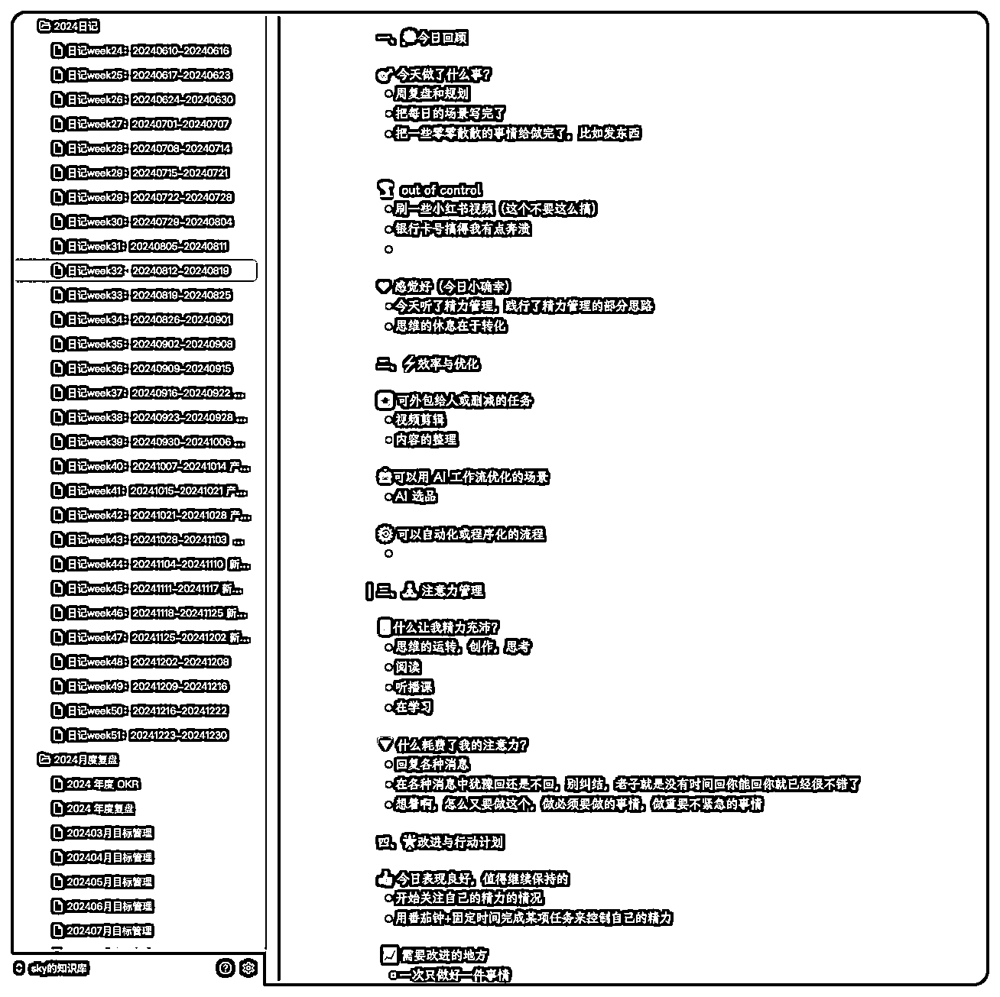
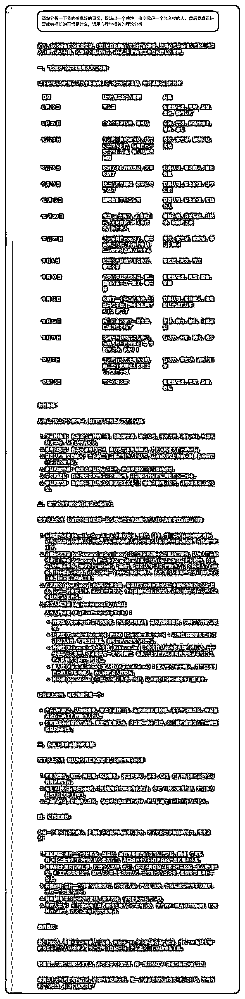
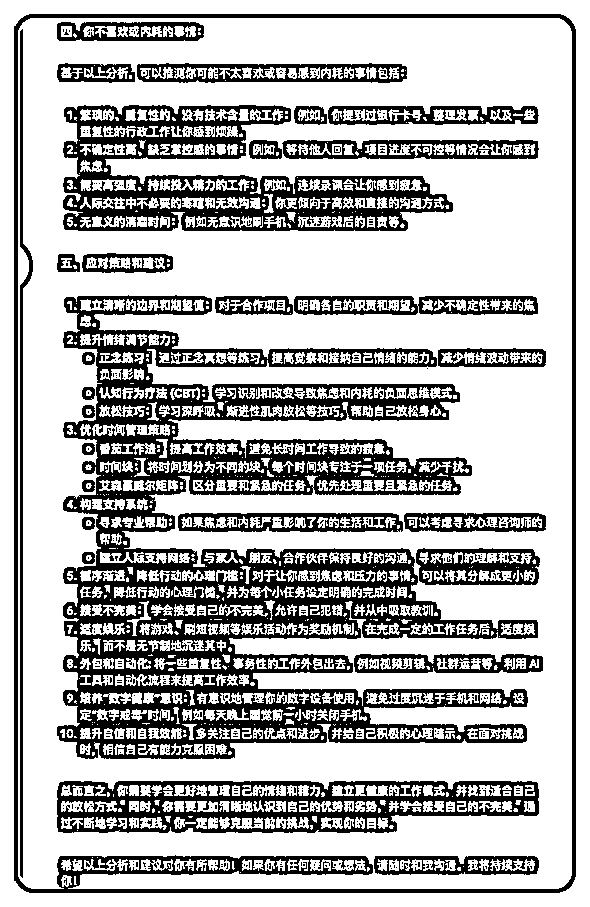

# 迷茫焦虑？如何快速找到你的热爱和天赋！这个 AI 记录法，值得每一个人去尝试！

> 原文：[`www.yuque.com/for_lazy/zhoubao/swbq3ic33thiv1y8`](https://www.yuque.com/for_lazy/zhoubao/swbq3ic33thiv1y8)

## (25 赞)迷茫焦虑？如何快速找到你的热爱和天赋！这个 AI 记录法，值得每一个人去尝试！

作者： sky 陈天

日期：2024-12-30

大家好，我是 sky 陈天，一名新手奶爸，去年加入生财搞了一年副业转正啦，现在是一名 AI 企业培训讲师、AI 办公提效顾问。

大家在赚钱做项目过程中，肯定会有一个时刻，就觉得虽然能赚钱，但好像自己没那么喜欢，我到底喜欢什么呢？

我发现很多年轻人包括我自己，都有过极度迷茫的时候，不知道自己到底擅长什么，喜欢什么。我也是 INFP
性格，很喜欢做自我探索，最近在做年度复盘，然后**我发现一个非常炸裂的 AI 用法！**

都说 AI 时代做自己非常重要，那到底如何去挖掘和找到自己的喜欢又擅长的事情呢！

**今天我给大家分享如何用 AI 来发现自己擅长和热爱的事情，非常简单，可实操。** 这篇文章建议每个人都认真看完，很短，但一定会对你有价值！

**核心就是：建议迷茫的年轻人，一定要多输出，多记录。**

尤其是记录自己每天做了什么，感觉是开心还是难过，越细节越好。

我坚持记了一年，每天都会按照以下的模版来写一个日记。

然后我把这些记录都发给 AI，让他帮我分析，如果是你写的复盘也可以直接发给他，不用日记也可以，以下是提示词。

> 请你分析一下我的感觉好的事情，提炼出一个共性，推测我是一个怎么样的人，然后我真正热
> 
> 爱或者擅长的事情是什么，请用心理学相关的理论分析

AI 直接帮我梳理出了我的底层动力，性格，喜好，并且推测了我最适合的职业！就是我现在干的 AI 企业培训+AI 咨询顾问。

你也可以从反方向询问 AI，我不喜欢什么事，如何避免做这些事

> 请你分析一下我的感觉不好的事情，提炼出一个共性，推测我是一个怎么样的人，然后我不太喜欢或者内耗的事情是什么，请用心理学相关的理论分析，并告诉我应该怎么样合作，或者克服呢？

我自己从 2020 年开始自我探索，阅读了很多心理学的书籍，也找过一些咨询教练，找到自己热爱的事情太 tm
难了，一个是没有方法，第二是缺少牛逼的外部教练点拨。

但现在你只要记录，再加上 AI，这件事真的变得容易多了。

AI 时代，找到自己的价值感和意义变得非常重要，可能 10 年后我们都是“无用之人”，无法在工作中找意义，而是要找到人生的意义。

AI 用的是 gemini2.0，拥有 200w 字的上下文，所以他能分析我一年所有的文本，如果你的文本不够多，用国内的 kimi 、智谱都可以。

每日的记录模版也分享给大家，这个模版是我和夙愿学长共创的：

一、💭今日回顾

🎯 今天做了什么事？

🌪️ out of control

❤️ 感觉好（今日小确幸）

二、⚡效率与优化

🔄 可外包给人或删减的任务

🤖可以用 AI 工作流优化的场景

⚙️ 可以自动化或程序化的流程

三、🧘 注意力管理

🔋什么让我精力充沛？

🔻 什么耗费了我的注意力？

四、🌟改进与行动计划

👍 今日表现良好，值得继续保持的

📈 需要改进的地方

📝具体的行动计划（列出行动点）

五、 🎯明日计划

🚀 明天最重要的三件事

🛡️潜在挑战及应对策略（预案）

🤔完成最主要的三件事，还可以怎么做什么？

六、🧠 总结反馈

👍对这次复盘的感受（嘉许自己）

🔧 对复盘这件事情本身的改进建议

抓紧去尝试起来把！先从每天腾出 10 分钟记录开始！如果你刚好没记日记，你也可以把自己的航海日志发给 AI 来分析哦！

老规矩，如果这篇文章有帮助，也请点个赞哦！你的喜欢是我更新的最大动力！

* * *

评论区：

燕子 : 日记也是在 AI 上写的么？

sky 陈天 : 不是，随便找个笔记软件上写

燕子 : 谢谢

心净亦如心镜 : 学到了感觉很有用

sky 陈天 : 哈哈谢谢，对你有帮助就好