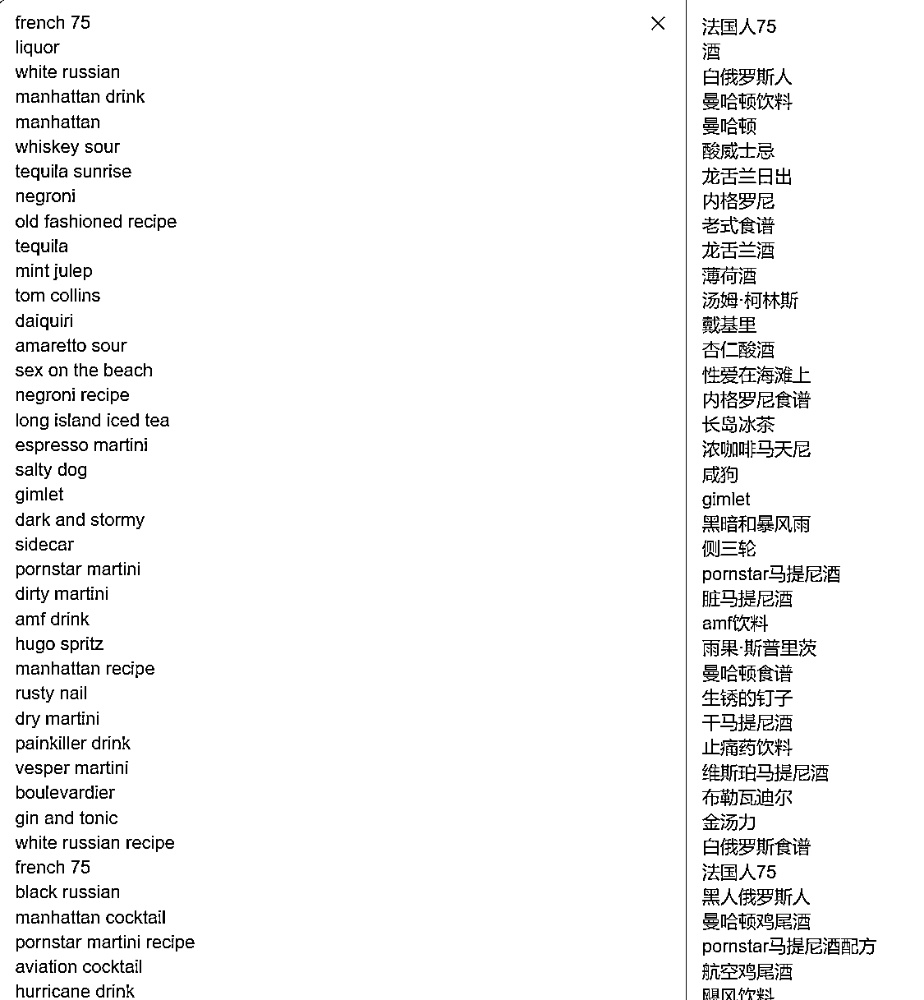
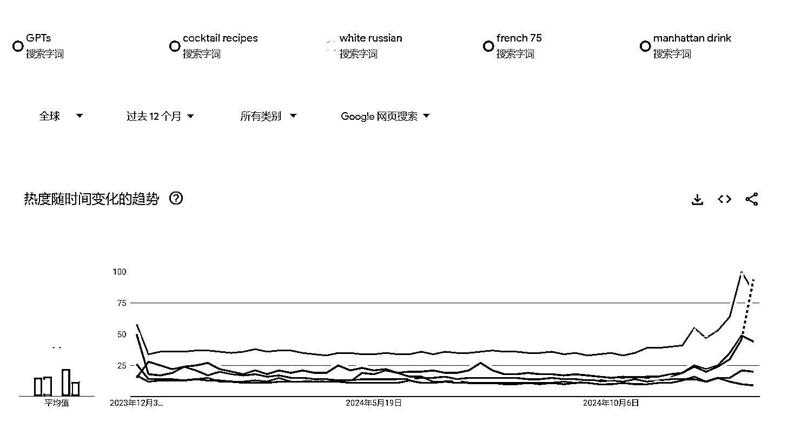
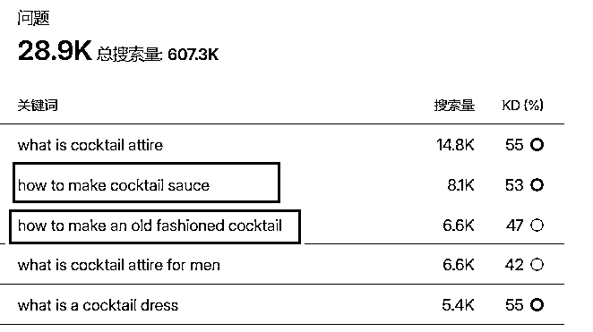
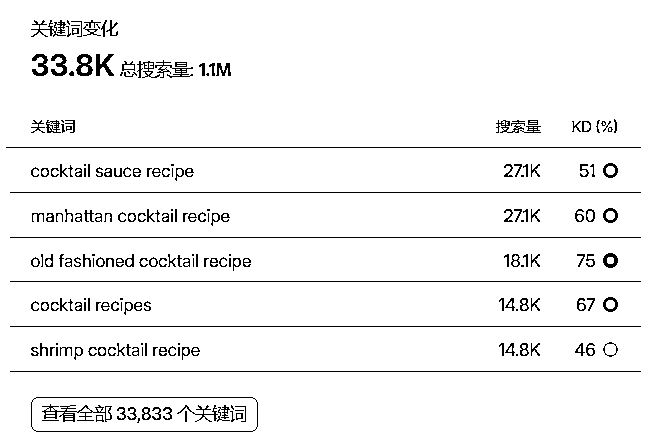
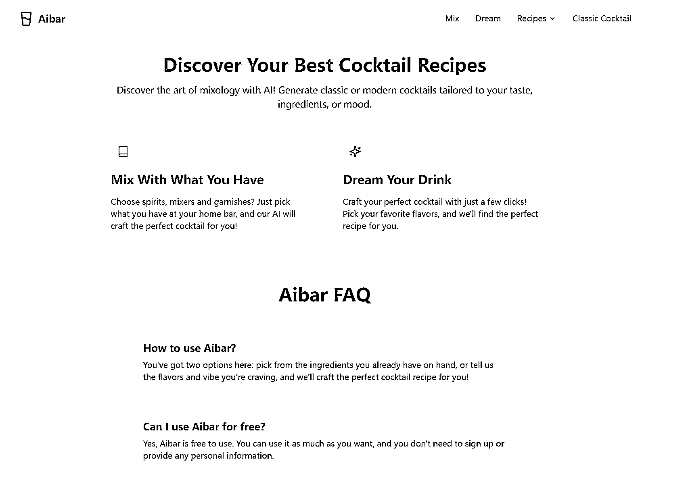

# 龙珠悬赏 03 猎龙计划 1

> 原文：[`www.yuque.com/for_lazy/zhoubao/qrz430466vl3l4iw`](https://www.yuque.com/for_lazy/zhoubao/qrz430466vl3l4iw)

## (11 赞)龙珠悬赏 03 猎龙计划 1

作者： 彩笺

日期：2025-01-02

## 前言&概述：

文章结构：

**对手变现 &流量分析**  一共分析了三个要挑战的对手，他们在**核心功能、总体体量** 都有所不同，但是又都**围绕着满足用户需求来展开**

**总结用户意图**  通过分析对手，利用工具和搜索引擎总结的信息，以及社交媒体的内容判断，总结出来的**用户搜索意图** ，以及**流量关键词**

**核心功能 MVP**  包括 MVP 核心功能，未来的初步演变方向

**冷启动**  围绕**如何获取免费的自然流量** 的具体实践内容。

**额外说明：**

最终产品全部使用 bolt+cursor 生成，一行代码没写（修修改改不算

过程中使用了很多工具分析了大量的网站，以及用户需求，部分数据直接呈现，同时部分观点会直接给出结论。就不一一截图展示了，保证信息完全匹配调研数据。

使用到的工具有：similarweb、semrush、google、google search console、google
trends、reddit 等社交媒体。**变现的估算分析学自自哥飞的公众号。**

### 竞争对手分析

> 寻找已完成变现的产品：抄作业就要抄学霸的

我更倾向于把他们称之为要挑战的对象（不气盛还叫年轻人么

### 竞争对手 1

#### 概况：

网站：[liquor](https://www.liquor.com/)

鸡尾酒博客网站，主要形式为内容，用户体验良好，内容有趣，专业，并且有在持续更新，近一年更新了 192 个页面，没有强制弹窗广告。网站 seo，架构等设计也都很强。

#### 变现情况：

变现方式：**广告**

大致变现估计：

每个页面中都插入了 3 个广告位，网站主要依靠内容来提供价值，根据流量地域分布，ECMP 一般在 3-6 美元之间，另外从跳出率来看，PV 和 UV 是基本可以对应起来的；简单计算，那么该网站月收入大致为：

`4000000PV / 1000 * 4 * 3 = 48000 美元`

**数据基本没问题（因为我见过月广告收入在 w 刀的网站，对应的流量数据）甚至这个网站的收入，比预估的只高不低。**

#### 流量分析

流量大小：平均一个月**400w PV，250w UV,** 平均访问时长 `1min:41s` , `跳出率 64.82%`

流量分布：**80%的流量来自于发达国家，其中有 70%来自于美国**

流量来源：

分类|  |

---|---|---

| 免费流量 `99.87%`| 付费流量 `0.13%`

| 自然搜索 `71.43%`| 直接访问 `22.56%`

| 非品牌流量 `83%`| 品牌流量 `17%`

| 移动端流量 近`80%`| 桌面端流量 近`20%`

以上数据来源 similarweb，其中设备流量分布中，移动端直接流量有`86%` ，自然搜索的流量是`80%` ，所以按照 80%写的表格。该网站在 semrush 上数据表现几乎一样。

#### 自然搜索流量分析：

从 semrush 可以看到，除了第二条 liquor 和域名重合之外，**几乎所有的自然搜索流量，都是各种各样的鸡尾酒带来的，用户的搜索意图也很明显，寻找配方等相关信息** （为什么要分析，等下要考的

**下图为该网站流量 top50 关键词：**



### 竞争对手 2

#### 概况：

网站：[cocktailbuilder](https://www.cocktailbuilder.com/)

用户选择一部分的鸡尾酒材料，生成
有哪些鸡尾酒有可能调制（使用已有数据，非 AI）用户体验差，有强制弹窗广告，页面不好看，配方较少，可以选择的基酒等调味材料较少，不够自由。

#### 变现情况：

变现方式：广告

大致变现估计：

不算弹窗广告：`130000PV / 1000 * 4 * 3 = 1560 美元`

实际应该要更高一些，上面的计算**弹窗的广告没有计算在内** ，并且弹窗广告的价格应该会更高，按照普通广告来计算的话，**月 1950 美元以上。**

#### 流量分析：

流量大小：平均一个月**130K PV，8w UV,** 平均访问时长 `1min:07s` , `跳出率 48.63%`

流量分布：将近 80%的流量来自于发达国家，其中有 50%来自于美国，10%来自于加拿大，近 20%的来自于欧洲

流量来源：

分类|  |

---|---|---

| 免费流量 `100%`| 付费流量 `0`

| 自然搜索 `68.22%`| 直接访问 `26.31%`

| 非品牌流量 `86%`| 品牌流量 `14%`

| 移动端流量 近`81.47%`| 桌面端流量 近`18.53%`

### 竞争对手 3

#### 概况：

网站：[bargpt](http://bargpt.app)

使用 AI 制作鸡尾酒，这个网站一两个月前我就盯上他了，最开始是无广告，每个账号每天都有一次免费使用机会，订阅分 3.99<card type="inline" name="math" value="data:%7B%22code%22%3A%22%E6%9C%88%2F29.99%22%2C%22id%22%3A%22DQPrJ%22%7D">年。</card>

后来在网站上添加了广告。用户体验最开始是比较好的，**最近对免费账户加了强制观看广告，流量也对应的开始下跌。**

**额外说明：**

从搜索引擎搜索 ai cocktail，他排在第一位，同时提供 AI 制作鸡尾酒服务的应该最多也就不超过个位数的网站。

其中排在第二位的是一个 21 年的网站，也可以使用 AI 生成，但是访问量很低。

排在第四位的是一个综合性老网站，几乎什么都有，该网站有个内页提供 AI 制作鸡尾酒。用户体验一般般。

#### 变现情况：

变现方式：广告+订阅

大致变现估计：

订阅的部分，不太好估算，一种可能的估算路径是查看使用的支付方式，分析其对应的出站流量。（经验还比较少，我记得之前好像看到过一个可以分析 AI 付费情况的网站来着，找不到了。

广告部分：每个月 4 位数的美金肯定是有的，这还是建立在不清楚强制观看广告的价格的前提下。

#### 流量分析：

流量大小：当月的流量状况：平均一个月 100K PV，5w UV, 平均访问时长 `1min:02s` , `跳出率 47.60%`

流量分布：将近 80%的流量来自于发达国家，其中有 50%来自于美国，10%来自于加拿大，近 20%的来自于欧洲

流量来源：

分类|  |

---|---|---

| 免费流量 `100%`| 付费流量 `0`

| 自然搜索 `61.15%`| 直接访问 `28.99%`

| 非品牌流量 `97%`| 品牌流量 `3%`

| 移动端流量 近`76%`| 桌面端流量 近`24%`

### 用户意图分析

从上面网站的状况，以及相关关键词的拓展搜索，可以确定，用户的意图是**信息** ，主要表现在**鸡尾酒配方，如何制作等方面** 。

用户意图分析来源： **鸡尾酒、鸡尾酒配方关键词检索（semrush）更精确的鸡尾酒自然搜索，社交媒体。**

#### 需求关键词

**所以的用户命中的需求关键词是：cocktail recipes, 各种各样的鸡尾酒名** ，贴图一张感受一下：



**以及关键词**`cocktail recipes`**延伸的问题搜索量：**





### 产品 MVP

有了用户的需求和意图，以及三个对手的详细分析，**那么我们应该做什么，在哪些地方引入 AI 的功能，哪些地方我们可以做的比他们还好；其实就一目了然了。**

网站：[aibar](https://aibar.app/) （欢迎大家去体验一下，顺便+点流量 hh
直接复制版本：[`www.aibar.app`](https://www.aibar.app)

网站首页图片镇楼：



#### MVP 功能点

在 AI 方面，目前基于两种不同的方向进行生成

提供多种的基酒、调味饮料、装饰品（**你有什么** ），用户选择之后，使用 AI 生成鸡尾酒配方等相关信息

用户提供风味、视觉效果、引用场合、酒精度、心情（**你期望什么** ），使用 AI 生成鸡尾酒配方等相关信息

多个博客页面，在本地使用 AI 生成鸡尾酒配方并上传

后续基于冷启动的反馈，再来做调整，比如增加更多的选择，以及额外新增自定义生成等内容

### 冷启动实践

核心永远是**满足用户需求** ，所有的冷启动策略，均围绕核心来展开。

网站内，通过添加更多的**热门搜索** 鸡尾酒配方页面，来命中**有流量的关键词** ，增加搜索引擎给的曝光

筛选一些，有流量，但是**低竞争的关键词** ，通过这部分曝光和带来的流量，带来一部分的初期用户。同时这部分的用户数据也能慢慢累积网站权重

cocktail recipes 关键词是有竞争的，**锚定：ai cocktail recipes** ，过程会比较缓慢，但是 google 看到你的内容带来了真正的价值之后，是会推更多的流量的。

发外链，目前手里有一些可以给 Dofollow 的高权重网站，去发外链增加权重传递

分析对手的外链来源，特别是**自然增长的外链** ；寻找社交媒体等真实用户场景（像是去去寻找国外的小红书、即刻

通过上一步的手动引流，从用户需求出发，写引流博客；例如：

```
 * 帮助手册（我这个网站如何用）

 * 社交媒体分享鸡尾酒榜单类似的帖子（避免拉踩，同时这种类型的文章，一般都会被社交媒体允许）

 * 模拟身份，通过 prompt 模拟身份，通过类似小红书经验帖的形式，做更贴合真实的用户分享
```

有几位调酒师朋友，邀请他们使用，给些更专业的建议（AI 生成的够不够好用等）

有几个需要注意的点：

网站的页面，要做好 SEO 和关键词，更核心的是，内容要有价值，虽然会借助 AI 生成，但是保持严谨，我在这几天还去翻阅了国际有名的鸡尾酒书籍，来确保内容的可信程度。

过程不是一蹴而就的，注定会有个缓慢的增长过程，不要急功近利（上一个也是做的第一个能有流量的网站被 google 惩罚了，这就是教训）

非常具体的过程，需要结合自己对需求的理解程度，过程中根据对需求跟深刻的理解做调整

冷启动过程中，可以通过 google search console 和 google analytics 看到用户的详细数据，根据数据反馈做调整。

为什么标题是猎龙计划 1，因为过程中发现了另外一个需求，所以可能会有 2。

最后立个 flag，这个网站拿到流量拿到钱的那一天，去云南的调酒师朋友那边，学做一名调酒师（蓄谋已久

#龙珠悬赏

* * *

评论区：

柠檬🍋 : 优秀，加油

彩笺 : 多谢[奋斗]~