# 00 后，24 岁，脱下孔乙己的长衫，我开了家一人公司｜年复盘

> 原文：[`www.yuque.com/for_lazy/zhoubao/zasufrbfnw7iwygk`](https://www.yuque.com/for_lazy/zhoubao/zasufrbfnw7iwygk)

## (42 赞)00 后，24 岁，脱下孔乙己的长衫，我开了家一人公司｜年复盘

作者： 安七

日期：2024-12-30

**嗨，你好，我是安七。** 欢迎收看我的 2024 年度复盘

23 岁，双非二本院校毕业，本该成为一名人民教师，结果阴差阳错当上了一人公司小老板；

本科学马克思主义理论，结果创业方向是 AI；

梦想成为高级打工人，结果误打误撞开始创业，从月薪 3k 到现在创业年入 7 位数……

是一种什么样的体验？

当我脱下孔乙己的长衫、开了家一人公司，发现 00 后 AI 创业的真实场景，是这样的。。。（答案在后面~）

读别人的故事，悟自己的人生。妙啊。so，咱们开始吧~

为方便大家阅读，文章共分为 4 部分：

1/从小乖乖女、目标高级打工人，怎么拿到创业剧本了？

2/创业新兵、非典型创业者，创业路上都有哪些挑战？

3/2024 的创业剧本中，我的收获和意难平

4/广漂 1 年多，一人公司接下来 All in 的方向

**阅读建议：** 文章较长，7000+字，预估用时：3-5 分钟，建议在较安静环境下阅读。

# **01**

# **从小乖乖女、目标高级打工人，怎么拿到创业剧本了？**

如果你有我朋友圈，不难发现，之前的我是这样的：乖乖女、上进积极、认真打工的学生党一枚，跟 AI、创业毫不搭边。

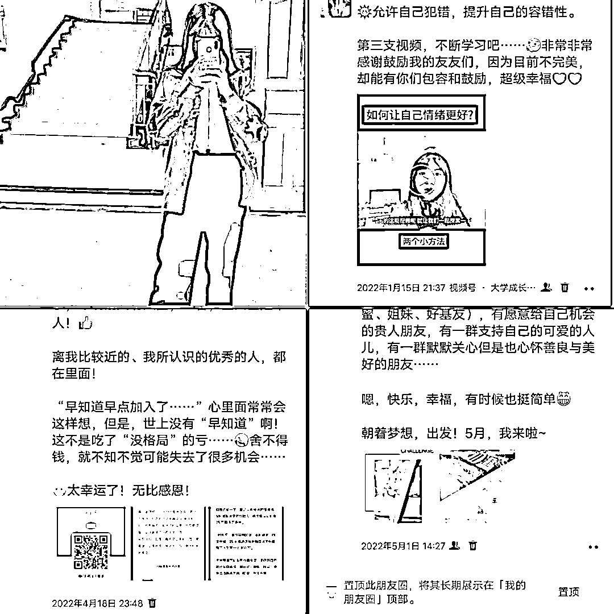

如果你看过我的盖洛普优势，不难发现，我是有“审慎”才干的，创业这么高风险的事，对我来说“危险系数极高”，还是打工更让人安心

为什么从小乖乖女、谨小慎微、厌恶风险的人，突然拿起了创业剧本？

其中一个重要的原因是，当时没有其他可选剧本了。

投资人张哥说：当你觉得自己有很多选择的时候，其实恰恰说明你没得选。

## **大学剧本（1）：学历不突出，放弃考研目标，想靠社会能力博胜率。**

我出生在湖南农村的一个小山村，属于奶奶带大的那种，深受她老人家影响。奶奶带大的娃，基本都会被教导要“真善美”、“好好学习、天天向上”。

秉持着这样的理念，我读书一直很努力，奈何智商一般，属于笨小孩类型，最终以全班第 7 的成绩，考入了本省的十八线小城市的双非二本院校。

（当时我们班主任还说，我这成绩，能考个三本就差不多了。我肯定是不服气的，最终现实结果比他预料的好

就读的高中班是普通班，50 多个人，只考了 7 个二本及以上的，我刚好是最后一个 images.zsxq.com/FvkizSuw0ubBapxkBPqpDeqrGRvN)。）

和大部分高中生一样，刚入校的时候，我还是延续高中的那套，觉得一定要好好学习，通过读研再读出去。

当时规划很好：

大一进学校社团、广交好友、广结人脉

大二听说学业紧张，好好学习

大三开始备考，考研

大四考研结果出来，要么继续读研，要么找工作

但人生从来就不是一条直线，走着走着我开始发现不对劲——为什么会那么迷茫？

后来我问自己：读研真的是我想要的吗？经过一个月，我做了个违背我爸初衷的决定：不考研了。

**当时做出这个决策，是基于这 2 个情况：**

**  **

*①我去了解了一下，之前学长学姐的“天花板”在哪*

_  _

我们学校是双非二本，从二本考到一本，已经是我们往届比较优秀的学长学姐比较好的出路，极少数才能考到重本。

我好不容易到罗马，结果发现人家出身就在罗马，从二本到一本或者好点的重本，真的是我想要的吗？

*②兴趣爱好、优势出发：*

_  _

比起扎进学术深造，我个人好像更喜欢社会实践。

那时心里面有股莫名自信：既然学历上不占优势，那就社会阅历上有亮点吧。同样是两三年时间，这两三年够我摸爬滚打积累经验了。

决定不考研的那一刻，开始疯狂尝试。

## **大学剧本（2）：「知识付费」学理论、混圈提认知，「实践」验证、职业试错**

其实大学每一年我基本都有不同的尝试：

大一花了上万块出去学习，提升自己的底层能力：情商、人生规划、人际沟通、基础商业……

（不是有钱，我家其实没啥钱，甚至从小听到的最多的一些话就是“穷”、“没钱”之类的，所以其实是有匮乏感的

但是：

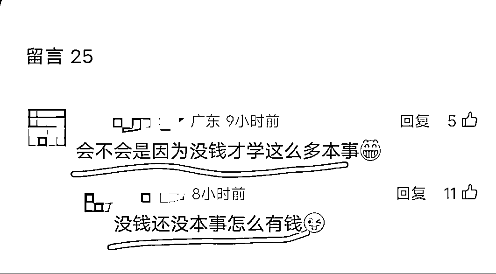

**不希望自己什么事都拖，**

**  **

当时做出要花很多钱出去学习这个决定的时候，我问了自己一个问题：

这个东西，我真的想学吗？如果过一年我还是想学，那早学和晚学，哪个成本更高？

问了几次，答案都是：想

那就不犹豫了，哪怕没钱，也厚着脸皮跟我爸打了个电话，说我真的**想出去学、出去看看、见见更大的世界**

**  **

他一度怀疑这个是不是骗人的、诈骗之类的，但拗不过我，后来还是去了。）

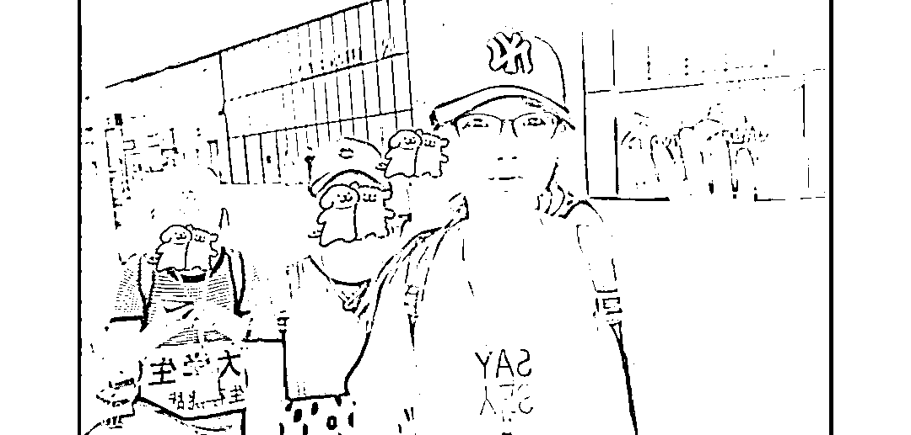

（大一暑假出去学的，当时的街头实验，担任小组长带组员完成任务）

大二提前职业尝试，通过 HR 小姐姐内推，找了份房地产销售，一个多月快速试，判断清楚自己是否真的合适

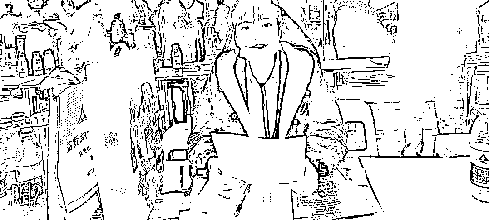

（这个图片其实很有意思，当时口罩期间，房地产公司在广州，招聘会在湖南，来不了，就让我当个临时 HR，大二去面试大四的，hh）

至于为什么那么想尝试销售，是因为当时有个想法要印证：我爱说话，所以天真地认为，爱说话=适合做销售

大三通过知识付费，线上混圈，降低了链接人的成本，遇贵人获得了线上兼职的机会，打开自媒体的大门

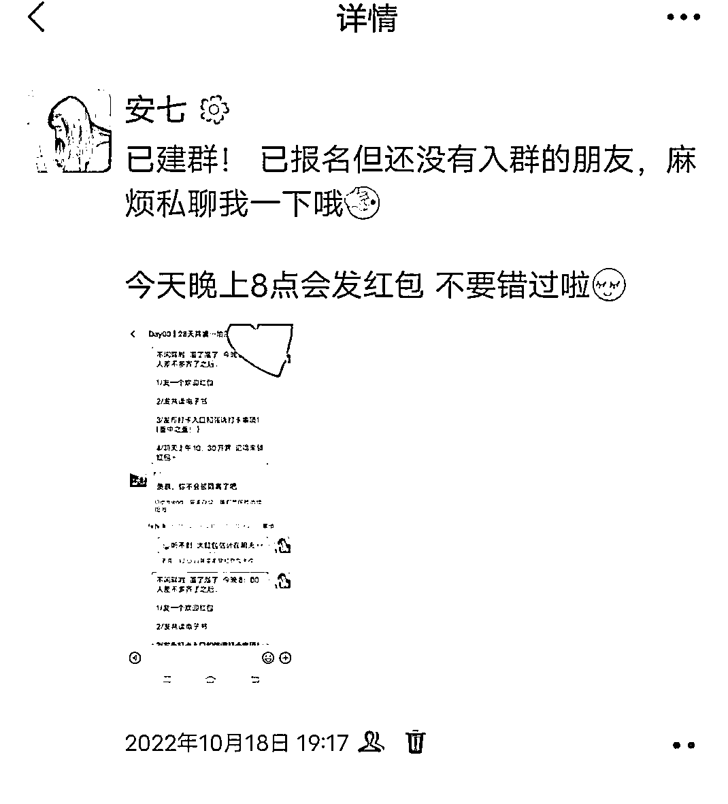

（当时负责社群运营）

大四毕业开始创业，到目前已经创业一年多……

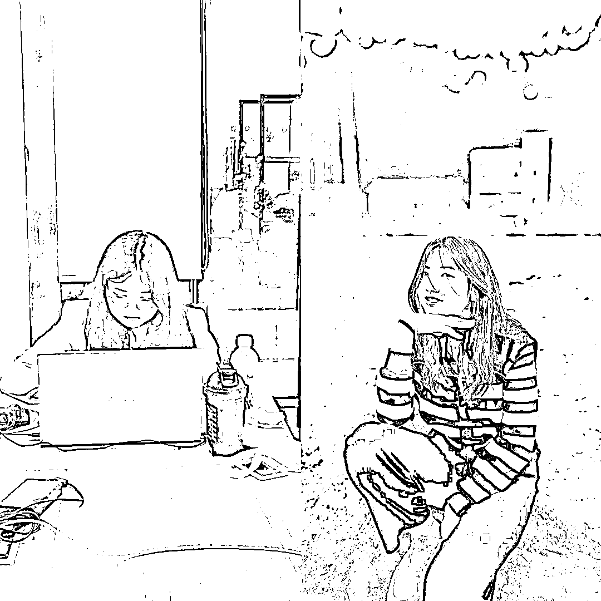

左边是开始创业，右边是创业前（创业前多标准哇，创业后更“福气”了）

每一年都在折腾、试错。

好的方面是，大学时期有足够的试错成本：有时间、没压力

不足的方面是，还是没有意识到**圈子** 的作用，很多坑要自己去踩一遍才知道或记得，而其中有些，可能就能避免。

但整体来说，是比较满意的，因为这是那个时候的我，基于那个时候的认知和资源，能做出的最好的选择。

## **大学剧本（3）：社会教了我一课，挨打、创业**

前面说，我的梦想一开始是成为高级打工人，创业其实是“被逼上梁山”的。

事情起因其实很小、很简单，就是：

当时怀揣着期待投了一个项目，结果项目黄了，大学时期辛辛苦苦、扣扣搜搜省下的两三万块，全部打水漂。

发生这件事的时候是大三下，原本的规划是利用这笔钱做个毕业缓冲金，手里有钱心里不慌，结果一下子破灭。

去👮‍♂️局报案，👮‍♂️叔叔瞥了我们一眼，然后口头教育了一下，就没然后了，把我们赶了出去。这也是我真正意义上，第一次被社会教育。

（坐在警局的椅子上 眼里是无措）

现在云淡风轻地说出来，当时内心其实也承受了比较大的压力，都不知道也不敢和家人说。23 年的春节，一家人聚在一起聊天的时候我都不敢多说啥，如坐针毡。

两三万的存款，对一个大学生来说，无疑是全部的身家性命。

（事实上，当时作出这个决策的时候就是错的和愚蠢的——

怎么能把全部身家都赌上？基本的**风险意识** 都没有，应该要做**下行风险有限，但上行空间无限** 的事。）

没钱就要想办法搞钱，但搞钱二字对当时的我来说非常陌生，过往接触的教育、人群，都没有一个是说要怎么搞钱的，所以脑子里的搞钱可选项不知怎的，就变成了“开家餐饮店”。

后来就是在打算开餐饮店的过程中，遇到了天使投资人，然后一步一步“攻略”，

具体的情况在这里，就不再赘述啦（点击篮字即可直达）：

[`t.zsxq.com/66ApJ`](https://mp.weixin.qq.com/s?__biz=MzI5OTE2OTY1Mg==&mid=2247486663&idx=1&sn=191433cdb8f5cc4402cc6b7eb9ef6298&scene=21#wechat_redirect)

所以人生就是很神奇，**常说要逆天改命，实际上改的是自己的行为模式。能吸取教训，改变行为模式的人就是改写了命运。**

# **02**

# **创业新兵、非典型创业者，创业路上都有哪些挑战？**

前半部分，是对拿到创业剧本的回顾。

从这部分开始，会尽量还原一个**非典型创业者在创业路上会遇到的挑战、场景** ，从创业者身份角度，和大家分享一些东西。

**温馨提示：** 由于个人创业体质有差异，所以可以看，但请勿过分带入，要因人而异哈。

投资人张哥说，我是非典型创业者。

## 典型创业者的特征，包括但不限于：

1. 敢于冒险

2. 有梦想

3. 能折腾

4. 不怕失败

5. 善于学习

6. 解决问题的能力

7. 领导力

## 但我不一样，甚至很多方面都是反着来的：

**1.有情绪**

**  **

我是一个比较容易有情绪的人，比如：

黑粉骂我，我会很生气甚至伤心，想哭；如果学员太执拗，一根筋说不听，我会头脑混沌，生气；

和谁发生矛盾了，我也会不开心；被客户夸了，我也会开心一整天……

办公室的其他创业搭子说，我是一个喜怒形于色的人。但他们蛮照顾我，用词是：**真实。**

**  **

这点很神奇，之前会以为：因为是女生，所以会这样。但后来看到了有尔，我发现并不是这样，她是雌雄同体的。

不过也像投资人张哥说的那样吧：**一个人的优点，也是他的缺点。**

**  **

如果我没有情绪、对情绪捕捉和感知、甚至包括表达都很淡，那就写不出能打动人心的文字。

所以从这个方面来看，我有情绪是正常的，只是要修炼那个**度** 。

毕竟，没见过哪个正儿八经的创业者整天为关系而发愁。

对强大的创业者来说， *情绪是工具，是给别人看的，而不是影响自己的* 。

**2.不自信**

**  **

这点很神奇。

天使投资人说：我就搞不懂了，都让你拿到结果了，还是你自己做出来的结果，为什么还不自信？

朋友说：按道理，你 00 年的，今年 24，创业一年多，能靠自己和有人指点，正儿八经的赚到 7 位数，还有什么好不自信的？

创投机构出来的老总说：你这个年龄，已经超过了 90%的同龄人了，很优秀

搭子说：你想啊，你 24，不仅养活了自己，还能养活小助理，这不牛逼吗？

我的优势教练说：安七，你其实很棒

……

其实这个问题，至今我也没有想得很明白。

成绩确实是一步步做到的，说造假吧，也不现实。线下见过我的伙伴都知道，我属于有一说一、说不了二的实在人。

那有可能，钱不是我衡量价值的唯一标准？

虽然这方面比较欠缺，也在补课，但好在人是多面的，在关键场合能不掉链子，我觉得自己这点也很棒。

**3.商业认知**

**  **

这个点不是我说的，是投资人的反馈。

有时候他跟我们说个点，说什么什么理论？听不懂…… images.zsxq.com/FnnmWhNz708O4QOZefbC779_ioXS)

所以他会换成我们能听懂的表达，最常用的就是《遥远的救世主》里面的例子（这本书已经成了入驻广州孵化基地之前，必读的一本书，不然没有共同话题。）

讲完了，无声叹口气：商业基础薄弱。

之前不觉得，我也很犟，觉得：没那么差吧？

直到前段时间有个涉及到法律上的事猝不及防的出现在身边的时候，慌了，不知道怎么做，

跟张哥说，他马上打电话，说这事可以怎么做（张哥 os：废话，哥可是经过法考的男人）。又咨询律师，发现真的和他的猜想基本一样。

创业路上，都是坑。一个好的引路人带领，可以规避 80%以上的坑！

前面说的这些，都是**个人层面** 上的。

## 至于这 3 点：**有情绪、不自信、有点弱，是怎么攻克的？**

有情绪这个，主要是有教练陪伴。

我是 e 人，要通过社交获取能量，当我有个可以倾诉的对象的时候，我、就已经处于一种宣泄或者低能量的释放了。

但 *教练对话又不完全是负面的情绪宣泄，他是引导你自己由内而外的去表露一些真实的想法，然后自己给自己设定一些可以行动的目标之类的。*

_  _

对我来说，能把话完整真实地表露出来，把内心最脆弱的一面给说出来，就已经能解决我 70~80%的情绪了

不自信，这个就是不断的做到一些小成绩，慢慢的会有一定的自信积累。

至少在我的专业领域或擅长领域，肯定是没什么不自信可言的，因为我就是做出来了

商业基础这个，要不然就是你平时就有很强的自驱力，去主动的学习和捕捉，要不然就是遇到了事情，倒逼你去学习。

接下来说说，**创业过程中，遇到的挑战。**

**  **

**1.流量挑战**

**  **

我刚开始创业的时候非常顺利，

一是时间踩的很好，去年正好公众号爆文是红利期，不仅自己拿到结果，还带人拿到了很不错的结果，增强了不少信心，

二是我之前有一定流量积累，不算严格意义上的从 0 开始。

当时我的微信好友才 3000 来人，但是做到了几十万的业绩，所以一度让我觉得，创业好像也没有很难？没有想过会遇到流量瓶颈！

投资人让我去做直播，但是我不理解这是在做流量，后来直播这件事，做着做着还是停了，很痛苦。

所以不出意外，走到后面，遇到了流量卡点，老本已经快吃完了，又没有新的流量注入。。。

所以今年上半年其实比较平，转折点是下半年。

在直播陷于停滞状态、去山东学习不露脸直播结果以失败告终后，也许是老天爷偏爱，转折点就在 9 月中下旬——我的公众号，直接爆了！

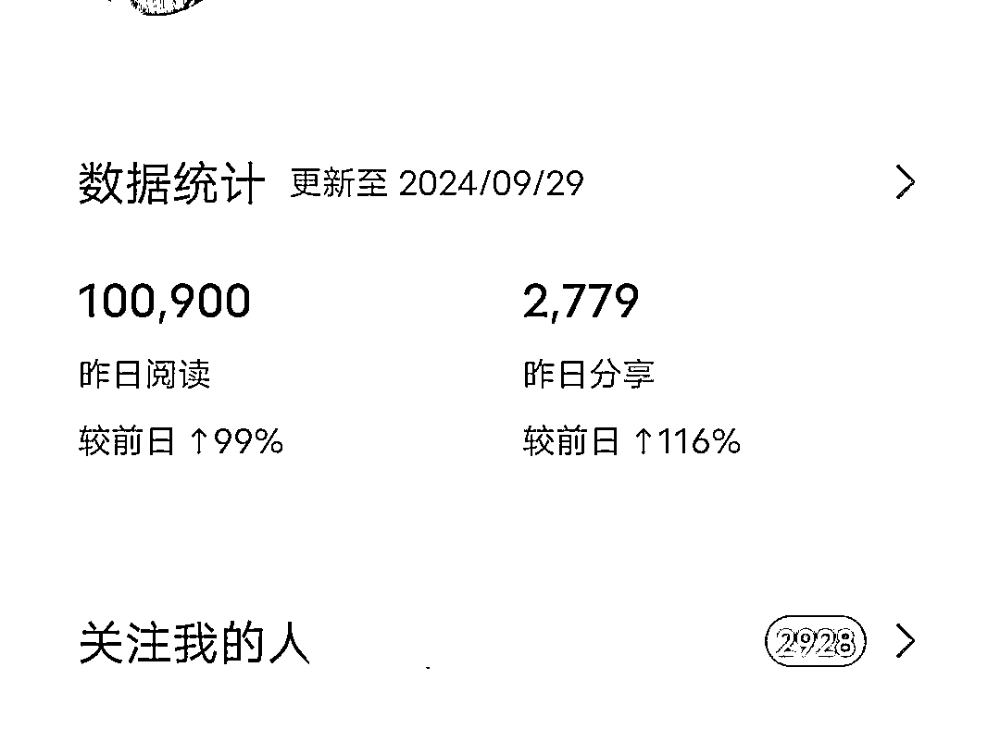

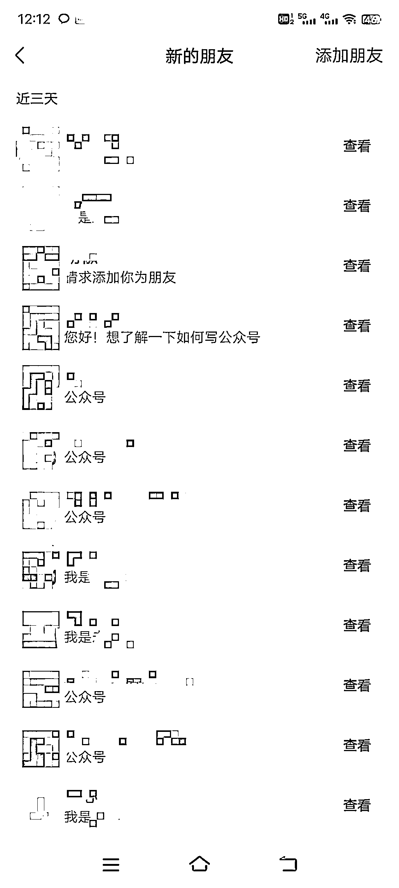

随着我的公众号大爆，这才解决了阶段性流量问题。

（所以公众号一定要做，而且是要认真做。

不一定是赚钱，至少你有个自己的输出、自媒体发表作品、被人看到的地方。）

**2.销售挑战**

**  **

这是下半年解决完流量问题后，接憧而至的另外一个问题。

说出来可能会有点得罪人，我之前的销售业绩，绝大多数都是“被动成交”——**不套路，不群发，靠吸引，不销而销**

**  **

所以我习惯了这种销售方式，但是当加到私域的好友人数飙升、有相当一部分被“静置”、人是多了但产品出单反而没有那么多后，才开始意识到这个问题。

（投资人：说又说不动。）

一开始也想过找个销售合伙人，但是合作下来，发现效果还是有限。

**身为公司创始人，没有谁会比你更适合，当最积极的销售了。**

**  **

雷军老师都那么牛逼了，还时不时出来冒泡，周鸿祎也很有钱啊，但仍旧出来做视频、直播……

所以这也是创业路上，一个比较大的转变。从不好意思卖，到开始大胆卖。

**3.人员管理挑战**

**  **

虽然我是一人公司，但是不代表没有人。最高峰的时候，线上助理有 10+位。

所以那段时间，我又开始请教投资人：“该怎么进行人员管理？”

投资人说：“不用学，你没到时候，那是你一年后应该要考虑的事”

有的方面，时候未到，说了也没有太多效果，所以一边开，一边摸着石头过河。

虽然是线上小助理，但来来走走的，也会让我有点伤感。

一开始都是我自己带，后来没时间，让我的第一位小助理（也是跟我最久的一个姑娘），放权给她来培训其他小助理，别说，带的还挺好。

很多方面也是她帮我打理、协助，特别好。其他两个小助理也可以，有潜力。

# **03**

# **2024 的创业剧本中，我的收获和意难平**

收获

## **1.最直接的：物质上的收获**

这个点很直白，也很直接，是检验创业结果最直接的标准。

就像那句：你可以假装努力，但结果不会陪你演戏。

虽然，创业路上被吐槽了很多、自己也崩溃过一些时刻，但好在付出有收获，没有辜负张哥设的标签：**“应届毕业生，一年双百万”** （百万爆文+百万营业额）

收入组成主要有：公众号平台流量主收益+训练营收入+搭子合作+自营+分销……

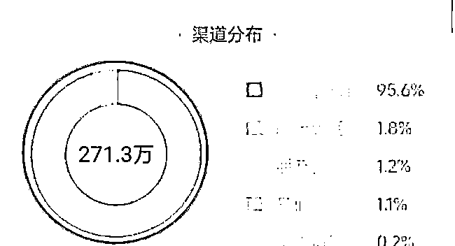

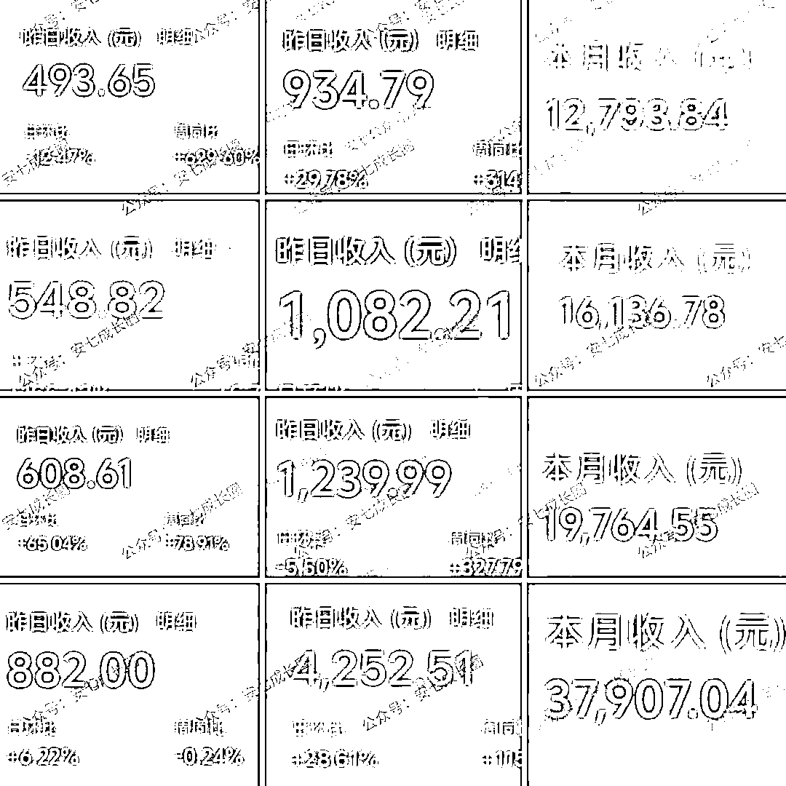

## **2.顺利进入「生财航海家」，这是创业上一个台阶的标志。**

生财有术星球有几万人，里面有很多很基础、入门的玩法，干货教程

但也有一个比较隐蔽的圈子：航海家

这个有门槛，不是是星球里面的伙伴就可以入，而是你得有正儿八经的业务、一年创收多少、规模如何……递交申请，审核通过才能进。

今年很开心的一件事就是：成为了生财航海家、还被邀请去杭州生财线下成为夜话官，分享小绿书玩法主题！

之前觉得遥不可及的，现在都在逐一实现，

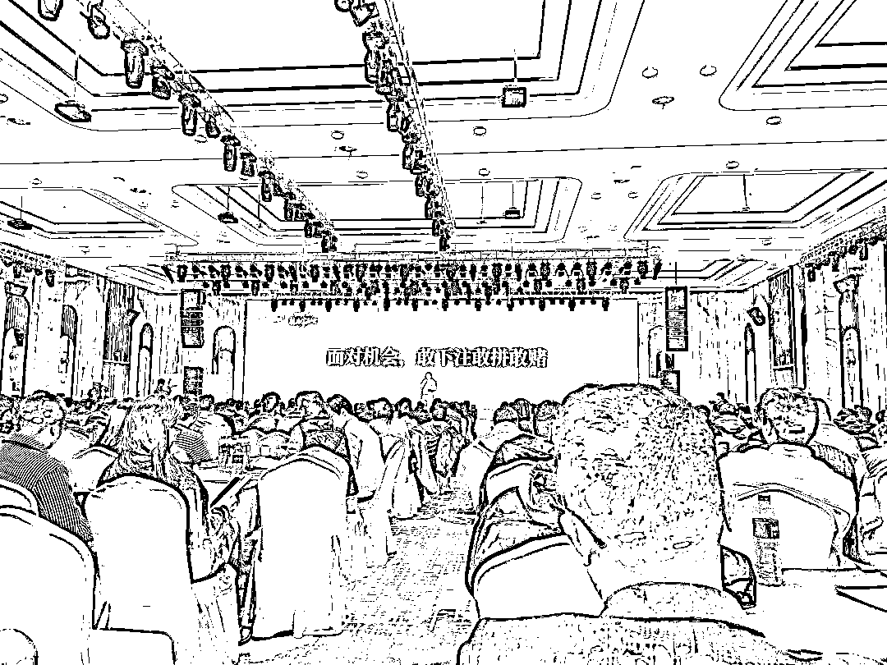

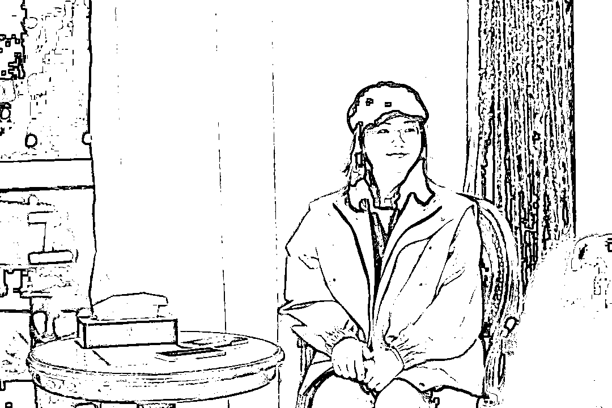

今年还当了 2 次航海教练，一次**公众号** ，一次**小绿书** ，**带领了几千位学员从 0 到 1** ，都是很棒的一次体验。

成功晋升，资源接触的更多。

## **3.认识了更多贵人、朋友**

之前有朋友帮忙算过，说我适合跟别人合作，贵人运不错。

啊哈哈，我觉得还是比较准的。

两位天使投资人肯定是人生中的大贵人，除此之外还有很多贵人、朋友，比如：

我的优势教练朱教练（从 3 月份教练开始一直陪伴，14 次教练对话，把我从一个很“小”的状态，慢慢养成了一个“大”一点的状态，让我有能量把自己重新养一遍。）

亦仁（创办生财，里面有海量资源，让我少走了至少三年弯路）、

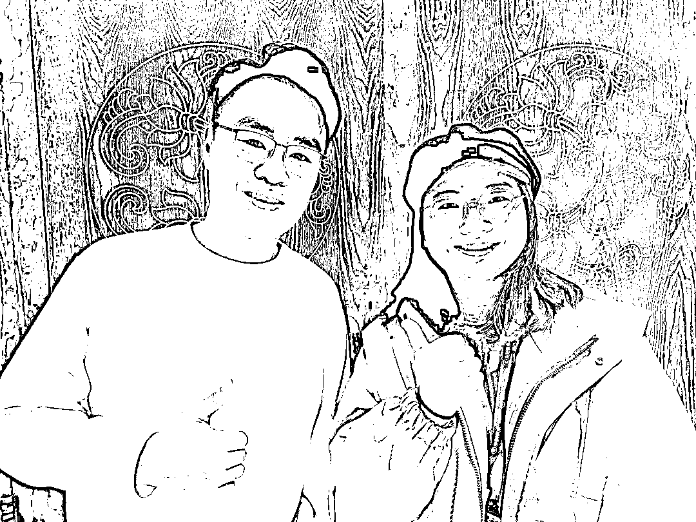

（左为亦仁老师，右是我）

坤汀哥（615 圆桌，也是正式和航海家群体接触的第一次）、

许老师（感谢许老师带来小绿书的信息差，下半年最大的一个机会之一）、

肖肖和 Erik 老师（感恩肖肖推荐！感恩艾瑞克老师线下很耐心细致地教学，可惜没学出来，还是有点小惭愧。

但是 9 月份去山东线下真的好舒服啊~听说是最好的时间。）

秀儿和子安（很喜欢漂亮大气的秀儿，子安年龄也很相近，能一起玩）

这是线上的、同类型圈子的

线下，同学同学也有我的贵人朋友：凳子（一直陪伴，是我最好的合伙人）、姐妹、鸡汤（无条件挺我，精神搭子）、好基友（地理位置最近的搭子）……

## **4.创业，让我重新把自己养一次**

和很多 00 后一样，我的原生家庭也有残缺。

我从大学开始经济独立，很大一部分原因是被逼的——读大学的时候，我一个月生活费是 1000/月。

但是我爸喜欢打牌，总没钱，没钱就容易拖，给的时候会“不情不愿”、无意识地嘟囔一句：“怎么这么快就用完了？”。

那个时候有种“寄人篱下”的感觉，**没有经济权就没有话语权** ，很多方面都受限，所以发狠一定要自己能赚到钱。

**真正让我有意识开始，向内探索、成长，还是创业。**

**  **

因为**创业要的素质太多** 的，不可能所有都是外界给你的，一定是**由内而外** 的。

但是这个由内而外释放能量的过程中，我发现自己并没有那么多能量能源源不断，它也经常断供，所以**一边赚钱，一边养自己的内在小孩。**

**  **

甚至有时候我会感觉，自己在一路升级打怪，在搜集**“灵魂碎片”****。**

**  **

从一开始的不知道“我”是谁，到因为一些原因，不得不补课学习，接触更多人、事，开始**内观自己** ，

有痛苦，有快乐，但好像都在拼凑自己的灵魂碎片，让自己变得更加完整。

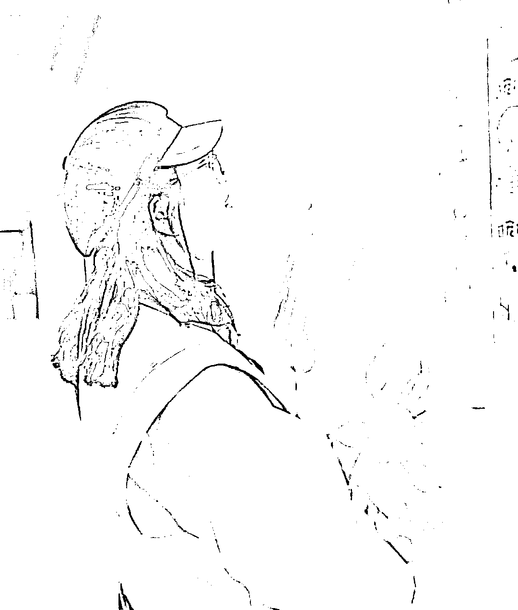

这 4 点，应该是收获最多的。

## **创业路上的意难平**

当然，也有创业路上的意难平：拉朋友上路，结果“坑了”人家。

24 年 3 月，去了趟深圳，见了两个女生。没想到，把人家带过来一起创业了……

后来，创业几个月，她们俩都走了。现在怎么样，我也不知道。但是能感受到，第一次创业拜拜，对各方面打击都是有的。

她们俩离开团队的时候，我花了一段时间才缓冲过来，那段时间内心有股悲伤感，半开玩笑半认真地说：

做年复盘的时候，如果要写关键词，我一定会写上**“失去”** 这个词。

失去了一段关系，失去了，刚开始纯真、随意泛滥善良但不懂克制、设置边界感的自己，

开始更加小心谨慎，有边界感，**不让人随意进入自己的世界，也不轻易走入别人的世界，尽量不沾染他人的因果。**

**  **

创业真的不轻松，女生如果有得选，千万不要随意做决定创业。

# **04**

# **广漂 1 年多，一人公司接下来 All in 的方向**

如果我这家一人公司能继续运转下去，那接下来 All in 的大方向是：**AI+写作。**

**  **

AI 时代已来，写作又是自古都有的，加上我也比较喜欢写，而且已经做了一年多的 AI 公众号爆文基本盘了，出于这几个方向的考虑，应该是会继续加大这方面的投入。

**一方面，** 会继续招募和筛选学员，这是我的产品，也是现金流的一部分；

**另一方面，** 努力把自己做成一家更有使命和社会价值的公司，

比如能提供一些岗位，能帮一部分有技能有才华的人解决创收问题。

最后，分享最近看到的一段有感触的话：

*很多人跟财富擦肩而过是因为，遇到机会的时候没有拼尽全力，没有机会的时候拼命折腾。*

_  _

*所以，丰年存粮，在顺利的时候不要喊苦，多积累资本。*

共勉！

这篇文章，提笔于 2024 年 12 月 17 日凌晨 1：01，最终落笔于哪天？不知道。

本来是想生日前发出来的，但是又好像太早了点，因为没到 12 月 31 日，不是一年的结尾。

所以打算提前写，写好是哪天就是哪天吧。（你能在**评论区** 告诉我，是哪一天看到它的嘛？）

如果看完觉得还不错，可以点个**赞+******♥*** ***告诉我哦，祝你******2025 发财、平安、喜乐**

 emoji/res/v1.3.10/assets/Expression/Expression_67@2x.png?tp=webp&wxfrom=5&wx_lazy=1&wx_co=1)

* * *

评论区：

老彭 : 最近“一人公司”是生财热点哈哈哈

Dubhe : 航海家的门槛具体是多高？[可怜]

雾中观星 : 太厉害了安七教练！

安七 : 哈哈，因为超级个体真的很多

安七 : 8000+💰，还有一些审核标准啥的，具体可以问下鱼丸~

安七 : 一起生财🌹🌹🌹

黄岛主(副业项目) : 加油 ！

安七 : 冲冲冲