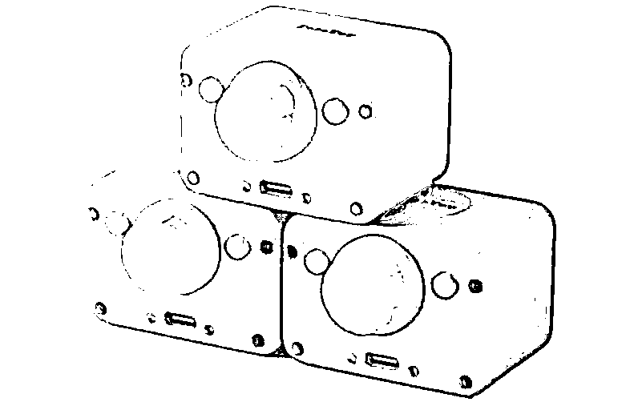

# 2025 年 AI 技术发展及对行业的影响

> 原文：[`www.yuque.com/for_lazy/zhoubao/yrs80s7kqy839qiq`](https://www.yuque.com/for_lazy/zhoubao/yrs80s7kqy839qiq)

## (14 赞)2025 年 AI 技术发展及对行业的影响

作者： 嘉应岛主

日期：2024-12-30

Halo，你好，见字如面，我是嘉应岛主

一位从事短视频领域 6 年（2019 年 → 现在）的 89 年处女座自媒体人

你知道吗？2025 年，AI 技术的发展已进入一个加速期，在未来十年，人工智能的浪潮将席卷各行各业，重新塑造我们的生产方式与生活模式。

根据最新消息，国产大模型 DeepSeek 的关键开发者之一 95 后罗福莉，被小米创始人雷军已开出千万年薪，将就职于小米 AI 实验室，领导大模型团队。

根据 Gartner 的研究，到 2025 年，AI 和自动化技术将为全球企业带来近 4 万亿美元的新增收入。那些早期采纳 AI 技术的企业，将在未来五年内获得超过 40%的市场份额。机会，往往出现在不被察觉的角落。

通过我跟一线 AI 创业者实际案例的访谈交流，希望带给大家如何使用 AI 去开拓新领域，我将从政策文件中如何发掘创业机会，到在 B 端市场挖掘潜在金矿，AI 与硬件普通人可以怎么切入等来聊。

无论你是想参与 AI 技术迭代，还是寻找与 AI 合作的商业模式，或许在这篇文章中，你将找到你自己的创业方向。

**从政策文件中挖掘 AI 的商机**

**01.AI+政策**

**我这里是希望大家可以从 AI 政策里面挖掘商机，务实去满足需求而不是仅仅去拉资金搞噱头，这轮不到我们普通人。**

这块其实我访问了一位某建筑科技公司的朋友—陈工，分享了陈总是如何从政策挖掘商机。

“2021 为了创业，我先去看了国家政策这块。怎么去看呢？我会从我的城市—广州，我的行业—建筑工程的，从而找到广州市住房和城乡建设局。然后去搜索行业关键词，那时候我搜索的是—海绵城市”

“然后找到通知中的需求，要求各项目建设单位需要把海绵城市评估落实”

陈总看到文件，春节后就开干

他实地走访了广州大部分工地倾听需求，给出解决方案

他认为”**解读政策文件去创业的时候，首先你要看是否有市场，是否硬性要求，是否有硬性门槛，是否具备专业能力？其次你要标准化产品，能够向客户清晰得描述你的产品，服务，价格。** 最后创业者其实是个销售，每一个小型创业者，小企业家，本质是一个销售，需要对公司的订单和营收负责。所谓形成自己的品牌，其实品牌是干出来的，积累出来的，不是包装出来的“

我与 ChatGPT 和通义千文都去谈话，给大家顺着陈总的思路，去挖掘如何找到相关政策去做 AI 的创业。

大家也可以试试，找到自己所属行业的政策机会

**我们找到共性的地方，其实就是广州市科学技术局**

**从 B 端市场中找到 AI 的机会**

**02.AI+B 端**

**这里我是希望给在 B 端掘金小伙伴们说，是个机会，因为 AI 现在还在持续迭代，那么跟 B 端企业的在 AI 这块深入合作去大有可为。**

**精华点一：不懂技术没有行业经验的人可以进入吗？**

恰巧我的身边就有一位朋友，他是不懂技术的的互联网人，在网易工作过，他觉得 AI 在绘图和视频会有第一波机会，其中电商是离得近的但也是比较卷的，他选择了游戏领域的 AI 绘图，并且用了几个月时间去跑了游戏公司展会，与中小游戏公司聊了需求，立马在广州招聘技术去做。

还有个朋友陶威他不懂 AI 也不是儿童教育领域的人士，他在 2023 寻找 AI 赛道。众所周知 AI 的文生图效果很好，他排除了 AI 电商，AI 游戏,，AI 视频，试着结合儿童绘画教育。所以花了一年时间找了 100 家儿童美术教育机构合作，收集他们的需求，然后给到央美专家去探讨，由专家顾问确定了儿童美育行业的痛点，儿童本身学习过程的痛点，美育教师教学的痛点去给到 AI 技术团队，由此诞生了智子视界—专门给儿童美术机构提供 AI 技术支持的。如此而言其他培训机构是否也可以？

**精华点二:为什么 AI+B 端有机会可以挣钱？**

2024 创原会年度技术峰会上记了一组数据「在中国，制造业还是经济核心，在联合国定义 666
个小的产业中，中国是全球仅有的各种产业门类都齐全的国家，而且这之中有 220 多个行业是全球第一的，中国的制造业规模连续 14 年独占鳌头」

不少服务 B 端的 AI 工具目前在低调赚大钱，一旦公开，大厂入场就可能碾压了这些 AI 工具。我认识的是科荔智能
CEO，他接的是 50W 以上订单的企业 AI 服务方案，例如跟汉森软件（个性化提供打印设备的公司占据市场大半）合作服务后端 AI 工具库，作用是该企业下游数千家柔性工厂做产品设计和商品自动化上架，当然期间就能沉淀数据。

除此之外还有一个典型的案例就是「极睿科技」一家做**电商零售领域 AI 应用， 内容代制作版块签约迪桑特 AIFashion 客单价突破 50w。**

**李开复说：“2024 可能是 AGI 时代的起步阶段，可能类比移动互联网的 2009 年的阶段，很多东西需要更多的探索。**

**关于世界各地的情况，在技术认知度上，美国处于领先位置，中国紧随其后，而中东和东南亚市场对整体市场的理解仍面临较大挑战。**

**2023 大家都基于 Scaling law 考虑，要弄更多的 GPU，去做更大的模型。现在很清楚的是，应用时代已经到来 。”**

AI 编程让普通人也可以参与制作工具

**03.AI+出海 工具 APP******

**出海是 2025 的主旋律，那么在除了电商出海，被人忽视的是工具出海。这里的工具我主要聊的是 APP 订阅式的，是几万创业资金可以启动的市场****。**

**(前言,小猫补光灯 APP 就是一个不懂技术的人,前后花费两周时间,通过 AI 工具—Cursor 写出来的一款极简的付费 IOSAPP)**

我专门寻找了西安桔子互动软件 CEO--Jason，他公司主要深耕 APP 订阅工具出海应用领域。

#### **精华点一:对于 APP 出海的人你会有什么招数帮到他们？**

#### 在 APP 订阅服务方面，我们也有做自己的产品，名字叫“订阅宝”

，算是一个 paywallscreens 的一个超级版本吧。为什么这么说，因为 paywallscreens 本身其实只提供了一个竞品订阅设计参考的服务，而我们订阅宝不仅会查看到竞品的订阅页，还能查看订阅的录屏，甚至还能查看历史版本的订阅页截图，每个版本的订阅截图对应的产品的订阅收入数据、以及 ARPU 值都有展示，这样的话，我相当于帮开发者们去筛选了竞品做的比较有效的订阅策略，这样能大大的节省他们的时间和测试成本，当然了，我们也不能完全去参考竞品，那怎么做呢，在现阶段，我们仍然可以把得到验证的订阅截图使用上，和现有版本来做 AB 测试，这样应该可以确保更好的效果。

**精华点二国内做 B 端 APP 订阅付费服务，有可以演化去国外上架的吗？**

万物皆可出海！尤其是这类 B 端服务的工具，还是非常出海的，因为开发者的需求往往具有通用特征，如果工具有一定通用性（比如做了多语言支持、兼容常见技术栈），也更易在海外落地。

#### **精华点三:AI 如何支持您公司可以在初创阶段在低资源、高竞争的环境中实现产品的快速迭代和市场占有率的提升？**

在我自己的整个工作流程中，有无数个会用到 AI 的地方来帮我提升效率。

比如，在我充当产品角色的阶段，我的原型图，我会使用 MasterGo 自带的一个 AI 生成 UI 的工具，几秒钟就可以帮我完成一个原型的设计。

在我充当文案角色的阶段，ChatGPT 又会变成我忠实的助手，它的思考比我全面，表达比我通顺流畅。

在我充当产品运营时，AI 又会帮我去回复我回复不了的邮件，靠它我才能用流畅的英文来说服苹果的审核。

而对于我们整个公司而言，只是我自己的效率提升是不够的，所以在此基础上，我要求我的同事们也必须使用 AI，做 logo 用 AI，画插画用 AI，做 ASO 用 AI，客服我们用 AI，投放素材同样也用 AI，可以说是无处不在。

当我们把公司事务中的很多环节用 AI 来做以后，我们的时间就可以更多的放在那些无法用 AI 替代的事情上了，效率自然会提升很多

**从硬件市场中寻找可以合作的机会**

**04.AI+硬件**

**这里我是希望给在 观望 AI 的小伙伴们说，AI 是下个十年，既然打不过 AI，那就去找到扎实往 AI 发力的公司加入吧**

**跃然创新联合创始人—高峰说，“国内在硬件制造有很强的供应链优势，以自身为例，硬件生产周期可在一个月左右即可完成。”随着“AI+硬件”的深度融合，AI 玩具目前被视为是大模型落地的最佳场景之一。**

智能硬件制造企业，他们没有算法，没有 AI 研发团队，创造 AI 产品的难度很高，但**AI+逐渐成为主流，市场需求量会越来越大，能诞生了很多市场机会。**

Pika 魔镜产品初代样品的在硬件研发和生产过程中 ID 或者 MD 存在缺陷，导致模具和组装过程中出现大量不良。供应商选择方面很明显缺乏经验。有着与小米合作供应链多年经验的 Harry
Lin 加入之后，「柯南 AI」把供应链梳理完毕，品质产品生产、交付问题已经梳理清楚，**产品成本下降了 30%，量产良品率达到 95%以上，成功把 Pika 魔镜推出市场，Pika 魔镜在发布后仅一个月，便获得了 2 万台的预订成绩**

****

**“传统行业的人很难做 AI，大模型企业很难结合制造，我们可以通过软硬件的孵化器和研究院的方式，将两边资源拉齐，为儿童教育品牌和工厂提供 AI 软硬件的各种方案。”Harry
Lin 表示。**

**说到这里，我们怎么介入？**

**那么 AI 硬件团队的公司需要供应链经验的人士，需要推出市场的人士，需要擅长安排培训整体框架和执行流程的人士，举个例子就像我这么一个擅长做短视频 IP 的人可以怎么做？其实就是加入他们，基于「柯南 AI」给 AI 赋能儿童教育方案商，给一个个 AI 厂牌主理人拍摄他们的视频，让 C 端看到产品，让 B 端看到解决方案，还能在 AI 前期站稳视频关键词在国内外沉淀下来传播。在 AI 接来的十年，你可以把 AI 作为工具，也可以把 AI 作为职业的第二方向去准备。**

**而 2023 年 7 月成立的 AI 玩具公司 FoloToy，一方面通过 IP 联名推出了 AI 向日葵，AI 火火兔、AI 仙人掌等产品，优惠后产品价格在 250 元至 400 元不等。**

**另一方面开发的 AI 大模型对话盒子 Magicbox（魔匣），集成了豆包、通义千问、月之暗面、ChatGPT 等大模型，可以把它安装到任何玩具上，让不同的玩具都有智能化的“灵魂”。而且 Magicbox 产品在 C 端的累计出货量已有近 2 万台。**

**原** 滴滴造车项目产品负责人——孙兆治成立了上海珞博智能科技有限公司。孙兆治曾在受访时提到，他之所以专注且看好年轻女性赛道，是因为 AI 情感陪伴类产品重度用户就是 Z 世代的女性。实际上低龄用户黏性、留存和长期付费其实都不太乐观。珞博智能主攻年轻女性 AI 陪伴产品，明年据此推出“AI 潮玩”。

亿家亿伴创始人郭志“AI 玩具会有很大的一阵风刮过。大风之下，能够留下的，还是那些最懂用户的产品及服务。

* * *

评论区：

嘉应岛主 : 请结合深圳市工业和信息化局印发的《深圳市打造人工智能先锋城市的若干措施》的通知来看，会更有收获感

黄岛主(副业项目) : 叫岛主的 我都赞

嘉应岛主 : 留言的我都喜欢～