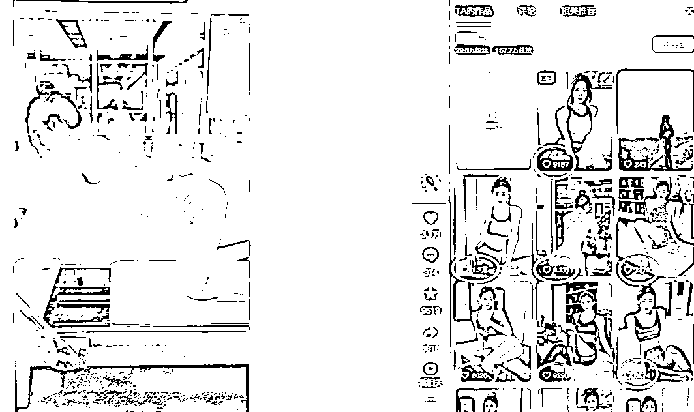
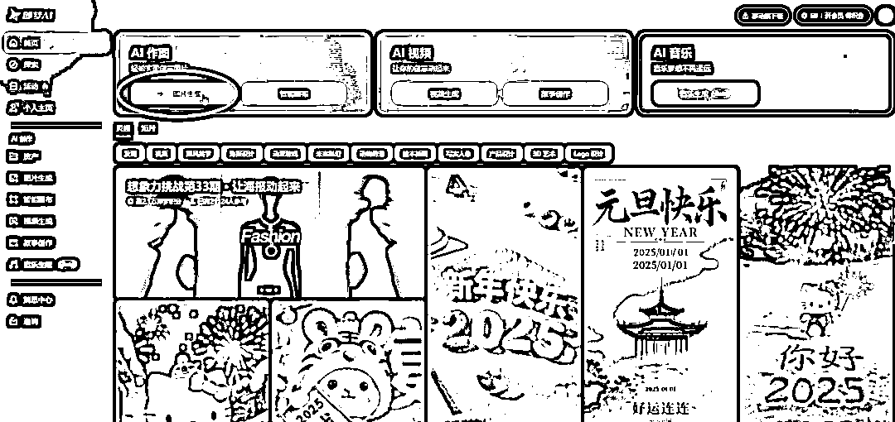
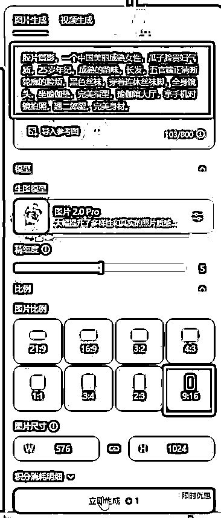
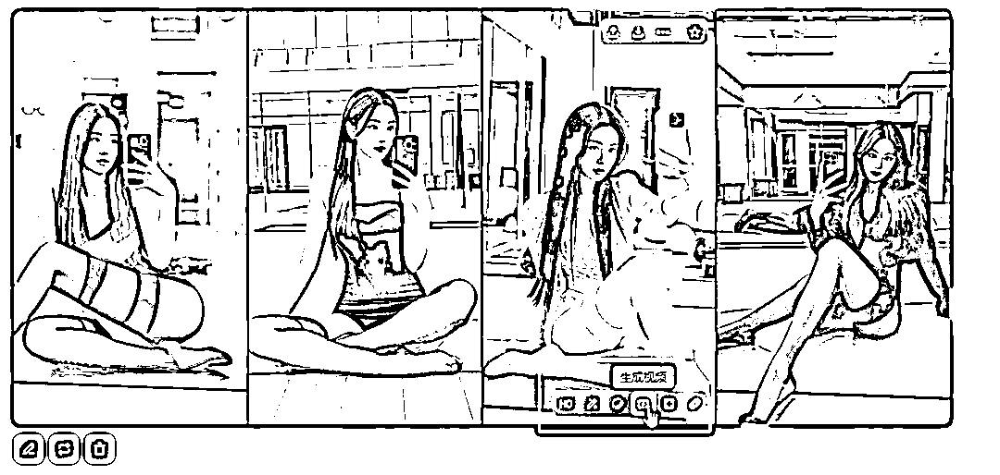
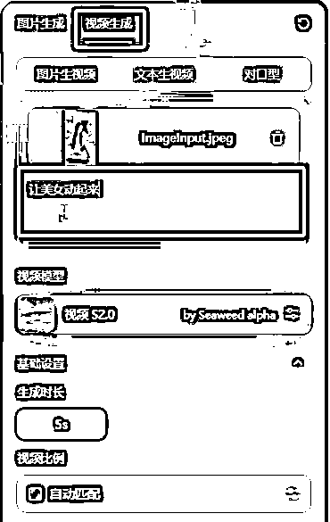
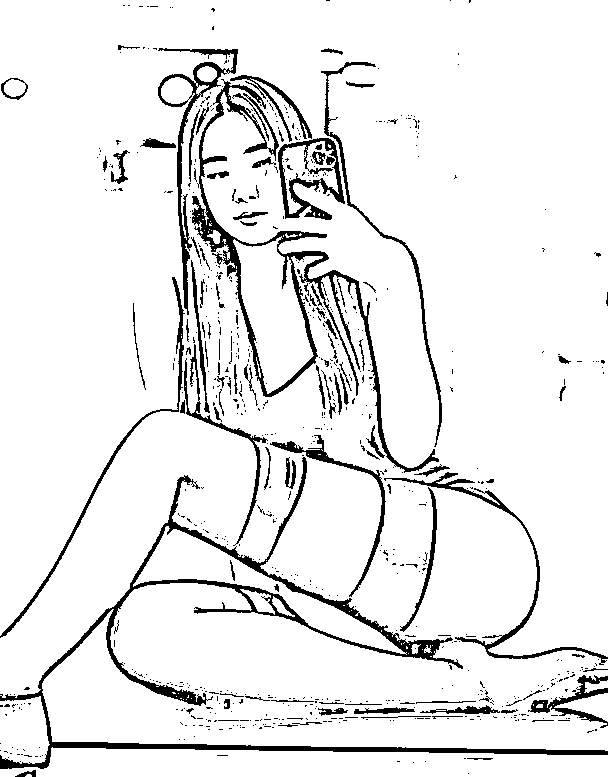
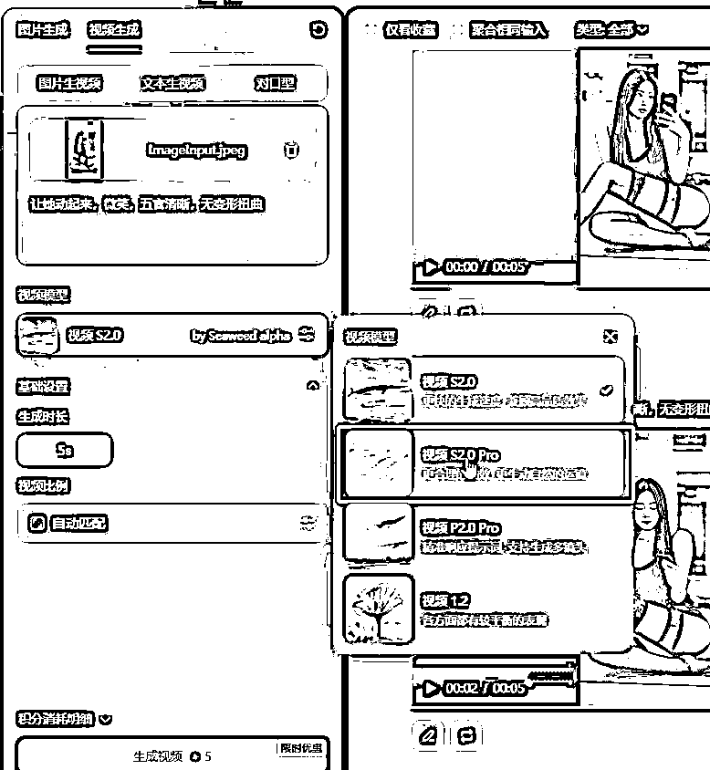
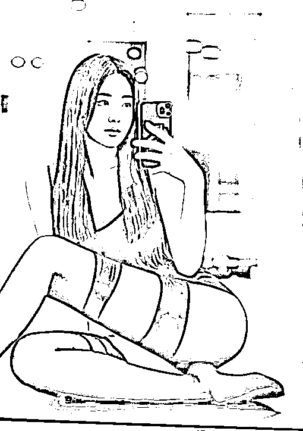
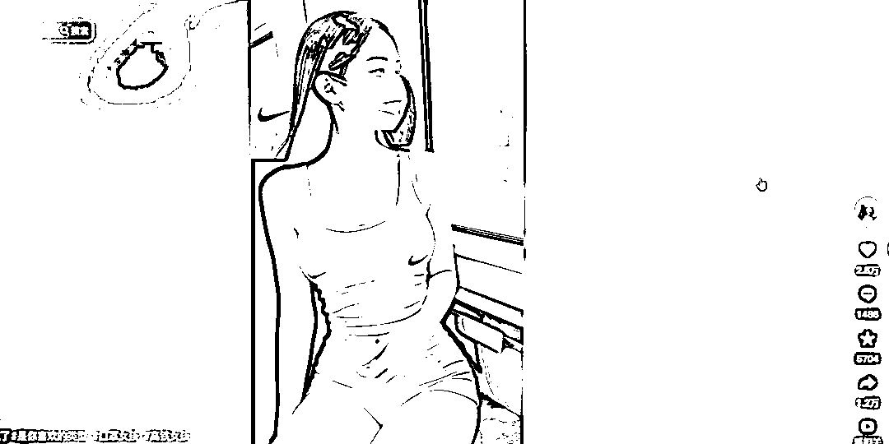
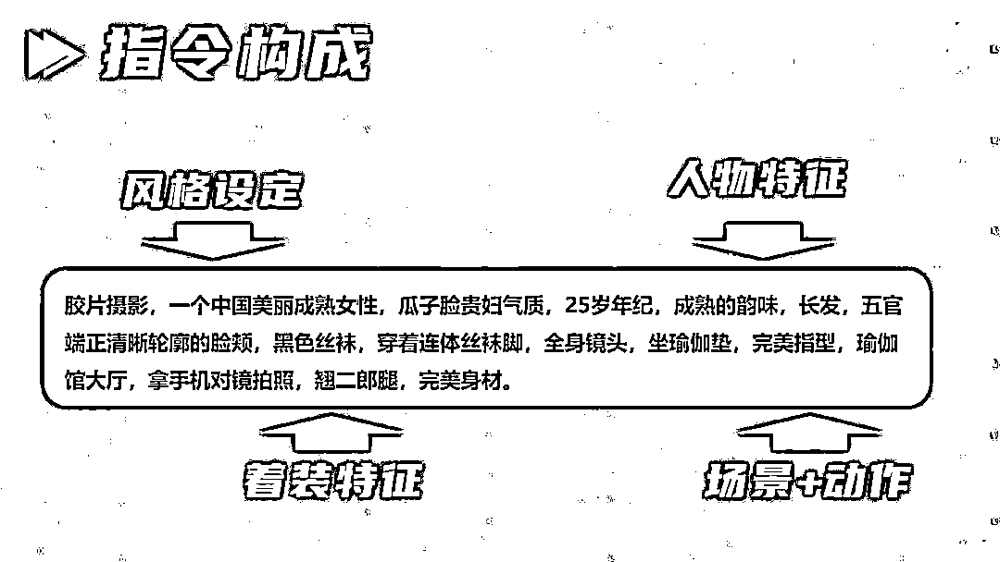

# 又一短视频流量密码，Ai 瑜伽健身美女视频怎么做，教程送给你

> 原文：[`www.yuque.com/for_lazy/zhoubao/karvbvea1se5kla2`](https://www.yuque.com/for_lazy/zhoubao/karvbvea1se5kla2)

## (13 赞)又一短视频流量密码，Ai 瑜伽健身美女视频怎么做，教程送给你

作者： 高鹏圈

日期：2024-12-31

大家好，我是高鹏。

今天继续分享一个热门玩法。

做这样的美女健身视频真的是破圈密码，你看这数据就知道有多火了。

但是你以为它这都是真人实拍的吗？当然不是，现在借助 AI 做这种视频是非常轻松的，看起来跟真人实拍的没有啥区别。

像这种号做起来之后，不管是吃平台流量的效益，或者带货一些瑜伽健身等等周边的产品都是不错的。

首先我们用到的工具就是我们的老朋友，即梦 AI。

打开即梦之后，来到首页，里边有一个 AI 图片，我们点这个板块进去。

然后把我给大家准备好的这个描述词直接丢进去，选择图片的比例，9 比 16，也就是标准竖版视频的比例，最后点生成。

等一会儿之后，这个图片就生成了，它一共给到咱们四张图片。

这四张图其实每一张效果都还是不错，看起来跟真人实拍的效果基本上没有什么区别。

我们从里边挑一张自己觉得效果不错的，把鼠标悬浮在上面，它右下角会出现一个选项，就是生成视频。

我们直接点一下这个生成视频，然后就来到了视频生成的板块。

在下面输入一个简单的提示词，比如说让它动起来，然后点生成。

等一会儿这个图片它就动起来，变成了视频。

我们点开看一下效果，能明显能感觉到，人物的五官有点扭曲，变形。

这个时候别着急，是因为我们选择的视频生成的模型有问题，我们更改一下模型。

因为这个模型默认是 S2.0，我们要把它改成 S2.0 pro，也就是升级版的。

但是 pro 的视频生成相对来说用的时间会长一些，但是效果要逼真的多。

提示词我们也要修改一下，在原来基础上再加一句：五官清晰无变形扭曲，这样的提示词。

等待一会儿之后，点开看一下效果，这次就自然逼真了。

视频没有问题之后，把视频下载下来，导入剪映加一个背景音乐，这个视频就制作完成了。

如果你觉得它生成视频比较短，可以选择生成的时长，或者多次生成之后进行拼接，这样视频的时长就变长了。

用这种方法做的美女视频，它属于百分之百原创。

这就是今天给大家分享的这个玩法的核心，类似的美女玩法还有很多，比如说有一些专门的瑜伽美女。

还有最近非常火的动车美女，在动车上拍摄的美女的玩法，原理都差不多，抓眼球的元素没有变，变的是美女所在的场景。

比如说动车上拍的、瑜伽馆里拍的、健身房拍的等等。

掌握了这个玩法之后，你可以发挥想象力，衍生出很多同类的玩法。

关于提示词，我给大家准备好了，里边的一些细节的提示，大家可以根据自己的想象去做一些修改。

比如说美女的着装、动作以及它所在的场景等等，这些都可以调整相关的描述词。

OK，今天的分享就到这里了。

关于这个玩法用到的工具，以及刚才提到的描述词的修改技巧，还有很多其他的 AI 的相关玩法,统一放到文档里了：[`svj4gxvm0v3.feishu.cn/docx/BW8xduJEwoLyMfxyWe5cEYTbnWb?from=from_copylink`](https://svj4gxvm0v3.feishu.cn/docx/BW8xduJEwoLyMfxyWe5cEYTbnWb?from=from_copylink)

我是高鹏，深耕网创 9 年，这是我拆解的第 705 个落地项目玩法，更多项目玩法，欢迎找我聊聊呀~

* * *

评论区：

早日当上小富婆 : 牛啊牛啊！学到了！

木羊 : [强]