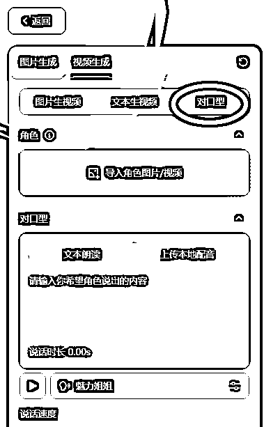

# 一条视频 100 万播放， 经典影视二创 Ai 对口型玩法爆火，教程攻略送给你

> 原文：[`www.yuque.com/for_lazy/zhoubao/rdgiux4c9t59kq1t`](https://www.yuque.com/for_lazy/zhoubao/rdgiux4c9t59kq1t)

## (12 赞)一条视频 100 万播放， 经典影视二创 Ai 对口型玩法爆火，教程攻略送给你

作者： 高鹏圈

日期：2024-12-30

大家好，我是高鹏。

今天继续分享一个热门玩法。

最近这种表情口型都非常自然逼真的对口型趣味视频，非常火爆。

它是怎么做出来的呢？其实借助 AI 就可以搞定，下面直接上实操。

首先我们要找到一个比较有意思的音频，再根据这个音频来进行画面的对口型。

找音频的时候，可以在平台上找一些爆款视频，用他们的音频，当然也可以用一些经典影视剧里人物之间的对话。

比如我找到了这样的一款爆款视频的配音，这个音频我们就可以拿来用。

找到视频之后，我们用到这款工具，把音频提取出来。

然后挑选一个影视剧里边的片段，同步导入到剪映里。

这两个东西准备好，接下来我们根据这个音频的特点，从影视作品里边挑选符合的片段。

这个怎么挑选呢？我们注意听这个音频的特点，比如说挑的这个音频，它最后有一个笑声，而且音频是一个人说的话，不是对话。

所以我们在挑选影视片段的时候，就挑一个人说话的片段就 ok 了。

把这个画面跟咱们的音频进行匹配，把长度匹配好。

然后再把这个画面的大小调整一下，因为像这种影视剧，上下都有黑边儿，而且有字幕。

我们把原视频给它拉大，这个上下的黑边裁掉就 ok 了。

接下来导出这个视频的时候，一定要注意，我们要同步导出视频和音频两个文件。

因为我们后续在对口型的时候呢，这两个文件都要用。

这两个文件导到本地之后，接下来就是对口型了。

用到的工具还是即梦 AI，打开它的首页，在 AI 视频里面找到一个视频生成的板块。

进去之后，它有三个功能，我们要用到的就是它最后一个功能，就是对口型。

点一下这个对口型，然后在角色这个地方点一下，导入刚才得到的视频文件，选择从本地导入。

这个不出意外的话，它会提示你未检测到可用角色，请重新上传。

这个不用慌，检查一下我们的这个视频画面。

因为画面里面出现了多个人物，这个时候 AI 没有办法识别我们这个角色，一定要选择单一的一个。

比如说我们第二号和第三号人物是用不到的，就需要遮挡住，而如果是背对着屏幕的，没有出现人脸的，这个是没关系的。

除了这种背景还有主角之外，其他角色的面部都要进行遮挡。

我们回到剪映里，在出现多组人物面部的这个地方，把其他的多余的角色进行一个遮挡。

用剪映的官方素材库里的黑色画布直接遮挡，调整它出现的时长、大小、位置就 ok 了。

然后把这个视频再次导出，导出之后再上传到 AI，就不会有这样的提示了。

视频上传好了之后，下边紧接着有一个音频上传的地方，就是我们要对口型的音频，把这个音频再上传一下，然后点生成。

可以看到，它已经生成了对口型的视频，里边的人物说话的口型，跟音频已经相匹配了。

但是我们遮挡的这一部分还是黑屏，怎么处理呢？

接着来到剪映里边，把刚才得到对好口腔的视频导入进去，再把原视频导入进去。

把原视频的后半段，就是我们进行遮挡这部分，做一个线性的蒙版，调整 90 度，然后把线拉到对好口型和我们刚才遮挡的这一部分的中间。

也就是实际上，我们把两个视频的片段进行了拼接。

然后把这个视频导出，就是成品的视频了。

像这种号在运营的时候，还有几个关键点给大家做一个总结。

就是前期你可以尝试一些不同的剧去匹配画面，就是不同的剧你不知道哪个会火。

后期的话如果你某一个剧在剪的时候火了，那就可以固定的去剪这一个剧。

比如说我们很多人都刷到过唐三藏大佬，他就是做的这种视频，非常的受欢迎，但是他固定剪的就是西游记这部剧。

对口型所要用到的音频，大家刚开始可以去对标一些爆款的视频，直接用他们的。

因为这些视频能爆，很大原因是因为文案比较攻心，比较有共鸣。

但是我们要用人家的音频，在发完作品的时候，一定要在评论区去声明一下，这个音频的出处，艾特一下对方的作者，不要让人家主动去找你，那个时候你就只能删视频了。

你主动的提出来，你的视频如果火了，也算是给人家带来的一些流量，这个的话一般作者都是同意的。

像这种爆款音频从哪儿找呢？我们关注一下抖音的热榜，像热门视频的音频出来之后，我们第一时间去跟上。

再一个就是要特别注意原创度的问题，因为我们知道你完全用的别人的音频，视频很容易出现原创度不够。

所以在剪的时候，尽量的从画面上下足功夫。

比如说我刚才给大家提到的唐三藏大佬，他的视频全部都做了滤镜，包括特效等等，大家可以去对标一下。

另外在发布的时候也要注意，一定要声明内容由 AI 生成。

这个声明大家可以放心，不会影响你视频的流量。

但是如果你不声明，一旦平台方面开始查你之后，它就会给你限流，所以这点也很重要。

OK，今天的分享就到这里了。

关于刚才提到的 AI 工具，以及具体的操作演示，统一放到文档里了：[`svj4gxvm0v3.feishu.cn/docx/EcNhdm2dWoxc9wxLSuccpMaWnX4?from=from_copylink`](https://svj4gxvm0v3.feishu.cn/docx/EcNhdm2dWoxc9wxLSuccpMaWnX4?from=from_copylink)

我是高鹏，深耕网创 9 年，这是我拆解的第 704 个落地项目玩法，更多项目玩法，欢迎找我聊聊呀~

* * *

评论区：

暂无评论