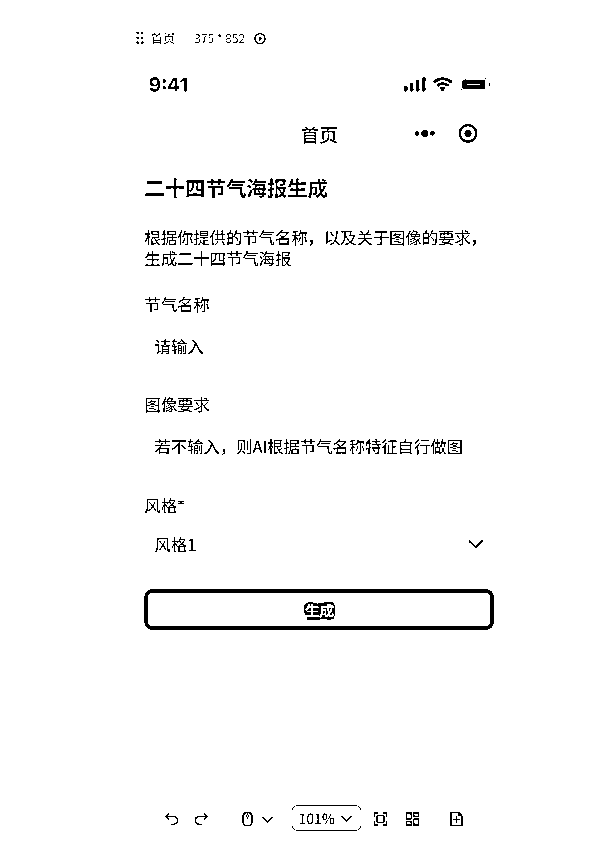

# 喂饭级教程!教你用 coze 做一个微信小程序之二：如何绑定工作流到页面

> 原文：[`www.yuque.com/for_lazy/zhoubao/hg1ve2pog8xbmzer`](https://www.yuque.com/for_lazy/zhoubao/hg1ve2pog8xbmzer)

## (3 赞)喂饭级教程!教你用 coze 做一个微信小程序之二：如何绑定工作流到页面

作者： 陈序员大康

日期：2024-12-30

太好用了，即使不懂代码，通过简单的拖拽，也能轻松构建自己想要的 AI 应用，从此小程序自由了。

上一篇内容，带大家，简单的搭建了个 海报生成的小程序页面，没看过的，请跳转 [Coze 应用实战！如何利用 coze 应用功能，开发一个海报生成小程序，并发布到微信（一）](https://b121w2zgwyx.feishu.cn/docx/XevpdRH0JokjJzxtZ71cvnPMngc)

只有页面，肯定还算不上程序，还需要实现一下真正的功能。

因此，今天的目标是，把首页的 **一键生成海报** 业务逻辑实现，come on！

跳转阅读体验更佳：[喂饭级教程!教你用 coze 做一个微信小程序之二：如何绑定工作流到页面](https://b121w2zgwyx.feishu.cn/docx/K5FMd5t71ojcREx7GFMcVsttnUJ)

# 一、分析海报生成功能

我们先来看一下，上一篇我们设计的海报生成功能页面：

从这张图分析，得出我们总共需要以下几个输入项:

1、节气名称

2、图像要求

3、风格（便于后期扩展各种风格，教程只做一种）

由于我们后续还有个历史生成记录的显示，所以我们最终需要的输出内容为：

1、一张海报图片

2、节气名称

3、生成时间

为了便于大家对于工作流的理解，我先展示一下我海报的效果图：

* * *

评论区：

暂无评论