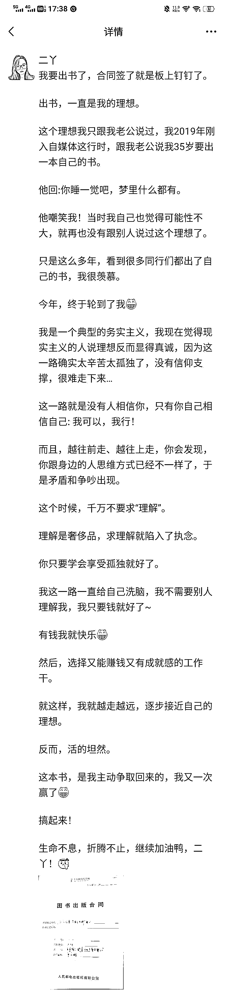

# 在公众号做女性成长号主，宝妈的私域起号样例参考

> 原文：[`www.yuque.com/for_lazy/zhoubao/fmguqm5rrxg0ilhg`](https://www.yuque.com/for_lazy/zhoubao/fmguqm5rrxg0ilhg)

## (26 赞)在公众号做女性成长号主，宝妈的私域起号样例参考

作者： 二丫吖

日期：2024-12-30

大家好，我是二丫。

我的互联网标签是：

一、大专学历，本职工作是互联网公司的项目经理，打工 5 年在上海买房落户

二、大专学历，通过有效相亲，找了个硕士队友，娃 7 岁

三、靠副业做自媒体，做到了百万营收

四、勤勤恳恳写文章，终于，成为了一名新晋作家，我的新书明年会上市

正好也到年底了，跟大家汇报下我的最新进展：2024 年，我的自媒体收入流水跑了 100 多万，加上我本职工作的收入。一个从湖南大山里走出来的农村女孩儿，在 34 岁这一年，首次做到年入百万。

耶！！

好，我现在给大家呈现的这个自我介绍，是「结果」。

年入百万的结果，很多同行都拿到过，尤其在生财有术这个人才济济的圈子里，优秀同行非常多，我的这个成绩其实在一众同行中并没有很突出，因为今年其实是我写作的第 6 年了。

在前 4 年，我一直在自媒体这行给大 V 打工，2022 年才开始做公众号做自己的 IP。

今天，我分享的重点，不在于「果」，而在于「因」。

因为自媒体这行能挣钱，这是个板上钉钉的客观事实，你们已经看到过非常多成功案例了，说明搞自媒体这个大方向没有问题。

那么，作为一个普通人，到底要如何切入自媒体这行，进而拿到正反馈，挣到钱呢？

**搞自媒体到底怎么开始，从哪里开始呢？** 这是个问题。

我做自媒体 6 年，不管是内容还是商业上，都有迭代，接下来，跟大家分享我在自媒体这行“升级打怪”的路径。

# 一、把公众号当“故事会”来做

一个能变现的账号，主要由三个面组成：**内容、流量、商业。**

你的内容不好就不会有人来看，你就没有流量。最关键的是你自己会对自己的内容不满，你会觉得“这写的什么玩意”，进而进入内耗，让你难以坚持创作，如果在内容层面你无法持续输出，那你的号肯定就做不起来。

即便你有了内容和流量，但你不懂得**商业化** 的运行自己的账号，那你就赚不到钱，这会导致你的更新动力下降，进而放弃。

所以，咱们说的普通人如何开始做自媒体？是以能**做成一个持久变现的账号** 为前提的开始，这个开始，主要包含两块：

1）内容上的开始；

2）商业上的开始。

我的公众号叫做「二丫吖」，我把自己定位成一个“生活博主”。

意思是：我的公众号记录的是我的生活状态，我的自媒体内容围绕我的生活进行，而不是我的生活围绕自媒体进行。

这就是“最小阻力原则”了，相当于“无痛起号”。

比如，我会在公众号写：我跟我老公吵架、跟我妈吵架、跟我老板谈涨薪、跟公司同事为需求的执行而争吵...

我的生活中为什么这么多吵架？因为实际情况就是基层女性要往上走，生活中就是会有很多冲突，并不是一路顺遂地就能把钱给挣了，就成了大女主了。

所以，用我的这种方法做号有个前提：你本人要有“野心”、要是个“不甘泯然于贫穷”、敢于“折腾”的人。

大家看我的起点：湖南人，父母开出租车，大专学历，带了两千块来上海闯荡的小姑娘。

我怎么一步步地向上走，拿到世俗的“小成就”，这需要我具备跟市场博弈的能力，而，我跟市场博弈的过程，这就是素材。

我还是个已婚已育的职场女性，是「女儿」、「妻子」、「妈妈」，「员工」我身上有这么多角色，怎么处理好角色和自己的关系，这是我的人生课题。

这，也是广大女同胞的人生课题。我把我自己作为女性成长的案例之一，把我如何修这门人生课题的过程，用写文章的方式呈现出来，这样，我就会成为互联网女性成长的代表之一。

当你在处理不同角色和自己的关系时，一定会产生冲突，这些冲突让我痛苦，为了舒缓痛苦，我就干脆把冲突记录下来，写成文章。

很多自媒体博主会有“素材本”、“选题库”，可我没有，我的生活就是我的素材库。

我每次都是在生活中发生冲突时，我的脑子就“叮”开始响起：素材来了！

事件结束后，我立马就会记录下来。可能是发朋友圈、可能是发星球、也可能是直接写长文发公众号，根据我当时的时间状态来匹配我到底发长文还是短文。

因为我作为当事人，冲突发生的时刻，我的情绪是最饱满的，不管这个情绪是正面还是负面，这种情绪上头时的创作，最真实。

我会捕捉这份真实，把那个当下真实的情绪、真实的念头，加上我本来就习得的写作技巧融合进文章里。

这样看我文章的读者，就能真实的感受到我的“人”味儿。久而久之，读者就会对我产生信任，我就像他们的「电子闺蜜」，他们会时不时来看看我，看我最近在干什么，这段时间又有什么收获和成长了。

相当于，我用一篇篇文章记录自己作为一个底层女性，努力往上爬的这个过程，让读者有了“爽”感（为什么会有“爽”感，因为我会有意识地用故事去放大我的情绪），进而，为读者提供了情绪价值。

等于，我把公众号当成一本「故事会」在做，这个故事会的主角，是我本人。

我日常的生活，就是素材，这样我的内容创作成本就非常低。

我就能兼顾我的本职工作和带娃，我在上班我就写上班时的事情，我在带娃，我就写育儿心得，我参加自媒体的活动，我就写自媒体相关的文章。

我随时随地都能写，我的输出量就大、输出频率就高，这就解决了「内容搭建」的问题。

# 二、做 IP，先商业，后内容

怎么才能把生活中的“小事”写成能对读者有启发的文章，而不是流水账？

这是个「写作技能」的问题，你需要具备“网感”。

而如何具备网感？这又是个商业问题。

我做自媒体这行的“商业思维”是靠“兼职打工”启发的。

我在 2018 年 12 月份正式进入了自媒体这行，为什么会选择干自媒体？

为了钱。

当时的我娃儿才 8 个月大，丈夫负债 8 万，我妈来上海跟我挤出租房，帮我带娃，我非常愧疚，我觉得因为自己的无能，连累了她。

我迫切地需要钱，我在网上看到一篇写作课的宣传文案，说写作能挣钱，我就来了。

之后，我就是哪里有钱去哪里，靠投稿挣到过小钱，100 元/篇；

给大 V 当过写手，当时她给我的写手工资是 2 元 100 字，也就是说，一篇 1000 字的文章，我能挣 20 元，我还需要结合热点，让文章有阅读量，否则，我的岗位不保...

其实那会儿我本职工作已经能有 1.8 万一个月了，但我这个人就是踏实肯干，我觉得进入一个新的行业，从底层开始干，最能积累经验，有两块钱赚总比一毛没有好。

所以，我兢兢业业地完成了写手的工作。

2019 年 7 月份，我赶上了今日头条青云计划的项目，中一篇能挣 1000 元，我就辞了写手的工作开始专心搞自己的号。

我本职工作月入 1.8 万，对于身为大专生的我而言，其实能在互联网上打差异化人设。

我就靠这个优势切入了职场赛道，写了很多诸如：“大专学历，月入过万”的文章，出过不少 10W+、100W+的爆款，粉丝量也涨到了一万多。

后面，我就靠自己写了很多爆款和青云计划的文章，找到了一个给大 V 当写作班助教的工作，我在助教这个岗位上干了三个月，这三个月，对我来说价值巨大，直接撬动了我后面 20 多万的变现量。

在助教这个岗位上，对我的价值主要体现在：

1）一对一帮学员改稿，相当于近距离地接触到一线消费者，了解他们的真实需求和写作水平。

让我跳出了“我执”的状态，看到了“众生”。讲实话，我本人对钱是有点子执念的，我当初干自媒体就是为了挣钱，这个初衷就让我偏执地认为：大家来干自媒体都是为了钱。

可，干了助教，真实地接触到知识付费的消费者后，我才发现：大部分的消费者，他们最底层的诉求其实要的是情绪价值、要的是鼓励，而不仅仅是目标导向的方法论，有的学员他们即便没有挣到钱，但只要自己有成长，他们也觉得很好。

PS：所以，我后面公众号内容的重点是轻方法论，重故事。重点放在给读者提供情绪价值这一块。

2）你作为“工作人员”看到的训练营流程和作为“客户”看到的训练营流程是不一样的，我作为助教，跟了三期写作营，我就把开训练营的 SOP，自己梳理了出来。我当时想的是未来我自己要是做写作课，我就用这个 SOP 来搞。

助教因为要一对一对接学员，我又有本职工作又有娃，我实在顾不得自己的账号更新了，权衡过后还是想做自己的账号，于是辞了职，辞职后，因为有在大 V 这里的带班经验和自己的账号也有 1 万多粉丝了，因此链接到头条上一个 10 万粉丝的博主，之后跟她合伙开青云计划写作班，2 年多，变现了 20 多万。

这一整个过程，就是我干自媒体的“商业启蒙”过程。

①我靠自己做号，了解到平台的规则和爆款逻辑，获得了网感；

②靠给大 V 打工，了解到知识付费的运营 SOP；

③在粥老师这边干过助教，又因为粥老师在行业内的口碑好，他是中小博主对标的对象，于是，我运用了职场跳槽逻辑，用这份从业经验在市场上链接到一个首次做知识付费的博主，成为她的合伙人。

基于此，我的副业收入，从到处打散工到变现 6 位数。

2020 年 8 月份，今日头条青云计划取消，我后面读书营的项目做了几个月，在 2020 年年底，我就跟合伙人提离职了，账号也不更新了，放弃了全部的副业。

放弃的主要原因是青云计划的取消，还有我自己的抑郁症复发了，没有心力搞了。

2021 年，我退出了自媒体这行。

这两年的自媒体经历打通了我的“任督二脉”，让我养成了阅读习惯、获得写作这门手艺、走完了一个账号商业化的闭环，为我后面做公众号、做私域打了个非常好的基础。

如果不是这两年商业化的启蒙，那么，我写文章依旧像写日记，而日记式的内容，无法跟市场博弈，不具备交换价值，既换不来流量，也换不来金钱。

所以，我认为：做 IP，得要先商业，后内容，因为做内容比做商业简单。

先把难学的学会，容易的就更好上手了。

我跟你们说，我的经验是，做自媒体：

0-1 万，这是一个坎；

1-10 万，这是第二个坎；

10-100 万，这是第三个坎。

每一个阶段的认知和行动都不一样，如果，你没有挣到那个阶段的钱，那么，说明你至少有一块的认知和行动，不在那个收入范围内。

正确的过程，才会产生正确的结果。

圈子的好处是，你能看到非常多已经拿到结果的人的案例，你能横向对比，收入的不同阶段的同行，他们之间的差异是什么，进而，对比自己，学到他们身上的思维方式和行为准则，再坚定不移的执行！

# 三、什么是个人 IP

粥左罗老师说过：个人 IP，就是【理想人】。

总结下来是：你呈现出来的样子，是别人希望成为的样子，观众/读者把对自己的期待，投射给 IP，于是，相互成就，粉丝找到了精神寄托，IP 有了粉丝基数，逐步向上发展。

今年，是我做自媒体的第六年，我想在这个概念的基础上再加一层：IP 是需要**真实** 的、**真诚** 的「理想人」，而不是捏造出来的「理想人」，否则 IP 自己会很割裂，无法长期坚持。

你呈现出来的状态得是真实的你，不是装的，这样你才不会觉得累，你才能源源不断地输出。

我为什么在 2021 年选择退行？

是因为，我发现我把自己套在“写作导师”的身份里，被限制住了，之前因为我擅长写爆款，有网感，了解青云计划的规则，我就用自己的优势去跟**市场博弈** ，我也会用这几个点去跟客户证明我很强。

为了出更多的爆款，我就写了更多的：“大专学历，上海买房”、“大专学历，2 年月入过万”、“大专生配硕士老公”，这些内容，在消耗我，在掏空我，我有严重的数据焦虑，一篇文章发出去，阅读量没几个，我就焦虑！

我就开始质疑我自己，如果是为了钱，那么搞自媒体两年才挣 20 多万也没有很多嘛，毕竟那会我的本职工作一年就有三十多万了。

为了这一年十来万的收入，整个人都被焦虑裹挟，影响到生活，这很不划算，所以，我就退了行。

退行的这一年，我也 31 岁了，我处理了家事，因为之前做自媒体而保持的阅读习惯帮助了我，让我开始向内探索，我开始重视自己的需求，我到底要什么？

至此，一个中年女性的自我，开始觉醒。

觉醒，是痛苦的开始，人一痛苦，就想表达，于是，我选中了公众号，它的私域属性让我有安全感，做公域，遇到喷子是常态，但在私域，你可以用内容慢慢养自己，创作环境比公域好很多。

我能够把 IP 做成最关键的原因是：我并不忌讳去诉说我生活中的**痛苦和困境** ，我会很坦诚的把我的痛苦和困境展示在读者面前，并且告诉他们我的解决方案是什么。

我能做到**公开展示自己的生活方式和价值观** ，而不是把自己套在“自媒体导师”的身份里只讲正确的方法论，我觉得市面上有非常多的人在讲正确的废话。

理论正确，但，无用。

我个人觉得有用的东西，就是处理好生活中的一件件小事，这样，人就会像走阶梯一样，一步步往上走。

既然市面上那些讲正确的废话的人，都能做成一个号，那我这样一个勤勤恳恳、脚踏实地、步步为营的女性，为什么不能做成一个号呢？

跟 2018 年入行时的发心不同，2022 年再回到自媒体这行，我要的不仅仅是钱。

而是，我笃定的认为我的那套行为准则才是能帮助基层女性往上走的关键，我要让我自己站到更大的舞台上，要让更多的人看到我，我要我自己具备更大的影响力，我要影响更多的基层女性。

我要告诉她们，即便跟我一样，出生基层，大专学历，咱们也可以靠自己的努力，改变自己的命运。

所以，我做合伙人这个产品，让我最开心的是两点：

1）一天内，我收了 700 多个合伙人，进账 30 万+；

2）因为这个产品，我被出版社看到，邀请我公费出书，我的故事，可以让更多的人看到。

我真的为自己争取到了更大的舞台，去讲述我的奋斗故事，去传递我的价值观！

# 四、如何做一个能变现的公众号

前面我有跟大家分享说我在用做“故事会”的思路做公众号内容。

但，如果你内容写得好，可不会商业化运行自己的账号，那你的变现量就上不去，挣不到钱，你做号的动力就会下降。

所以，我一直觉得：商业是慈善。

博主能挣到钱，才会有更多的动力生产价值高的内容，读者才会因此受益。

要想做一个变现强的公众号，你就需要具备“商人”思维：

你是在微信公众号这个平台开了一家「线上店铺」，你本人是这家店的「老板」，你写的文章是店铺的「装修」。

老板+装修是店铺必备的两项，但是这两项并不能直接变现，得有人来逛你的店（这就是流量）才可能产生交易，并不是每一个逛你店铺的人都会消费。

所以，你不要纯粹地追求爆款、涨粉，你要把**流量转化** ，才能**产生收益** 。

你的店你得卖东西出去，你才能赚到钱。

那么，你的这家店，**卖什么产品** 很重要，决定了你的变现量。

卖什么东西，这就是跟市场博弈的关键了！

你的店要紧跟市场的流行，消费者认可什么，你就卖什么，这样，才能增强你**跟市场** 的**博弈能力** 。

知识付费的产品，也是有红利期的，如果你每次都能抓到红利期，那就代表你跟市场博弈的能力强。

2017-2019 年，录播课卖得好，这几年是课程的红利期

2019-2022 年，训练营卖得好，这几年是训练营的红利期

2023-2024 年，社群卖得好，这两年是私域社群的红利期

以我自己这个「二丫吖」这个 IP 发展为例：

1、我自己当年入行是靠花钱报班，那会赶上训练营的红利期，靠这款产品的服务，获得了写作、读书变现这两项技能；

2、我短时间内大量刻意练习，让我的写作水平持续处在行业中等偏上的阶段，我就能带新人；

3、技能提升上来后，迅速转型，抱大腿做大佬助教（其实教是更好的学）获得大量用户视角，提升沟通能力，了解训练营的团队结构，借用打工的视角更深度地了解行业；

4、做私域，从 2023 年开始，私域社群开始井喷式发展，我马上调整节奏，出了自己的社群合伙人产品，撬动了高变现。

市面上其实有很多的社群和合伙人产品，这类产品到底是个什么性质，为什么短短一年就发展得这么猛？（这个我明天星球发）。

总之，你要做一个能变现的公众号，你就不能只关注内容和流量，最关键的其实是商业化运行的能力。

私域发展到 2024 年，最出挑的商业模式有两种：

# **1、先 IP，后经销商。**

自媒体最重要的三个点：内容、流量、产品，副业自媒体时间有限，这三块最好抓“内容和流量”而不是“产品”，所以，做分销是很好的模式。

从 2023 年开始，市面上出了合伙人产品，粥老师的顶峰会也是 2023 年出来的，高价课的出现，让小 IP 的变现量直接以翻倍的速度增长。

比如我，2023 年才收入 20 万，2024 年就直接 100 万了。

相当于小 IP，只需要写自己想写的内容，用内容获取价值观类似的读者群体，最后，以分销为变现点即可，省去了做产品的环节。

这种模式适合有内容创作能力，真心喜欢写作，比较社恐，是 i 人，有流量获取能力但商业思维较弱的小 IP。

# **2、先经销商，后 IP**

更适合社交能力强的人，他们是先花钱买各种课，接着在不同的圈子里打榜，混成群红。

吸纳其他的社群成员加他们，接着他们以朋友圈作为内容输出的主要场地，来完成转化这个动作。

低价课往高价课转。

比如，打卡 100 天返现，接着转化成合伙人。

经销商的内容创作能力会相对弱一些，但变现很强，他们主要靠社交、混圈来扩大自己的影响力。

可经销商的竞争也很大，做到后面也会出现流量入口不够的情况，于是，就必须拓展做 IP。

我是先 IP，后经销商。通过跟不同的人合作来夯实自己的业务基本盘，扩大自己的行业话语权，获得更多市场资源。

另外，新人做 IP，**要做泛 IP** ，不要圈定具体赛道，反而市场更大

我看到一些同行，刚开始职场强，就开始走职场路径，结果，做了一两年，路越走越窄了，成也职场败也职场。

我们要做“泛 IP”，因为你又不是什么超级名人，你如果一直走职场，讲实话，咱也就几十万、百把万一年，当你要去扩大流量入口时，你的思维就被你的优势绑定，你老用职场这个点去打市场。

当你用单一的技能去打市场，你就得卷“专业”。

那你肯定打不赢市面各种创始人 IP 大佬，比如，我知道一个许单单，人家是拉勾网的创始人，他都在公域卖职场课。

没有必要跟他们去卷。

你的受众就被你所谓的“赛道”给筛选得很小了，如果你流量跟不上，那你的业务就会越来越小，你就会越做越累。

所以，我们普通人更适合做“成长 IP”、“生活方式 IP”你就讲你生活中遇到的事、你看过的书、你遇到的人，后面在变现上，你啥都可以卖！

所以，我的这个做公众号的路径，一个生活 IP，其实适用范围很广，人人都可以做，因为人都是自恋的嘛，你就是会拥护自己的思考和观点，把这个过程记录下来，这就是生活 IP 了。

希望今天的分享，能对大家有启发~

* * *

评论区：

暂无评论