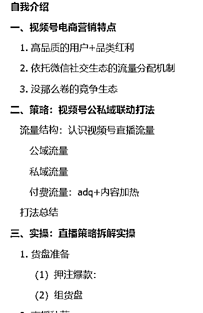

# 河林分享视频号直播运营经验与 2024 年总结

> 原文：[`www.yuque.com/for_lazy/zhoubao/yc1cqr86spg3yeyu`](https://www.yuque.com/for_lazy/zhoubao/yc1cqr86spg3yeyu)

## (22 赞)河林分享视频号直播运营经验与 2024 年总结

作者： 河林

日期：2024-12-30

各位生财星友好，我是河林，是一个加入生财两年、第一次发帖的小透明。

简单介绍一下自己，我是河林，98 年出生，4 年运营经验，base 杭州；

是一名视频号直播运营操盘手，也是一名互联网营销自媒体作者。

我从 2022 年开始，先后**在头部母婴新媒体公司、视频号头部女装达人公司，做视频号直播带货运营** ；

至今为止我自己作为专场项目管理+运营执行+中控跟播，统筹的直播也有接近 300 场了，全品类都做过，其中也做**出过多个 100w+GMV 的大场。**

我平时有输出的习惯，擅长营销案例拆解，长期为零一裂变、鸟哥笔记等互联网营销资讯平台供稿；

在自己的公众号写过几篇分析视频号直播的小爆款文章。

2024 结束了，我想把这篇文章作为我的年度总结，给大家分享在视频号直播的赛道上，~~（给老板打工）~~ 摸**爬滚打 2
年多之后，我的经验、观察、实操打法，也算加入生财 2 年来给生财的一份贡献。**

我会在这篇文章里分享我对以下几个问题的观察：

1.  视频号直播电商生态特点

2.  视频号公私域联动打法策略

3.  百万 GMV 直播专场策略拆解

4.  视频号直播入局建议

5.  视频号运营知识库免费公开（直接拿、无套路）

6.  文末无任何训练营、收徒、付费社群广告

目录大纲：

事先声明

1.  适合人群：本篇经验适合视频号达人带货直播、侧重 5 人以上的、配置完整的正规团队的直播打法；

**  **

1.  不太适合个体户、野路子打法参考，如果大家想了解更实际的、适合小白的视频号玩法，比如无人半无人直播、口播带货、混剪短视频等打法，可以多看看生财精华帖，已经有很多大佬做了分享。

2.  因为大家对视频号会有各自不同的视角、需求，也所处于不同的阶段，所以我的分享不一定能涵盖大家的需求，也会有侧重，那么结束后大家有任何问题的话可以提问，我的认知范围内的我都会尽力解答。

希望对大家有帮助。

**图片、文字较多，排版受限，全文请移步飞书阅读，感谢理解：**

[`jid6vvjfdm.feishu.cn/docx/R9zfdm4Q2oVMS2xDneccJdkInxh?from=from_copylink`](https://jid6vvjfdm.feishu.cn/docx/R9zfdm4Q2oVMS2xDneccJdkInxh?from=from_copylink)

在文末我还公开了一份我花了 1 年时间持续更新、整理的视频号运营知识库，作为给星友们的 2025 新年礼物，欢迎领取

* * *

评论区：

暂无评论