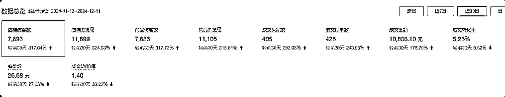
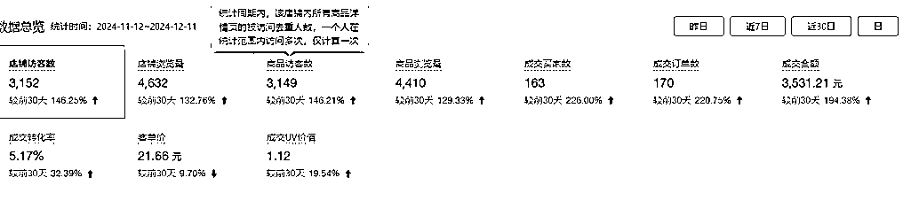
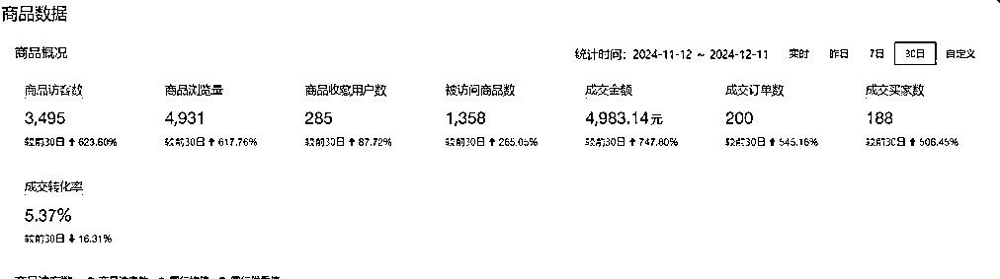

# 拼多多二手书店群 3 个月，登顶二手书头部玩家，我的经验分享

> 原文：[`www.yuque.com/for_lazy/zhoubao/xgf782ebs1qliypc`](https://www.yuque.com/for_lazy/zhoubao/xgf782ebs1qliypc)

## (42 赞)拼多多二手书店群 3 个月，登顶二手书头部玩家，我的经验分享

作者： 程序员田同学

日期：2025-01-03

各位圈友好，我是田二，坐标郑州，程序员|连续创业者。

毕业这几年我做过很多项目，和大部分人一样做过很多项目，成的少失败的多。

从去年五月我们开始入局二手书项目，十月开始全力做拼多多无货源二手书，目前我们一个人负责一个执照下的 20 多个专营店，好的店铺一月一万多营业额，差的店铺一月三四千的营业额，单店 20%到 30%的利润率。

仅以本文做个记录，看能不能给做二手书的小伙伴提供点帮助。

为提升阅读体验，请大家移步飞书：

[`q2srbwoeiz.feishu.cn/docx/BnkSdKB7YoK6JLxI6A6c8a0enmh?from=from_copylink`](https://q2srbwoeiz.feishu.cn/docx/BnkSdKB7YoK6JLxI6A6c8a0enmh?from=from_copylink)

* * *

评论区：

朱小朱 : 请教一下文章里面提到的“拼多多一套执照可以开将近 30 个专营店”是指一个营业执照➕一个出版物许可证可以绑定 30 个拼多多专营店吗？

程序员田同学 : 对呀

nnnn : 着一个店铺要办一个宽带吗？

程序员田同学 : 不用，多多 ip 关联没事

李旭东 : 请教一下，要上品一两万怎么上呢？用的什么软件呢

程序员田同学 : 服务市场搜一下图书

百哥 : 不投流竟然还有流量，我的店铺每一单都需要几十块钱买流量

程序员田同学 : 二手书比较特别，同行没有投流的