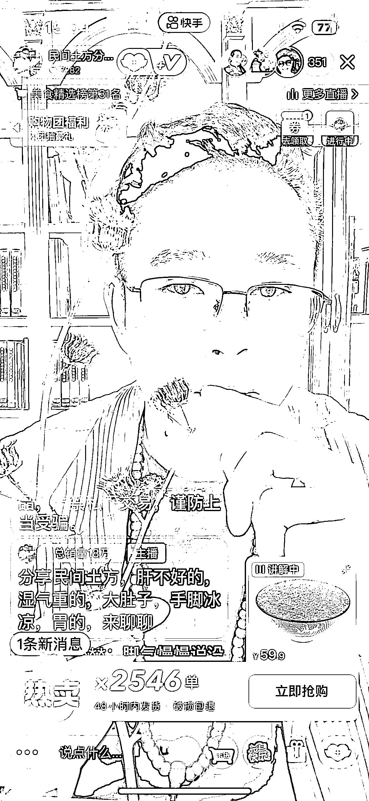

# 快手“民间土方分享”直播变现实操教程

> 原文：[`www.yuque.com/for_lazy/zhoubao/rukeasd7eqnavmpe`](https://www.yuque.com/for_lazy/zhoubao/rukeasd7eqnavmpe)

## (46 赞)快手“民间土方分享”直播变现实操教程

作者： 金成

日期：2025-01-03

大家好，我是金成，80 后宝爸，不善言辞的实战派。真诚才是第一必杀技，7 千字手打实操干货复盘送给大家，文笔有限，只能用尽量多的干货填充，如果觉得有用请点赞鼓励。

这个项目本来想私藏起来，但是上周传术师见面会，亦仁老师，一句“越分享越幸运”，让我无地自容。

这应该是全网，第一篇“民间土方分享”直播玩法的实操干货文章，图文+视频的形式，能够让你更容易理解，还请移步链接。

【腾讯文档】快手“民间土方分享”直播变现实操教程

[`docs.qq.com/doc/DZGhYVnpncWN6VmJ3`](https://docs.qq.com/doc/DZGhYVnpncWN6VmJ3)

* * *

评论区：

阿喜小哥 : 你好，能和你建联吗？

金成 : 可以的 找下鱼丸

阿喜小哥 : 嗯好的

半扇咸鱼 : 请问是怎么挖掘到这个项目的呢

金成 : 我本身就在做养生方向的口播带货，多刷视频就发现了。现在平台的喜好偏向推荐太严重。很多宝藏玩法我们都刷不到。因为我们本身不是别人的目标人群。
有一个办法，用老年人的手机、小孩子的手机刷一刷。说不定会有意外收获。