# 同城小项目，一个月多赚个千把两千块钱没问题！

> 原文：[`www.yuque.com/for_lazy/zhoubao/mie4uswfgk007gmq`](https://www.yuque.com/for_lazy/zhoubao/mie4uswfgk007gmq)

## (23 赞)同城小项目，一个月多赚个千把两千块钱没问题！

作者： 糯米

日期：2025-01-02

新年伊始，祝大家新年健康，平安，幸福！

今天本来想写的标题是

**在新媒体时代，只要认真做，谁都能在别人的行业捞口饭吃**

这句话其实算是我整个 2024 年尝试的一些项目的核心总结

怎么理解这句话呢？

其实大概意思就是，只要你稍微能够做一点产品，做一点服务，看起来还像那么回事，价钱呢也公道，你就可以去互联网上找对应的客户人群，给他们做交付，赚他们的钱

**你不用成为一个非常专业的这个领域的人，但是呢，你只要稍微认真一点，你一定可以达到用户期待的交付及格线，甚至可以做得更好**

以我的经验，大多数人沉淀在某一个行业之后，慢慢的，他就会失去初心，就会把产品越做越差

如果说你肯认真的，细心的去经营你的交付产品，其实你可以很快就做得比他们好更多，可以很快打败他们

因为你作为一个初入门选手，首先，你的定价不会过于离谱，毕竟你还没怎么干过这个领域的项目，对于客户来讲就是超值的

其次，你也是刚进入这个行业，你的精气神是饱满着进来的，心力足，则交付品质就可以更高，客户肯定更愿意选你，反馈也会更好

相比起这个行业的一些老人，他们已经在这个大染缸里面泡太久了，已经麻木了

最开始的那些坚定，情怀，早就被一门心思搞钱取代了，交付出来的东西自然会更差

你只需要在这个行业，不要太过于耗费精力的，每个月搞个几次交付，每个月赚个一千两千块钱是很简单的，而且可持续

这个事情就有点像是一个爱好，一个月偶尔做个几次，顺带着呢，把小钱赚了

就拿我昨天组局的这个事来说，其实今天要写这篇文章，也是出于昨天组局来的灵感

而且昨天的文章写的仓促，可能也没有给大家讲太多太细，今天我就细细的给大家讲一下，我整个组局的心路历程

首先组局呢，我自己有兴趣，本身也比较爱玩嘛，我也是一个喜欢跟朋友聚在一起的人，不喜欢孤独，这些都算原始动力

我记得 2022 年的时候，有人劝我把理想和赚钱分开看待，但是越到后面，我越发觉得人的原始动力非常重要

如果说你去做一个项目，真的不是来钱很快的那种，一旦你缺乏原始动力，你根本就不可能做起来的，而且现在还能找到几个来钱快的项目呢

就像我跟你讲，你现在去做这个项目，这个项目可能要一年两年才能够赚到钱

同时，这个项目要你做的事情，你又不喜欢，你要忍受一两年的痛苦和折磨，去熬进度，你觉得会有多少人能熬得出来这两年？大概率是不可能的

OK，说回来，我首先有了原始动力，所以我能组这个局，我是能更容易成功的

那这次组这个局呢，其实细说下来，我的实际动因有二

一方面我问了自己，我真的还是想组这个局的

另一方面，因为在社群里面发起组局的这个契机，相当于已经逼我走了 30%的路

那我要把它推进到完成，那其实是更容易的，况且我已经开始采买一些东西了，已经有沉没成本了

那我们说完能够把这个组局搞起来的原因之后，然后我再来讲讲我对这个项目的理解

你可以参考我对这个项目的理解，同样的去做类似的项目，一个月多赚个一千两千块钱，应该是没问题的

以我的经验，我在杭州去参加过一些外面人组的局，就是那种人家专门做同城年轻人组局社交，一起玩的那种

那我对他们的收费，交付，以及运营模式有大概的了解，其实也不难

获客嘛，通过互联网去发帖子，发视频，然后引流到自己的私域

私域，可以是在群聊，在朋友圈触达用户，告诉大家，最近的组局计划，甚至是可以私发给你，问你要不要来参加

我加了不少这样的人，他们大概率就是不断群发，只要你没把他删掉，就会一直群发给你

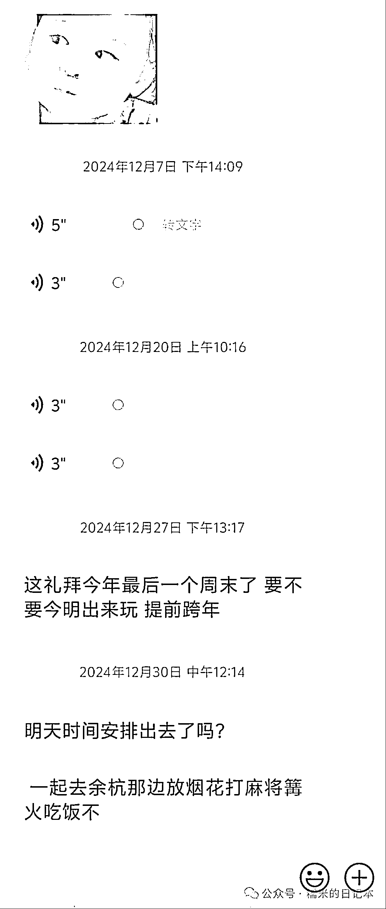

而且他们也比较会讲一些俏皮话，好像是一对一的在跟你私聊，很真诚的邀请你来参加这边的聚会一样

**这个是他们专业人员/年轻玩家的优势，不过我们外行人想做到也不难**

然后这边稍微插句嘴，其实我这么久以来，对杭州的感觉很趋近于下面的描述

杭州这边大量的商业化服务都是，付钱之前你是大爷，情绪价值给得很足

等到付完钱之后，你会体验到，其实交付也非常的普通，也就那样，这个时候的情绪价值给得也没这么多了

不过以杭州这边商家的素养，他们的售后也是比较擅长去安抚你的，不太会让你骂骂咧咧很不爽的离开

对这个售后的感觉，我觉得可以形容为“100%兜底”

**真的，杭州很多商家，特别是有互联网成分在的，如果你想去体验，一定不要被售前忽悠得太上头**

**因为收完钱他的任务也就结束了，后面你的体验如何跟他是没关系的**

OK 我们再讲回来，通过在互联网上发帖引流到私域之后，除了上面讲的那几个方式，我看杭州这边的组局团队还会做公众号去沉淀流量

而且他们公众号做的确实也不错，看起来挺漂亮的，我看了，我都会觉得哇，这个组局应该是蛮正儿八经，蛮不错的

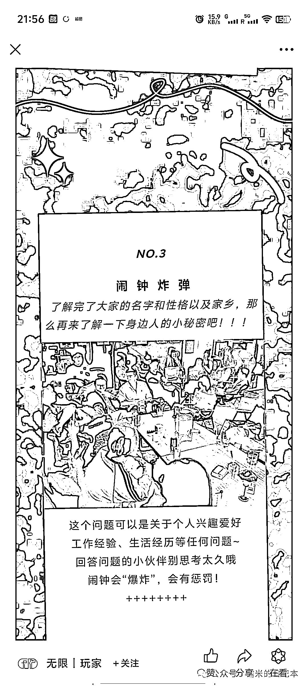

其实像组局这个项目最核心的部分也很简单，就是你展示出来的交付预期是真的很棒的

像我这一次组局的话，我交付预期的呈现就是，我把计划好的流程是怎么样的，布置的场景是怎么样的

我做了哪些准备，买的零食拍给大家看，我现在准备的酒买了多少瓶，摆出来拍个照给大家看

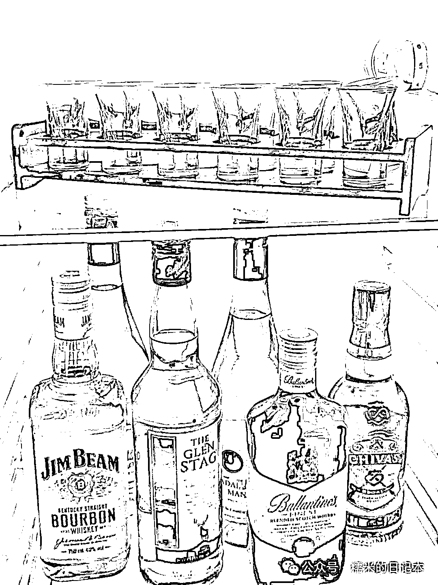

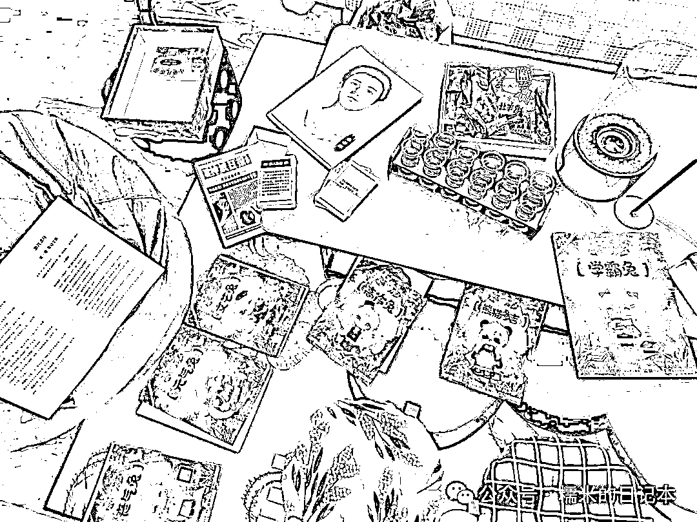

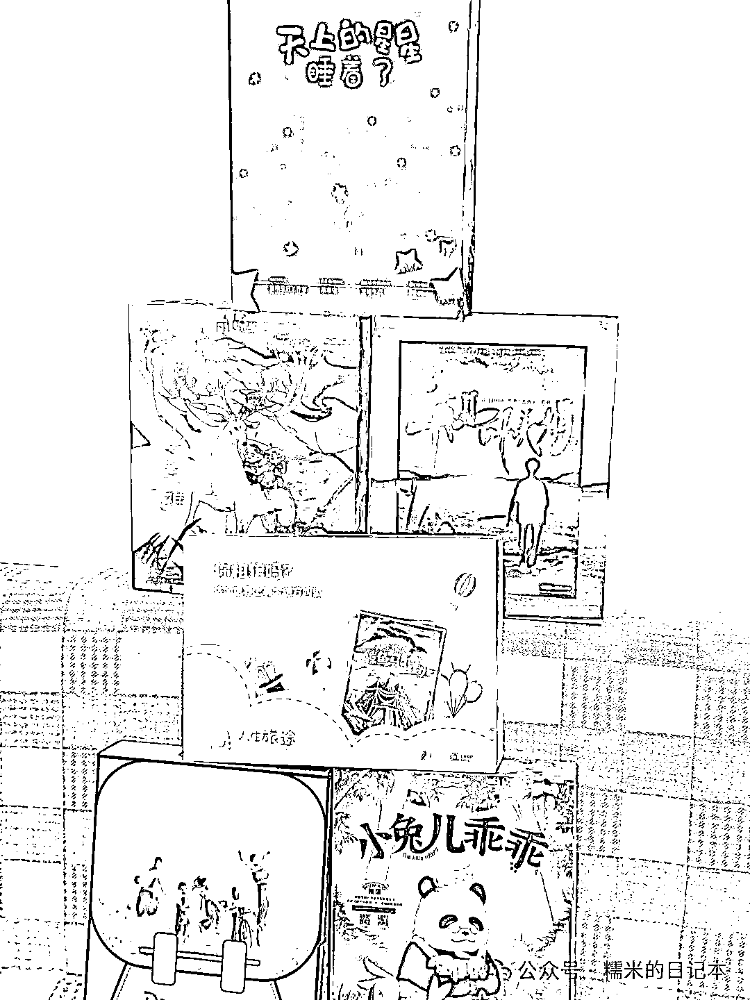

做到随时更新进度给大家，我现在准备到什么环节了，这就是我这次组局的一个操作

我随时都在告诉大家，进度到哪了，我在做什么，大家的期望值也拉了起来

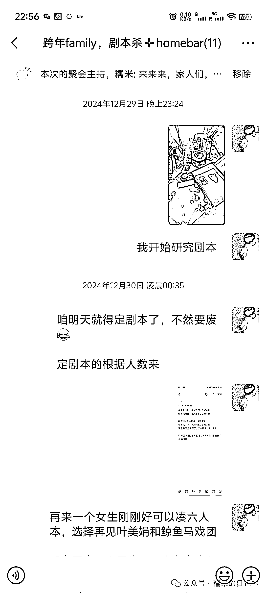

**而且，不要不自信，怕大家期望值过高，只要你是认真准备，花了心思，真诚对大家的，一定不会翻车的**

我真的完全是一个组局的行外人，我相比杭州很多的玩家来讲，我并不专业，也不是很会造气氛，但是我这次的结果就是挺好的

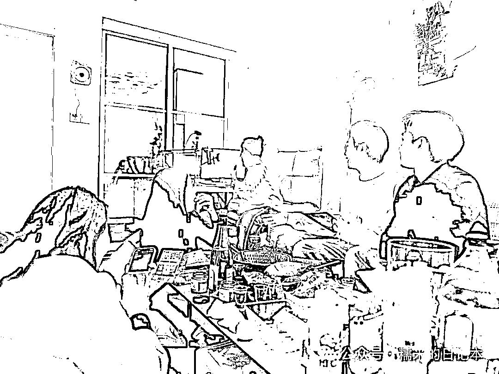

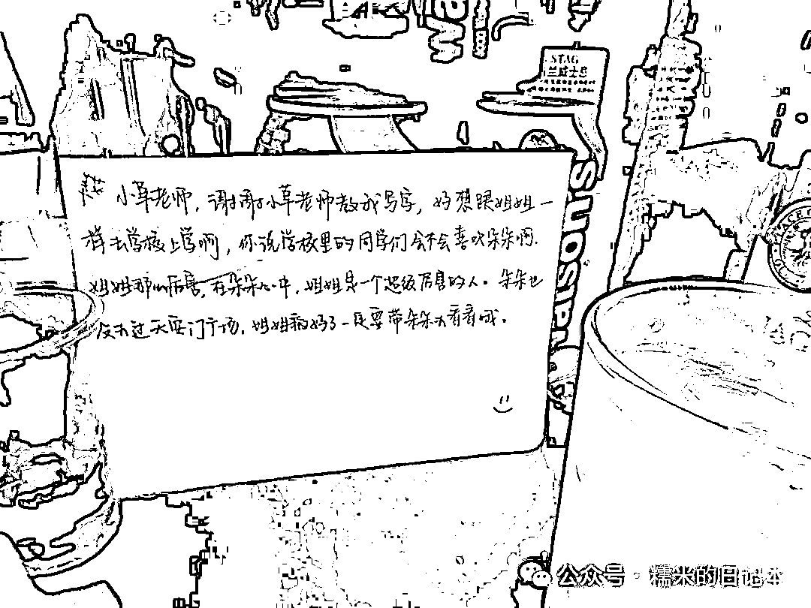

跟这个领域的专业玩家的交付相比，在我这边，真的就是非常超值的一次体验

而且为了保证我的交付质量，每个月我可能也不会整太多

未来的计划，可能每个月搞个一两次，最多三四次就顶天了

那这个项目对于我来说，就算是一个爱好，我把大家聚在一起，大家玩的很开心，我自己也排解了孤独，同时自己还赚了个房租钱

也是如我前文所说的，你只要肯认真去做一个事情，能够稍微做个产品，做个服务

以刚刚入行的那种状态，那种初心去做交付，你真的可以超过蛮多这个行业的专业玩家的

要在他们这个领域稍微分一小碗羹，去赚点小钱，没有问题的，一个月赚个一千把两千块钱是真的完全没问题的

然后我现在给大家讲讲，我这个组局的一些流程吧，就是讲一点能够落地实操的

因为很多小伙伴可能看到这儿，前面我都还是在想讲心法，没有讲到具体的落地流程

我最开始呢，发起了这个组局之后，已经积累了 2 个小伙伴来参加，那这个算是活动正式启动了

然后我就根据现有的条件，去找我想要营造的那种氛围的案例

**其实就是根据我家的情况，在网上去找了适合我家的，我喜欢的那种 homebar 的装修布置的样式，然后我来还原一下**

根据网上的一些帖子，我就观察复刻，买了一个长桌，然后买了一个地垫，买了一些座椅坐垫，零食酒水水果，以及一些喝酒的杯具

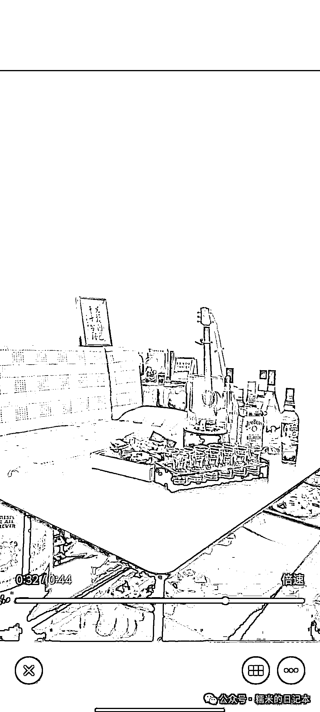

配合这次的主题，还要准备剧本杀，也是花了很多功夫，比如淘二手剧本杀套盒，给来家里的小伙伴匹配剧本，做问卷调研，反正做足了准备，还买了一些香薰蜡烛搞氛围

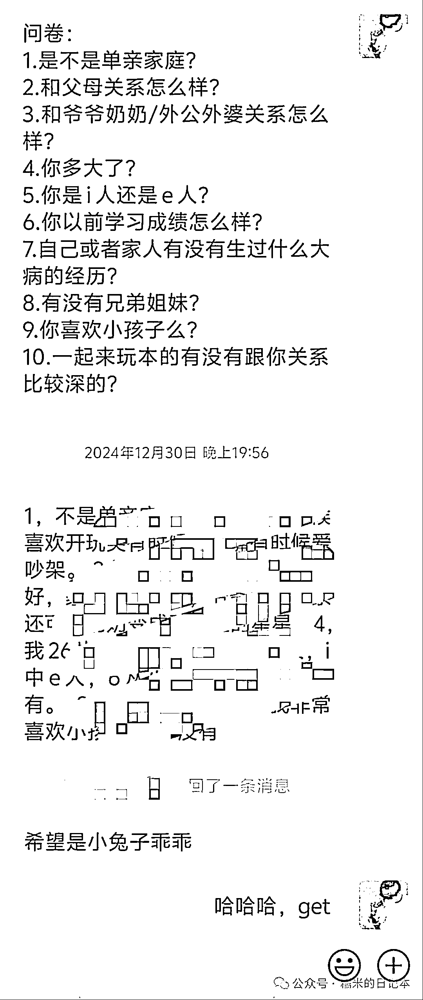

那我一边在做这个事情的同时，一边还要解决这次来参加这个局的人的问题

我是借着元旦这一次跨年的时间节点，在网上不断去别人的帖子下面发帖留言说我的组局是什么情况，就是不断的去捞人嘛

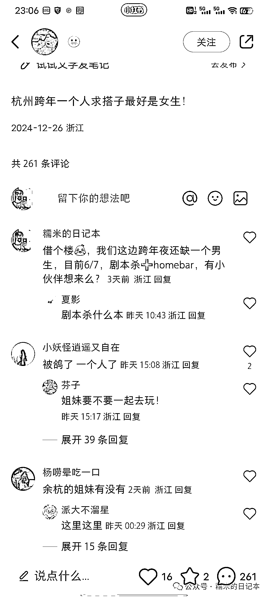

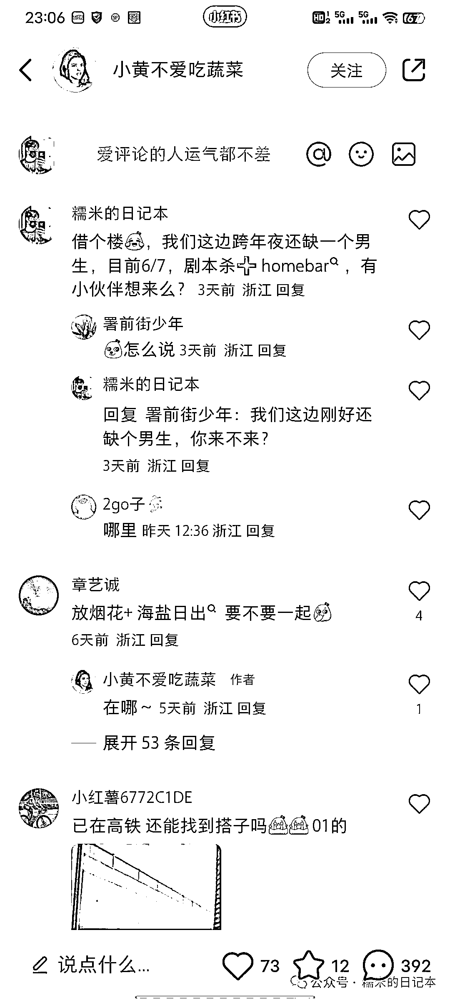

其实我自己也发了帖子，就是没有什么流量，不过我预期自己大概率是能组齐这个局的，这个结果我能预判

因为按照这两天的杭州组局需求，仅仅是以从别人帖子下面的截流获得的曝光量来看，要捞个 4-5 个人，其实并不难，发够几百个评论肯定差不多了

所以，我的主要任务就是不断找合适的帖子去留言，让别人更多的可能看到我，然后曝光我，然后通过这个渠道捞人来参加我的局

这次组局我也没有太过精细的去计算成本，但是粗略估计来看，我这一次大概花的钱和收回来的钱差不多是收支平衡的

相当于就是把这个活动办下来了，可能自己倒贴一点钱吧最多

你比如说像这次我买那个剧本杀，虽然是淘的二手的，但是也是一笔不小的成本

差不多我把群拉好了之后，就是不断在为了人的事情操心，在网上不断的捞人

人进来了之后肯定要沟通嘛，就得跟他们讲，我们这次大概的流程，这次大概要干什么，这些都可以 sop 化

重复的东西反复发就行了，不断预告，把自己的那个进度也讲的很明白，这就给人家一种很真诚的感觉

这个也是我认为的很重要的一点，上面说过了，这个是这次我搞这个组局能搞得下来的一个核心

像我这次准备的吃的也很丰富，活动流程也给大家整的很好，场景也布置的很温馨舒服，很多东西也替大家考虑到了

比如说大家过来冷了怎么办，对吧，给大家发暖宝宝，然后大家进来是不是套个鞋套，那得门口放个椅子坐着套鞋套要舒服一点吧

然后剧本杀怎么开，我自己也是反复的很精细的去跟人家沟通，做问卷，了解哪个剧本适合发给谁，真的是做了蛮多的工作的

但是我摸着良心讲，这一次的交付确实蛮重的，我前前后后起码准备了将近五六天吧，就一个星期左右的时间

前前后后买了很多东西来布置，花了很多时间精力，不可能每次搞都这么辛苦的，后面的话肯定要降低这个交付的重量

比如说剧本杀，那我开剧本杀次数多了之后，那我要再次开起来，其实就不用提前做这么多准备了

**相当于用经验去降低了交付的重量**

那其次呢，随着组局经验增加，就能更好降低组局的准备工作和善后工作量

比如说什么样的零食不适合买，容易弄得到处都是，要买多少合适，什么样的酒不适合买，要怎么去避一些坑这些

大家来家里的行为习惯怎么样去规范，对吧（比如抽烟）

这一次搞其实已经算不错了，没有弄得很狼藉，但是打扫起来确实还是花了一番功夫，特别像桌子，有些地方现在是怎么搞都搞不干净的

但组了第一次嘛，第二次肯定会轻松很多，因为现在的布局布置，很多东西已经成型了，可以留下来反复使用，后面的成本确实会更低

此外这个事情，我也愿意做持续去做，对于我来说，不是一个让我觉得很辛苦的事儿

甚至持续去做之后，这个项目有可能变成一个更大一点项目，可以靠这个项目在杭州赚更多的钱，或者发展出个小团队

我也不知道它能够发展到哪一步，但是这个事情我觉得既然做起来了，能够成为我生活的一部分，那它发展上一个更大台阶，成功率是会更高的

以上这些就是我这次大概想做的一些分享吧

如果说大家想看更落地的细节操作，那我可以再写一篇文章，细讲我的操作步骤，第一步做什么，第二步做什么，第三步做什么

不过如果没有任何人跟我提这个需求，那万一我心思一转，也没什么兴致写，那可能就没后续了，哈哈，随缘随缘

* * *

评论区：

暂无评论