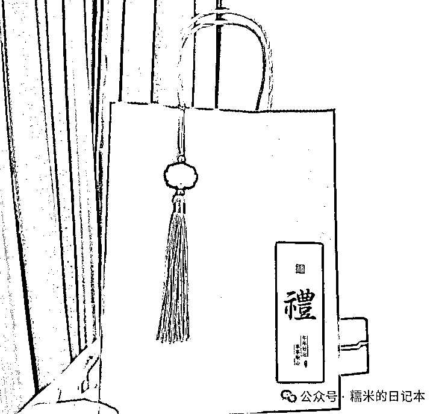

# 医药代表能做的 10 大副业！

> 原文：[`www.yuque.com/for_lazy/zhoubao/wpwzif4osedhz6rv`](https://www.yuque.com/for_lazy/zhoubao/wpwzif4osedhz6rv)

## (16 赞)医药代表能做的 10 大副业！

作者： 糯米

日期：2025-01-02

前阵子，跟一个医药领域的公众号约了篇稿子，关于“医药代表转型，医药代表副业”方面的内容，经过了好几天的修订，终于是发出来了，自然也想转发到符合调性的生财，希望对圈友们有帮助，以下是正文文稿：

“副业”

这个词近几年火得一塌糊涂，是个人都想做点副业，为什么呢?

确实近几年国内的就业市场，经济环境，消费力都不太行

大家为了谋出路谋希望， 副业，或者说第二职业这个词就有了

**“医药代表能做的 10 大副业"** 为什么我今天会写这个话题呢?

1.我本身就是医药代表

2.我有丰富的副业经验

3.我知道医药代表人群对这个话题有兴趣

4.我跟药前程官方约稿了

哈哈哈，糯米我这个人吧，向来以真诚出发，文字也是从真诚开始

确实是有约稿这个事儿，所以我从这个事儿开始写才会文思泉涌

要让我无中生有编造内容，我真的写不了一点儿！

所以，今天之所以加上模板，调好字体格式，这么正儿八经的，也是因为约稿这个事儿，哈哈

不过，若这篇文章真的被药前程转载出去了，那很多人是不认识我的，所以这里我做个自我介绍（当小故事看吧）

hello，你好，认识一下，叫我糯米就行，我也跟大家一样是代表

2019 年大学毕业，毕业即入行，入行则 4+7，虽然艰难，但是也勉强混下去了

然后我在南京度过了大概一坤年（两年半）的药代职业生涯

攒了点钱+心念一动，我选择了裸辞，说去做点自己想做的事儿

当时蛮喜欢剧本杀的，想尝试做这行，所以在南京的房子到期前的几个月，我一直在混剧本店

离开南京后，我又出去潇洒了一圈，然后回贵州老家过年

但过年期间我也非常有危机感，也在琢磨怎么靠剧本杀赚钱这个事儿

毕竟现在没有收入来源了，但也不敢盲目投钱开店

当时的想法是剧本杀结合自媒体做做账号，但一直不得其法

也就是过年那两天，跟以前的校友请教自媒体的时候，他让我去广州看看他们在做的直播带货，说也很赚钱

大年初二，天下着大雪我就出发过去了

看到他们一天营收几万到几十万，确实，我心动了，在广州一呆就是半年

但哪有那么简单的，自媒体的风向变化很快

没多久项目就黄了，场地也没了，没人管没人带，我挤在小破房子里继续咬牙坚持

当时在广州做过电商直播，社群管理，什么服装，食品，减肥都做过

我自己又从抖音摸到视频号，当时最初的视频号红利，就是我拉着朋友一起蹭到的，靠混剪直播带货赚了点小钱

后来回到老家贵州又做了半年的游戏博主，也赚了点小钱，反正那年合计赚了小几万吧

但跟我花出去的钱对比，杯水车薪

最后我穷得只剩下了 1w 块来的杭州，我告诉自己，现在要重新开始！

到杭州的那天是 2023 年 3 月 25 日，我记得很清晰，找工作那阵子也碰了不少壁

我一度以为自己回不了医药行业，毕竟中间 gap 了一年多，没有正式工作

在这个行业断档这么久了，确实优势弱，得靠这张嘴忽悠

为此，那阵子我每天就是投简历，面试，反思面试，优化简历，优化面试技巧和话术

如果你去翻我那阵子发的文章，是能找到关于面试思维方面的内容的

20 天后，我入职了现在的公司，当时也挺艰难的

好在我经过那 1 年多自由职业的洗礼，已经异常坚强了，行动力和思维都变了很多

然后我花了半年时间，在杭州站稳脚跟，保住工作

直到 2023 年 8 月份，命运的齿轮开始转动了

我开启了“陪诊"这个项目作为我的第二职业，也取得了一些成果，在圈内有点小名气，然后持续至今

当然，此外我还有很多经历，比如公众号持续写作 2 年多，知识付费录课卖课，卖咨询之类的我都做过

这里实在是写不完，咱们就说这么多，估计现在大家对糯米我的认识就更立体了

那今天由我给大家聊聊副业，肯定也是够格的，现在我们直接进入正题

**作为医药代表，到底能做些什么副业呢?**

糯米在讲副业之前，要先给大家植入一个问题

请大家想想，你心目中的副业是什么概念，或者说是什么样子?

为什么要问你这个问题呢?

**因为你必须先搞清楚自己的预期，自己搞副业到底是希望得到什么！**

比如有的医药行业的前辈，在我看来，根本不值得折腾什么副业

自己底蕴身家已经很哇塞了，折腾副业的投产比对于你来说太低，还有不确定性

**真的，不是每个人都有必要创业，折腾副业的**

你可能辛辛苦苦花钱学习，费力费脑，一年挣不了几个钱

当然不否认哈，能学到东西，能看到一些横向领域，但以你们的年纪来说，会学得比较辛苦

这个地方没有恶意哈，以我自己而言，我都羡慕我小外甥他们这种还在大学的孩子了

他们学东西很快，是比我要更理解现在的新事物的这么一些年轻人

如果我不加紧学习，很快就得跟年轻人脱节了

今天这个文章很真诚，所以啰嗦了一点，大家见谅，我们继续讲回来副业的事儿

OK，你先想想，自己做副业到底是图个啥，预期在哪?

**如果你只是想尝试尝试，那完全没问题**

医药行业的人，说实话，思维相对封闭一点的

打破一下常规，出来看看，真的会很有价值

**亦或者，你想一个月增加个几千块钱的收益**

如果只是想赚点生活费，车费，房租费啥的，也是很大概率能成功的

杭州做副业的人太多了，我之前小红书上请了一个小哥上门，帮我拆装电脑主机换新机箱

他一个月闲暇之余搞搞电脑硬件软件，多赚个几千块是稳稳的，他也不是专业人员，就是以前爱打游戏

**再或者，你想得更大一点，期待以后副业能走上正轨，帮你增加睡后收入**

对吧，你躺着的时候，都有钱进账，这就很爽

**甚至是你想副业再进一步放大，超过主业**

让你有底气开除那个气人的老板，那这就看你的预期到哪了

**但无疑，预期越大，成功率越低，这个是事物发展的规律**

想清楚这个问题之后，我们再来聊具体的副业

一般我是不建议直接网上随便挑一个副业就开干的

为什么呢?因为这 2 个问题

1.大概率你要从 0 开始

2.大概率你选的副业坚持不了一周就不想干了

那我更建议大家做一些离自己“近”的副业，比如我的陪诊项目就是一个非常好的医药代表副业

**本来就要经常去医院的，加上工作时间也非常灵活，自己的职业素养也高，完全是从 50%的进度条开始走的，很舒服**

那医药代表还有些什么副业可以做呢?

1.科室餐

2.卖礼品

3.组织凑会

4.代写论文

5.PPT 美化

6.健康咨询

7.代购药

8.卖医药学资料/服务

9.医生助理

10.xxx

我知道很多人看到这里，会觉得大失所望

“哎呀，什么嘛，不就是老三样嘛，身边早都有人在搞了！”

但是我要告诉你的是

我可以给你讲一堆网上稀奇古怪的副业，逻辑也好，模式也好，我都能告诉你，但是你大概率会回到上面的结果

1.从 0 开始，2.坚持一周然后放弃

现在，我希望你耐下心来，听我细细分析这 10 条副业的可行空间

**1.科室餐**

这个是你能直接左右的，因为你有代表的身份，离代表群体就近

你可以很容易加很多同城代表，代表就有权利决定在哪订餐，获客优势

然后你可能会说，那为什么人家会找你订餐呢?如果找你订餐，餐又在哪出呢?

那你想想代表的需求是什么呀，你应该最懂了呀!

是开发票？是报销？还是 fd？只要有利可图，为啥不能找你订餐呢？

**OK，订单拿下了，餐要怎么办?需要你自己开个店么?**

根本不用！你只需要在医院附近找 20 家餐馆谈合作即可！

你就帮商家卖，赚佣金，这个是最简单的模式

你就 20 家慢慢筛选，看谁家的餐好，你就努力去给身边的代表推，就行了

但如果你想把这个生意做稳，做大，我稍微延伸一下

**第一，改进餐食** ，你要懂医生的需求，一般就是好吃，看起来漂亮高级，搭配得好，这个要根据你那边的医生群体需求来设计

**第二，配送问题** ，你要解决好及时配送的问题，很多科室会的尴尬出现在送餐不及时，医生饿着肚子等这个事儿上

但这些其实都可以靠筛选店铺解决，运气好，能直接选出来，不用你操心

你只管帮老板拿订单，优化成本，多宣传多拿订单就行

这个东西一旦做好了，在医生那边能持续表现好，可能他们自己都会自发点你们家外卖

**人都是懒的，习惯了就不会换了，你就守城即可**

这个时候，你的客户群体可能就是各种 B 端的团队商务餐，不限于医院了

等你都懂这一套逻辑了，自己开家店不也可以了么，从中间商过渡到源头供货商

你发现了么，到现在为止，只要不走到开店那一步，你就一点成本都不用花出去哦

只要成了，之后就是接单+安排+盯好不出问题即可

**2.卖礼品**

作为代表，经常要为礼品发愁，这个就是一个硬需求

还是一样的逻辑，多加代表人群，然后多去探索礼品的选择

坚持每天谈几家供应链，每天检索一下都有些什么好礼品，然后你就在朋友圈卖货给代表不就挺好的么

假如你加 1000 个代表，不限地域，各个城市都有

然后你手里有 100 家供应链，可以做批量的礼盒，也可以散着卖

但凡是到了什么节假日，你提前一周左右就开始发朋友圈，文案写

**“中秋节送客户的最佳礼品，xxxx，实惠又时尚，别再傻乎乎送超市买的粽子啦，买它，让客户眼前一亮吧!"**

我估计就那几天，你多发几次，询问量 100 人起步

我给你算个账，按照 20%成交，每单 200 元，你赚 20%，也就是 100*0.2*200*0.2=800

可能看起来不多哈，但如果你看不上，我给你讲几个逻辑

第一，有没有可能 200 元一单保守了，你自己估计一下

第二，20%的利润空间有没有可能提高？

第三，这些订单是只发生一次么？还是下一个节假日依然会有订单？

第四，你朋友圈里的客户人群永远都只有 1000 个么？会不会慢慢积累到 5000 个，甚至开第二个微信，积累 1w 个？

第五，能不能好好做私域，把询单人数做高?

**3.组织凑会**

看到这里有感觉没，这些项目都是有人在做的，为什么我还会提这些项目呢?

因为这些都是被市场验证过其逻辑性的项目，有需求，有花费，有市场！难道你想自己去蹚雷创新么？

我们这个行业的人经常需要去参会吧，能不能花钱请人来开会凑数呢？

能不能我不想去的时候，花钱请人替我去呢？

甚至能不能我以后承包一些公司的会场会务布置呢？

**有人花钱的地方，就能赚钱**

你都会花钱找人去参会了，那帮你参会的人，不就赚钱了么？那如果在你这里能形成一个参会人力资源中心呢？

**4.代写论文**

这个是针对医生人群，或者是有写论文需求的人群吧

咱们医药人，逐渐学历也高起来了，慢慢的可能以后都是本科起步

毕业设计都做过，实验都做过，论文自然也写过

像医生很忙，自己不想写，没空写

那纯手工的部分是不是可以我们代为做一些杂工呢?

比如排版，摘抄，复制粘贴，把这个做成一个服务，商业化起来

如果自己不能亲自完成，那完全可以在网上找一堆论文代写机构

然后你去找医生拿订单，然后赚个差价，只要你找的商家服务质量靠谱即可

**这个模式一定可以成立，但是难度系数会有点高，论文代写的复购频率也非常低，要做的话可能需要借助自媒体打开全国市场才能赚点钱**

但我之所以会提这个点子，一方面是逻辑成立，一方面也是遵从了我的思维习惯

即，在医药行业，尽可能的还是要往专业度高的方向发展

像我今年就考了执业药师，让我在药的领域起码又专业了一个档次

前阵子我又亲自买了一个动态血糖仪，拿自己做实验

连续监测了 15 天的血糖，那我对饮食跟血糖关系的了解，就更专业了

要记住，健康无价，做一个健康专家，以后多的是钱给你赚

**5.PPT 美化**

这个副业是这么来的，你首先在医药这一行，本身就会经常跟 PPT 打交道

**不论是汇报工作，还是科室会，甚至是帮助医生做一些病例 PPT**

你可以去付费学一套 PPT 的课程，学着把 PPT 做得尽善尽美

一方面你自己的职业上会有很大的助力

一方面可以用这个技能赚网友的钱，比如卖课，直播，或者网上接单帮人做 PPT

很多人会做事儿，但不会表达，不会展示，10 分的辛苦表达出来就 5 分，很吃亏

**在 PPT 上下功夫，真的是能帮你晋升的**

(如果你说你就是混得很好，且 ppt 从来不做，那可能您的其他地方出众吧，但对广大的同行来讲，可能没有广泛复制性)

OK，说回来，如果你做这个生意，那医生，公司领导，同事，同行都会是你的客户

因为他们都有做 PPT 的需求！

**可能你会觉得，我怎么可能跟他们收费呢？这个口开不了**

那我这么说，你帮他们做，其实已经在收费了，只是兑换形式是以人情交付

你如果跟我一样，能把这个事儿区分对待，那你完全跟客户收费

**谁的劳动是免费的呢？对吧！**

药代是药代，下班了你就是 PPT 写手，正常接单，大不了给个人情折扣，这个就看你自己选择了

**6.健康咨询**

这个前面提到过了，如果你愿意沉淀在这个遍地黄金的行业，就多积累专业知识，努力给别人解决问题吧

等你真的积累了足够的专业知识，以及服务案例了之后

你真的可以做到，哪怕是代表的身份，别人找你咨询，都要 1000 起步

我认识一个北京的姐姐，也是同行，她就做到了，因为她足够专业

**7.代购药**

这个跟陪诊是交叉的，你懂药，且在这个行业，你就可以帮别人代购

毕竟你也天天跑医院嘛，身边还是一堆做药的，先天优势圣体

需要做的无非就是多收集供应链，然后谁问你，你都知道在哪能买，你就是能买得到

当然哈，要注意合法合规！

所以，模式跟上面差不多的，积累足够的客源，积累足够的供应链，沉淀+持续对外宣传

那么一个月整点零花钱是没问题的，但是要想做大，那老复杂了去了，今天肯定不延伸这么多的

**8.卖医药学资料/服务**

这一条我想讲的就是我考执业药师的这个事儿

**我考过了，那我就能教别人怎么考过，卖服务！**

哪怕我没考过，咱是这个行业的，卖这个服务自然那也会有一定的背书感

话分两头，每年考医考药的考生那么多，不卖服务，咱搜罗一些资料，整理好之后卖出去，不也是个很好的项目么?

而且你的身份，你在的行业，确实能让你更懂一点，你这个人来做这个事儿就是更方便成交的，懂么?

可能有的人会看不上，但我跟你讲，我有一个认识的前辈，2023 年我刚来杭州第一天，是我第一次见他

我跟他在同一间房间，我们几十个人围着他听他分享，请教他问题

他现在在青岛买了车买了房，车是越野，一百多万的车吧好像

前两天看他开车去雪山拍照，他就是考了研究生之后，靠卖考研资料赚了几百个 w 然后翻身的

**所以，不要看不起卖资料这个事儿！**

最后算个账吧，19.9 一份资料，就算资料的来源有些是收费的，那也是一次性的收费

你整理出来之后，可以无限卖，不会有任何成本吧

你就卖电子的，只要你能无限获客，你就能无限 0 成本赚钱

而且不用担心客户复购问题，考生是会一批一批的再长出来的

近几年的药考人数平均值大概是 70w，哪怕你只分个几千人的蛋糕

算一下，假如给你一年时间，获客 2000 人，10%成交吧，200*19.9=4000 元

这么一看我都觉得不多，可能还挺累的，于是很多人看到这里可能就不想干了

但是我要说的是

**人就是这样的，小的看不上，大的够不着，这个事儿你得做了，才知道真实数据**

也许成交率会是 50%呢？特别是考前那几天，很多临时抱佛脚的会冲动消费的，我也是其中之一

哈哈哈，当时临考前有点慌，我也网上买了学霸笔记资料

OK，说回来，你可能看不上这点钱，但是你花了一年的时候，你的微信里躺了 2000 人

**都是垂直用户，都是医药行业的，都是考执业药师的，往后他们的需求会非常相似**

难道你就不能做别的产品么？比如 2000 人里有 500 人是医药代表，你就把礼品卖给他们呀，这不闭环了么

我是没做这个事儿，跟你们摆的数据只是为了让大家更直观一点

实际上是不是这个数据，我也不知道

到底 19.9 的好不好卖，我不知道

获客是否好获客，我不知道

但我知道的是，卖我资料的那个老哥，一年可以赚这个外快大概几万吧

然后他不仅卖药考资料，他还卖医考，考研，只要是学习资料，考试资料，他都卖

**9.医生助理**

现在已经是医疗自媒体大时代了，医院都在抢患者流量

而现在影响患者心智的方式，已经不能仅靠传统方式了

做做什么小区义诊，这一天下来才接触多少人啊，对吧

现在医院都主动在培养自媒体医生，网红医生了，就是为了抢患者流量嘛，这个已经是刚需了

我身边就过这样的需求

有次，同行找我说，他的医生客户想找个剪辑助理，因为知道我有在混自媒体领域，让我给找找人安排过去试试

那如果你可以剪辑，会剪辑医生 IP 视频

那你一个月，做医生 IP 剪辑师的副业就能赚个小几干，这个是没问题的

如果你天赋异禀，你的剪辑手法很牛通，你剪的视频就流量很好

然后你有作品了，那你甚至可以跳出医药行业，去做专门的医生 IP 剪辑师

真的，牛通的剪辑师可遇而不可求，我看 boss 直聘上，这个岗位都是 1w+的薪资

**10.xxx**

第十条我没写，因为副业太多太多了，这个留给大家遐想

比如你完全可以作为一个虽然是医药代表，但是还有一个宝妈身份的代表，做一些宝妈方面的生意/副业

或者你可以从你的生活出发

我认识的一个代表非常爱穿搭，她就可以把自己的爱好发展发展，一个月赚个几千块

就推荐推荐衣服，卖卖货啊，说不定做几年积累个几十万粉丝

变现能力好的话，直接不干代表也是可能的！

OK，写到这里也差不多结束了，全文 7 千多字，也算是糯米的掏心掏肺系列文章，最后收个尾吧

这篇文章我写了好几天，不断修改排版，全程应该花费了十多个小时才写完

如果你对目前的代表这份工作不喜欢，不适应，特别是新代表，我真的是懂你们的

最开始我入行时候，经常迷茫，经常感到无所事事，感到焦虑

对吧，还有不被社会认可的压力，我也是这么过来的，只能说咱们没赶上好年代

这个年代的挑战，也是机遇，我们要做的，就是审时度势，顺势而为

跟前辈大佬，不是多吃饭，多混在一起就能巴结上的

哪怕大佬对你有好感，也不会轻易给你资源和人脉

**我们要做的就是差异化竞争**

他们现在年纪大了，学东西慢了，执行力不行了，我们就得从这些方面入手去换

像我为什么可以跟药前程约稿？

是因为我天天写公众号，写了两年多，大概 700 多篇(有一部分没公开发出)，我的写作能力是有的

其次我折腾了很多年，在自媒体，副业创业等领域，我是有思维和经验在的

所以这个主题的文章我可以写，后面我还可以写一个系列！感兴趣的话，就继续关注糯米吧！

**最后，愿你看完这篇文章，不管能不能对你的生活有点作用，只要能让你心头一热，也算是为了之后的改变继续一点力量了！那也很值得我开心了，愿诸君共勉，努力向前，终将成为那个你想成为的自己！**

* * *

评论区：

一栗米范 : 还可以帮医生搞自媒体 ip、社群管理

Fan : 我身边好几个医药代表从做副业到正式全职做营养品的，都做的挺不错。选副业项目关键是公司平台、产品和团队。

糯米 : 哈哈，是的，路径也挺近的

糯米 : 那挺好的，也算优势对口