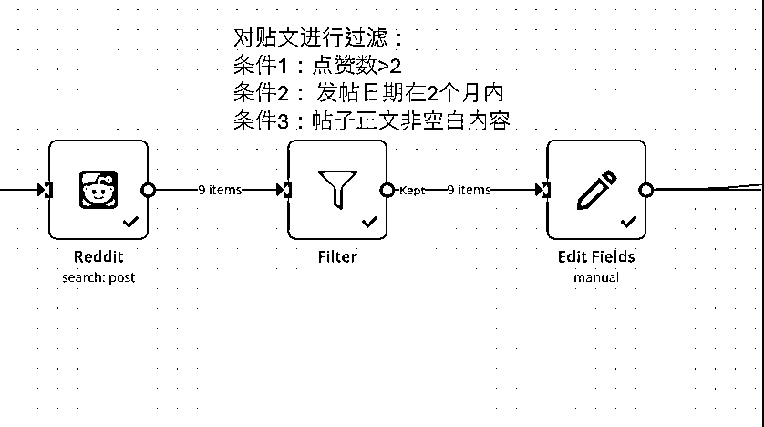
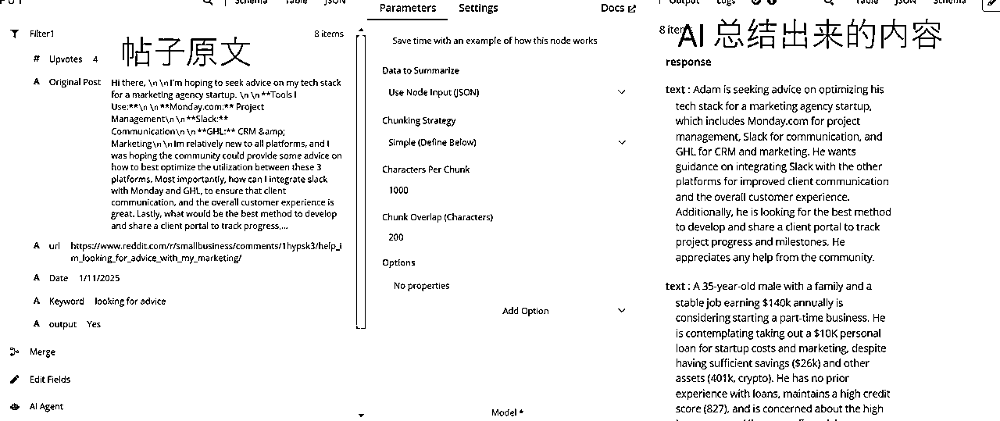
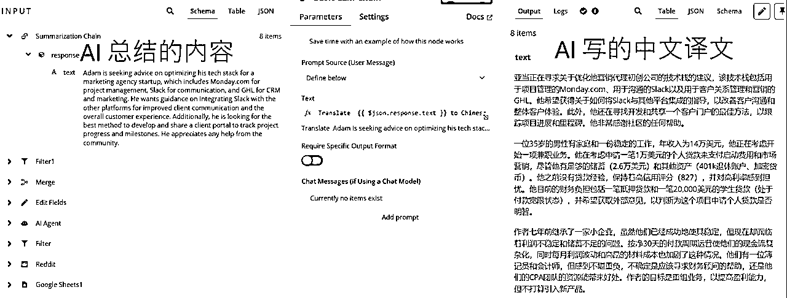
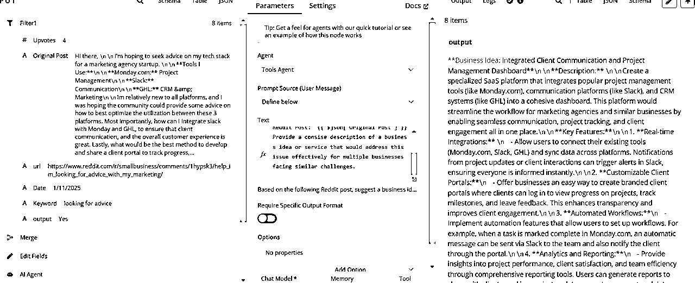
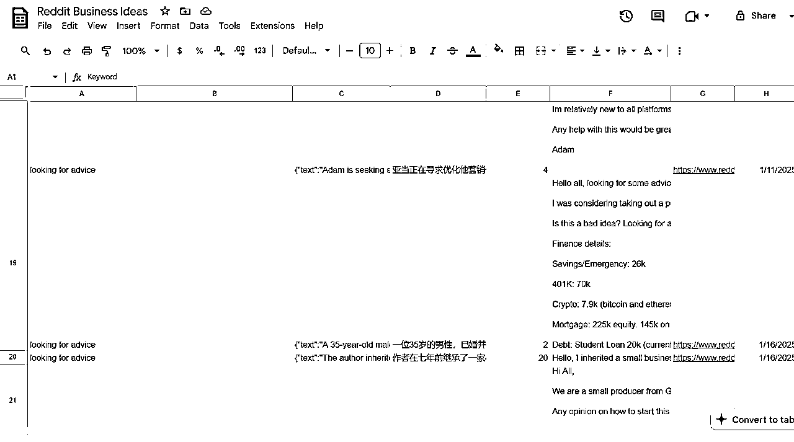

# 用于挖掘Reddi 需求的 AI Agent

> 来源：[https://zcnzawlx2ndr.feishu.cn/docx/AUxIdF9X0oYRQ4xvjoUcm0llnHd](https://zcnzawlx2ndr.feishu.cn/docx/AUxIdF9X0oYRQ4xvjoUcm0llnHd)

大家，我是2024年10月加入生财大家庭的四喜，这是我第一次发帖分享，请大家多指教！

昨天看到亦仁大大的龙珠悬赏，决定把最近做的一个用于挖掘国外Reddit社区用户需求的AI Agent 分享出来，也希望大神们给我一些反馈，让我继续成长！

为了方便展示，我给这个AI Agent 起了个名字叫 Reddit Agent

### 关于Reddit社区

总的来说，Reddit里面有许多小社区（Subreddit），这些社区里面都是活人在参与讨论，寻求别人的意见，隐藏着很多真实的需求和痛点。我们知道，如果要开发一个app，作网站，或者跨境电商选品，找到用户未被解决的需求和痛点是很重要的一环，那么这些subreddit里面就藏着许多钻石等我们去挖掘。比如我们的花生圈友，就是从subreddit里面根据一个很无厘头的需求开始，最终开发出一个爆款app - 小猫补光灯。

之前圈友老彭也发了一篇Reddit 扫盲贴，写得非常详尽，有兴趣的圈友可以参考。

### 关于我做的这个Reddit Agent

这个可以看作是一个AI Agent，也可以看作是一个AI工作流，它能实现的事情是：

第一步：根据指定的关键词，在指定的subreddit小组内搜索含有关键词的帖文

第二步：根据设定好的条件过滤贴文

第三步：让大模型对贴文内容进行分析，分析出哪些贴文是与业务需求相关的。返回答案：Yes / No

第四步：过滤掉与业务需求无关的帖子

第五步：让大模型总结每个贴文的内容；把每个贴文翻译成中文；同时根据贴文内容给一个解决方案

第六步：把所有信息都存入Google Sheet

### Reddite Agent 关键步骤展示

1.  工具用的是n8n，是一个以Langchain为底座的低代码 AI Agent和工作流搭建工具。我感觉这个工具类似于DIFY，比起Make自动化工具可以处理更复杂的功能，支持本地部署

1.  根据指定的关键词，在指定的subreddit小组内搜索含有关键词的帖文

先把关键词存在一个文档里，我放了3个关键词

1.  根据设定好的条件过滤贴文

1.  整个模块让大模型对贴文内容进行分析，分析出哪些贴文是与业务需求相关的。返回答案：Yes / No

提示词：Decide whether his Reddit post is describing a business-related problem or a need for a solution. The post should mention a specific challenge or requirement that a business is trying to address.

Reddit Post: {{ $json['Original Post'] }}

## Output Format

Return Boolean output

If the answer is affirmative, return Yes, if the output is negative, return No

大模型返回结果：9个Yes, 1个No

1.  过滤掉与业务无关的帖子，最好剩下8个帖文进行进一步处理

1.  针对和业务相关的8个贴文，Reddit Agent 继续以下操作：

1.  总结+翻译成中文

1.  根据业务问题给一个解决方案

AI 根据原贴文给出具体的Business Idea

1.  最后把所有信息汇总好，自动更到google sheet

### 总结

1.  这个Reddit Agent 的启动可以是手动也可以是定期自动启动

1.  这个方案还有其它的延申：

1.  延申思路1：可以让Agent根据贴文自动生成一篇博客发到网站

1.  延申思路2：把贴文和评论抓下来，做一个数据库，有需要的时候用

1.  也可以自动发贴文和自动回复等等

1.  大模型的输出有不可控性，结构化提示词是相当的重要

第一次在社区发文，谢谢观看 ~