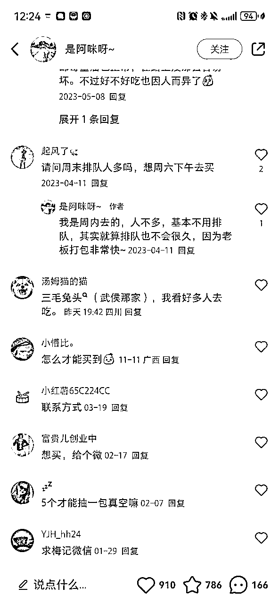

# 文旅餐饮矩阵运营复盘

> 来源：[https://n1dkx7fiuye.feishu.cn/docx/O9sydR4eYojqTrx0Vbpc4aqUnoh](https://n1dkx7fiuye.feishu.cn/docx/O9sydR4eYojqTrx0Vbpc4aqUnoh)

“我现在每个月都能稳定跑大几百万的流量，有什么变现效率比较高的业务吗？”

大家好，我是大周，在成都做实体获客流量业务。

开头的问题，是我今年九月份回杭州的时候，问圈友@曹聪 聪哥的原话，

当时我的团队已经拥有比较成熟稳定的流量获取能力，也跑了一些各行各业比较有趣的项目，

像家政的 家政阿姨 https://v.douyin.com/CeispuPP/

像亲子培训的https://v.douyin.com/CeisoVqs/

像禅修营招生的 https://v.douyin.com/Ceisc9pD/

等等

做这些项目的过程中，把整个矩阵的业务流程，团队经验都培养得比较好了。

就想着再找找看有没有相对利润比较高的项目，去跑跑看。

聪哥是我认识在本地生活方面做得比较厉害的圈友老大哥，

在这方面给了我很多建议，

最后他反问我说，为啥不做我之前的老本行，餐饮方向呢？

我说餐饮我自己都开过一百多家店，这行业利润太低了，不管是代运营还是自己做，都不太有能力支付或者说覆盖营销成本。

聪哥就问我说

”餐饮就没有接近100%利润的业务方向吗?“

可能是因为自己做了四五年餐饮，就对这个行业有些看轻，总觉得别的业务是不是更好更赚钱呢？

这个问题提出来之后，我就仔细考虑了下。餐饮有没有接近100%利润的模式呢？

确实是有的，就是文旅餐饮。

文旅餐饮是比较特殊的一种餐饮业态，大部分餐饮，不管是商场门店、街边门店、还是连锁化门店，在营销投入上更多会更加看重直接的团购销售数据，有主打性价比的，有主打口味的，但不管怎么样，大多数都是面向本地消费者做营销，但是文旅餐饮不同，文旅餐饮在本地获得一定的客群基础后，更多是面向全国消费者做营销，做种草。

文旅餐饮的门店，大多数都以地方特色餐饮为主，比如四川的兔头、蹄花，东北的汤饭、西南的菌菇火锅等等，要么是有历史渊源的，要么是地方特色食材或者口味的，就类似于说，咱们到了成都要吃一顿火锅，到了自贡要吃一兔头，到了杭州你可能也会考虑吃一碗杭帮面。

像大多数的餐饮，因为店开在城市密集商圈里，竞争对手多，营销包括价格方面竞争方面的压力大，所以利润确实会薄一点。

但是文旅餐饮往往是开在文旅景区，景区内的餐饮，是有门槛的，商铺有限，租金也会高很多，所以竞争对手的数量往往都会被限制住，尤其是在三四线城市的小众景区。

比如说我刚来四川的时候，去了自贡一个古镇，叫艾叶古镇，非常原生态的一个古镇，也确实是非常小众的一个景点。

就像我标注的一样，这个古镇上，一共就五家餐饮店，也就是说，你如果能够在这个商圈里开一家餐饮店，你的竞争对手只有这几家。

我当时问当地的一个老板，我说这个小镇，每年能有多少游客？

那个老板告诉我，不算自贡市区来的，外市来的每年有十多万人次，这个数据跟我在豆包上查到的数据比较接近。如下图。

也就是说不考虑本地餐饮需求，全年也有十万外地游客来这边，平均每天接近300人，大家经常出去玩的都知道，旅游就是两样事情，逛吃逛吃，逛完了就得吃，

吃什么呢？吃就是吃当地特色餐，有句话叫“来都来了”对吧。

当时一起去自贡这个小镇的，有一个朋友是当地的餐饮老板，告诉我这个小镇上一家卖当地特色土鸡脚的店，单店月净利润在20万往上，旺季只会更高。

像这样的小景点，全国数不胜数，当然也不全是小景点，像一些三四线城市也会有一定的旅游资源，那么整个城市的餐饮也都有机会带动起来，类似之前的淄博烧烤、天水麻辣烫。

这样的业态，跟前几年生财很热门的“淘宝蓝海”非常相似，小众文旅资源就可以理解成电商平台上的小众类目，利润没有那么卷的同时，竞争对手也有限，消费者非常依赖搜索结果来做消费决策。

所以像这样的文旅餐饮门店，做营销的思路也非常明确，就是打关键词，做好搜索结果的优化，把跟景点、地名等等所有文旅相关的词都做进营销内容里面。

# 一、筛选适合的文旅餐饮项目。

九月底，经过多方考察，确定了这个文旅餐饮的方向比较可行之后，我开始逐个筛选我之前在餐饮行业积累的一些资源，本来是想在成都找一个项目的，但是想第一次上手，还是先找个小地方的文旅餐饮做吧。

最后跟牡丹江的一个汤饭类项目开始了合作，综合考虑的因素就是两点，

一个是牡丹江也有丰富的文旅资源，又是中俄边境，冬季又是赏雪旺季，同时去年哈尔滨也有一波很强大的文旅热度，今年应该也会延续这个热度。

另一个就是牛肉汤饭，是非常有东北地方特色的一个餐饮品类，冬季也是汤饭消费的旺季。

# 二、流量打法

我去年在生财分享过短视频的矩阵打法，这是去年的玩法，比较基础https://articles.zsxq.com/id_wmp6qws20x14.html

这个打法已经过时了，今天的分享我会给大家更新一下目前升级后的打法。

## 1、矩阵账号的分层运营

账号一共分三层，

*   首先是品牌矩阵号， 包括门店蓝V号，来客职人号（连锁主体可以设置200职人号，单店可以设置5个/每店）。 这部分的账号因为都是实名号，权重较高，播放量和带货能力都比较强。

*   其次是素人矩阵号，包括员工自己的个人账号，品牌自行注册的大量素人号（通过PDD购买虚拟运营商号卡，可以突破三大运营商实名号卡额度限制，单人50+号卡，单号卡成本6元。），顾客扫码发布的账号。

*   然后是探店达人号，目前探店方向， 规定地域IP的云剪达人账号，单条发布，2级以上达人，带货模式（绿标）成本在3元左右（不同区域的成本不同），铺1000条的成本3000元，很多同行说云剪号没有流量，我们实测下来其实流量不小，关键还是在于内容质量。 然后是当地的实探和云探账号，一般是5级以上达人，价格50-200元不等，一般会安排50条/月的数量。

为什么要明确不同的账号呢，因为我们在做矩阵营销业务的过程中，发现不同类型的账号，流量不一样，带货能力也有很大差异，不同的账号需要做不同的内容，才能将这部分账号的价值最大化。

举一个最简单的例子，同样的内容，你用带货模式（抖音左下角POI显示绿标）和打卡模式（抖音左下角POI显示白标），带货模式点击直接进入门店团购界面，打卡模式会进入类似小红书的POI页面，仅显示打卡模式的视频，需要点击页面很小的一个按钮才能进入团购界面。

所以打卡模式的视频，就适合种草目的的内容，而带货模式的视频，就要做卖货目的的内容。

## 2、不同分层账号的内容运营

今天的分享重点讲抖音板块：

### 品牌蓝V账号内容模板如下：

### 职人账号内容模板如下：

大字报带货模式，和趣味美食模板

### 素人矩阵内容模板如下：

主打两类，新闻体模板造势，

和旅游攻略类模板种草，做文旅流量：

### 达人矩阵内容模板如下：

混剪美食带货模板：

混剪伪探店类模板（美食素材+达人批量拍摄的露脸镜头一起混剪）：

### 脚本总结：

因为我们要打的是文旅餐饮，所以素材和脚本，

1、要有结合文旅属性。文案和素材要带上地标建筑和景点，比如牡丹江的车站，机场，交通枢纽，素材里要有热门商圈和景点的镜头。

2、要体现地方特色，比如这个汤饭店，要体现正宗地道的东北大米，要让东北口音的服务员出镜。

### 内容生产力工具

至于这么大批量的内容生产，怎么降低生产成本。尤其是脚本文案的去重。

1、剪辑工具：我们团队用的是火山引擎的智能创作云，可以批量剪辑和生产内容。

2、文案工具：团队会每周整理爆款模板，然后用ai改写版本，方法如下截图：

第一步：找到你要的模板，让豆包AI直接拆爆款模板，然后改写爆款模板。

第二步：将上述脚本，导入剪映。批量生成不同的音频文件和SRT文件。

第三步：将上述音频文件导入混剪工具，进行批量剪辑。

## 3、内容关键词梳理

上面的矩阵方案和内容生产力工具，其实大部分圈友都能搞定，都只是细节而已。

我觉得比较重要的一点是内容方案，尤其是内容关键词的梳理。

像我们目前接了好几个文旅餐饮的项目，前期做方案的时候，最花时间的还是在于关键词确定和相应的爆款内容模板。

关键词的确定很重要，我们目前的做法是这样的

关键词模板化：地域词+行业词+问题

地域词就是黑龙江、牡丹江、夏威夷区，某某街道，某某小区、莫某写字楼

行业词就是：美食打卡、必吃美食、巷子里的店、苍蝇馆子、本地人推荐、美食攻略、附近老字号美食、排队、无法超越、没有对手、土著整理、宝藏美食、小众餐馆、美食地标、美食爱好者必去、高性价比美食、美食宝藏清单、美食地标打卡、老字号传承、美食达人私藏、一生必吃的美食、深巷宝藏餐馆、传奇苍蝇小馆、本地土著强推、详细美食攻略秘籍、苍蝇馆子、汤饭店、老店、快餐店、东北菜馆、必吃美食

问题词就是：怎么点菜、团购套餐是什么、招牌菜是什么、好吃吗、正宗吗、中午排队吗、好停车吗？新鲜吗？上菜快吗，能外卖吗？有什么优惠、有包厢吗？几点打烊？人均多少？跟其他店区别？调料配方？

把每个项目的上述关键词梳理出来，然后让ai来自由结合，就是文案标题里的模板了。

## 4、评论区截流：

之前做东北这个汤饭项目的时候，还没有用这个评论区截流的方式。

后来做四川这边项目时候发现，评论区截流一定要做。

像这条视频，在达人广场后台看数据，

这条视频的播放量跑了四百多万，

但是我想这个店的老板一定开心不起来，因为评论区全部在讲另外一个同样卖干果兔的店。

所以我们现在做任何一个文旅餐饮的项目，都会疯狂在同行的热门内容下面做评论。

比如我们现在做的一个成都兔头的项目。

基本上覆盖了兔头搜索结果下的热门内容，基本上评论够100多条热门笔记，相应的这个词就会变成蓝色的搜索词了。

文旅餐饮做截流的好处是，因为不涉及引流打粉，什么A种B收的打法都用不上，纯种草而已，因此不容易被封号，同时像这样的打法成本是非常之低的，基本上只需要定位到竞品品牌、同城大V、历史搜索结果这三类的帖子，定期监控，及时覆盖评论区，就可以把那些动辄四五万甚至几十万探店费用的网红博主的笔记或者短视频，变成给你目标门店导流的渠道了。

# 三、数据总结

东北汤饭这个项目，我们10月份中旬做的，安排了两个小伙伴，集中火力半个月，矩阵的各类分层一共做了1000多条视频。

整体播放量跑了200万，条均播放量有1500+，对于矩阵分发来讲是比较好的一个数据表现了。

给单门店带来了3万+线上销售额，线上交易额核销了1.89万，半个月带动到店人数是1868人。

等于每发一条视频，就能带动一个人到店。

因为这家店用料比较扎实，比同行门店客单价要高出5-10元，没法走性价比路线，所以团购交易额没有比较明显地带动，这是比较遗憾的地方。

门店老板反馈讲10月份门店午晚餐期间，都会排队半小时以上。

像这种文旅餐饮的内容，做起来比较有想象空间的地方，就在于它不会像集中批量的达人探店视频一样，几天时间提高很多的销售额然后就没水花。

而是会比较细水长流，各方面的交易数据都会随着内容量的不断累积，关键词搜索结果不断覆盖，而形成一个比较稳定的增长曲线。

像这个门店，10月份集中发了半个月视频，11月开始就只保持蓝V号和职人号的更新，但是销售额和核销额度一直没有下降，反而还在继续稳定增加。

另外像我们在牡丹江一个市集中铺了1000+短视频，很多视频挂上了加盟咨询的关联搜索，所以半个月也带来了几十条加盟线索，但是不清楚老板后续的加盟转化。

# 四、业务总结和思考

1、目前我们已经承接了四个餐饮类项目，是按照3万/月的服务费收取，但是因为这个费用是包含了咨询和执行同时的费用，因此其实四个项目的利润还不到10%，这个是比较尴尬的地方，人工成本+执行费用（拍摄分发），3万/月的服务费是比较低的。

2、在做了四个项目，有了部分案例的基础上，我在北京开设了一期餐饮行业的矩阵营销培训班，收费5980/人，来了30+学员，目前根据反馈来看，这个培训业务在未来一年的时间内是可以持续进行并存在放大的空间的。这部分的利润就比较高了。

3、对于生财圈友来讲，我觉得我这个业务，就是比较完整的一次借助生财的资源和打法进行创业的过程。

在做这个业务的过程中，我大部分的灵感以及绝大多数的执行层面的业务流程，都是在生财的分享帖，或者跟各位生财圈友们的沟通中受到启发的。

矩阵模式的玩法，是充分参考了鲸点云做抖音鲸致生活的打法，@刘杰 @曹聪 刘杰老师和聪哥给我无私分享了很多平台的资源、政策变化以及业务所需工具。

小红书的工具，是@杨涛 涛哥给我提供的，@富贵 富贵老师教我使用的（尤其感谢那几个凌晨两三点的电话，半夜不睡给我辅导。），说实话这个工具非常牛逼，但因为我们没有打粉引流的业务，在我手上只作为截流评论工具使用，显得有点宰牛刀杀鸡了。

内容创作，图片的AI工具，是@刺猬 刺猬哥给我启发给我看案例，给我发学习教程链接的，虽然很早就意识到ai牛逼，但如果不是今年回了几次杭州，肉眼看到几次真实应用场景，我可能要很久以后才会把这个东西应用到业务流程里。

尤其感谢其他更多的圈友，像@条形马、@黑小喵，@大树等等，在我刚开始这个业务的阶段，给我介绍业务和客户。

我觉得生财有术是一个极其神奇的社群，待得久了，会发现创业过程中需要的大部分技能和资源，都能在这个社群里获得，我们就好好地把拼图工作做好，大概率就可以养活自己或者实践自己的一些想法了。

这个业务给我最大的启发是以下两点：

1、城市之间的差异，同样的打法和玩法，在北上广深杭，三四百万一个月的播放量，连点水花都看不到，但是在三四线城市，这样的流量完全足以使一个默默无闻的小店大排长龙，变成网红店，甚至是地标性打卡门店。

2、圈子与圈子之间的信息差，我们今天在生财这个圈子里聊矩阵聊引流获客，似乎所有人都已经司空见惯，所谓的这些打法和SOP都已经是基础常识了，但是哪怕是生财五年前的内容，你放到某一个传统行业的圈子里，都是一种巨大的认知差。

我因为自己做餐饮，又是生财圈友，我也常常觉得我所日常接触的这些东西也没什么大不了的，直到我做了几个案例之后开始做培训了，我才发现原来这些互联网圈生财圈的基础常识，在这些传统老板这里是这么的稀缺。

我在想哪怕不说生财圈里其他的打法，单单是我这个帖子里所说的矩阵打法，如果不是跟餐饮行业结合，跟其他传统行业去结合呢？是不是也一样存在非常大的机会呢？

12月底我在杭州跟刘杰老师约了一个咖啡，对于上面两个想法，我们的观点都非常一致，一定要去下沉市场赚钱，也一定要去赚抹平不同行业圈子之间认知差的钱。

不知道大家对此怎么看，也欢迎一起在评论区多交流看法呀~