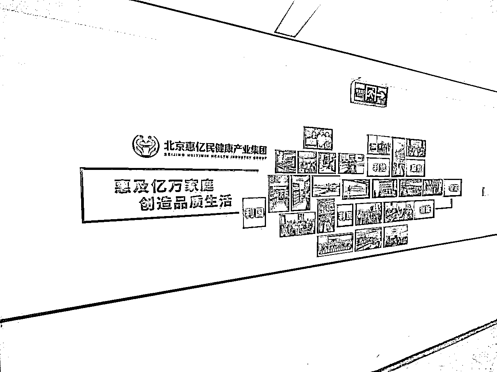
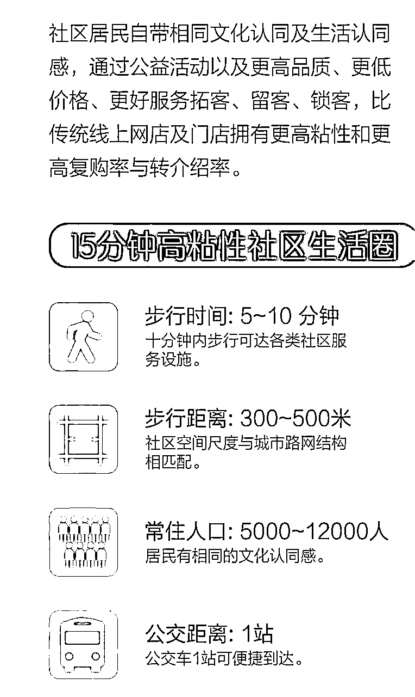
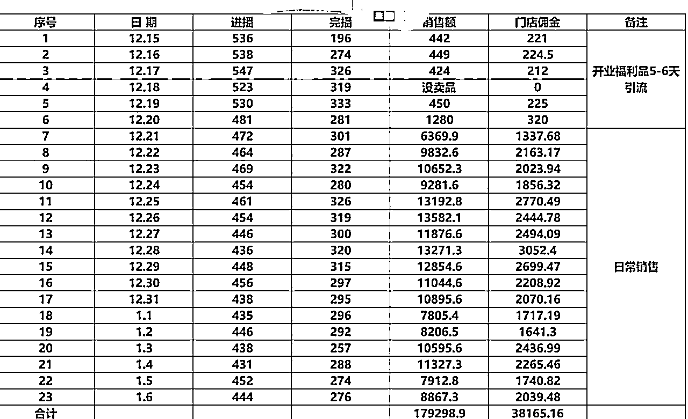
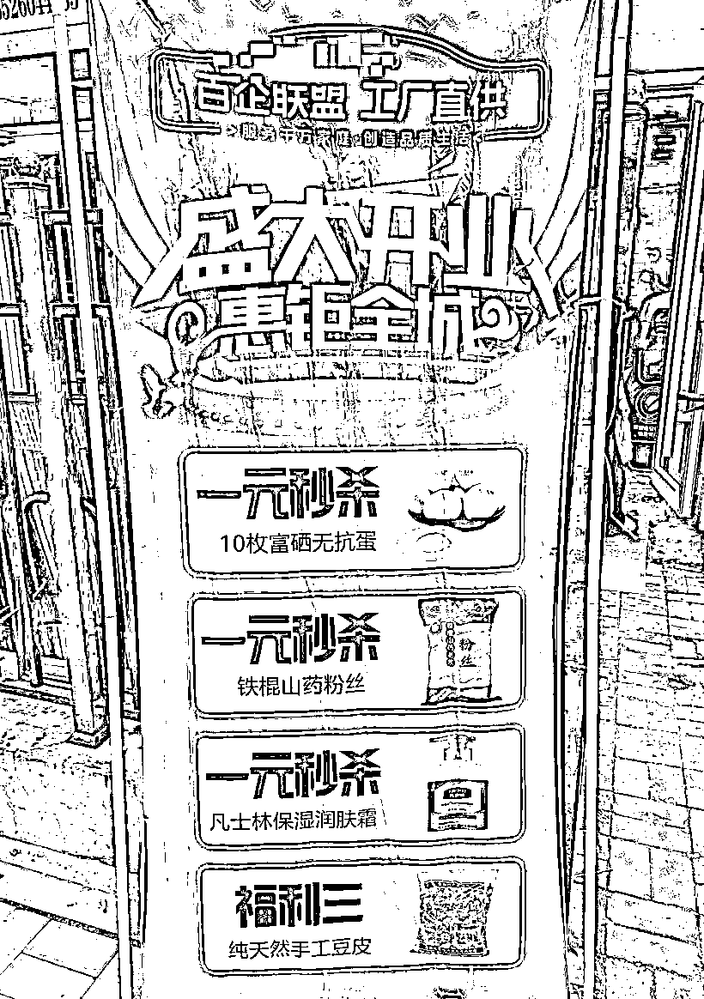

# 火爆的私域直播，到底是怎么回事

> 来源：[https://aso41gpxhm.feishu.cn/docx/AwoKdjGx8oHHEtxeSpMc6Kwznsc](https://aso41gpxhm.feishu.cn/docx/AwoKdjGx8oHHEtxeSpMc6Kwznsc)

最近私域直播，这个模式在市场上取得了巨大的成功，目前年销过百亿的公司有几家、年销过几十亿的几十家，年销过亿就不计其数了，圈内人的共识，未来产值应该过万亿，

但是很多人也认为是骗局，面向中老年人的骗局，品特别差、专坑中老年人，为此，我实地去了多个社区门店，而且我也去了一个比较大的私域直播平台的总部，其实品都是还是不错的，服务也是不错的，也没有想象中的那么差，其实这一套本质上中老年人的流量洼地，有一些平台还是在认真做事情，有一些平台是好，还是不能一棒子打死，我们还是要拥抱新事物、拥抱未来，

私域直播，其实也是一个同城实体赋能的业务，我称他为，同城社区小店赋能，用私域直播的方式赋能社区小店，

私域直播，其实就是社区团购的高毛利版本、中老年人版本，就是将社区小店周边的中老年流量，通过送鸡蛋等低成本的方式，把他们吸到私域中，再把之前线下会销（先送礼品、组织讲座，然后再推销产品）搬到线上直播间，售卖中老年保健品、旅游品、地方特产等高毛利产品，通过到店自提的方式，完成社区小店单店模型的闭环，

我通过下面5个点，讲清楚为什么这套模型可以支撑起万亿产值，

1、社区团购模式，团购集采+到店自提对电商效率做了极大的提升；

2、以社区店为支点，借助信任、服务把流量成本历史性降低；

3、银发人群为主力，巨大的基数、巨大的消费力支撑起万亿市场；

4、线下会销线上直播化，把成交效率进行了创新性的提升；

5、单店模型足够标准化、普适性，具备全国规模化的能力；

6、普通人如何入局这个赛道？

## 1、社区团购模式，团购集采+到店自提对电商效率做了极大的提升；

团购，电商领域的超级黑天鹅，团购这个领域长出了美团，长出了拼多多，长出了聚划算，长出了直播电商，让整个阿里在近几年绝对焦虑；

我们就以黄峥的思考来讲述，传统电商是其实就是把义务小商品搬到网上，流通侧信息高度透明化，线上商贩竞争越来越激烈，线下生产的计划脱节和对比就越厉害，其实对线下传统制造业改变并不多；

那解决方式就是黄峥用倒立的资本主义来解决，富人有资金抗风险能力强，穷人愿意向富人买保险， 换过来如果穷人愿意把自己购买的意愿卖给富人，也就是说先把自己的需求提出来，把一批人共同的需求做一个归集，再提交给生厂商，这样后端生产商就是可以实现需求和资源的有效配置；

团购就是把一些需求滞后一些，这样后端可以根据一部分确定化的需求，来调整实现最高效率运转，高于传统货架电商。

我们梳理一下线下蔬菜水果小贩的整个流程，这里只是梳理最简单的流程，一个农户a种出西红柿，当天采摘然后小贩b来收，小贩b卖给批发市场c，小贩d来批发市场采购之后，去摆摊售卖或者是自己的店铺售卖（店铺一般都是对应的小贩直接配送，在这里咱们阐述最简单的流程）；

这里小贩b，批发市场c，小贩d，对于这个西红柿都是x因素，纵然可以根据之前的经验确定采购多少，销售多少，但终究不是确定的因素，不确定就是无法实现资源的最高效利用，不确定就意味的无法在供给侧进行改革；

首先团购集采＋到店自提带来了

1.带来了确定性需求，也就是苹果要了多少斤，在这个确定性需求下，整个链条下，更可以进行资源的最高效利用；

2.缩短了整个环节，产地—供货商－仓库－社区门店，通过环节的缩短，降低了运费，降低采购成本，降低了客单价，

这就是社区团购的创新，也是为什么私域直播可以支撑的核心原因。

## 2、以社区店为支点，借助信任、服务把流量成本历史性降低；

章燎原讲了一个观点，中国改革开放40年多年来人口和人口的分布方式造成的结果，而未来5到10年中国的人口流动可能没有那么大了，城镇化就是将每一个商圈的人口密度急剧提高，而且变得稳定，这个时候就能够支撑很多以前不能进场销售的业态，成为进场的销售，所以会延伸出很多基于社区的更多商业模式

私域直播其实就是以社区店为核心，服务社区店附近的中老年的客户，就是社区团购+中老年人群

社区店获取流量有几大优势

1、社区店附近人口密集，区域流量大，

对于同一个市场来讲，只要在这个市场中的人，实现10%人使用一个产品，就是实现自然裂变，形成引爆，

因为区域流量本身是密集的，所以很容易做到10%；

2、社区店有老板的背书，能建立起天然信任感；

因为社区店的老板只要是经营3个月以上，基本社区附近的中老年人都会认识他，有天然信任感的流量更容易获取；

3、社区店到店自提，可以进行服务；

中老年人对于产品的使用大量的误区，尤其大量的空巢老人更需要一定的协助，流量粘性就做起来了。

基于上述三个点，社区团购+中老年人群，把流量成本历史性的降低了，所简单的模型就是送鸡蛋、红枣等方式，把附近的中老年人群拉进来，

一个店，2000人私域，1000人进直播间，一个月，5-10万的成交额，因为那些品，都是超高毛利的产品，利润超级高，

当时我还看到了一个数据，当时400个店的数据，大概月gmv大概是3000万，毛利30%-40%，

这是一个在杭州模型店的数据，整个数据还是很爆的，

## 3、银发人群为主力，巨大的基数、巨大的消费力支撑起万亿市场

目前60岁以上的老年人群，在中国人口接近3亿，而且人均存款在26.8万，这是一个巨大的消费市场，而且中老年人群是真正爱自己的那个人群，他们在健康、旅游、娱乐等领域有巨大消费力；

银发人群现在的消费趋势也正在转变，从节俭型消费到价值型消费，也就是说更愿意为优质的生活方式做买单；

## 4、线下会销线上直播化，效率进行了创新性的提升；

中老年人的线下会销，其实就是一种针对老年消费群体的销售模式，

简单点就是通过举办各种讲座、讲解会，吸引目标客户群体参与线下活动，并通过现场演示、产品试用、互动沟通等方式，促使消费者当场下单或建立长期关系，

因为之前疫情，开不了线下讲座了，所以就搬到了线上，之前一个讲师只能触达几十人或者是上百人，通过直播的方式几万人或者是几十万人，

直播也不是用传统意义上抖音、快手视频号的直播，用的是小鹅通相关的直播工具，

有一些在直播工具上可以设置各种各样的激励，例如：看直播领红包、看直播领积分，这样中老年人就愿意在直播间里看几十分钟的直播，

线下会销线上直播化，形成了一个新效率的创新。

这是最早的打法，随着私域直播产品的演化，现在产品力其实越来越好，高价值的产品也越来越好多，服务越来越好，

## 5、单店模型足够标准化、普适性，具备全国规模化的能力；

只有封闭边界，才能无限复制，因为有了聚焦单位，只有找到了单位，你才能无限复制。

对于一个社区店，这个聚焦单位的模型就极其清晰，

先有一个社区小店入驻一个私域直播的电商平台，然后这个社区小店把周边附近3公里的用户，通过送鸡蛋、送红枣的方式，把附近3公里的中老年人拉过来，

在直播中进行变现，后面社区小店的店主，再进行持续性的运营，跟附近三公里的用户打好关系，

这个封闭模型就很清晰了，具备了很强的规模化的能力，

接下来就是，

比拼拓店的能力、中心化直播的能力、供应链的能力、店主动销的能力。

## 6、普通人如何入局这个赛道

我们拆分环节，

店家：加入私域直播的老板

拓店：拓店、维护店的操盘手

直播：给这个平台直播的，主播

操盘公司：这个平台的主体公司

供应链：给操盘公司进行供应链操盘的

如果你是一个实体老板，可以加入一个，

如果你是一个操盘手，可以跟实体店进行联营，你来进行操盘，实现流量最大的化的吸引、流量最大化的变现，

如果你是一个主播，这个还是比较自己难起盘的，

操盘公司与供应链，就是更专业的，

目前来看，以一个实体的操盘手，跟大量的实体店进行联营，是最高效切入这个赛道的机会，你能运营几十家店，

变现也是很大的，对于这个操盘手的能力，就是能拓店，能帮这个实体店做出流量，

我们团队目前也在也在切入这个赛道，我们目前开了一个项目组，现在也开始自己开店，跑这个模型，

跑完这个模型之后，开始用我们原有赋能的方式放大，

当然很多人也在抨击这个赛道，一些品的质量不好，现在产业应该有近千亿了，近千亿的产业存在肯定有合理性，