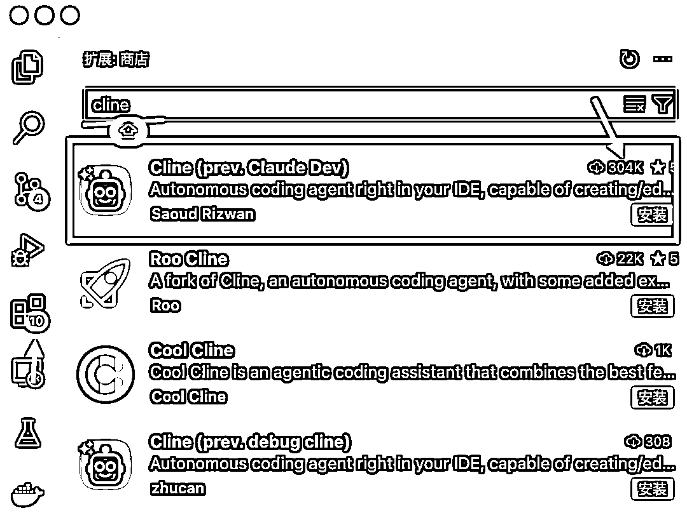
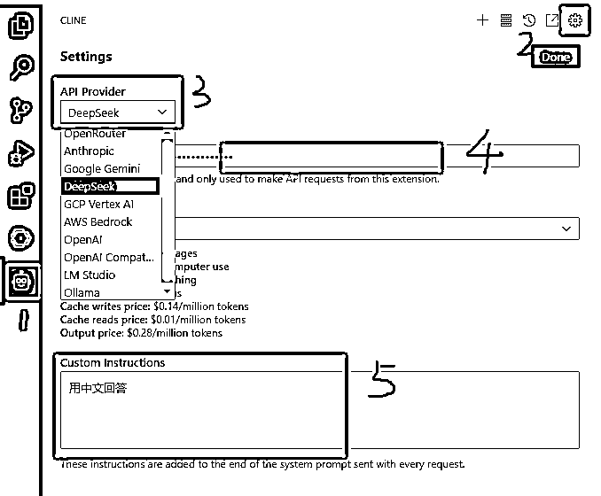

# Cursor平替，国内环境如何低成本畅享Ai编程

> 来源：[https://dxg04ukow4.feishu.cn/docx/BDETdxolno9COyxL8Kec1dyQnZf](https://dxg04ukow4.feishu.cn/docx/BDETdxolno9COyxL8Kec1dyQnZf)

# 背景

大家好，我是牧童，国企程序员。最近 Ai 编程爆火，Cursor 和 Windsurf 新产品层出不穷，不过限于公司无法用魔法，日常编程都用不上。最近找到另一种方法，用 VScode 软件的 Cline 插件 + Deepseek 的 api，实现国内环境低成本畅享 Ai 编程。

Cline 插件 + Deepseek 的 api 最大的两个优点是：

1.  不用魔法

1.  便宜

缺点也很明显：没有 Claude sonnet 聪明，复杂任务来回改都改不对，容易鬼打墙

总结：该方案适合不能用魔法、低成本尝试 Ai 编码、代码实现不复杂的小任务。

# Cline 插件 + Deepseek api 编程方案

## VScode 软件

VScode（Visual Studio Code）是微软开发的一款免费、开源的跨平台代码编辑器。它于 2015 年发布，凭借其简洁的界面、强大的功能以及丰富的插件生态系统，在开发人员中广受欢迎。

Cursor 是在 VScode 的基础上开发的，用法基本一致。打开官方网站 https://code.visualstudio.com/ ，直接下载对应版本即可。

## Cline 插件

Cline 是一款集成了多种开发工具的开源智能编程助手，它能够与VSCode无缝集成，通过与大模型（如 Deepseek v3、Gemini 2.0）的结合，提供了便捷的代码编写、调试、任务管理等功能。近期引入了Model Context Protocol (MCP)，使得 Cline 能够自己读取写入文件，哐哐自动写代码，几乎完全不需要人工干预，看 Ai 干活太爽了哈哈哈哈



## Deepseek api

前段时间 Deepseek 爆火，发布的DeepSeek-V3 在开源模型中位列榜首，与世界上最先进的闭源模型不分伯仲。

打开deepseek官网：https://www.deepseek.com/ 选择接入api


## Cline 插件配置 Deepseek api



1.  打开左边栏插件

1.  选择设置

1.  选择deepseek模型

1.  输入上一步得到的api

1.  输入系统提示词，我的是让它永远用中文回答我的问题

# 牛刀小试

今天看到Super黄的Ai编程蓝皮书，里面有一个flomo插件案例，我自己正好是flomo重度用户，自己动手照着写了一个chrome插件，方面我在看各种信息源时记录flomo笔记，方便日后随时找到原文。


给Ai提要求如下：

```
我想做一个Chrome的浏览器插件，使得能够在阅读文章时，通过打开这个插件，在右侧边栏按照制定结构输入内容，然后点击提交，一键通过flomo的API，同步到flomo内。
侧边栏里有几个输入框和一个提交按钮，下面我说说都有哪些文本输入框：
1\. 原文标题和链接（这个输入框自动带上当前网页的文章内容标题、链接）
2\. 原文摘要：这里留白给用户自己Copy进来
3\. 个人感想：这一部分让用户自己输入
flomo的API地址是：https://flomoapp.com/iwh/MzYxMjI0/********************/ 
在flomo的API说明里，给了个案例，你可以参考：
我想自己开发
POST https://flomoapp.com/iwh/MTY1OA/30d923d91fe52a7c9eb6b11111111/
Content-type: application/json
{
    "content": "Hello, #flomo https://flomoapp.com"
}
```

# api 账单消费


冲了10块钱，自己写了5~6个小东西（包括小程序、网站、插件），还有日常工作随时让 Ai 干活，用了一个月才刚过1块。。。。真是白菜价，随便造，不心疼。