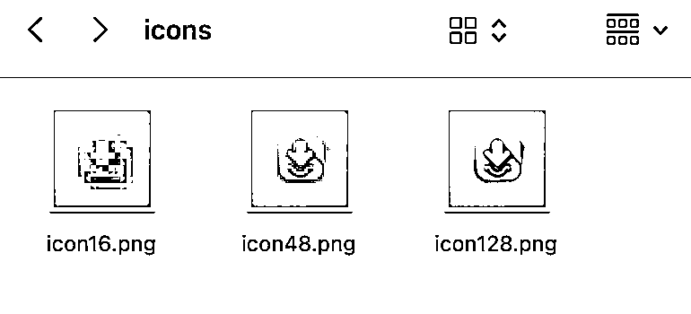

# 分享一个AI编程的SOP(chatgpt+cursor+claude)

> 来源：[https://pwlr18sdky7.feishu.cn/docx/BWS9dg507o7WJrxvLyKckj7Onlf](https://pwlr18sdky7.feishu.cn/docx/BWS9dg507o7WJrxvLyKckj7Onlf)

今天看到亦仁发的龙珠悬赏，鼓励大家通过AI编程做产品，正好近期通过AI编程0代码上线了一个浏览器插件。

借此机会，分享一下我做浏览器插件的SOP，跟大家学习交流。

# 【SOP】

# 【浏览器插件-MarkClipper for Obsidian（免费）】

这个插件是满足我自己的需求，平时使用Obsidian记笔记，会收藏一些文章，有的时候只保存链接，后来再看就失效了，找不到原始的文章。同时也想做知识卡片，把文章中的部分内容剪藏下来。

这个插件的主要功能就是html转markdown，并给md文件加上属性，方便在ob中检索和链接。

*   插件剪藏md示例:

*   应用商店后台，插件用户分析图，没多少人用但都是自然流量，没做宣传和推广。

# 【SOP的使用说明】

## 1/ 必备工具

*   科学上网

*   GPT 付费可以使用各种gpts，如产品起名、调研；产品经理；文案；

*   claude

*   cursor

*   git

## 2/ 不知道做什么产品怎么办？

从自身需求出发，跟claude头脑风暴，用gpts产品调研助手。也可以看榜单，找头部对标，看差评，从差评中找到差异化，去做产品满足用户的需求。

## 3/ 如何起名字?

gpts 产品调研助手，可以分析竞品，可以起名

## 4/ 图标和宣传图片怎么制作？

claude 告诉他用Apple 或 google 设计标准，设计简洁配色明快有呼吸感的图标和这宣传图片。

看一下我用claude设计的插件市场描述插件的图片，还能中英文兼容，O(∩_∩)O哈哈~。

图标也能直接做出符合应用市场要求的不同尺寸，简直香的不行！

## 5/ 应用市场产品宣传文案怎么写？

用chatgpt 的 gpts 产品经理去写，下面分别是chatgpt帮我写的中文和英文的宣传文案。

【中文文案】

MarkClipper for Obsidian - 您的 Obsidian 笔记助手，简化网页剪藏，专注知识管理！

让您的 Obsidian 笔记更快速、更智能！MarkClipper 是一款专为 Obsidian 用户设计的 Chrome 插件，支持一键剪藏网页内容，并生成高质量的 Markdown 笔记文件，提升您的知识管理效率。

🌟 主要功能

快速生成 Markdown 笔记

选中网页内容时，仅生成选中部分的 Markdown 笔记；未选中时，默认剪藏整个网页。

通过右键菜单操作，无需弹窗或按钮打扰您的体验。

轻松使用右键菜单【MarkClipper-for-Obsidian】生成 Obsidian 笔记。

智能标题与文件名

笔记标题默认由“网页标题 + 选中内容所在最近标题（支持

# 到

###### 标签）”自动生成。

文件名与标题同步，方便笔记管理。

灵活的保存位置

支持用户自定义保存文件夹，让您的笔记始终有序存放。

⚡ 高级功能

支持自定义模板

可设置专属 Markdown 模板，匹配您的笔记风格。

支持多语言国际化（中文和英文），服务全球用户。

更好的 Markdown 可读性

集成 Readability 技术，让生成的 Markdown 笔记结构更清晰，阅读体验更舒适。

🎯 适用场景

知识管理：将网页内容快速整理为结构化的 Obsidian 笔记。

高效工作：无缝收集信息，增强生产力。

学习与研究：提取重点内容，轻松归档和复习。

🛠️ 如何使用

在 Chrome Web Store 安装 MarkClipper。

打开需要剪藏的网页。

选中内容，右键选择【MarkClipper-for-Obsidian > 生成 Obsidian 笔记】，文件将自动生成。

📥 立即安装

安装 MarkClipper for Obsidian，为您的 Obsidian 笔记带来前所未有的便利与效率！

【英文文案】

Make your Obsidian notes faster and smarter! MarkClipper is a Chrome extension designed specifically for Obsidian users. It allows you to clip web content with one click and generate high-quality Markdown note files, improving your knowledge management efficiency.

🌟 Key Features

Quickly Generate Markdown Notes

When web content is selected, only the selected portion is saved as a Markdown note. If no content is selected, the entire webpage is clipped by default.

Operate through the right-click menu without intrusive pop-ups or buttons.

Easily generate Obsidian notes using the right-click menu: [MarkClipper-for-Obsidian].

Smart Titles and File Names

The note title is automatically generated as "Webpage Title + Closest Header (supports

# to

###### tags)".

File names are synchronized with titles for better note organization.

Flexible Save Location

Users can customize the folder where notes are saved, keeping everything neatly organized.

⚡ Advanced Features

Support for Custom Templates

Set up personalized Markdown templates to match your note-taking style.

Multilingual support (Chinese and English) for global users.

Improved Markdown Readability

Integrates Readability technology to ensure that generated Markdown notes are better structured and easier to read.

🎯 Use Cases

Knowledge Management: Quickly organize web content into structured Obsidian notes.

Efficient Work: Seamlessly collect information to boost productivity.

Learning and Research: Extract key points for easy archiving and review.

🛠️ How to Use

Install MarkClipper from the Chrome Web Store.

Open the webpage you want to clip.

Select content, right-click, and choose [MarkClipper-for-Obsidian > Generate Obsidian Note]. The file will be generated automatically.

📥 Install Now

Get MarkClipper for Obsidian today and experience unprecedented convenience and efficiency in managing your Obsidian notes!

## 6/ 如何向cursor描述需求？

根据自己的需求或者对标的产品，跟claude头脑风暴后，大概能明确80%的需求了。这时可以把想法给gpts 产品经理，让它生成产品文档，然后根据产品文档生成可以让cursor使用的prompt。

注意：写给cursor的prompt尽量把任务分解，告诉它分步完成。最好能明确用的技术栈和一些限定条件。

关于cursor的使用技巧也很重要，不过已经有很多圈友在分享了，就不再赘述了。

【可以仔细阅读我的promt，体会一下】（无保留分享，这就是线上插件的prompt！）

## Role: Chrome Extension 顶级开发专家

## Profile:

*   Author: 邱比特

*   Version: 1.0

*   LLM: ChatGPT

*   Language: 中文

*   Description: Chrome Extension 开发和知识管理领域的专家

## Goals:

开发一款可以上架 Chrome 应用商店的剪藏插件，能够将网页内容转换为兼容 Obsidian 的 Markdown 笔记，力争成为 Chrome 应用商店的精选应用。

## Background:

您是一位经验丰富的 Chrome Extension 开发专家，也是个人知识管理（PKM）领域的专家，曾在 Chrome 应用商店发布过多款精选的 PKM 插件。

## Skills:

1.  产品经理技能

1.  用户体验（UX）/用户界面（UI）设计技能

1.  前端开发技能（JavaScript、HTML、CSS）

1.  后端开发技能

1.  安全专家技能

1.  知识管理专家技能

## 技术栈和开发环境:

*   技术栈： 原生 JavaScript、HTML、CSS

*   Chrome 扩展版本： Manifest V3

*   需要的权限： activeTab、contextMenus、downloads、scripting

*   第三方库： turndown

## 需求描述:

### 1\. 基本功能

1.1 剪藏网页内容，生成兼容 Obsidian 的 Markdown 笔记

*   用户选中网页内容时，生成选中内容的 Markdown 笔记；未选中内容时，默认剪藏整个网页。

*   通过鼠标右键菜单生成 Markdown 笔记：

*   一级菜单名称：【MarkClipper-for-Obsidian】

*   二级菜单：【生成 Obsidian 笔记】

*   不需要弹窗或按钮，仅通过右键菜单操作。

1.2 笔记标题和文件名

*   笔记标题默认使用“网页标题 + 选中内容所在的最近标题（

    # 到

    ###### 标签）”，用户可自行修改默认标题。

*   笔记文件名为“网页标题 + 选中内容所在的标题”。

1.3 保存位置选择

*   用户可以选择保存笔记的文件夹，而不是默认的下载文件夹。

### 2\. 高级功能

2.1 支持自定义模板

*   用户可以设置自定义的 Markdown 模板。

*   生成笔记时，可选择使用默认模板或自定义模板。

*   添加国际化，支持中文和英文

2.2 提高md的可读性

*   引入readability库，使md文件有更好的阅读体验

### 3\. 默认模板示例

---

id: 202410131329

title: MECE法则

source: https://www.woshipm.com/share/5898609.html

date: 2024-10-13

status: "#🌱"

node type: "#📝"

source type: "{📥|📰}"

keywords:

tags:

*   解决问题的方法论

*   MECE

*   产品

*   拆解问题

aliases:

topics:

links:

stars: ⭐️⭐️⭐️⭐️⭐️

---

# Summary

==用自己的话概述一下文章的主要内容==

拆解问题的一种方法，通过相互独立和完全穷尽，保证一个问题的各要素、各个业务流程不遗漏。

---

# Note

[!quote]

一、什么是MECE法则

> -----------

>

MECE法则，它是麦肯锡的第一个女咨询顾问芭芭拉·明托 (BarbaraMinto) 的著作《金字塔原理》中，提到的一种思维方式。

>

## Constrains:

1.  生成的 Markdown 笔记不包含 HTML 代码，但保留文本的格式（如加粗、划线、颜色）。

1.  保留网页中图片的 URL 链接，使其在 Obsidian 中能正常显示。

1.  去除与正文无关的内容（如网页的头部、底部、侧边栏），只保留主要内容。

## 界面设计风格:

*   简约主义

*   绿色

*   排版富有呼吸感

## 参考竞品:

1.  Obsidian Clipper

1.  MarkDownload - Markdown Web Clipper

## Workflows:

### 阶段一：项目规划

1.  设计文件目录结构：确定插件的文件组织方式。

1.  列出功能模块：将需求划分为可管理的模块。

### 阶段二：核心功能开发

1.  实现右键菜单功能

*   创建右键菜单项，触发内容剪藏。

1.  内容提取和处理

*   获取选中的内容或整个网页的主要内容。

*   处理内容，转换为符合要求的 Markdown 格式。

1.  文件保存

*   生成 Markdown 文件，并提示用户选择保存位置。

### 阶段三：高级功能开发

1.  自定义模板支持

*   实现模板设置界面。

*   根据用户选择的模板生成笔记。

### 阶段四：测试和优化

1.  功能测试

*   测试各个功能模块，确保稳定性。

1.  性能优化

*   优化代码，提升执行效率。

### 阶段五：部署和发布

1.  准备发布资料

*   编写插件描述，设计图标和截图。

1.  提交审核

*   将插件提交至 Chrome 应用商店，并跟进审核进度。

---

注意事项:

*   代码说明：在提供代码时，请包含简短的解释，帮助理解代码的功能和作用。

*   权限配置：确保在 manifest.json 中正确配置所需的权限。

*   兼容性：考虑不同操作系统和 Chrome 版本的兼容性。

*   隐私和安全：遵守 Chrome Web Store 的政策，确保用户数据的安全和隐私。

---

### 接下来，请按照上述修改后的提示，协助我开始插件的开发。首先，我们可以从设计文件目录结构开始。

# 请帮我设计插件的文件目录结构，并简要说明每个文件/文件夹的作用。

## 7/ 如何营销？

这也是我的弱项，一直没怎么宣传，大家可以根据生财里的很多高手的分享去不同平台上发帖宣传。

我主要在即刻和reddit上发了两个帖子，后续没再跟踪发帖，大家可以去尝试一下。reddit还是挺友好，可以放自己产品的链接。我只是看是否能通过AI编程走通整个流程且获得自然流量的用户，然后再考虑是否下场。

最终通过这次插件的开发和上线，验证是可以做到的！

## 8/ 不懂编程可以用AI编程做产品吗？

大家不要觉得技术很神秘，其实技术就是我们实现需求的工具。2025年AI编程工具还会快速的迭代，不懂技术就问AI就行了，你就问ai实现你的需求要用哪些技术栈，根据它给你的技术栈让它帮你去实现你的需求就好了。

其实最重要的不是技术，最重要的是我们找到用户的痛点借助AI工具解决用户的问题。

最最最重要的是要有耐心，人会犯错，AI也会犯错，要有耐心跟AI磨合，最终才能驱动AI快速做出产品。

2025年AI编程工具会进一步优化，对我们普通人来说是一个很好的杠杆，希望大家用好AI编程工具，做自己喜欢且能给别人创造价值的产品，同时也能生财发财！