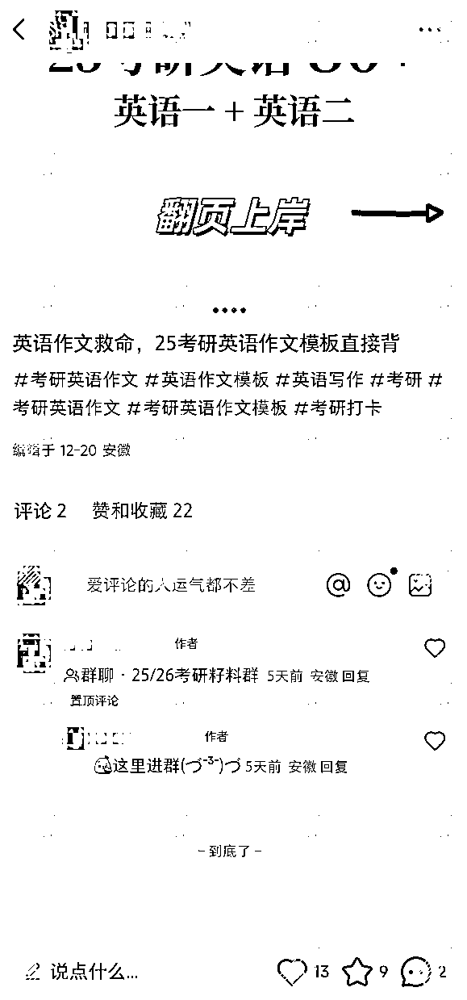

# 新人第一次迈过商业市场那道0-1的门槛——小红书虚拟资料项目复盘

> 来源：[https://gv8oauv56zz.feishu.cn/docx/BYBod3P2lo9njbxWULvchTbOnjd](https://gv8oauv56zz.feishu.cn/docx/BYBod3P2lo9njbxWULvchTbOnjd)

圈友们好，我是青城，来自安徽淮南，目前生活在合肥~

我是24年8月加入生财的，9月做公众号爆文没有成功，12月转战小红书虚拟资料，12月11号发布第一篇笔记，14号成交第一单10元，到21号考研开考一共成交53单，赚到450多块钱，成功跑通了0-1

生财应该还有很多没有跑通0-1的新人，所以我把自己做项目的所思所想，行动操作都分享出来，以便给大家做个参考。我相信跑通项目并不是新人难以达成的目标，只要认真研究项目，做好执行和优化，大概率是能够做到的🌈

希望我的分享能给大家带来一些启发🙏

* * *

# 一、我与生财的缘分

## 从知道，到认识，再到加入

有次跟朋友聊天说到怎么做副业，他说有个app挺火的叫“知识星球”让我琢磨琢磨，我第一次看到生财就是在知识星球的排行榜上，而且还是一直霸榜的那个

看到后我其实很感兴趣，但我并没有马上加入，因为刚看到并不了解，而且价格还是有些贵的

为了避免被再一次割韭菜，我就在网上搜集了一些信息和资料（dddd~），也关注了公众号，想看看到底为什么能卖这么贵还这么多人加入，这个时候大概是23年10月

当时也尝试了很多其他方向不过都失败了，包括图文带货，视频带货等等。(本人还算有点丰富的失败经历如果感兴趣可以看文末链接，就不放在正文里了）

直到24年7月底，在生财公众号看到了圈友@辛亥分享的《00后大学生，加入生财3年如何破圈成长？》这篇文章。看完之后脑子里就冒出一句话：“我想把他的成长之路自己试着走一遍。”

这句话背后的意思是，我清楚的看到了一个人是怎么成长起来的，有迷茫，有探索，有朋友，有收获，有接触面的广度，也有思考的复杂度，而这正是我极其需要的

没有犹豫，我当天就报名参加了生财体验课，一周后，以总积分第2名在2024.08.08这个日期加入了生财（这个日期数字也挺有缘分的）

之后看了一圈，我给自己定了个目标：半年内跑通一个项目，一年内发一篇长文帖。比较开心的是，我提前完成了半年前定的目标

## 进入生财后的初步学习

### 首先是从看置顶开始的

我一个个浏览过去，包括会员日活动信息等等，看到新手指南我想应该很快就能看完吧

可没想到如果按图索骥，一个链接一个链接看下去根本看不完这个链接下涉及到的文章，后面还有进阶指南，还有@罗卜和@七小两位大神整理的资料，根本不可能短时间内看完，然后我想了想，还是需要精简一下

### 从体验课提到的几个大板块开始学习

新手指南看了半个月，按图索骥延伸下去短时间看不完，所以我就精简了一下任务，把过于复杂和现在用不到的信息快速略过，浏览了解生财的大致情况之后，开始看精华帖，风向标，航海，聚会这几个核心板块的内容，时间差不多了就准备报名9月的航海

### 过程中不出意外的出现了信息焦虑的情况

开始看精华帖的那段时间，有很多写着月入1w，月入3w，月入10w，年入百万千万的标题，看得多了难免会产生再不赚钱就晚了的焦虑感

不过好在我也算赶上了好时候，9月开始打击标题党，这之后的帖子就很少出现类似的问题了，不过信息焦虑确实在一段时间内影响了我的思考，我也花了一段时间才想明白

### 跳出信息焦虑

我理解中的信息焦虑是“我想知道，怕错过导致我不知道，从而导致我的某些损失”，这其实是一种自身利益遭受损失的幻觉

如果自己一直处在这种被动接收外界信息灌输的状态，那就会一直焦虑下去，甚至焦虑到逃避，焦虑到无法行动，无法思考

焦虑一段时间后，我开始学习没有标题党的精华帖，再加上有意识的控制信息的摄入量和摄入渠道之后，发现没那么焦虑了，我学会了主动学习，而不是被动的接收外界信息

这个过程中思维上一个很重要改变是“不要想着大而全，不要想着全盘接收”

全盘吸收生财的信息，这几乎是不可能的。信息量浩如烟海，放宽心态，没看过就没看过，过去的就让它过去，没来得及看就不看，切忌大而全。

想要缓解信息焦虑，个人觉得最好的办法就是排除一切外来信息，去主动获取，主动搜索，只抓住自己想知道的一个点，由点及面的搜集并整理信息

过程中被动接收的不是自己想知道的信息，就及时过滤掉，不断暗示自己这不是我现在想知道的，以后的事以后再说，除非自己主动，其他的都概不接收

人的精力是有限的，人也不可能知道所有东西，所以没有必要为自己不知道的事而焦虑

# 二、9月航海，公众号爆文项目是怎么失败的？

## 第一次选项目，为什么选择了公众号爆文？

我想自己还是有些自知之明的，只能从最简单最好上手的项目开始积累经验，当时刚进圈的时候鱼丸给我发了个生财项目库的海报，海报上列出的项目后面都标出了上手难度，唯二的1星难度一个是小红书达人变现，一个是公众号爆文，这是原因之一

另一个原因是公众号爆文是一个从23年5月就有的航海项目，我想既然持续时间这么长，上手难度这么低，那就选这个吧，还有我想公众号能做出来的话，也算培养我的写作习惯了，就这样我就选择了这个项目

## 结果如何？

运营了2个公众号，后面又加了1个，共3个，做了1个半月的时间，赚了不到2块钱，这不到2块钱还是9.18号晚上合肥地震我赶热点随便发的一篇

刚开始的2个号，用ai写出来的文章前面还在增长，后面都0阅读了，新号发的文章前面正常，后面3个号一起发的时候就又变成0阅读了，我想可能是ip问题，也有可能还是文章问题，那到底还要不要坚持做下去呢？

## 没有得到正反馈的我还是选择了结束

我在10月底11月初参加了2场合肥的线下聚会，见到了很多圈友，也听@张波老师和@阿乐老师说了公众号爆文项目的情况

（原图已被清理）

总的来说就是，公众号爆文项目是个很卷的赛道。现在都在用ai写文章，而每隔一段时间就会出现一批新的ai工具，如果不想被淘汰就需要不停的迭代新玩法，需要不停的测试新的话题或领域。

当然，除此之外还有@西西老师日更公众号，精细化运营单账号的玩法

我自己思考后觉得，公众号爆文这个项目主要是赚广告费，但对我来说它爆文的逻辑或者说概率是个黑盒，每篇文章能拿到的ecpm也是个黑盒，更不涉及转化、交付等后端流程，我能看懂的，能自己操作的环节太少

其实本质还是因为我看不懂爆款逻辑，做不好这个项目，虽然星球里有很多做成这个项目的人，但我确实不能忽视它可能并不适合我的事实，所以我就没有再坚持下去

# 三、12月航海，小红书虚拟资料项目是怎么跑通的？

## 为什么选择了小红书虚拟资料项目？我是怎么选择的？

之前在安徽圈友群里@小花老师提到过他在6月份的一次线下聚会上和@汤不知老师聊到她在做的小红书教育类虚拟资料项目，之后小花老师也开始做这个项目，收益都很不错，虽然不是个新项目

刚好@小花老师和@汤不知老师都在10月底的那次聚会上分享了他们是怎么做的，我想身边就有这个项目的案例，而且当时还看了一些小红书app的用户分析文章，觉得小红书很有搞头，那不如就做这个吧，之后我就报名参加了12月小红书虚拟资料的航海

现在回过头看，选项目其实也不难，可以从简单的，流程少的，身边有案例的，或者自己想做的开始选，只要看看往期的航海手册就会对项目有个大概的认知

如果可以的话，还可以从项目的可操性作角度考虑，比如项目的各个环节自己是否可以自由操作，比如引流，转化，交付等。这样如果能跑通0-1，对自己也是一种极大的锻炼。

## 怎么选赛道，怎么调研，又是怎么选对标账号

### 我在纠结中选择的考研赛道

刚开始学习航海手册的时候，我有纠结过是做小学还是考研，但手册中提到过，@希平教练直播分享的时候也说过，可以选择自己熟悉的领域，如果实在纠结，那就做小学吧

教练还在群里加餐分享的时候说到，跑通项目的核心步骤就六点：

确认赛道-同行调研-确认业务路径-准备产品-搞流量-搞转化

我当时其实很纠结，想着要不就做小学吧，然后就去小红书搜了一下小学赛道的笔记和内容，找了找对标，然后发觉这些东西我都不熟悉也不感兴趣，想想后面还要和家长打交道，我心里就打了退堂鼓。

然后我又搜了一下考研赛道，发现这些都是我熟悉的内容，之前也有考研的经历，也挺感兴趣的，所以我最终决定做考研赛道。带着做笔记发内容的心态去搜索笔记，看自己想不想做，能不能做，调研一下就知道做什么赛道了。

### 距离考研时间已经很近了，还有赚钱的空间吗？

我一开始也像无头苍蝇一样，只顾着找对标笔记刷刷刷~，直到包装账号的时候才发现，简介怎么写？我这才发觉没做同行调研，也没确认具体的业务路径，然后我掉头回来去做同行调研。

有没有赚钱空间，问谁都不如问同行，虽然教练说做项目照做就好，但照做的案例却需要花费精力去确认才行。我大概花了2天的时间，找到了30来个有价值的账号，再筛掉免费分享的，引流考研机构的，看不懂怎么盈利的，还剩下5-6个，添加微信，继续调研私域情况，并估算一下利润。

最终有3个微信是同一个团队，有价值的调研案例还剩3个，最终分析下来，现阶段卖英语作文模版和政治大题是个不错的选择，对标账号的利润近3个月都很可观，尤其是其中一个在店铺卖作文模版的，估算利润在6-8w左右。最后汇总成一张表格。

尽管调研的同行并不是很多，但也对行情有了了解，可以开始着手干了，我没有继续花更多时间去调研，一方面是考研临近时间不多，一方面是想先把笔记发起来，先做了，才能不断完善。

下面是我那两天调研的总结：

### 我是怎么选择对标账号的？

#### ⭕️发笔记的对标

我把自己刷到的，数据比较好的笔记汇总做了表格，当然也对30多个对标账号的笔记做了筛选，粉丝1w以下，起量笔记在3个月以内的账号中，近半月内流量比较好的（点赞评＞1000），大概17个账号，60篇左右笔记，并按照发布时间和账号名称排序。

注意：我在这里想的是，每次发笔记前到这里找合适的封面类型，然后模仿对标做低粉爆文，但之后我改变了策略，后面会解释。

#### ⭕️引流方式的对标、微信包装的对标

我选择了同一个团队的引流方式，包括建群，关联笔记，评论区引导私信，并在群里发带有微信号的视频等等。微信头像，名称，简介，朋友圈背景，朋友圈内容对方主要发的是交易记录和收学员，且毫无规律，就没做参考。

#### ⭕️私域话术的对标

就对标我添加了微信的那几家，大差不差，草台班子准备好了，开始干了~

## 发笔记，引流，微信成交的过程中遇到的问题，怎么思考和解决的

### 怎么发笔记？发笔记的过程中遇到的问题

一开始我选择了低粉爆款的笔记去二创，但发出去之后并没有多少流量，可是我对标的账号也发了同样的笔记，他的流量却爆了。

然后我就去研究了一下对标账号是怎么做对标笔记的，发现他并不拘泥于画面的二创，而是根据对标笔记的爆款逻辑，去制作轻度原创的内容，和我自己的二创一对比，差距就体现出来了，发了几次这样的笔记，流量还是不行。

我觉得这样下去不是办法，追低粉爆款不确定性太大了。

然后我分析了一下表格里的笔记对标，封面形式多变，对标账号也是发几篇就换个封面，流量起伏且不稳定，虽然有时候会出现爆款，但我想的是不求爆款，因为即使爆了我也承接不了那么大的流量（除非做店铺），变不了现也就浪费了，我需要的是稳定持续的流量。

之后我就重新做了筛选，选出了3个封面形式固定，自己也能做得出来，流量相对稳定的对标账号，即使运营时间超过了3个月甚至半年，但只要近期流量稳定，就有参考的价值。

下面是我选定的3种对标笔记封面和我模仿封面逻辑，自己做的轻原创：

第1个，客资很少，零星几个；

第2个直接二创的，流量不错，但没有客资；

第3个，客资越来越多，一直持续到考前都有搜索流量，发出去第2天就成交了第1单。

这时我发现，我思考的逻辑好像是对的，然后我就放大第3种封面的形式，把另外2个账号的内容全部换成了英语作文，并同时测试其他封面的可能。

但很遗憾，都失败了，最终其中1个号停更（也有上班时间不停换手机太麻烦的原因），另一个号之后还是采用了第3种封面，没有再去测试新的，因为这时候考研时间已经很近了。

自始至终我的笔记都没有大爆过，最多的小眼睛不过6k+（右边图片）。

直到考前为止，2个号发了15篇同样类型封面的笔记，1篇过5k，3篇过1k，5篇过500，还有3篇违规隐藏了，正常没有低于200，流量不大，但还算稳定，总共1.5w阅读，进群250人，添加微信104人，引流率41.6%。

### 怎么引流？引流过程中是怎么改进的

我参考对标账号，建了个群起名“25/26考研籽料群”，任何人可加，对成员展示历史消息，成员消息权限全部关闭。

因为我没有准备引流用的小号，我就模仿对标做了引流用的视频（右边视频）。

这样的视频，每1-2天就重做一次，避免被小红书检测到，反正手机录屏，很简单。

笔记在最后一张图留下钩子，比如“完整版pdf，扣上岸”（“完整版”可能有风险），评论一个个回复“tt我”，私信发引流视频，或者邀请进群，笔记有10个赞后，群要关联发出去的笔记。

第1次改进：后面发现还可以提高进群效率，在评论区粘贴群链接，并自己回复自己“这里这里❤️”

第2次改进：自己用小号加群，点击加群后出现了群介绍，然后我又去改了群介绍：“25/26考研资料，㊗️宝子们考研一战上岸！❤️”

第3次改进：考生进了群不知道哪里有引导，我又去改了进群欢迎语：“可以看一下置顶🔝视频哦~(¯▽¯~)，英语作文万能模版一二都有，㊗️大家考研顺利٩(๑^o^๑)۶”，这样每个进群的都会被@，而同群的其他人不会看到满屏的@。

从看到笔记，看到笔记钩子，看到下方群聊，注意到评论区超链接，加入群聊，看引流视频，到添加微信是一个完整的链路，效率提高了很多，但评论区埋不了楼，不能给笔记增加热度，也算有利有弊，不过基本不用回评论，直接私信也少了很多，却一直都有人进群。

第4次改进：为了增加评论区活跃度，笔记刚发出去我就暂时不在评论区挂群链接，有时用小号去下面评论，等有了几个评论之后再把群链接挂上，个人觉得最好的时机应该是在有了差不多10-20个评论之后再挂群链接，这样搜索来的人看到有热度就会进来，进来就可以直接进群。

引流方式都是有利有弊的，引流链路也需要动态调整。

### 微信成交话术的问题

添加微信的基本都是有明确需求的人，我并没有花时间去发朋友圈，也还是因为时间来不及也没必要。刚开始有人加微信后，我什么话术都没准备，直接赶鸭子上架，想到什么就说什么，主打一个亲切友好、方便利他，准备好开场白，报价，网盘链接，解释话术，鼓励话术等，其他的随机应变。

因为白天赶上公司培训，不好玩手机，我就空余时间迭代自己的话术，最大化精简对话回合，第3天的11单，第4天的20单，最短的可以在2个对话回合内成交，大部分对话都在2-3个回合，后来临近考前，为了方便我也方便学生，我把链接替换成了直接发文件。

最终添加微信的104人，成交53单，成交率51%，GMV450+

话术的目的是为了成交，我没什么大的经验，但我的体验是：与人方便。

小惊喜：考试前一天和当天还有同学加了微信，但我想不卖了吧，直接免费送，也算帮助考生了，没想到考完英语后，回来给了我5.21的打赏hhh，说是背了刚好就用上了~

## 我在复盘什么，在总结分析什么？

我会总结思考遇到的问题，分析同行的现象，优化自己的业务，测试一些数据等

每天思考，总结，并在第二天去做验证

1.  可以先把成交链路跑通，再去思考各个环节怎么优化，怎么提高进群率，怎么提高笔记的热度，怎么更方便且不违规的加微，怎么提高转化，怎么提高客单价等等

1.  我有成交也就这一周的时间，每天都在想还有哪个环节可以提高效率，还有哪个环节有遗漏或风险，要及时调整，同行上门了要及时维护评论区，笔记违规了就及时隐藏，继续发下一个

1.  每天统计笔记数据，记录进群人数，加微人数，引流率，成交数，转化率，GMV等等，并分析数据变化可能的原因，时间拉长看根据数据变化的趋势去调整策略

1.  什么时间发作品有流量，我测试了8点，9点，10点，12点，14点，16点，20点，22点，发现上午发流量相对比较好，但这并不代表其他赛道是同样的情况

1.  投流能不能带来搜索流量？我测试了上午半天，发现并没有什么用

1.  什么时间加微信的人多，统计后发现上午9点半到11点半，下午1点半到4点半，晚上6点半到11点半

1.  为什么考前成交率这么高，统计同行数据和我的数据后发现，考前临时抱佛脚的人会越来越多，同行店铺的销量是加速增长的，我的成交量是递减的，临近考期，成交链路越短成交率越高

1.  如果能缩短成交链路，那销量会有一个爆发，就像对标账号，店铺销量不到2周卖出了3k+份，总共销量5k+份，客单价29.9，预估利润15w+，这还不算其他带练服务

统计同行数据，统计自己的数据，分析总结，调整策略，持续优化，然后把这些经验迁移到下一个产品或项目上，从0-1，从1-10。

# 四、想对还没跑通项目的新人，以及我自己说的话

1.  我只是展示了我的做法，仅当做案例参考

分享中没有说到我建议什么什么，因为我也没有什么丰富的项目经验，只是把自己做项目的每一步都复述出来，分享我是怎么做的，怎么思考的，怎么优化迭代的，这也是我失败那么多次之后第一次成功跑通了一个项目的0-1。

1.  1w块太远，100块太近，500块作为第一步，我觉得刚刚好

航海第一天立下要赚1000块的目标，我虽然只完成了一半，但500块也是一个对我这个新人很有意义的里程碑了，这给了我继续做下去的信心，以小见大，这个项目就有可能从1做到10，甚至从10做到100。

1.  做项目是一种轻创业，而创业是一场无限概率游戏

抛弃掉“救命稻草”“一战功成”“全力以赴”“裸辞干项目”的想法，调整好心态，把做项目当做“日常工作的一部分”来做就好。

1.  做项目没有什么黑科技

@盗坤老师说，做项目的核心方法论其实很简单：尊重常识，踏实做事，日拱一卒。随着时间的积累，时间就是最大的壁垒。

@亦仁老大说，越是着急赚钱，就越是赚不到钱；越是不着急赚钱，想着每天认真解决一个问题，长期积累，就越容易赚到钱。

现在的我坚信这一点。

* * *

以上就是我加入生财这半年以来做项目的经历，思考与总结，感谢在生财遇到的每一个人，感谢教练，感谢领队，感谢志愿者，希望我分享的内容可以给大家带来一些帮助~

* * *

上文中提到的个人还算有点丰富的失败经历（不感兴趣的话还请忽略）：