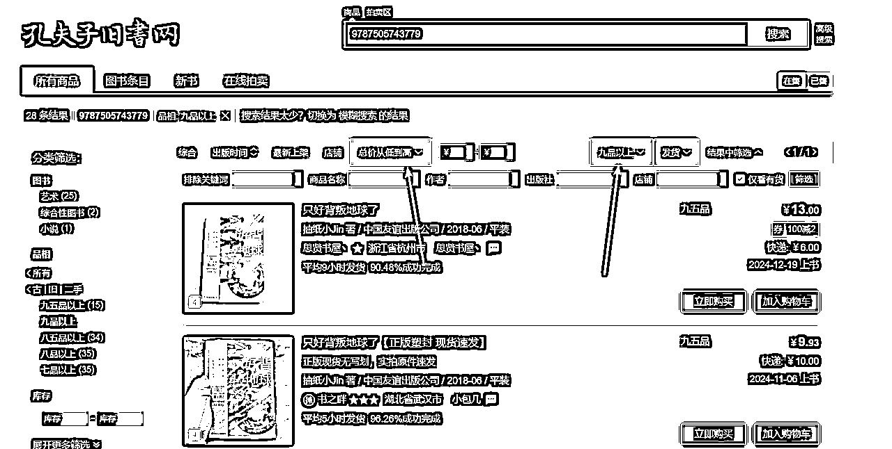
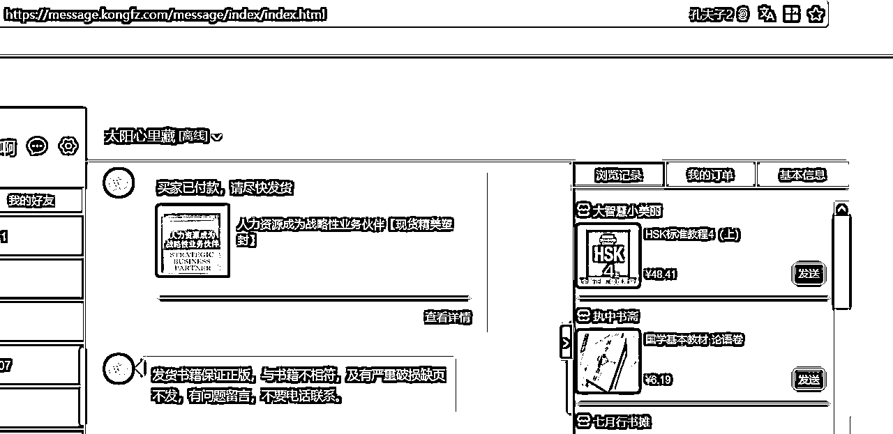
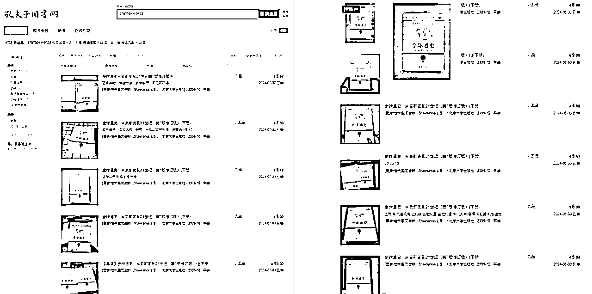
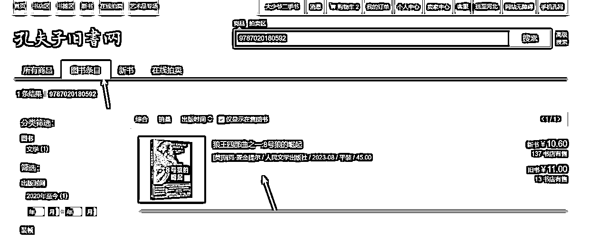
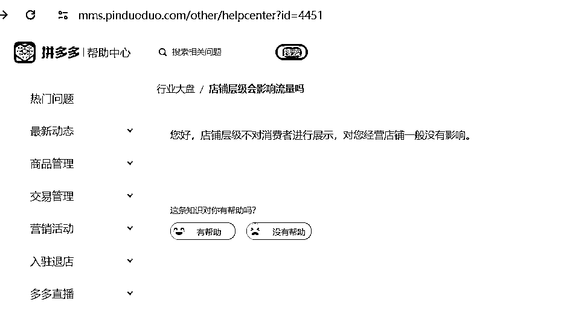
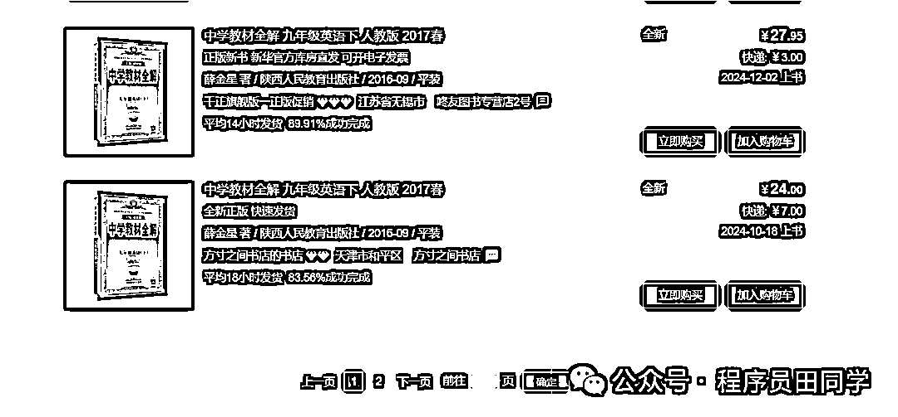

# 拼多多二手书【店群】3个月，登顶二手书头部玩家，我的经验分享

> 来源：[https://q2srbwoeiz.feishu.cn/docx/BnkSdKB7YoK6JLxI6A6c8a0enmh](https://q2srbwoeiz.feishu.cn/docx/BnkSdKB7YoK6JLxI6A6c8a0enmh)

各位圈友好，我是田二，坐标郑州，程序员|连续创业者。

入局拼多多无货源二手书三个月时间，目前我们一个客服负责一个执照下的20多个专营店，好的店铺一月一万多营业额，差的店铺一月三四千的营业额，单店20%到30%的利润率。

最开始做二手书我们是做孔夫子旧书网（https://www.kongfz.com/），用了三个月的时间我们做到了孔网同行二手书的头部，将孔网交给一个全职员工以后。我们继续测试二手书其他平台，半年时间里我们基本上把所有平台试了一遍。

闲鱼零售上品数量少，出单少，客单价低放大不容易。批发客单价高，但是售前咨询太多，做着累，淘宝二手书看中店铺权重，成本高投入大，最终我们锁定了拼多多二手书。

拼多多一套执照可以开将近30个专营店，一个专营店可以上10万品，无论是拼多多的用户体量还是上品数量都不是闲鱼二手书可以比拟的。

很多人可能会觉得二手书有那么大的市场需求吗？

自从教育部明确规定大学不允许学生强制购买教材后，二手书市场就蓬勃发展起来了，每年两个学期都会有数以百万计的大中专生在网上购买二手教材。

## 一、货源

只要我们买一本二手书，无论是在闲鱼、淘宝、拼多多、京东下单，最终二手书的货源都是来自一个渠道——孔夫子旧书网（https://www.kongfz.com/）。

孔夫子旧书网是一个很老牌的二手书交易网站，成立的时间比淘宝还要早一点。

孔父子旧书网内的二手书完全按照价格排序，并且80%的书都是卖给了代购（淘宝闲鱼拼多多多京东的无货源店家）。

代购只要在孔网下单就会价格排序，要求孔网卖家不能给用户打电话。

孔网在售图书数量庞大有1.5亿本，有 40 万的商家，这些图书都是我们上架到拼多多的选品对象。

## 二、选品

二手书的所有交易数据都在孔夫子旧书网，所以我们我们做二手书在任何一个平台，都要以孔网作为研究对象。

一般我们选品有两种方式，一个是查孔网的已售，孔网有一个很好用的功能，可以查询到每一本书最近几年的销售情况。

随便找到一本书背面的条形码下面就是图书的ISBN （图书的身份证号）。

打开孔网首页-搜索 ISBN 点击-已售，可以看到该书的销售情况，比如《全球通史》。

点击左侧的按售出时间排序，就能看到每本书最近一年卖了多少本。

通过 ISBN 判断图书销售情况，是一套标准化的操作流程，通过这套标准化流程，我们将获取到的图书交易信息保存下来，就能得到一份图书在售数据。

还有一种办法是通过图书条目，通过查看一本书的图书条目，我们能看到这本书曾经有多少人买过。

打开孔网首页-搜索 ISBN 点击-图书条目，在图书条目详情中看到多少人买过。

无论是查已售还是图书条目，多少人买过显示的都只是比例不是具体销量，但是能大致判断一本书的销售情况。

在Excel中将这些数据的isbn和价格保存下来，长时间的行业深耕就能形成一套自己的选品数据库。

不只是拼多多二手书，即便你在做闲鱼二手书，同样能拿到这套数据上架到闲鱼，比无脑铺品效果都要好上不少。

## 三、开店运营

### 1、开店

拼多多开店需要出版物经营许可证，执照注意要用个独或者公司，不要使用个体户，个体户的流量差而且只能注册三个店铺。个独和公司一套执照能注册30个左右专营店，我们在这方面踩了不少坑，花了不少钱办的个体户都没用上。

执照和许可证下来后，直接选择拼多多0元开店，上传证件大概三个工作日店铺就注册通过了。

拼多多保证金从去年降为了500，为了节约开店资金，前期可以先不缴纳，等销售的货款超过500块钱以后直接转为保证金。

### 2、上品

拼多多上品非常简单，在服务市场搜索【图书】就能找到很多相关的图书上货软件。

基本所有的二手书上架软件，上架二手书都有三个关键的字段，

一个是ISBN（上步选品得到的），

第二个是图书的售价，做二手书最核心是也就是如何给二手书定价，定价一般是参考孔网八五品以上的在售价，有的同行是取第一个，有的是取第五个，有的是第一页取平均值，不同的定价对应着不一样的缺货率。

每个人对利润和缺货率的标准不一，这个要根据个人标准调整价格。

得到商品的进价以后，接着我们就是在进价的基础之上再价格，一般加价是加一个底数然后乘以一个百分比。这样做的好处是便宜的书不至于加价过多，贵的书又能保证利润空间足够。比如（原价+6*0.2）。

第三个关键字段是库存，我们一般加库存都是1，如果书售出了，在孔网查一下价格如果有利润就继续加库存。

做二手书拼多多分为专营店和旗舰店，专营店可以上十万品，一般同行是直接上十万品，我实际测试每天上一到二万效果最佳，要做出来差异化，做精细化运营。

### 3、运营

做拼多多最怕的一个问题就是断流，很多同行前一天还是几百的访客，第二天就个位数了，我们目前几十个店铺还没出过断流问题，

减少断流问题的关键就一个原则，尽可能的遵循平台规则，减少断流概率，断流是多个维度的影响，比如：

用实体卡少用虚拟卡、少用第三方软件、每次上品数据控制做精细化运营，店铺IP关联（一张营业执照一个网络）。

在拼多多做二手书因为全部是自然流量，运营起来很简单，总结说来就三句话，有流量没转化就是定价过高，流量低就上品，重视店铺层级。

虽然官方明确说店铺层级不影响流量，实际影响很大，店铺层级指的是最近一个月的销售额，最近一个月1000以下1级，1000以上2级，1万以上3级，3级以上的流量最好。

### 4、拼多多为什么不投流？

二手书的特点就是种类多，库存少，大部分书的库存有五十本就不错了。

所以二手书不能像一般的电商商品那样，一个店铺上几个链接，打爆某个爆款。

库存少没有办法投流，一个链接的流量模型还没建立起来就已经卖光了。

和传统商品不一样了，只要某个款式爆了，厂家想要多少就能做多少，因为它不能投流，给我们精细化玩法带来生存空间。

## 四、总结

见过了太多的短期项目，平台红利期一消失就清退大量用户，我们找项目一直追求比较稳定的项目。

### 1、项目稳定

不像大部分无货源店群的铺货玩法，和平台对抗去获取流量，我们尽可能的顺应平台规则，做精细化运营不做废号流，用心经营店铺。深耕二手书项目，不断顺应规则调整玩法

二手书循环利用，符合国家碳循环的大背景，只要二手书的需求存在，在电商平台卖二手书就不会过时。

### 2、有积累

在做二手书的过程中，我们要不断积累二手书的销售数据，覆盖所有二手书数据后，我们下一步计划是做平台做回收，从拼多多无货源逐渐转为做仓做供应链。

在闲鱼小红书搜索二手书回收，能看到很多上门回收二手书的，这种的逻辑基本上都是把书收回来，然后挂到孔网出售给代购。

最终做回收、仓库、销售，最终形成在平台买书和卖书的生态。

以上抛砖引玉，希望能对二手书有兴趣朋友的有所帮助。

欢迎交流经验，微信： 270878732