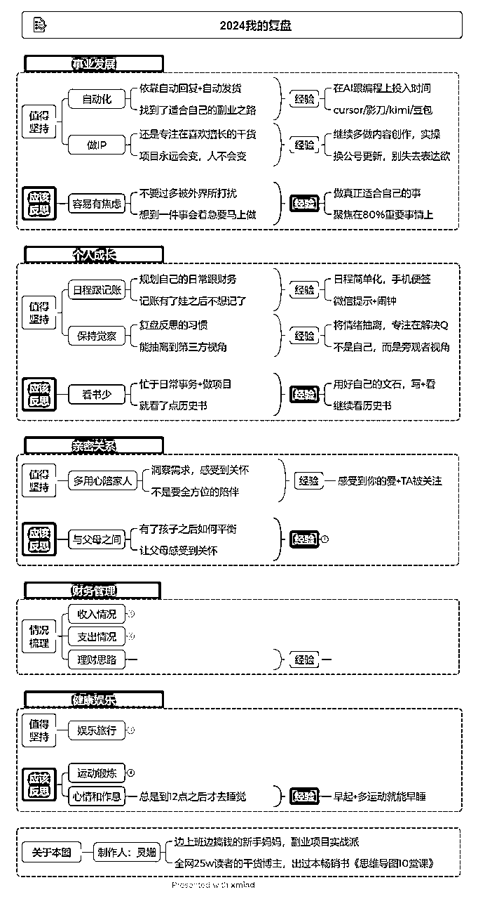
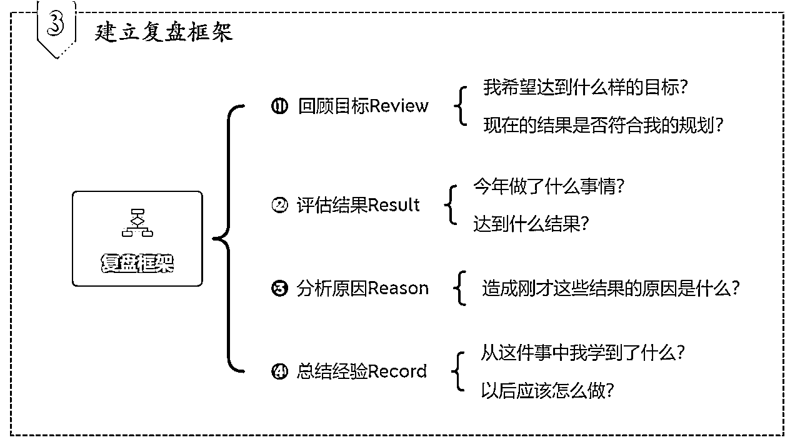
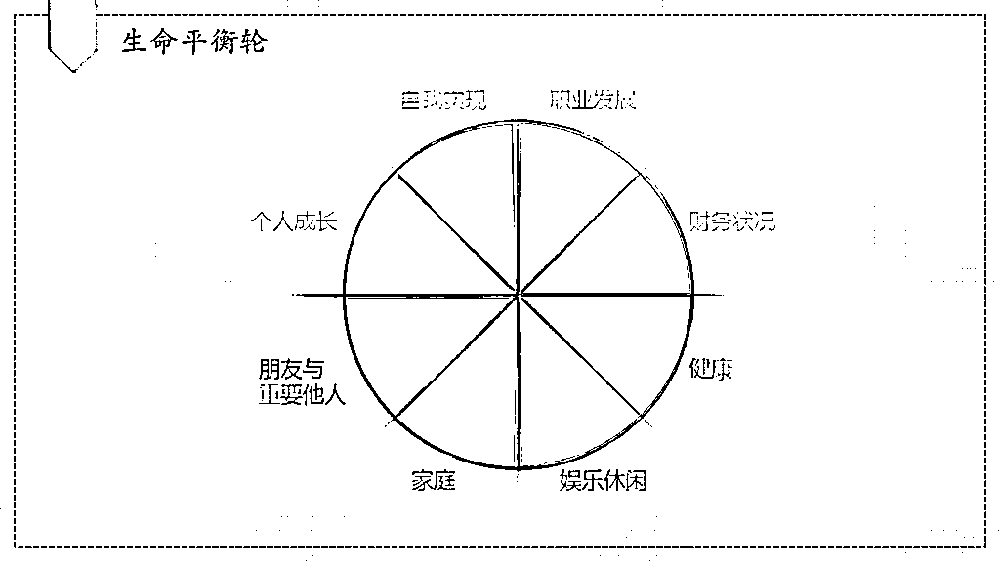
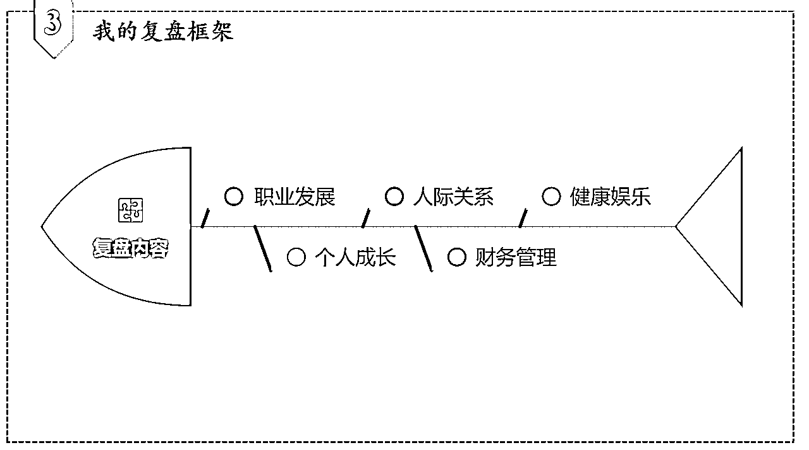

# 用思维导图复盘新手宝妈2024年六位数的副业之旅

> 来源：[https://gism31za7q.feishu.cn/docx/C3cQd87IPodn2LxKa9RcD6Hgn7f](https://gism31za7q.feishu.cn/docx/C3cQd87IPodn2LxKa9RcD6Hgn7f)

大家好，这里是边上班边搞钱的新手妈妈灵姗。

今年解锁了很多大事，怀孕、生娃带娃、重回职场。也开启了新的副业，依靠公众号爆文+小红书虚拟店铺副业收入了几十个。

最近年底太忙，传统的纯文字复盘感觉缺少了很多趣味，也没有动力。

我们的大脑会下意识逃避复杂难做的事情，动辄给自己定下一个写3000字、5000字复盘的计划，想想都觉得不想干。

思维导图复盘每个分支主题都是复盘的一个部分，而这些部分组合起来就成了我们的年度复盘。

就像是将高楼的一个个钢筋混凝土模块逐个预制好，然后再拼接起来，搭建高楼来就会很容易。

先附上我的复盘图，一些个人信息我删除隐藏啦，提供一些复盘思路供大家参考。

### 搞定复盘框架

复盘简单来说，就是回顾这段时间做的事儿，总结经验，吸取教训，将它转化为未来工作、学习和生活的能力，将事情越多越好。

为什么说思维导图适合做复盘？因为思维导图，是聚焦某个中心话题，逐步向外发散思路的一种工具，非常适合结构化的内容。

复盘恰恰就是这类内容，围绕某段时间自己做过的事情，从不同的角度发散，进行深入思考。下面介绍一下我的个人复盘框架：

1.回顾目标Review

我希望达到什么样的目标？现在的结果是否符合我的规划？

如果你有做年度计划的习惯，这时候可以把之前的计划拿出来。

2.评估结果Result

今年做了什么事情？达到什么结果？

在评估过程中，建议大家关注两点，一方面，要关注“优化的空间”，与我的预期相比，有哪些做得好与不好的地方。做的好继续坚持的，做的不好总结教训。

另一方面，要关注“目标重合度”，今年在做的事情，和自己的短期目标、长期目标的重合度有多高。

因为生活工作中的琐事，我们很容易就陷入到“这些要我做”的状态，而不是“我要做什么”。

如果感觉自己疲于奔波在不重要的事务中，年终复盘就是我们反思修正目标的好时机。

3.分析原因Reason

造成刚才这些结果的原因是什么？好的总结经验，坏的吸收教训。

丰田公司有一个经典的“5why分析法”，其实就是对一个问题点反复问5次为什么，来发现现象背后的根本原因。

非常简单但很实用的方法，建议大家在分析原因时多问几个为什么。对自己足够坦诚，才能对剖析地足够深入。

4.总结经验Record

从这件事中我学到了什么？以后应该怎么做？

做复盘最终目的是为了以后的进步，所以一定要总结经验，并且行动起来。

“从过去获得力量，来帮助我们更好地面对未来”，这才是复盘的终极奥义。

### 解决无内容可写

刚开始复盘的时候，我经常写到一半就不知道该写什么了。因为，我的整个复盘过程没有逻辑，想到哪儿就写哪儿，想不到了就写不出来了。

一会写今年要锻炼身体，接着写要坚持做每日复盘，过会又写理性消费别乱花钱。

为了避免这种情况，推荐大家用生命平衡轮模型作为内容参考，这个模型是生涯教练常用的一个工具。

把我们的生活分为了八个方面，个人成长，自我实现，事业发展，财务状况，朋友与重要他人，家庭，娱乐休闲，健康，把个人管理的内容都涵盖了。

在复盘的时候，可以按照这八个方面进行展开，把这段时间的事情都装进这个框架里，增加我们内容的逻辑性。

我在做复盘的时候，因为觉得八个方面太多，就根据自身的情况进行了简单的调整。所以我的复盘图里，最终是职业发展、个人成长、人际关系、财务管理、健康娱乐五个方面。大家可以根据自己的实际情况，对这几个方面进行适当地增减。

### 我的作图思路

我的制图过程是这样的：先确定中心节点，也就是“2024年我的复盘”。

然后以此为基础，向外发散思维，根据之前提到的生命平衡轮，确定了五个方面的复盘内容，也就是思维导图的一级子节点。

我的平衡轮精简了，这样会让我的思路更加集中。

接下来，进一步向外发散，补充思维导图剩下的的细节内容。刚才提到了，复盘有两个思路：

一个是从经历中找闪光点，值得我们坚持的。

另一个是从失败中吸取教训，应该反思改正的。

所以根据复盘框架“review-result-reason-record”，我又进行了细分。把评估结果的过程分为了「值得坚持」和「应该反思」，用来对比结果和自己预期目标之间的关系。

达成目标，复盘的核心点就是经验萃取 ，未达到目标，核心就要集中在反思提升上。

接下来就是找到规律，把前面总结的那些内容整理成系统的知识，或者是可操作的行动，我在后面又设定了一个节点，叫做「经验」。

最后一步，就是对整张图形进行装饰。包括调整字体大小，配色，配图标等内容，让整张思维导图看起来更舒服。

### 副业反思

其实今年我最大的感悟就是要去增加自己的被动收入，丰富收入的渠道。

今年向公众号分成跟小红书虚拟店铺都帮到了我大忙。公众号分成现在整体团队批量运营出文章，年底也上线了小程序，方便取文章。

通过这样的形式对外招募他人发文，也是解决了公众号爆文存在一定的运气成分这个问题，只要数量够多，就能有更多的账号跑起来。

还有小红书虚拟店铺，在我坐月子期间，我当时发烧，基本上一个月在床上都没有动弹，还是成交了9000多块钱，那个感觉真的很棒。

前几天跟我一朋友聊天，她说我现在赚几万块，都没有躺赚个几百块钱开心，因为那1万多块钱是付出辛勤劳动赚来的，我应得的，而那几百块钱是躺赚的，就会暗自窃喜。

真的还是要找到适合自己的路。就像是在工作中干事儿，会干事儿跟埋头苦干事儿差别很大，在关键处发力，才能越来越轻松。

我也很庆幸自己在去年怀孕之后进行了调整，过去实在是太重内容创作了，给自己带来了非常大的压力。

当时也是一种被迫调整，但没想到反而带来了这么好的结果，也有很多感慨吧，年初的我当时只想一个月能赚个几千块钱，没有想到现在后面加了个零。

期待2025了。

以上就是我根据复盘框架和生命平衡轮模型，设置这张复盘思维导图的思路，希望对大家有帮助。

有几个朋友私信问我，我把复盘模板的xmind版本放在夸克了，大家有需要可以自取。

我用夸克网盘分享了灵姗的思维导图复盘模板

链接：https://pan.quark.cn/s/8b0b30e58138