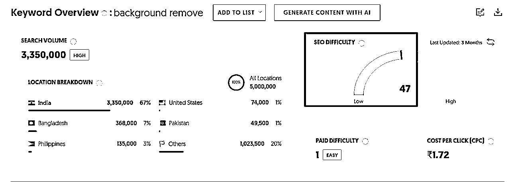

# 想都是问题，做才是解决之路

> 来源：[https://y3my0b87ql.feishu.cn/docx/CCZ1dDUbYoYgu6xj9GLcgAQrndh](https://y3my0b87ql.feishu.cn/docx/CCZ1dDUbYoYgu6xj9GLcgAQrndh)

海航刚刚结束，龙珠悬赏第三期又来了，给大家分享下我自己的经验 ~

希望这个内容可以帮到大家，用 AI 编程来让自己的想法快速落地。

不要成为学习高手，要成为实战高手。

第一个是自己熟悉的领域，

想想，自己在日常生活中最感兴趣的事物是什么，哪些活动或话题能让你投入大量时间和精力而乐此不疲。兴趣是最好的老师，选择与兴趣相关的领域，会让你在工作中更有动力和创造力。

第二个是自己感兴趣的

海外的产品，个人感觉和国内的不太一样， 如果是靠SEO的话，是一个长期的投入。所以评估自己对某个领域的热情是否持久。有些人可能对某个新鲜事物感兴趣，但随着时间的推移，热情可能会减退。选择一个能够长期保持热情的领域，有助于你在遇到困难和挑战时坚持下去。

第三个是用自己擅长的技术

还有，分析自己目前具备哪些技能和知识，这些能力在哪些领域可以得到更好的发挥。例如，如果擅长python编程，可以选择fastapi， django之类的框架。

如果是零基础，真的非常建议要看看航海手册里面的基础知识，事半功倍。

第四选择一个需求旺盛需求

任何赛道，都不多一个能赚几十万的人。

对于需求，我个人建议是选择一个市场需求旺盛、能找到竞争小的领域是最好了，找不到也没有关系。可以通过一些网站给的搜索关键字来看看市场的需求情况。google index, similarweb等，了解市场的需求和偏好，以及市场的发展趋势。

后期可以关注非标，定制化的需求。这样更容易转化和付费。

# 市场调研

## 1.1 对标案例

去哪里找？首先是网页内应用，没有app的。这样的应用开发快，落地快， 跑通MVP也相对简单一些。

1.  首先，Product Hunt - 新产品发布平台，可以看到最新的创新产品，和流行的：

https://www.producthunt.com/topics/artificial-intelligence?order=best_rated

这几年AI大热潮， 很多AI发布优先选择这里，这个平台大部分是产品经理，程序员开发，以及投资人，所以真的用户是很少的。 不过有可以看到一些热门的应用，


1.  AlternativeTo - 可以找到类似产品的替代方案， 这里是相对成熟的

https://alternativeto.net/software

我用这个网站来评估，这个业务是不是很卷。

比如这个产品，可替代的有66个，就问你卷不卷， 肯定卷的飞起来~


1.  通过收款平台流量来监控，那个网站搞钱多

下面这个网站就是和钱相关了，

https://whoismaking.money/?domain=ai ，这个是关于stripe付费网站，流量的去向统计趋势，最后找到一个适合自己的网站。


这个网站类似一个导航网站，流量也挺不错的 2M，不过我用它看推荐的AI产品，也是相对热门的，

https://www.toolify.ai/zh/Best-AI-Tools-region

我的这个产品就是从这里找到的。

1.  用搜索引擎

推荐几个我爱用的所搜关键字：AI index， global AI trend index , 这个网站也提供https://www.emarketer.com/一些行业的趋势报告，重点提到的趋势，就是说明这个行业用户挺多的，比如400w用户，1%的用户就是1w了，对于付费用户来说，哪怕是0.1%， 不低了~ 吧

最后找到一个 revmoe.bg 这样一个巨无霸的网站，每月7000万访问。

## 1.2 变现模式

任何一个行业都不缺一个多赚10w块的人。

目前看到remove . Bg 有3种方式变现： 一次付费， 订阅，API定制化。


首先，提供了一些免费的模式， 基础功能免费：低分辨率图片处理。

付费升级：高分辨率输出，批量处理，自定义背景。

用免费的功能吸引用户，过来使用产品，然后用增值付费来让用户掏钱。

这个网站具体的收入情况，没有查找到。按照其他同行的收入，可以估算。是一个不低的数字。

顺便查到另外一个，我没有具体看，不过差不多的技术，收入情况：

这个公司收入 2000 万美元？没看错吧


我知道这个背景移除行业特别的卷，技术门槛低，实现也快，但是如何落地，在一个海量的需求里面，快速的赚到一块钱，应该相对容易些。

## 1.3 流量获取渠道

1.  直接流量占所有流量的46.96%，这是网站流量的主要来源之一，可能包括了用户直接输入网址或书签访问。基本上就是长期用户了~ 包含1%的付费用户就很客观了。

1.  自然搜索构成网站流量的50.92%，是网站流量的主要来源。品牌搜索占比较高（92%），表明用户对remove.bg品牌有一定的认知度。

1.  付费搜索构成网站流量的<1%，网站可能没有大量投入付费广告，或者付费广告的效果不佳。

1.  对于其他流量，关注自然流量，和直接访问流量（这个大概率是老用户，存的书签），还有就是付费带来的流量有多少，同时关注其他媒体youtube，tiktok等链接过来的流量。

搜索流量：

对标网站remove.bg，在全球范围内拥有44.7M的自然搜索流量和457.9K的关键词，Authority Score为90，Semrush域名排名为1.5K，显示了其在线影响力和搜索可见度。


来自印度的，挺多的， 这部分转化应该不高


关键字：主要自然搜索关键词包括“remove bg”和“remove background”，分别排名第一，

第一个是人家的域名， 第二个就是大部分人需要输入的关键字。我猜测的。


竞品网站：包括erase. bg、photoroom. com、pixelcut. ai和removal. ai等，这些竞争对手在自然搜索关键词和流量方面与remove. bg有共同之处。 后面2个额都是带有ai的域名。


关键字seo难度

https://app.neilpatel.com/



SEO 难度不小，值为47， 但是付款做 SEO 的难度是 1，easy。 我想大家知道路径了吧。

其他建议的关键和question，这个就是后面的blog文章，内容做seo的方向。


我这个就是域名 翻译过来的， 和这个关键字难度低，但是总体搜索量就很少；印度市场；


所以域名这个是没有优势了， 就是布局其他关键字或者 其他方向路径了。

# MVP开发

每天制定计划推进，就是最快的赚钱方式。

## 2.1 核心功能

核心功能就是：

用户通过上传图片， 移除背景。

我不是产品经理，所以直接问的 AI。有些步骤我直接高亮了。

在产品目标确定之后，首先要明确用户故事，即用户在使用产品时会经历哪些场景和需求。对于这个产品来说，目标用户是那些有使用移除背景和处理图片的人，因此需要为他们设计一条能够达成目标的使用路径。

为了更好地思考和规划用户的使用路径，使用了 User-Story Mapping 图表。这个工具将用户的行为划分为三个层级：

*   活动：用户参与的主要活动，比如我做的背景移除：上传图片、处理图片、下载图片等。

*   步骤：每个活动下具体的步骤，例如在“上传图片”活动中，用户可能需要注册账号、直接粘贴，直接上传等。

*   细节：每个步骤中的具体细节，如:注册账号时可以选择使用 Google 或 Email 注册。

User-Story Mapping 是一个辅助思考的工具，帮助梳理和理解用户在使用产品时的行为和需求，从而更好地规划产品的功能和开发路径。但工具只是辅助，核心还是要关注业务和用户实际的使用场景，根据用户的需求，不段迭代。

## 2.2 开发策略

在产品初期，最重要的事情是快速交付一个最简可行产品（MVP）。因为最初的产品规划都是基于团队的假设，没有用户参与和反馈，所以需要尽快让用户能够参与进来，来验证产品是否真的可行。

构建 MVP 的核心在于高度提炼用户故事中的必备路径，即用户完成目标所必须经历的步骤，而不是事无巨细地包含所有可能的路径。这样可以更快地推出产品，让用户参与并提供反馈，从而不断迭代和优化产品。

对于工具类产品，一开始就追求大而全是不可取的。大而全的产品往往没有明确的卖点，而且是偷懒的做法。

根据我个人的了解，海外用户通常不太喜欢大而全的产品，他们更倾向于功能明确、简单易用的工具。

技术方案，就不谈细节了，有问题直接问搜索引擎来的最快 ，用AI 编程

https://bolt.new/ 或者是 https://v0.dev/ 生成一个demo，然后开始二次开发。

不会的怎么办？向谁提问？

向谁提问估计都不会有足够强的耐心, 哈哈~ ，除了AI搜索引擎。所有的问题，AI搜索引擎几乎都有答案，而且不会嫌弃我们的问题啦。

还有一个就是尽量用已有的服务。自己买服务部署，还是购买接口，优选开源的。

我的后台接口用的服务商提供的AI 部署的接口，服务器用的免费vercel，后面计划切到aws云，其他域名和dns，存储用，都是用的慈善家的cloudflare免费的。

前期省钱省时，就是赚钱。

最后的效果：


## 2.2 收款渠道

推荐：lemonsqueezy。

1.  万里汇，可以申请账户，不过现在停了。不支持非实物打款从 stripe 提款到国内银行了。

我看有些文档说的，可以用万里汇，我最后通过邮件问了官方人员，目前来说，申请的账号，不支持非实物贸易中资金打款了。所以 SaaS 的服务，软件订阅的这条路是走不通了。


1.  如果是前期，不需要折腾的，就用 lemonsqueezy， 手续费贵点，但是前期没有那么多折腾，对于新手来说，是一个不错的选择。

这个 lemon 最近被 stripe 也收购了， 新增了很多的用户申请，导致审批有点慢呀～

如果还有其他的，希望大家有推荐下，感谢～

lemon 激活的流程可以参见和这个教程：

https://docs.lemonsqueezy.com/help/getting-started/activate-your-store

# 推广策略

## 3.1 市场定位

国外和国内的情况，还有点差别。 国内的小红书，抖音/快手， 微信生态。 知乎，B站

我的产品主要是国外的， 国内的是我看过的一些资料，然后总结出来的。 后面我有国内的产品，我肯定会第一时间上这些渠道。

小红书作为新生代年轻人首选的内容平台，通过优化标题吸引力和提供实用解决方案，能有效提升内容曝光度。用户在搜索相关话题时，借助平台算法推荐，更容易发现你的优质内容。建议结合热门话题标签和垂直领域关键词，打造差异化的内容定位。

在抖音/快手及微信平台上，如果不是关键意见领袖(KOL)且没有投放广告，特别是微信公众号，通常只能获得长尾流量，较难实现有效的产品转化。不过，平台会给新注册的账号一个流量扶持期，建议把握这个初期红利机会进行内容布局。

知乎和B站也可以试试。

国外这个，是我主要的推广渠道， 首先是SEO是大头，其次是其他平台。

## 3.2 获取流量

不像小红书和快手 抖音，一上来就有新手期， 直接就爆了~

对于海外市场推广，我主要依赖两个核心渠道：SEO优化和其他平台营销。其中SEO是最主要的流量来源。

下面是我从SEO策略， 从两个维度展开：

1.  技术层面的SEO优化

*   利用专业SEO工具进行关键词研究和优化， google console, ahrefs

*   确保网站结构符合搜索引擎最佳实践


1.  建立长期内容SEO策略

*   搭建WordPress博客平台

*   虽然可以借助AI辅助内容创作，但需要特别注意内容质量，因为Google对AI生成内容有严格审核。纯机器生成的内容可能面临搜索引擎惩罚，影响网站排名。


我听了一期这个网站站长的播客的内容： https://aimangatranslator.com/manga-translator/

如何做博客内容的搜索引擎优化。

1.  文章数量, 每天5~6篇文章，AI辅助写

1.  内容大概方向，排行的 xx TOP工具

1.  AI提示词汇： 假设用户画像？ 作为一个用户，真实的场景： 用户怎么喜欢这个产品，什么情况下会搜这个产品

看到还有其他技巧，我抛砖引玉，欢迎大家补充~

下面是的我的提示词

```
你是一个来自德国的《林美琪是一位27岁的社交媒体营销专员，在一线城市工作生活。她身高163cm，身材苗条，总是戴着标志性的黑框眼镜，喜欢扎着丸子头，穿着oversized西装外套的简约时尚风格。作为一个完美主义者，她对设计细节异常敏感，具有极强的美感和设计天赋。每天清晨7:30就会到达公司，戴着耳机听着轻音乐专注工作，桌面上总是贴满了五颜六色的便利贴。她精通PS、AI等设计软件，擅长图片构图和色彩搭配，月收入在12000-15000元之间。工作之余，她喜欢逛艺术展览、尝试新开的咖啡店，经常在Instagram上分享自己的作品，并在Pinterest上寻找设计灵感。作为一个苹果生态的忠实用户，她愿意为提升工作效率的工具和在线课程投资。虽然每天要处理大量的产品图片，但她始终保持着对设计的热情，梦想着35岁前成为设计总监，并开设自己的设计工作室。面对偶尔出现的创意瓶颈，她会通过参加设计分享会或整理个人素材库来寻找突破。在她的生活中，无论是工作还是生活，都透露着对设计的执着和对美的追求。》，需求：写一篇关于对《图片背景移除的 TOP 工具排行榜》，语调亲民，简单。内容：第一个是 bgclearer.com 特色是：Remove Background in Seconds。 
输出为：全英文，不要复杂的单词，内容不能功能列表，每个网站 需要 2～3 段整段文字内容
```

比如搜索引擎推荐：


通过这个网站可以粗略的检测下SEO的评分怎么样？

https://pagespeed.web.dev/analysis


我这个SEO，通过描述，直接用AI生成的SEO，按照要求修改即可。

Ps, 推特和prodcuthunt发布的，没有粉丝，没有资本加持的情况下，很难有转化的。

# 最后

不是航海才学习了cursor， comfyUI这些技能么？用起来~

大家一起出海，用 AI 赚美元。

不要成为学习高手，要成为实战高手。

干。