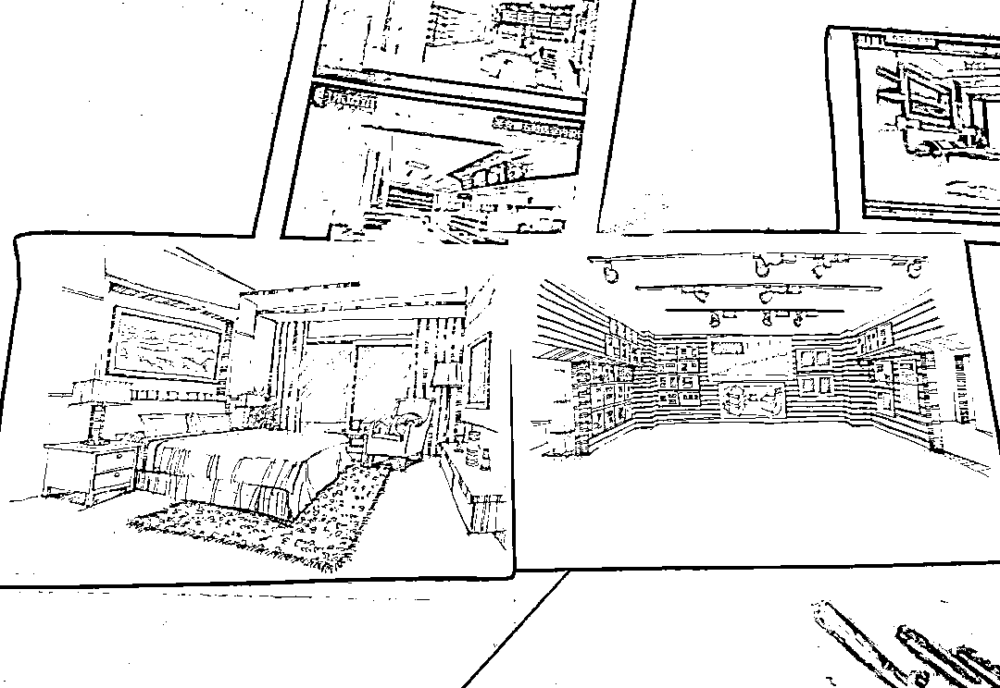
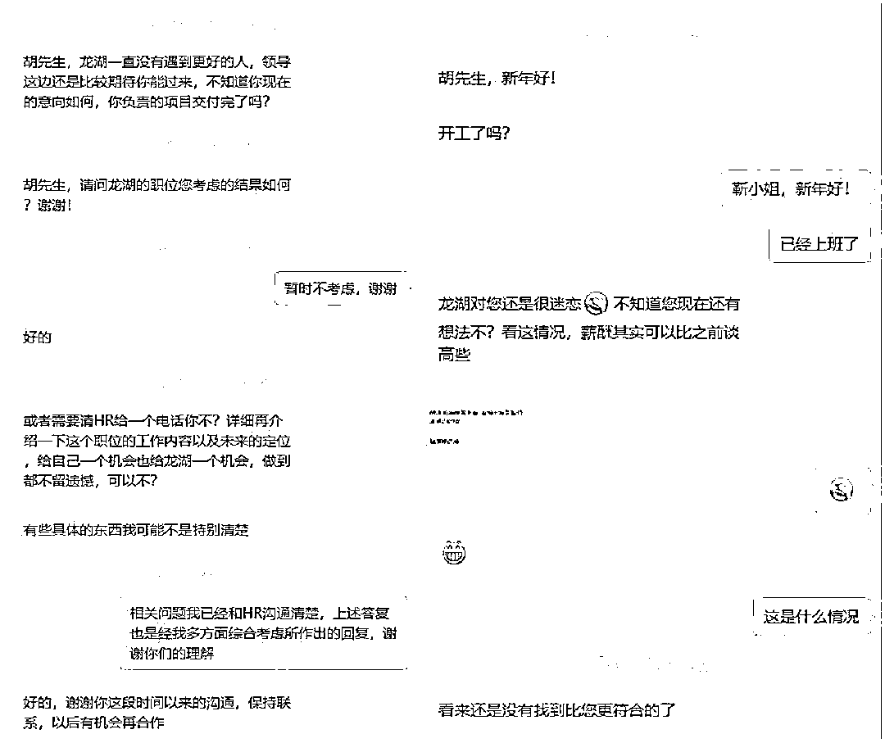

# 我，一个I人，如何成为出击必胜的面试高手？

> 来源：[https://e9sw1q3p71.feishu.cn/docx/Q7emduyh4o2vBxxxCKIcAHeEnFg](https://e9sw1q3p71.feishu.cn/docx/Q7emduyh4o2vBxxxCKIcAHeEnFg)

生财创业、搞钱大佬特别多，但对于很多年轻小朋友，以及还在职场中的大厂精英、斜杠青年，如何通过面试获得一份好工作，其实是很重要的一个课题。

大部分普通人，除开找关系、走后门，在20到30岁之间，通过面试找一份好的工作，是人生路上非常重要的大事，不夸张的说，面试能力强的人，能把自己卖出更高的溢价，甚至能逆天改命。

前两天，一个做室内设计的宝子私信问我关于面试的问题，语音通话聊了二十多分钟，我详细解答了如何做简历，需要做好哪些方面的准备，以及相关注意事项。

作为一个I人，我从小性格就非常内向，曾经一遇见生人就紧张，如果要我当众发言，整个人甚至能紧张的全身发抖，但我从惧怕面试，面试时紧张的连话都说不利索，到后来猎头追着我给offer，成为一个出击必胜的面试高手，我还是有挺多经验和心得可以和大家分享一下。

# 第一次大厂面试经历

在我工作的前5年，我换过两次工作，第一次换工作之前，当时我还在湖南老家四线城市的一家小装修公司做室内设计师，到手工资每个月只有可怜的2000元左右，我收藏了一个本地门户网，每天刷上面的招聘信息，可整整刷了一年，连一家像样点的房地产公司都没有，基本全都是些微小企业的招聘，偶然间刷出个本地城投公司的招聘，还都被关系户提前预定。

作为一个普通人，如果我要继续在本行业发展，只能在一堆小装修公司里选，想着以后顶多也就只能赚个几千块钱度日，这让我一度非常绝望。

时间一晃到了2012年底，当时我已在老家市中心买了房并刚结婚不久，但对在本地找份好工作已完全失去信心，于是只得无奈将找工作的范围扩大到全省，每天在前程无忧上面刷招聘信息，虽然年底是投简历换工作的黄金时期，但奈何当时个人的工作履历属实不怎么样，所以接到的面试通知也寥寥无几。

转机出现在12月份的某天，我接到了位于长沙的远大集团HR打过来的面试邀约电话，当时正好远大T30酒店短短48天就建成的视频在网上特别火，而且远大也是湖南省内为数不多的知名大厂之一，奔着大公司的光环，我对这份工作非常期待，对这次面试也抱有很大希望。

面试前我提前做了很多准备，除了网上大量查阅远大相关的简介和新闻，我还把大学的获奖证书，以及工作这几年的设计作品都打印出来，做成了一本个人作品集，并在面试的前一天就来到远大城熟悉环境。

当时面试的岗位是可建研发部装修设计工程师，一起来面试的有3人，HR小姐姐在基本面试之后，还现场考察我们手绘能力，让我们在2小时内，任选其中一副自己的作品用手绘的形式表现出来，画完之后再在自己的座位上把看到的场景也用手绘表现出来，这正好是我大学苦练多年的拿手绝活，在规定时间结束前，我就轻松完成任务，后面由远大总裁张跃先生亲自面试时，还得到他的肯定。

这次面试由于准备充分，考察的内容也都是我的强项，且面试的是基层岗位，所以非常顺利就通过了。入职远大之后，因为各种原因，我只坚持了不到一年，但这份工作履历为我后续找工作和面试加分不少。

# 面试成功，运气也很重要

离开远大之后，我再次面临第二次换工作，这回全省范围内都没得选了，因为湖南老家离广东比较近，加之有几个好朋友在珠海，所以直接在广州和珠海等几个城市投了一圈简历，当时房地产行业发展正盛，考虑个人职业发展方向，另外当时地产公司装修相关工作以工程岗居多，下定决心要从设计往工程方向转型，于是投递了一圈装修工程师的工作岗位。

因为面试需要从湖南坐高铁到广东，成本比较高，当时囊中羞涩，连路费都够呛，还好老天帮忙，正好那段时间接了一个客户的装修设计，付了我一笔设计费，才得以让我订了车票。

当时印象特别深，最先收到的是广州长隆附近的一家地产公司的面试通知，其开发的项目还比较知名，虽然在远大工作期间，我已负责设计图纸到现场施工落地的协调事宜，但在装修工程这块，不管是技术还是管理方面的知识和经验，都还比较欠缺，面试前我还是照常做了充分准备，但面对自己没有底的事，心里还是比较忐忑，结果面试官接连问了我几个工程专业问题，我都支支吾吾回答的很牵强，从面试官的现场表情来看，我就知道这次面试没戏了。

广州回来不久之后，又接连收到了几家面试邀约，其中有珠海两家公司的面试，一家是珠海本地龙头国企H发，另一家也是机缘巧合与湖南远大同名的房地产公司，在珠海只有一个房地产项目。

于是马不停蹄，从湖南坐高铁一路南下到了珠海，这次面试的重点是H发，出发前就在网上了解了一圈公司信息，还想办法找到了HR的邮箱，把个人作品及强烈的入职意愿，真情恳切的写了一封邮件发了过去。

面试时一路顺利的从人力面到分管工程的领导，直到面试到最后的大领导时，领导有重要会议，等了很长一段时间，结果领导开完会又马上要外出，关键时刻感谢HR小姐姐先把我的简历推给了大领导，领导看了看手表抽出几分钟时间，简短的问了我过往工作经历，在了解到我同时有过设计和施工管理经验后，当下拍板录用，后面几个人都没来得及面试就先行离开了。

这次面试成功，一多半是运气，剩下的是个人诚恳的态度和过往工作经历起了一点点作用，可能换家公司或者换个风格的领导再面试，是否能顺利通过，就很难说了。

也就在那时，我意识到了面试的重要性，这也是混职场的一项必备技能，抛开运气成分，要让每次面试自己都能掌握主动权和成功率，这项能力才算合格。

# 面试也是一项技能，需要多刷经验

在珠海工作了一段时间后，工作之余在猎聘网注册了个人信息，因为在本行业有了一定的工作经验和大项目经历，而且借着就职公司平台的知名度，隔段时间就能接到HR和猎头的电话。

当时工作虽然忙碌，但也隐隐感受到一股危机感——

当前这份工作这个平台，我是否能一直干下去？

如果面临再次找工作，我的面试能力是否能让我成功找到好工作？

既然自己已意识到自己的面试能力不足，是否可以多参加一些面试来积累实战经验？

基于这些考虑，我开始选择性参加面试，但即便是带着刷经验的目的，大部分面试的结果都不尽如人意，但这也让我看清了自身存在的问题，比如心态不好容易紧张，专业知识还存在盲区，管理能力有待持续提高，每次面试都成了对自身短板查漏补缺的机会。

一直到2017年，我通过正常面试渠道，同时收到了三家行业排名靠前的地产公司Offer，最终选择入职央企地产TOP10 H润。在H润工作期间，专业能力和视野得到了肉眼可见的快速提高，加之有在大央企从业经历的加持，隔三差五就能收到公司HR或者猎头的电话。这段工作期间，个人还主持了很多会议及公开活动，比如评审会、述标会、宣贯及厂家考察，对待面试，从心态和底气方面已有了翻天覆地的变化，个人除了最大程度展现个人优势，还能逐渐掌控面试节奏，在谈酬和职位等方面，也都有了自己的话语权。

凭借个人职业经历和专业能力，在地产发展火热的那几年，我曾每周都能接到十余个猎头电话，只要参加的意向岗位面试，面试通过获得offer的成功率几乎100%，而且也曾得到多家TOP房企领导的喜欢和肯定。

近几年，我作为专业面试官，还多次参与了公司装修专业管理人员的面试，对于行业内精装修专业管理人员的用人情况，也有了更深层的了解。

在职场，绝大部分人都是普通人，即便是公司高管，也都是代表一个职位，HR和猎头挖的也是某某岗位，而不是某某人。如果有朝一日，我能接到猎头的电话说，某某公司找的就是胡哥，而不是找一个装修佬，那一定是我职业最高境界了，可以自称装修界的王者了，哈哈。

# 关于面试，最后总结一下

1、菜鸟时期，自己菜，能给予面试机会的公司也比较菜，这个时期如果能收到一家大公司的面试，准备工作要做足，实力不够态度来凑，当然运气也很重要，心态要放平，除此之外，多投简历多面试，积累面试经验，如果本地没有合适的工作，就扩大范围到全省，或者北上广一线城市。

2、尽早、努力加入行业TOP大厂，在专业能力、管理、人脉、业内资源等各方面疯狂积累，好好沉淀几年，以后你的选择会大很多，如果你待过TOP大厂和普通小公司，你应该明白我在说什么。

3、重视个人简历。具体的点包括：删除无关紧要的信息，只保留关键信息，把个人基本情况，工作以及主要项目经历等，全部排列在一张A4纸上，做成一个PS模板，兼顾美观。

4、面试也是一种技能，需要积累经验；多创造面试机会，多面试，多刷面试经验。当然，这一切最好建立在你的个人专长比较强的基础之上。

5、不要羡慕管理岗，各自根据自己的脾气、性格、能力特点找到自己的生态位就好，互联网、自媒体时代，技术路线一样能有很好的发展。

能做到上述几点，再加上点运气，在面试时基本就能战无不胜了。

2021年就加入生财了，但上面还是第一次在生财发帖，请大家多多指教。

马上2025年就要到了，祝亦仁、各位生财圈友，在新的一年工作顺利，蛇来运转！