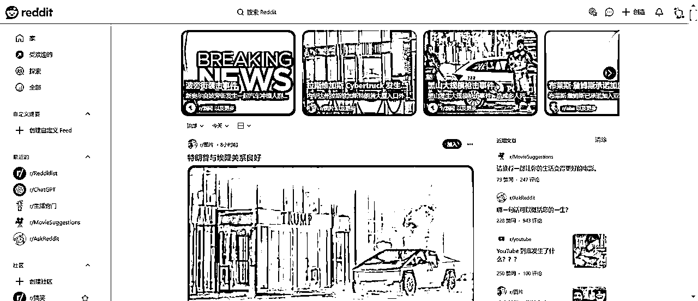
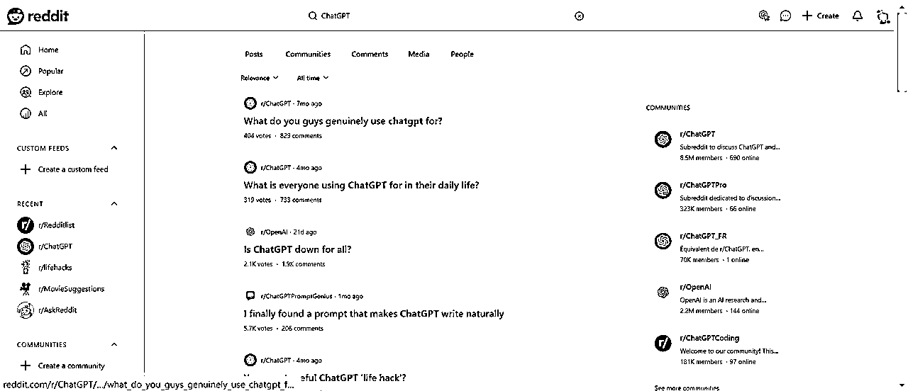
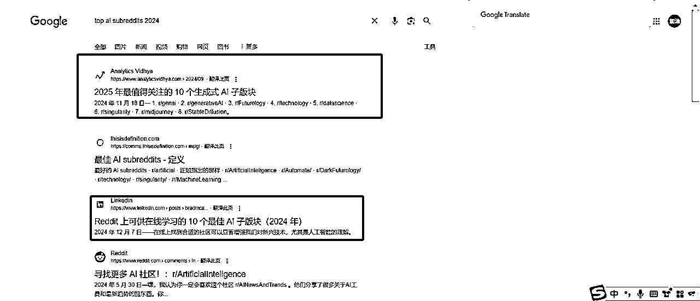

# 完全为第一次接触Reddit的新手小白准备的

> 来源：[https://qjv17b58t3.feishu.cn/docx/L3mbdU39BoQgrqxI2Dlcizz9nRb](https://qjv17b58t3.feishu.cn/docx/L3mbdU39BoQgrqxI2Dlcizz9nRb)

# 海外社媒运营（reddit小白篇）

## 必修篇：

一、为什么你要了解Reddit

二、Reddit的赚钱案例（举例）

三、了解Reddit是什么

四、Reddit的玩法

## 选修篇：

五、了解Reddit的推广规则

六、如何搜集热门subreddit数据

# 必修篇

### 一：为什么你要了解Reddit

#### 1、流量大

全美流量前五的网站，仅次于谷歌、油管、Facebook和Amazon，2024年11月，月活3.5亿

（数据来源：SimilarWeb）

#### 2、用户持续增长

Reddit的月活跃用户（MAU）增长持续强劲，截至2025年已突破5.5亿；日活跃用户数也同比增长47%至9720万。

#### 3、SEO价值大

Reddit的帖子由于高互动和真实需求，通常排名靠前，甚至有些帖子能长期在Google搜索结果中占据首位。

#### 4、Reddit平台在商业化的中期

1）建立了稳定的盈利模式，但尚未完全开发潜在商业化能力；正在扩大多元化收入来源（如广告、API收费、会员服务等）

2）为吸引更多内容创作者，Reddit推出了贡献者奖励计划，鼓励用户发布优质内容，进一步提高平台活跃度。

#### 5、出海项目的“流量洼地”

对于国内创业者而言，Reddit不仅是一个流量资源池，还是一个低竞争、高质量的“引流+品牌打造”平台，尤其适合英语市场出海项目。

#### 6、Reddit正在AI时代中崛起

1）2024年3月的首次公开募股（IPO）后，股价大幅上涨，截至2024年12月，Reddit的股价已上涨约250%

2）这波 AI 浪潮之所以能兴起，正是因为互联网在过去二十几年来沉淀了大量的数据，Reddit拥有大量UGC数据，OpenAI等公司为数据访问支付了数千万美元，为Reddit创造了新的收入来源。

### 二、Reddit的赚钱案例（举例）

#### 案例1：在reddit做谷歌SEO，引流变现

###### 实操方法：

1.  找到行业/细分领域小组；

1.  复制小组链接🔗到Ahrefs中，也可以尝试SEMRush

1.  通过site explorer进行关键词分析

1.  通过organic keywords找到高排名关键词

1.  进行关键词的搜素排名排序

1.  筛选出排名前四的关键，针对性优化

###### 变现方式：

*   通过独立站或电商平台盈利：当用户通过Google搜索访问你的网站，就可能直接转化为购买

*   通过广告或联盟营销赚钱：Google流量会带来更多广告点击 或 联盟链接的使用（如亚马逊Affiliate计划）

*   为他人提供SEO服务：熟练使用Reddit挖掘关键词技巧后，可以将这一方法打包成服务

*   自媒体变现：将Google流量引导到自己的内容平台（如YouTube、在线课程等）

##### 案例1.1：用Reddit矩阵营销精准导流，实现100+单转化

<h7>实操步骤：</h7>

1、以用户身份加入相关产品的subreddit，以真实分享的形式发布帖子，同时在内容中自然植入自己的产品（可通过兼职写手辅助创作）

2、利用水军账号（通过购买或自养）对帖子进行评论、跟帖，增加互动率，提升帖子的热度和可信度，推动内容成为爆贴

3、重复上述动作，在多个相关小组中使用不同账号和水军发布类似内容，形成覆盖多个小组的营销矩阵

4、避免直接在帖子中展示长链接，将产品链接隐藏在超链接（如产品名）中，提升用户点击意愿并优化体验

##### 变现方式：

1、通过帖子内容引导用户访问独立站（如 Shopify），实现直接购买

2、爆贴后的热度提高品牌在 Google 搜索的曝光率，形成额外订单转化

3、通过矩阵操作和社区热度拉动独立站流量，降低获客成本

### 三、了解 Reddit 是什么

#### 1、基础知识：

*   Reddit 是一个海外的社交新闻和论坛平台，有“全球最大的兴趣社区”之称。用户可以在上面发布内容、投票和评论，形成高度互动的社区氛围。（https://www.reddit.com/）

*   特点：

*   子版块（Subreddit）：用户可以在不同主题的版块内交流，比如 r/funny（笑话）、r/AskReddit（问答区）等。每个 Subreddit 都是一个小型社区，有自己的规则和风格。

*   内容互动：帖子由用户投票决定热度。点赞多的帖子会被推到首页。

*   匿名文化：用户可以匿名发帖和互动，整体氛围比较自由。

*   用户群体：以欧美用户为主，英语内容居多。用户多为高教育水平、科技敏感型的群体，比如程序员、工程师、学生等。

#### 2、了解 reddit 内容创作者：

即使你没有自己的现成业务，也能成为一名内容创作者

*   在目标 Subreddit 分享有趣的故事、漫画、图片、视频等，积累 Karma（Reddit 的积分系统）。

*   高Karma账户可以转化为运营账号或出售。

例子：

*   一些 Reddit 用户通过制作“meme”在 r/memes 吸引大量关注，然后将账号出售给需要推广的企业。

#### 3、什么是 Reddit 的 Karma？

Karma 的来源：

1.  Post Karma（帖子 Karma）：用户发的帖子被其他用户点赞（upvote）时，你会获得 Karma。反之，如果被点踩（downvote），Karma 会减少。

1.  Comment Karma（评论 Karma）：用户的评论被点赞时，也会增加 Karma。

Karma 的显示位置：

*   你的总 Karma 是你在 Reddit 所有活动（发帖、评论）的累积分数。

*   每个 Subreddit 内的活动也有各自的独立数据，但这不会单独显示出来（除非 Subreddit 的管理员特别设置显示规则）。

Karma 的作用：

1.  提升信誉：总 Karma 越高，表明你的内容越受欢迎，账号看起来更可信。

1.  解锁权限：某些 Subreddit 会要求用户达到一定的 Karma 才允许发帖或评论，防止新号发垃圾内容。

1.  运营优势：一个高 Karma 的账号发帖更容易引起关注和互动，尤其是在热门 Subreddit 中。

##### 3.1 Karma 与账号权重的关系

Karma 不是 Reddit 官方明确的“权重系统”，但它确实影响你的内容在社区中的接受程度：

1.  信誉背书：

*   高 Karma 账号会被认为是“有经验的用户”，发帖时更容易被其他用户信任。

*   一些 Subreddit 会对新号进行严格限制，高 Karma 账号就显得特别有优势。

1.  点赞吸引力：

*   高 Karma 用户的发帖更容易被其他用户点赞，因为他们的内容通常更符合社区规范或趣味。

*   这种“马太效应”让高 Karma 账号更容易累积更多的点赞和评论。

1.  专业领域优势：

*   如果你的账号长期活跃在某个特定 Subreddit（比如 r/technology），并经常分享优质内容，你的发帖会获得更高的关注度，因为社区成员熟悉你。

##### 3.2 为什么高 Karma 账号值钱？

1.  吸引流量：

*   在 Reddit 上推广内容（如产品、服务或网站），使用高 Karma 账号发帖更容易获得初始的关注和互动。

1.  避免审核：

*   高 Karma 账号发帖被自动删除（因被视为垃圾内容）的概率更低。

*   某些 Subreddit 要求一定 Karma 门槛，高分账号就能自由进入。

1.  账号买卖：

*   某些人会购买高 Karma 账号，用来发广告或运营品牌。这样的账号对 Reddit 新手或希望快速推广的人有吸引力。

##### 3.3 如何积累高 Karma？

1.  参与热门话题：

*   选择流量大的 Subreddit（如 r/funny, r/aww, r/news），发内容更容易获得点赞。

*   比如发布热点相关的 meme、故事、问题等。

1.  发高互动内容：

*   原创性：Reddit 用户喜欢原创、有趣、有用的内容。

*   投其所好：研究目标 Subreddit 的风格，发他们喜欢的内容。

1.  避免踩雷：

*   Reddit 用户对垃圾广告和无关内容特别敏感，违规发帖会被删，甚至会扣分或封号。

1.  定期互动：

*   评论别人的帖子，提出有趣的观点或有帮助的建议，也能获得点赞和 Comment Karma。

### 四、Reddit 的玩法

重点来了！

要在 Reddit 上实现推广和引流，不能简单粗暴地打广告，因为 Reddit 社区文化排斥“硬广”。成功的推广往往更依赖于内容的价值和社区互动。以下是具体的推广玩法与思路：

#### 注册 Reddit 账号

首先，你需要在 Reddit 上注册一个账号，这样才能参与到社区讨论和发布内容。注册过程非常简单，按照以下步骤操作即可：

步骤：

*   访问 Reddit 官网：打开浏览器，进入 Reddit 官网。

*   点击“Sign Up”：在页面右上角点击“Sign Up”按钮。

*   填写注册信息：你可以选择使用电子邮件地址、Google 账户或 Apple 账户进行注册。选择你最方便的方式，并填写相关信息。

*   设置用户名和密码：为你的账号选择一个易于记忆且符合你品牌定位的用户名，同时设置一个安全的密码。

*   完成注册并验证：系统会要求你验证电子邮件或通过手机短信确认身份，确保账号安全。

一旦完成注册，你就能开始探索 Reddit，参与讨论，发布内容，加入 Subreddit 版块。

#### 选择合适的 Subreddit（版块）

Subreddit 是 Reddit 推广的核心。要想精准引流，首先要找到与你项目相关的版块。

操作步骤：

1.  关键词搜索： 在 Reddit 的搜索框中输入与你项目相关的关键词，如“AI”、“短视频”等，找到热门的 Subreddit

1.  筛选条件：

*   订阅人数多：如 10 万以上订阅者的版块流量更大。

*   活跃度高：看每日的帖子数量和互动频率。

*   主题相关：确保版块讨论内容与你的项目方向契合。

举例：

*   AI 类：r/ChatGPT、r/midjourney

提示：在 Reddit 上，了解版块规则很重要，每个版块都有“社区规则（Rules）”，提前查看，避免违规发帖。

1.  加入并参与 Subreddit 社区

找到合适的 Subreddit 后，你可以点击版块进入，点击页面右侧的“Join”按钮，成为该 Subreddit 的成员，开始浏览和参与讨论。在 Subreddit 页面，查看高赞和热门的帖子，了解社区成员的兴趣和讨论热点。

1.  查看 Subreddit 的规则：

每个 Subreddit 都有自己的社区规则，点击版块名进入后，你可以看到版块的规则和讨论指南。确保你的内容符合规则，避免被删帖或被封禁。

1.  关注多个 Subreddit：

刚开始时，不妨关注一些与你目标群体相关的 Subreddit，查看它们的讨论内容和活跃度，找到最适合你推广的版块。

* * *

#### 深耕内容，输出价值

在 Reddit 上，推广的核心是输出价值，即通过高质量内容赢得社区用户的信任与关注。

##### 内容形式推荐：

1.  经验分享帖

*   分享项目实战经验，如“我如何用 AI 工具赚到第一个 1000 美元”。

*   案例解析，详细拆解你项目的操作流程和成功经验。

*   用户喜欢实用、有干货的内容，这种帖子容易获得 Upvote 和关注。

1.  工具推荐帖

*   介绍某个 AI 工具的使用技巧、效果对比，帮助用户解决实际问题。

*   例如，“使用 ChatGPT + MidJourney，我如何 10 分钟做出一组高质量的海报。”

*   注意：分享时保持客观中立，过于推销会被社区反感。

1.  问答互动帖

*   提出有价值的问题，引导用户互动，例如：“你们在使用 AI 工具时遇到过哪些困难？一起来讨论解决方案。”

*   问答形式不仅增加互动，也能引导用户对你项目的兴趣。

1.  资源汇总帖

*   整理与项目相关的资源，如“10 个必备的 AI 副业工具清单”。

*   这种帖子易被保存和分享，增加曝光度。

* * *

#### 参与互动，积累账号权重

在 Reddit 上，社区互动是提高账号影响力和获得用户信任的关键。

具体操作：

1.  回复热门帖子：

*   在热门的帖子下发表评论，提供建设性观点，展示你的专业性。

*   高质量的评论也容易获得 Upvote，增加账号影响力。

1.  参与问答：

*   在版块中回答用户的问题，提供实用建议或解决方案，逐步积累信任。

1.  定期发帖：

*   养成发帖习惯，每周发布 1-2 篇高质量内容，逐步获得社区认可。

1.  避免广告行为：

*   Reddit 对“硬广告”非常敏感，直接打广告容易被封禁。

*   用内容引流，设置合适的“Call To Action（行动号召）”，比如引导用户私信你、访问你的个人资料等。

小贴士：账号权重越高，发帖曝光率越大。一个活跃、有贡献的账号，更容易在社区中获得流量。

* * *

#### 合理利用工具和数据分析

辅助工具：

1.  Reddit 自带数据：

*   关注 Subreddit 的订阅人数、活跃度和帖子热度。

*   每个版块顶部都有“Top”选项，查看哪些内容最受欢迎。

1.  第三方分析工具：

*   SubredditStats：分析 Subreddit 的用户增长趋势、热门帖子等。

*   TrackReddit：监控特定关键词的讨论热度，及时发现热门话题。

数据分析：

*   哪些帖子获得最多 Upvote？总结它们的标题风格、内容形式、互动话题。

*   哪些时间段用户互动最多？找准时间发帖，增加曝光率。

* * *

#### 实现自然引流与转化

Reddit 用户对商业推广敏感，因此引流的关键是“润物细无声”：

1.  打造个人品牌：

*   在个人资料中设置简单介绍，例如：“AI 副业实践者，分享实用工具和经验。”

*   链接个人博客、社群或项目落地页。

1.  提供免费资源：

*   在帖子中附带有价值的资源链接，如工具教程、免费模板等，引导用户访问。

*   如：“你们可以下载我整理的 AI 工具合集，链接在评论区。”

1.  建立私域联系：

*   主动与有兴趣的用户互动，引导他们通过私信与你沟通。

*   注意避免过度引导，保持自然交流。

#### 实战小结：一套 Reddit 推广闭环

1.  选择目标 Subreddit，找到精准用户群。

1.  输出高质量内容，通过经验分享、工具推荐等方式提供价值。

1.  深度参与互动，积累账号权重，逐步赢得社区信任。

1.  使用工具分析数据，优化发帖时间和内容策略。

1.  实现自然引流，通过个人资料、免费资源等方式，引导用户关注你的项目。

#### 总结

Reddit 是一个内容驱动的平台，推广的核心在于提供价值、引发共鸣。通过高质量的内容分享和深度互动，你不仅可以获得精准流量，还能验证项目的市场需求，找到新的商机。

# 选修篇

### 五、了解 Reddit 的推广规则

1.  Reddit 推广的核心原则

在讲具体玩法之前，必须理解 Reddit 的基本规则和文化：

*   重视价值与社区互动：

*   Reddit 用户讨厌广告和硬推广，过度营销容易被举报或封号。

*   所以，内容要围绕分享价值展开，不能一味推销。

*   找到目标 Subreddit：

*   Reddit 是由成千上万个子版块（Subreddit）组成的，每个版块都是一个小社区。

*   你需要找到与你目标受众相关的版块，发布内容或参与互动。

*   帖子质量很重要：

*   用户可以点赞（upvote）或踩（downvote）帖子，点赞多的帖子才会被推荐到版块首页或 Reddit 首页。

*   帖子的标题、内容和配图决定了互动效果。

* * *

1.  Reddit 的主要推广玩法

#### （1）内容创作引流

通过有价值的内容引起目标用户关注，带动流量和品牌曝光。

*   玩法：

1.  找到与你目标市场匹配的 Subreddit，比如：

*   AI 工具相关：r/ChatGPT、r/MidJourney

1.  创作帖子：

*   分享实用干货、技巧、经验总结等内容，避免生硬推广。

*   帖子可以是图文、长文或讨论帖，标题要引人入胜。

*   提供有用信息后，可在评论区或简介中自然引导关注你的项目或资源。

*   示例：

*   在 r/ChatGPT 发帖：“我用 ChatGPT 结合 MidJourney，一个月创作了 200 条内容，效果如何？” 内容分享你的方法、工具和成果，吸引用户点赞互动。

* * *

#### （2）参与热门讨论

在热门 Subreddit 的评论区参与讨论，展示专业性，吸引目标用户。

*   玩法：

1.  寻找与你话题相关的热门帖子，通常会有很多互动和曝光。

1.  提供有深度的评论，或者用轻松幽默的方式增加互动（Reddit 用户喜欢有趣内容）。

1.  在评论区适度引导，比如：

*   示例：如果有用户提问“有没有更高效的内容创作方法？”，你可以回答： “我最近用 ChatGPT 写文案效率提高了 3 倍，整理了一些方法和工具，有兴趣的可以聊聊。”

* * *

#### （3）利用 Reddit 广告（Reddit Ads）

如果有预算，可以直接通过 Reddit 投放广告。

*   优势：广告可以精确定位目标 Subreddit 和用户群体，获得稳定流量。

*   玩法：

*   设计吸引人的广告素材和文案，投放到相关 Subreddit。

*   广告形式包括：

1.  Sponsored Posts（赞助帖子）：看起来像普通帖子，但标注“广告”。

1.  Sidebar Ads（侧边栏广告）：出现在版块侧边栏。

*   实战方向：

*   以 Reddit 上的 AI 热点为切入点，测试广告 ROI。

*   比如推广一款 AI 工具，或者分享社群的 AI 实战案例，吸引精准用户。

* * *

#### （4）蹭热点与打造爆款内容

Reddit 上有大量热点话题，你可以借势吸引关注。

*   玩法：

1.  追踪热门 Subreddit 中的爆款帖子，分析哪些内容容易被点赞。

1.  结合当前热点话题，创作类似内容或分享独特观点。

*   工具辅助：

*   可以用 ChatGPT 辅助创作，快速生成标题、内容、回复等。

*   用 Google Trends 或 Reddit 热帖榜（Trending Subreddits）了解当前热点。

*   示例：

*   AI 爆火时，发帖“用 ChatGPT 帮助我创业两个月，结果让我惊讶！”

*   内容展示具体操作、工具和成果，容易引发共鸣和互动。

* * *

#### （5）打造账号矩阵与内容生态

通过运营多个账号，深耕目标 Subreddit，形成稳定的内容引流渠道。

*   玩法：

1.  团队分工，每人运营一个账号，专注一个版块。

1.  输出高质量内容，逐步积累粉丝和影响力。

1.  在评论区引导用户关注或参与社群活动。

*   实战方向：

*   针对热门版块，批量运营账号，形成矩阵化内容输出。

*   比如团队 5 个人分别在 r/ChatGPT、r/Entrepreneur、r/MidJourney 等版块深耕。

### 六、如何搜集热门 Subreddit 数据

#### 方法一：Reddit内搜集

1.  Reddit 热门版块榜单

*   访问 Reddit 首页，点击 Popular（热门），你可以看到当前 Reddit 总站热门内容和版块。

*   例如：

*   r/ChatGPT：专门讨论 ChatGPT 的应用、技巧和工具。

1.  使用 Reddit 搜索功能

*   在 Reddit 搜索框输入关键词，例如“AI”“ChatGPT”等

*   根据搜索结果找到与关键词相关的热门版块，并按以下指标筛选：

*   成员数：版块人数越多，流量越大。

*   活跃度：帖子更新频繁，互动多的版块效果更好。

#### 方法二：第三方工具辅助分析

为了高效获取版块数据，可以使用第三方工具：

1.  Redditlist（https://redditlist.com）

*   功能：提供 Reddit 上热门版块的排名和统计数据，包括成员数、日活跃用户数等。

*   操作步骤：

*   进入 Redditlist 网站，按排名查看当前最热门的 Subreddit。

*   使用搜索功能，找到与你目标话题相关的版块。

*   筛选指标：

*   Subscribers（订阅数）：代表版块总用户数。

*   Growth（增长率）：快速增长的版块往往是新热点。

*   示例结果：

*   AI 类热门版块：

*   r/ChatGPT（订阅数 850 万+，增长快）

*   r/midjourney

*   r/ArtificialIntelligence

1.  Google 搜索结合数据

*   直接在 Google 搜索：“Top AI Subreddits 2024” 或 “Best Side Hustle Subreddits”。

*   很多博客和行业网站会整理 Reddit 上热门版块的榜单，快速帮你定位目标 Subreddit。

#### 方法三：观察 Reddit 用户互动与数据反馈

1.  分析帖子互动数据：

*   进入目标 Subreddit，查看热帖的互动情况：

*   Upvotes（点赞数）：点赞越高，说明内容受欢迎。

*   Comments（评论数）：评论多的帖子，用户互动更活跃。

*   发布时间：关注帖子发布时间，了解用户活跃时间段。

1.  选取版块内容关键词：

*   在版块中搜索关键词，如“赚钱”“副业”“AI 工具”“内容创作”等，看看哪类内容最受欢迎。