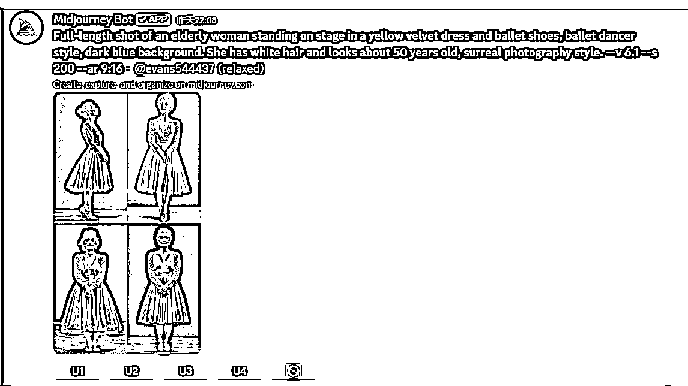

# YouTube shorts从0到1实操全过程

> 来源：[https://wats1vvw8ks.feishu.cn/docx/OZD2dEIzZoBMZwxEHzCc9ccMn8f](https://wats1vvw8ks.feishu.cn/docx/OZD2dEIzZoBMZwxEHzCc9ccMn8f)

大家好，我是好运，很开心能和大家一同朝着共同的目标前行了 21 天。

感谢生财平台，以及领队唐瑞老师和圈友 hulei 的邀请。今天非常荣幸可以在这里和大家交流一下YouTube shorts的心得，希望这篇我全程实操的分享可以对大家有所帮助

经过21天的航海，我发布了15条达人秀变身的视频，YouTube订阅达到10362，做出一条百万级播放爆款，累计观看次数188.8万次，视频号关注达到1006，相较于国内平台，个人认为YouTube对创作者还是比较友好，只要内容好，油管就会给你不断推流，所以长尾流量很好，但也确实不是一个短期项目

接下来我会详细分享这21天我的心得感悟，希望和大家一起跑通YouTubeYPP项目。

以下内容包括：

一、我的起号时间线

二、数据好的关键（个人经验）

三、如何找爆款对标

四、从0开始具体实操全流程记录分享

五、新手容易踩的坑

* * *

# 一、我的起号时间线

*   12.5-12.9我用5天时间寻找赛道，装修账号，养号，学习MJ，runway的基础使用

*   12.10我发布了我的第一条视频，比较幸运，第一条视频第一天就达到15000播放

*   12.14经过两天流量下滑，我通过关键词找百万爆款对标，用同样的选题更换元素，像素级模仿，成功将数据拉了回来，这也是我之前提到的那个百万级爆款，目前这条视频的观看次数是140.75万次

*   12.15至今，视频数据在万播徘徊，差的几千，好的两万多，所以爆款并不容易

# 二、数据好的关键（个人经验）

## 1、保持更新频率

我发现日更，推流会保持正增长，所以保持更新频率会让油管对你更加信赖

## 2、像素级模仿对标

我们做海外，其实最大的问题不是技术，是网感和文化，所以如果自己瞎创新，闭门造车，很容易扑街（我踩过的坑）。所以在起号阶段，模仿近期爆款是最好的选题方法，对标是新手最好的老师。

## 3、越真实越出乎意料数据越好

达人秀变身AI这种类型，本质还是依托达人秀，早期是人与兽的变身很火，到现在，大量账号起来，越真实 变化越出人意料 其实数据越好，可以去看一看美国达人秀的视频，找一找感觉

# 三、如何找爆款对标视频

## 1、关键词搜索法

搜索你的视频赛道关键词，油管网页版右上角筛选出本周内观看次数靠前的百万级爆款，这也是我最常用的选题方法

## 2、顺藤摸瓜找对标账号

shorts广场刷视频，查看数据和发布时间，近期发布且是爆款，顺藤摸瓜去看账号最近的数据情况，如果都在万播以上，且时不时就会有爆款，那就反手一个关注，他发布什么你立马模仿发布（不是搬运）

通过养号（大致意思就是通过标签刷对标视频，坚持刷，刷到你的shorts推荐里面都是同行视频就算成功），你的推荐都是同行视频

关注发布时间（近期），观看次数（几十上百万），找到你想要对标视频，进入主页

关注同行近期视频数据，发现十万以上视频比较多，就立马关注，影子跟随模仿对标。

# 四、从0开始具体实操全流程记录

## 1、确定赛道和定位

以下根据生财圈友分享总结

选品底层逻辑：需求

需求底层逻辑：目标用户

所有先确定目标用户，再根据用户需求确定垂直需求，找到高匹配产品

### 3个问题：

面向什么人群？

通过提供什么服务，解决什么问题？

卖给目标用户什么产品？

### 定位方式：

### 选择目标人群

#### 爱好出发，找需求，再做减法

*   爱好：罗列.....

*   需求：比如如何通过AI搞钱...

*   分析市场供需关系和竞争情况

#### 9宫格定位法

也可以用九宫格来做账号拆解拆解

### 注意事项：

立人设：有传播、有价值、受大众喜欢的标签

定受众：强需求，不要看自己，要看市场，看刚需，比如钱就是刚需

找传播记忆点：稳定特点，口号标签

比如每次出镜都是同一件衣服

以上是自媒体通用的方法论，其实我也只是记录了下来，也思考过属于自己的方向，但不太适合做YouTube shorts，我打算结合这些来做小红书项目，有感兴趣的圈友可以一起讨论。

我第一次接触 YouTube shorts项目，主要是想要尽快跑通项目流程，吸引关注、吸引观看是我的重点。同时，我自己对变身类视频也比较感兴趣，这类视频上手难度不高，最后我就选择了 “AI 达人秀变身” 这个方向。

## 2、热门赛道推荐

娱乐，健康，游戏，教育，测评，新闻时事，艺术创意，宠物动物，体育健身，财务商业，家庭育儿...

### 对标筛选条件：

1.基本条件

●2024创建，播放▶️＞2000w，20＜视频数目＜100，订阅＞1000

●2023创建，播放▶️＞1亿，50＜视频数目，订阅＞1000

2.没有断更，近期数据没有下滑

3.不是短期爆款、单个爆款

4.能赚钱，年收入＞29.4k＄(20wRMB)

5.不露脸

货币化查询网站：https://ytlarge.com/youtube/monetization-checker/

## 3、AI达人秀变身的SOP❤

下面是SOP简述，详细版本看后面视频制作过程

（1）开通账号、养号、建立频道并装修

（2）找到对标视频-->视频工具截取图片

（3）MJ生图（也可以用即梦可灵之类）

反推刚刚截取的图片，修改再生图，同时总结一些比较好的通用提示词

（4）runway生成视频

runway的动作幅度相较于即梦可灵比较小，但是对我来说视频比较清晰，人像不容易扭曲模糊，所以我大部分用的runway

（5）评委观众表情视频准备

我是到AGT的官方视频截取整合成一个评委观众表情库，但最开始最简单还是直接用对标的，如果对标有水印就用其他视频截取

（6）音乐准备

最开始还是一样，用对标的，我现在正在测试一个适合我的视频内容的无版权音乐，效果并不理想，刚开始就使用对标音乐就好，是经过市场验证的

（7）剪辑

简单点就直接拼接，复杂点就加上特效配音效，选择2K/4K导出，国外很多人用电视看YouTube

（8）多平台发布

### ❤详细视频制作过程

#### （1）对标视频截取图片

感谢老马教练的工具，超好用，圈友们可以看航海手册

#### （2）mj根据对标图反写提示词，出分镜图片

学习文档：Midjourney秘籍 · 语雀

##### ①选择对标图

通过对标视频截取出三张对标视频的图片（数量没限制，你觉得可以的都可以使用）

比如三张对标图：融合前，融合中，融合后

但要更自然可以四张图：融合前两个主体、融合过程，随意动作的两张，融合后

##### ②对标图反写提示词

###### 反写图片提示词mj用：/describe

人物一致性：

垫图法：图片链接， 提示词

seed法：提示词， --seed 号码

参数法：--cref<链接> --cw 100

常用参数：

--r 批量生图

--sref 链接 --sw （0,1000）数值越大风格越一致

--cref 链接 --cw（0,100）

常用命令

/blend 2-5张图片进行融合

/describe 反推提示词

/imagine 文生图

详细mj操作看语雀文档Midjourney秘籍 · 语雀

结构：全身照+人物形象+场景描述+画面风格+镜头描述+参数

##### ③MJ出图详解

*   图一（融合前）：图片投喂MJ：/describe写提示词，复制粘贴到谷歌翻译，修改图片元素，比如原图白裙子，你改成黑裙子，原图拿着五颜六色的花，你拿着玫瑰花，将修改后的提示词用MJ：/imagine生成图片

*   图二（融合中）：图一提示词基础上，加上“4 panels with continuous dancing, ”修改另外一个融合元素一点点关键词，比如花束，蓝玫瑰--->红色和蓝色玫瑰，比如老人-->年轻女孩

*   图三（融合后）：依旧是融合后的反写！反写基础上去修改，可以加上模型的选择v6.1，不然可能会随机到niji动漫模型，我需要超现实，再选择图片去细化v，细化用的提示词是图一的基础上，修改融合部分

so流程：

反写提示词-修改提示词-抽卡生图-细化选V-融合中的提示词是图一基础上修改融合部分或者一个新的形象-继续抽卡生图...(重复动作)

###### 案例

对标反写提示词：full body shot, 4 panels of continuous dancing, Mary blonde in white princess dress hugging Black Panther on stage of Miss Universe pageant, blue background, glitter falling from the sky. Photo style realistic and surreal, with film lighting, smooth skin texture, sharp focus and high resolution, spotlight, depth of field, close-up, full body shot, surreal photography, high resolution, ultra detail, sharp focus and high quality.photos must be very realistic Be as detailed as possible Ultra-high image quality, 4K The background should be on a bright blue stage . --ar 9:16 --v 6.1 --no sexy

改写后：

一位美丽的长发黑发女郎身穿镶满闪亮黑钻的黑色公主裙和红色高跟鞋，手捧一大束蓝玫瑰走上环球小姐大赛的舞台。她对着镜头微笑。照片风格逼真而超现实，具有电影般的灯光、光滑的皮肤纹理、清晰的对焦和高分辨率、聚光灯、景深、特写、全身拍摄、超现实主义摄影、高分辨率、超细节、清晰对焦和高品质。该图像使用索尼 Alpha A7 III 相机和 FE 24-35mm f/2.8 G OSS 镜头拍摄。 --ar 9:16

A beautiful long-haired brunette in a black princess dress with sparkling black diamonds and red high heels walks on the stage of the Miss Universe contest with a large bouquet of blue roses in her hands. She smiles at the camera. Photo style is realistic and surreal with film-like lighting, smooth skin texture, sharp focus and high resolution, spotlight, depth of field, close-up, full-body shot, surreal photography, high resolution, ultra-details, sharp focus and high quality. The image was taken with a Sony Alpha A7 III camera and a FE 24-35mm f/2.8 G OSS lens. --ar 9:16 --v 6.1

#### （3）生成视频runway

runway网站：https://app.runwayml.com/video-tools/

runway的Gen-3 Alpha turbo模型支持9:16比例

问题：垫步

解决：加上“fashion show”或者“walking on the camera”，提示词如：“主体，fashion show”，还可以加上镜头运动，比如镜头跟随拍摄或者焦点聚焦到模特身上

提示词可以让GPT（或者豆包）帮我写，比如把runway官方文档给他学习，再把首尾图扔给他，问他用什么样的提示词，已调教，MJ同理调教一下

###### 案例

①单图：The girl takes 3 steps forward holding blue flowers, fashion show, walking on the camera

②首尾帧（变身过程1）：The girl took two small steps and then ran forward with a smile

③首尾帧（变身过程2）：The bouquet turned into flowers covering the hem of her skirt, and the girl ran forward holding the hem of her skirt, fashion show, walking on the camera, zoom out

④单图，人物旋转展示：

Girl spinning in a circle at the center of the stage. slow, fashion show, walking on the camera, zoom:-5

其他：

Girl spinning in a circle at the center of the stage. fashion show, walking on the camera, zoom:-6

The girl held up her skirt and turned around, the camera focused on her whole body. fashion show；walking on the camera；zoom:-5

#### （4）对标剪辑

对标视频的音乐、封面、动态变化速度、观众反应、选题全部全方面对标

流程：对标视频拉入剪映——右键分离音频——右键智能分割——添加自己做好的视频片段，通过变速裁剪等与原视频保持一致——保留评委片段——加上特效或音效——导出

### 关于runway：一些有用的提示词[Keyword Output ]

Dynamic motion ；zoom out；Static Camera；fashion show；walking on the camera；zoom:-5,

The camera slowly pulls back and rotates as [the subject and subject action].

[Do not generate other people in the picture], the atmosphere is [warm and cheerful].

the camera focused on their whole body. Static Camera.

流畅变化：Detailed display of the change process, smooth changes, ultra-high definition

镜头变化：camera rolate, dynamic motion, Static Camera

### 经验提示

runway的提示词自己写可能无法达到想要的效果，可以结合chatgpt使用

先给chatgpt投喂runway的官方文件，或者告诉chatgpt：“提供适合Runway的视频提示词，专注于变化过程、动作变化、形态变化等描述。每个提示词都将注重动作细节和变化过程，并确保镜头和动作的精确描述。”

然后用chatgpt写提示词：

问：“现在画面中有两人分别举着左手和右手，我希望她们两个都可以左右摆手和观众打招呼，请问Runway提示词怎么写可以做到我想要的画面”

chatgpt给出的提示词大概率可以适配

### 工具：

AI绘画：

（国外）Midjourney（收费可买共享账号）（国内）即梦、可灵、liblib（免费，点数限制）：

AI视频：

Runway（可买共享账号）可灵、即梦

翻译：google翻译

剪辑工具：剪映

Youtube视频提取工具：YouTube Shorts Video Download online – Shorts Downloader，用不了的话，到谷歌搜索，很多网站可用

# 五、新手容易踩的坑

## 1、不养号直接发视频

我没试过，但我们作为创作者，依托于平台，平台需要真实用户这一点毋庸置疑，得到平台信赖才能得到更多推流，推流对我们的重要性就不必多说了

## 2、频繁断更

我知道坚持很难，我自己也有经历，尤其是我创作用时很长，确实很容易懈怠，但规律更新真的会得到正增长的推流，这是一个建立平台信任的过程

## 3、闭门造车

前面有提到，在我们不了解海外文化的情况下，我们其实很难把控什么是观众真正喜欢的，坦白说，我以为90分的视频发出去只有30%的几率上万播，起号阶段还是不要挑战观众耐心比较好

以上是我这21天跟着航海做Youtube shorts关于AI视频的一些心得，希望可以帮助同在一条船上的伙伴们，做YouTube shorts开通YPP是个漫长的过程，保持耐心保持谦逊，做好长期准备，祝大家最后都可以拿到不错的成绩

最后，再次感谢生财平台和唐队、hulei给的机会，以及雪雪老师的修订，可以在航海的最后和大家一起交流，21天的时间帮我们养成了习惯，接下来的每一天更是关键，希望大家不放弃，坚持，最后成功开通YPP，实现睡后收入！