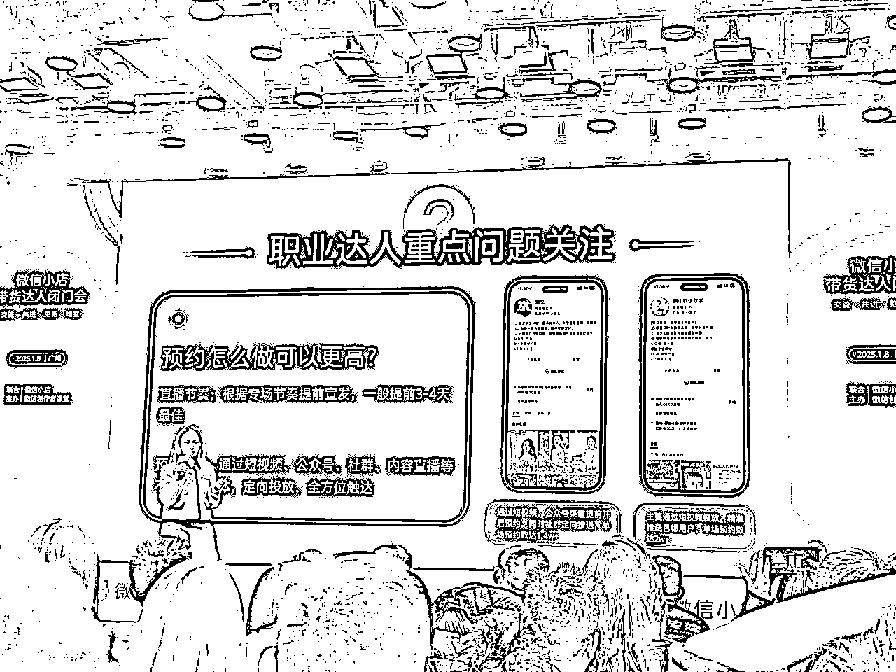
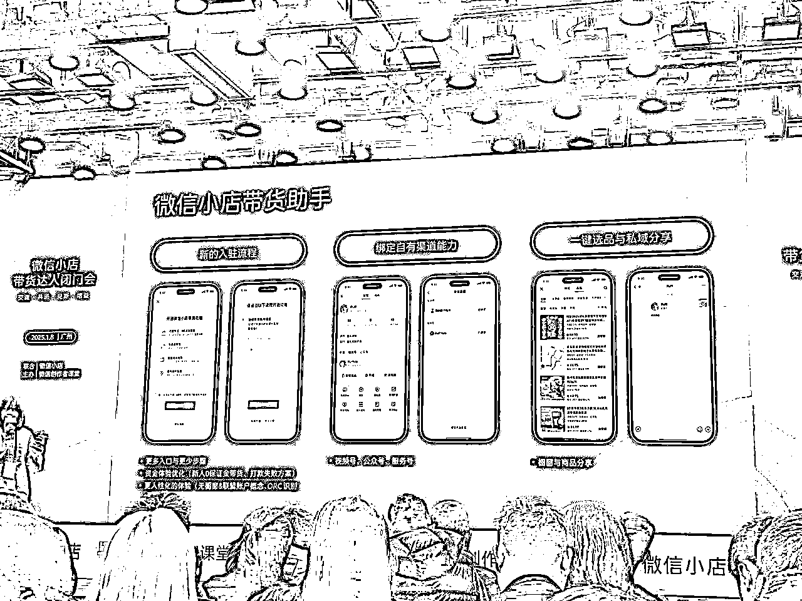
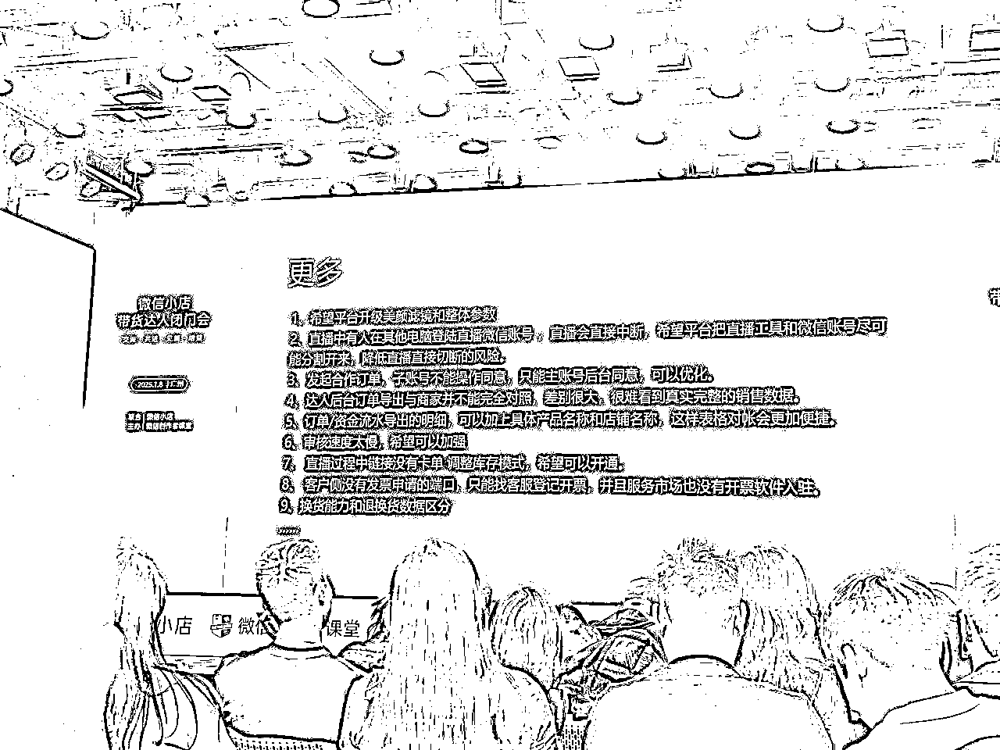

# 2025年Q1微信小店带货达人闭门会

> 来源：[https://rxc7lnelf7.feishu.cn/docx/DzbQdUetzo2Y7HxHCOvcHnpAnhg](https://rxc7lnelf7.feishu.cn/docx/DzbQdUetzo2Y7HxHCOvcHnpAnhg)

内容仅供行业交流，请勿商用！

# 一，上期会议重点问题解决进度回顾

1.  带货分修订，构成权重，带的商品评分权重降低，新增品退率指标，带货违规评分，带货举报率 计算分数时间，从90天到30天 带货分异动归因，精准提醒哪一单哪款商品出现的问题

1.  违规加热限制优化

1.  平台券和主播券

1.  合规添加客服，粉丝服务能力工具

小程序：微信小店带货助手，2025年会新增客服助手，达人可以向下单粉丝触达消息

1.  平台重要信息接受地

服务号：微信小店带货助手

学习专刊，关键词查询，一键召唤带货端客服

服务在微信生态内做带货变现的所有带货者：视频号，直播间，小程序，公众号，社群，分销推客等，鼓励达人做全域经营。

1.  平台提供标杆账号案例，方便学习。

微信小店带货助手里上线----成长中心，提供赛道标杆账号案例分享，优质同行，账号推荐。

# 二，带货业务最新进展分享

## 数据情况

第三季度到第四季度，达人带货GMV增幅140%，分销规模增速13%。

数据敏感，官方不允许拍照，这里就没图片了。

## 平台鼓励的达人方向和阶段

22年之前，私域起号

22-23年内容、人设信任起号转直播带货

24-25年逐渐发展全域经营，在微信生态内短视频，直播间，公众号，小程序，社群私域处处能看到这个达人，那那都还不错，那那都还可以，不偏科都能看到你的存在。即可定义为全域达人，平台重点扶持。

## 标杆全域达人案例

账号：谢谢你来了，好话题打造好内容。

切片+矩阵短视频+订阅号图文长内容

跨国·夫妻，剧情演绎，一个月千万以上

红粉佳人，心灵思考，带女装，信任背书

自9月份起，每个月增幅100%以上

长期老达人，布局微信生态，视频号展示流程，公众号展示图文拆解。

## 平台牵引内容，打造赛道达人出圈

老达人反馈说流量卡住了，但平台这么大的业务盘子，不会去卡某个达人的流量，平台明年会往达人生态丰富。

明年：平台牵引内容，打造赛道达人出圈，邀请老友互相连麦，老友空降，

赛道达人标杆案例

# 三，职业达人重点问题关注

## 推流核心指标

今年新客（非粉丝）指标很重要

GPM订单多，商品单价高

## 粉丝指标如何提升

A. 白菜GG，新客指标提升

「暂无偏好」未在平台下单的用户

1.内容偏好

2.直播引流

3.货盘匹配

4.价格优势

福袋送贴合用户的农产品，

新客点转高的是低价引流品

下沉用户对手机平板车多少钱没感觉

但是对小黄鱼（生鲜产品农产品）有感觉，菜市场卖xx，我给你xxx，用户就有性价比高的感觉

B.小韩夫妇，楠姐，老客复购

1.粉丝粘性

2.选品复盘

3.售后服务：和用户做朋友

视频号跟其他平台不一样的，粉丝一旦信任就会一直追随

## 短视频是否重要？

重要

1.可以带来新客

2.短视频带货转化率高

## 预约怎么做更高？

做专场，预约邀请的节奏拉密，但是不要拉长。

洞见：公众号图文预约

胡小群讲数字：短视频投放预约

为了用户体验，现在是用户不打开微信，就不推直播预约，不像之前直接不打开也强提醒。

## 曝光转化率

乡村婷婷一家人：直播讲一家人故事，用户像看电视连续剧一样，用户不是单纯看，主播会说听了粉丝的建议我们怎么这么改变，用户有体验感参与感，指导剧情走线

乔教主：直播场景真实，不叠加滤镜

## 人均观看时长如何提升

1.乡村晶晶妯娌俩：直播前面先做内容可看度的，不要一上来就卖货。

2.品格世界朱晓平：开播回应粉丝问题，粉丝反响比较热烈

粉丝希望听到什么，粉丝关心什么，而不是一上来就直接卖货。

## 矩阵账号可否做？

达人垂类矩阵，平台鼓励，但需要定位不同

要做就错开定位，做差异化内容。

# 四，带货业务生态治理分享

## 规则治理产品变动

服务号：微信小店交易中心

违规了，看不懂规则直接找客服

以考代罚

不合理规则下线

## 治理重点：不正当营销

违规案例展示

## 治理重点：虚假宣传

## 治理重点：大场高发违规

检查：样品跟商品详情页是否一样

检查：不可用违规词

检查：抽奖未使用官方工具福袋

检查:扣1才能领福袋，虚假领取条件违规

检查：直播展示产品/话术，不可出现未经授权的官方证书或者logo，比如宣传是央视展播品牌就违规

加热：违规会导致不可二次加热，所以不要频繁创建后又取消计划

# 五，带货业务新产品玩法分享

上线：微信小店带货助手

## 优化注册流程，5分钟完成注册

## 达人成长中心

重点：优质同行，账号推荐，达人训练营（系统针对不同阶段达人定制成长计划，辅助达人学习迭代）

# 六，带货业务新政策方向分享

## 达人方向

### 达人拉新

1月1号到2月底

### 达人跃升

### 达人大场激励

## 带货者服务商机构

平台：提供一切好工具，帮助服务商与达人赚钱+分钱

### 达人训练营

线上双选会，达人，带货机构，带货者服务商，三方双选。

给达人展示：优质带货机构和带货者服务商的案例和成绩

给带货机构展示：优质带货达人和带货者服务商的案例和成绩

给带货服务商展示：优质带货达人和带货机构的案例和成绩

### 带货服务商案例和模式

a从0-1孵化达人

b签约头部合作，只帮成熟达人放大

## 带货者服务商的持续方向

### 在线分账功能：

根据服务商等级给不同功能

重点：Q1上线，电商MCN在线分账功能（这功能从去年说到现在，期望2025能上吧）

基于电商mcn结果分账，加速中很快

### 鼓励全域经营：

视频号 公众号 服务号 橱窗，开放生态，达人在多场景为用户提供价值，做运营变现

带货者服务商的所有功能都是为了帮助机构与达人，

通过有序合作拿到自己该拿的部分，让机构和达人之间的信任度更高。

# 七，带货业务吐槽会

## 账号被仿冒，盗播卖货怎么办？

a及时举报，及时反馈

b优质达人可建立直播人脸库，非本人账号开播会掐播（在开发）

## 直播间福袋参与有异常用户怎么办？

黑灰产用户薅福袋，基本是同一地区，可把订单号提交客服，技术会排查拉黑。

## 福袋发放问题

## 微信小店客服问题

上线违规处理客服入口，人工客服早10-凌晨2点都在线，及时处理问题，

如无法解决的，客服会升级工单给，微信总部的一线规则治理团队，超过48小时可以再次反馈。

企微客服只能推名片，没有二维码，有需要的圈友可以直接找我推

## 大场问题

大场提前报备，春节后上线。

## 账号数据管理体系问题

会把各端数据汇集到微信小店带货助手，也从这里做权限隔离，明年推进。

## 老账号开播，不通知粉丝。

短视频和直播，不区别新老用户

关注栏粉丝刷不到的原因，会出现最新更新的内容，

推送是千人千面，不推送即是最近用户不看这类内容，所以不推送。

## 服务商与达人解绑问题

Q:反馈需要有冷静期，而不是马上解绑

A:明年，会给3-5天挽留期。

## 硬广问题

a.做大场预告的时候，整条视频或者多条视频全是这样的预告说我有什么优惠我能送什么东西，这样吸引过来的都是薅羊毛的，对账号的长期经营是不健康的。

这种用户进来你的直播间就是单纯为了拿福利，或者抢福袋来的，不会在直播间停留，更不会下单，反向的会导致你的直播间数据更差。

b.硬广明确不允许，展示产品时长不能超过30秒，要软性可看性强。比如说你要展示，我要卖出一条珍珠项链，这条珍珠项链我不能直接卖，如果你直接在短视频硬广推，就比较容易被中招。

但如果你能想出这个珍珠，它的产品背后的故事，那这样相对来说是更有内容价值的，这一部分也就更容易获得一个流量推荐。

## 改规则能不能提前通知？

平台规则会提前在规则中心出公告，7天反馈期7天公示期，而且明年会出柔性治理手段（以考代罚），多看微信小店交易规则中心。

## 更多问题，一个一个解决

