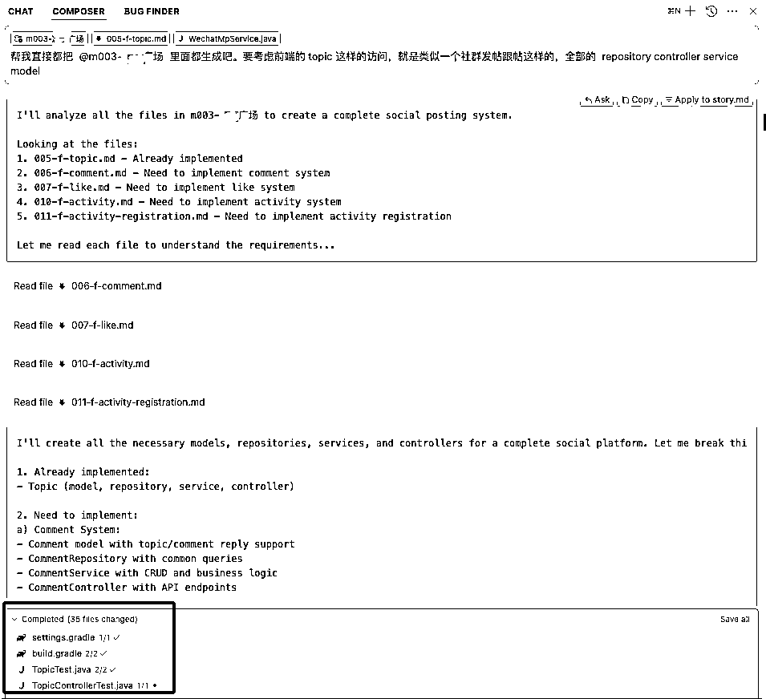
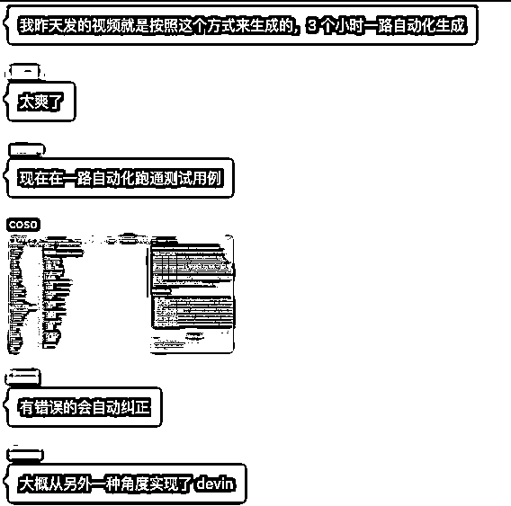
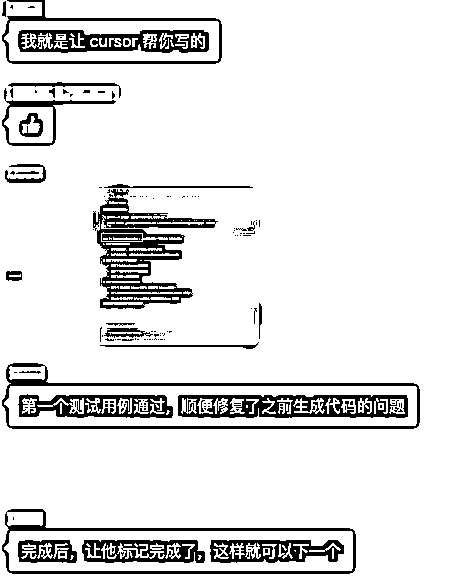
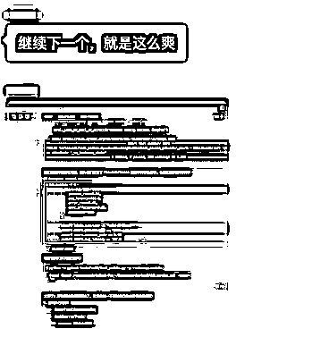
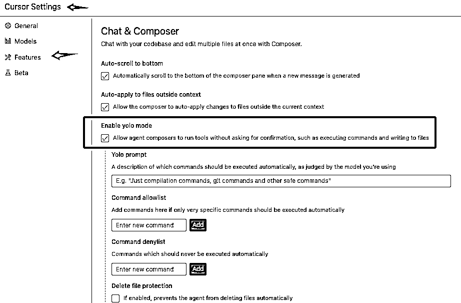
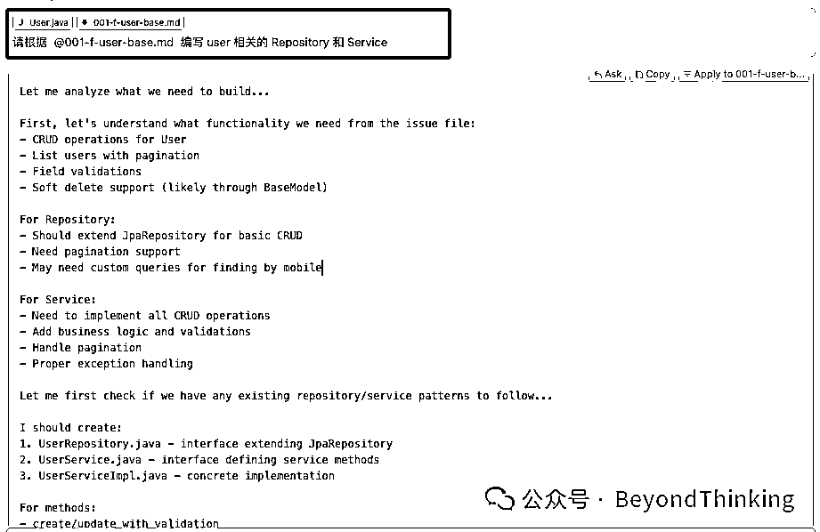
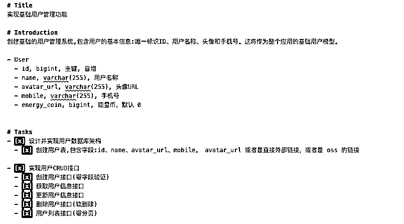
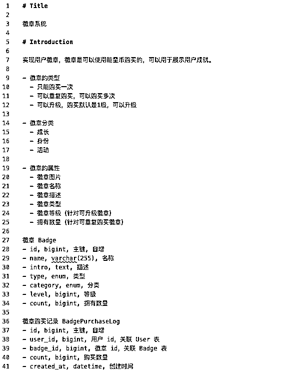
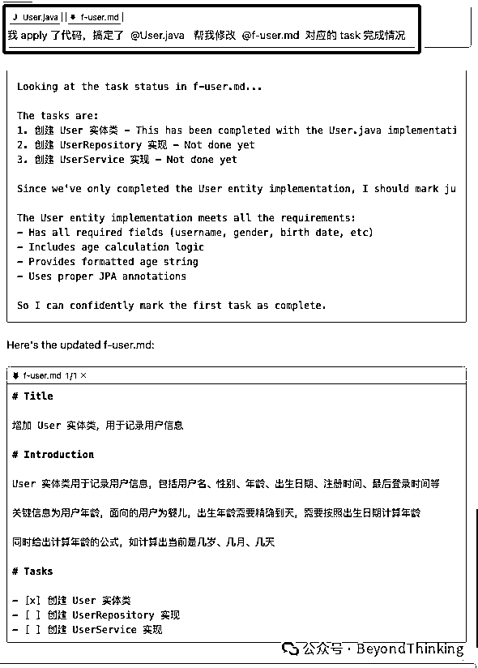
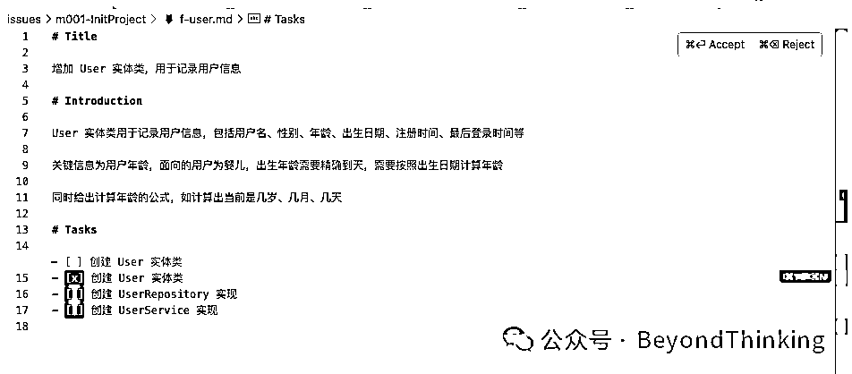

# 使用本地 issues 管理让 Cursor 自动化写程序

> 来源：[https://rxas35pmvn.feishu.cn/docx/EaSxdZ6vNoFBLVxFkG0chs4Unjf](https://rxas35pmvn.feishu.cn/docx/EaSxdZ6vNoFBLVxFkG0chs4Unjf)

在 12 月的航海后，很多非程序员小伙伴已经可以开始使用 Cursor 写程序了，不过过程还是颇为坎坷，人和 Cursor 之间的关系，如何配合始终是一个问题，小白同学越是深入使用越会遇到这个问题。

我这里帮大家整理了一套使用本地 Issues 的方式，让 Cursor 可以更加自动的写程序。相信不管是小白用户或者是资深开发者都有用

# 使用效果

## 一个对话修改/生成 35 个文件

我自己使用这种方式，在描述好一个 milestone 之后，一个对话 Cursor 帮我修改/生成了 35 个文件



## 三小时的编码一路发送继续继续指令

群里的一个小伙伴 3 小时代码一路自动生成







# 直接用起来

我们在开发一个产品的时候，一定会对要做什么，都有什么功能等有想法，然后告诉 Cursor 去实现。

一般我们都是使用 Chat / Composer 的功能给 Cursor 发送指令让他去辅助我们编程。这个过程就是让 Cursor 了解我们目的的过程。但是这里面有几个问题比较讨厌

*   一个 Chat / Composer 不可能无限长，当新开时候就需要重组上下文，如果是写了很多需求那就得重来一次

*   每次对话式的沟通，并不能完整的系统的表达我们的需求

*   开发产品一定是多个功能需求，而且相互之间还会有依赖关系

*   通过对话的方式很难给出完整的描述

*   对话方式很难表达依赖关系

*   出了 Bug 有时候还需要把描述从其他的工具搬运到对话框

为了更好的管理需求，我们可以使用本地 issues 的方式进行，在本地通过 issue 文件进行描述，然后在 composer 中选择 agent 模式，同时打开 yolo 功能（这个我以后单独写文章详细说明）



通过 @ 具体的 issues ，Composer agent 模式会基于 @Codebase 会直接进行编码。



## 添加内容到 .cursorrules

### .cursorrules

```
# Issues Management System

## Directory Structure

- `/issues` - Root directory for all issues
  - First level: Milestone folders (e.g., `m001-InitProject`)
  - Second level: Issue files within each milestone

## Issue Types and Naming

Issue files follow the naming pattern: `{id}-{type}-{description}.md`
- `{id}`: Globally unique identifier across all issues
- `{type}`: One of the following:
  - `story` - User story describing complete user value
  - `feat` - New feature implementation
  - `fix` - Bug fix
  - `test` - Test implementation
- `{description}`: Brief kebab-case description

## Issue States

Tasks and issues can have the following states:
- `[ ]` - Not started
- `[x]` - Completed
- `[-]` - In progress
- `[*]` - Skipped
- `[!]` - Abandoned

## Templates

Two types of issue templates are available in `/issues/templates/`:
1\. `story.md` - For user stories
2\. `issue.md` - For features, fixes, and tests

## File Modification Rules

- Only modify task/issue states in existing files
- Do not alter other content without creating a new issue
- Always update Status History when changing states 
```

## /issues 本地管理

### 目录结构

在项目的根目录，使用 /issues 目录进行管理，目录结构为

```
issues/
├── templates/
│   ├── story.md
│   └── issue.md
├── m001-project-milestone/
│   ├── 001-story-feature-description.md
│   ├── 002-feat-implementation.md
│   ├── 003-test-test-suite.md
│   └── 004-fix-bug-fix.md
└── m002-another-milestone/
    └── ...
```

### 文件命名规范

文件遵循以下命名模式：{id}-{type}-{description}.md

*   id: 在所有问题中唯一的标识符

*   type: 问题类型 (story/feat/fix/test)

*   description: 简短的 kebab-case 描述

### 模板

#### 故事模板 (templates/story.md)

```
# 标题
简短的故事标题

# 故事
作为 [角色]
我想要 [目标/行动]
以便 [收益/价值]

# 验收标准
- [ ] 标准 1
- [ ] 标准 2

# 子问题
- [ ] {id} 问题描述

# 依赖关系
- [ ] {id} 依赖描述

# 状态历史
- YYYY-MM-DD: 创建
```

#### 问题模板 (templates/issue.md)

```
# 标题
简短的问题标题

# 简介
详细的问题描述

# 任务
- [ ] 任务 1
- [ ] 任务 2

# 依赖关系
- [ ] {id} 依赖描述

# 状态历史
- YYYY-MM-DD: 创建
```

## 样例





# 为什么可以这么用

我们每次在和 Cursor 对话时候，都是从多方提供上下文，然后让 Cursor 去工作，这个上下文包括

*   Cursor 可以主动访问或者我们指定访问的内容

*   Codebase 代码库，具体的文件 ，这也是我们最常用的

*   文档

*   Web 网页

*   等等....

*   Cursor 的 Rules

*   设置里面的全局 rules

*   每个项目的 .cursorrules 文件

*   我们在对话框里面输入的内容

结合这三部分，Cursor 就可以开始工作了。

我们做的事情就是借助本地文件的能力，让 Cursor 通过 @特定issue文件 / @特定issue文件夹 把文件内容填充到对话上下文

我们在管理 issues 时候就可以非常详细的把我们的需求，一些实现的具体要求写清楚

聪明的你们自然知道，在 Composer 的 agent 模式中，Cursor 就具体的知道当前的代码库@Codebase，也通过 issues 文件知道我们想让他干什么，当然 Cursor 就可以更加顺畅的去干活了

干完活去更新任务完成情况（这个也可以让 Cursor 来做），就可以更加清楚的让我们和 Cursor 知道该做什么不该做什么了



可以看到文件的修改情况



# 对 Cursor 更多的思考

这种方式的本质就是通过本地文件把信息填充到 Cursor 上下文

*   Markdown 格式天然带结构，Cursor 可以理解的非常好

*   内容如果有和别的依赖，Cursor 的大模型能力可以直接搞定

本地文件可以形成非常大的生态系统，代码就是各种对本地文件的管理，而非常著名的笔记软件 Obsidian 也是本地文件

Cursor 是一个非常牛逼的本地文件的阅读和处理工具，这就是形成生态的基础

# 开源项目 & 小产品计划

上面的整体的内容我已经做成了一个开源项目产品，请自取使用

这也是我 2025 的一个计划，在 2025 年做出来 12 个产品

1/12 LocalIssues，当前的文件说明和模板是这个产品的第一部